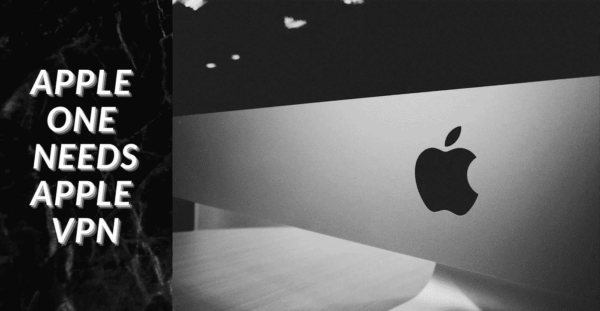

# 苹果虚拟专用网是下一件大事

> 原文：<https://medium.datadriveninvestor.com/apple-vpn-is-the-next-big-thing-efac18a3a678?source=collection_archive---------0----------------------->

## 意见

## 忘记智能手机和笔记本吧，隐私是新的竞技场

Image created with Canva

在智能手机的隐私和安全方面，苹果脱颖而出。其实很多人买 iPhones，只是因为觉得比安卓安全。

在某种程度上这是真的，但是大部分的标题都被夸大了。iPhone 更安全，因为 *s* [*和*](https://techterms.com/definition/sandboxing#:~:text=Sandboxing%20is%20a%20software%20management,from%20negatively%20affecting%20your%20system) *、* [阻止应用程序访问其他应用程序和操作系统超过一定阈值](https://www.lifewire.com/reasons-iphone-is-more-secure-than-android-2000308)。然而，这并不像一些头条新闻吹嘘的那样防黑客。

> [IOS 14 已经 pwn 了。](https://twitter.com/sparkzheng/status/1306413448926957568?s=21)

围绕 iPhone 安全性的大肆宣传为苹果创造了巨大的优势，以至于 WWDC 永远不会停止谈论苹果设备的隐私和安全性。

当谷歌、脸书和 Snapchat 等公司正在努力应对隐私问题时，苹果正在拥抱它，VPN 可以成为他们的王牌。

> VPN 代表虚拟专用网络。可信的 VPN 服务允许您匿名浏览互联网。

# 苹果不关心数字石油

当谷歌、脸书和亚马逊等其他巨头竞相榨取每一点数字石油时，苹果却在玩两面派游戏，以超越所有这些巨头。苹果公司正在拥抱用户隐私，用顾客的信任和金钱来奖励他们。另一方面，他们从这些巨头身上赚了数十亿。据报道，谷歌向苹果支付了 120 亿美元，让谷歌成为 iPhone 的默认搜索引擎。

苹果经常批评脸书在消费者数据隐私方面的不当行为。去年，苹果吊销了脸书的企业开发者证书，原因是其向消费者分发了一款收集数据的企业应用。根据企业开发者证书条件，是不允许的。苹果只是执行了许可协议，在这个过程中获得了隐私公开。

多年来，这种对隐私的公开让苹果公司赚了数十亿美元。这让苹果在 iPhone X 上获得了 64%的利润，尽管它在规格表上远远落后于其他旗舰智能手机。苹果已经让 iPhone 和 MacBook 成为一个封闭的系统，所以独立维修店无法修复你的设备，迫使你支付不必要的[数百美元的苹果服务](https://www.businessinsider.in/tech/apple-quoted-me-1500-to-repair-a-macbook-pro-so-i-paid-less-than-500-at-an-unauthorized-apple-repair-shop-instead/articleshow/67082867.cms) *。*苹果不断移除我们喜爱的东西:耳机插孔、USB 端口、home 键，它仍然保持着它在市场上的地位。

> 你不是我们的产品。我们的产品是 iPhones 和 iPads。我们珍惜你的数据。我们想帮你保护它的安全。
> 
> 蒂姆·库克

如果苹果真的在乎隐私，他们本可以屏蔽这些应用，支持 DuckDuckGo 和 Telegram 等替代应用。苹果可以把钱投在它的地图服务上，和谷歌竞争；它可以使用 iMessage 应用程序与 What's 应用程序竞争。这才是真正的弹性。相反，苹果在它的应用商店里分发数据占用应用。

# 苹果监狱需要一个 VPN

Photo by [Tobias Tullius](https://unsplash.com/@tobiastu?utm_source=medium&utm_medium=referral) on [Unsplash](https://unsplash.com?utm_source=medium&utm_medium=referral)

这不是什么秘密，苹果监狱是真实存在的，它是来从其他平台"*拯救"*你的。苹果硬件的无缝生态系统很棒，但那不是你所说的真正的监狱吧？你也需要控制软件。这就是虚拟专用网可以提供帮助的地方。

如果你想了解更多关于 VPN 的知识，这里有一本 Priya Reddy 的好书

 [## VPN:你需要知道的一切

### VPN——或虚拟专用网——是最大化你的在线隐私和自由的终极工具。一个好的 VPN…

medium.com](https://medium.com/@Priya.Reddy/vpn-everything-you-need-to-know-f5a55e6f03c1) 

苹果不能只靠硬件保持领先，它知道真正的钱在数字服务市场。他们已经在努力通过 Apple Tv +在数字媒体领域与网飞、Prime 和迪士尼竞争。[苹果的网站主页](https://www.apple.com/)，曾经是用来展示最新硬件的，截至本文写作时，现在正被用来增长 Apple TV +的受众。

2015 年，苹果发布了其 [iPhone 升级计划](https://www.apple.com/shop/iphone/iphone-upgrade-program):每年按月付费获得一部新 iPhone。你可以称之为“iPhone 即服务”计划。然后是 Apple Music、Apple TV、iCloud、Apple Care、Apple News、Apple Arcade 等一系列苹果订阅服务。

这个套件缺少一个产品，可以将所有苹果公司联系在一起，并维护苹果公司的公共隐私问题。

在人们抵制脸书并转向替代产品后，没有比用户隐私更重要的问题了。苹果可以利用这一杠杆来维持自己的地位，让像这篇文章这样的文章东山再起。另外，没有竞争。谷歌和脸书做不到这一点，因为他们在隐私问题上的声誉以及他们依赖数据运作的事实。亚马逊和微软不是最好的选择，因为他们没有苹果那么大的控制权，除非亚马逊将它纳入他们的 Prime 订阅中——这可能会改变游戏规则。

一提到 VPN 就让人困惑；他们不知道哪些可以信任，如何设置，是否值得，以及允许你使用多少带宽。苹果可以轻松填补市场空白。苹果以让事情变得简单而闻名，人们信任苹果，数十亿台设备正在等待这项服务。

在一个隐私已经成为人权的世界里，保护隐私比使用隐私更有意义。与谷歌和脸书不同，苹果的运营不依赖消费者数据，从而获得了不公平的优势。虚拟专用网将赋予苹果公司最终的权力，利用这种不公平的优势来赢得更多的顾客、信任，并最终获得一大笔钱。

 [## 苹果如何通过搜索引擎赚钱

### 苹果真的能在搜索引擎市场崭露头角吗？

medium.com](https://medium.com/datadriveninvestor/how-apple-can-make-money-through-a-search-engine-12e018a58154) 

**访问专家视图—** [**订阅 DDI 英特尔**](https://datadriveninvestor.com/ddi-intel)