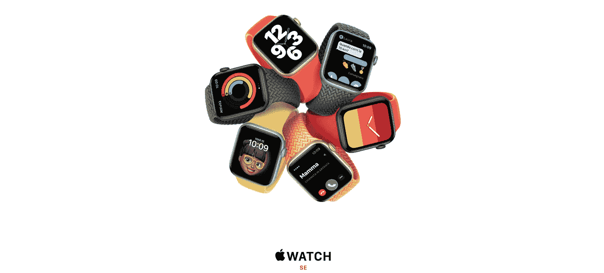
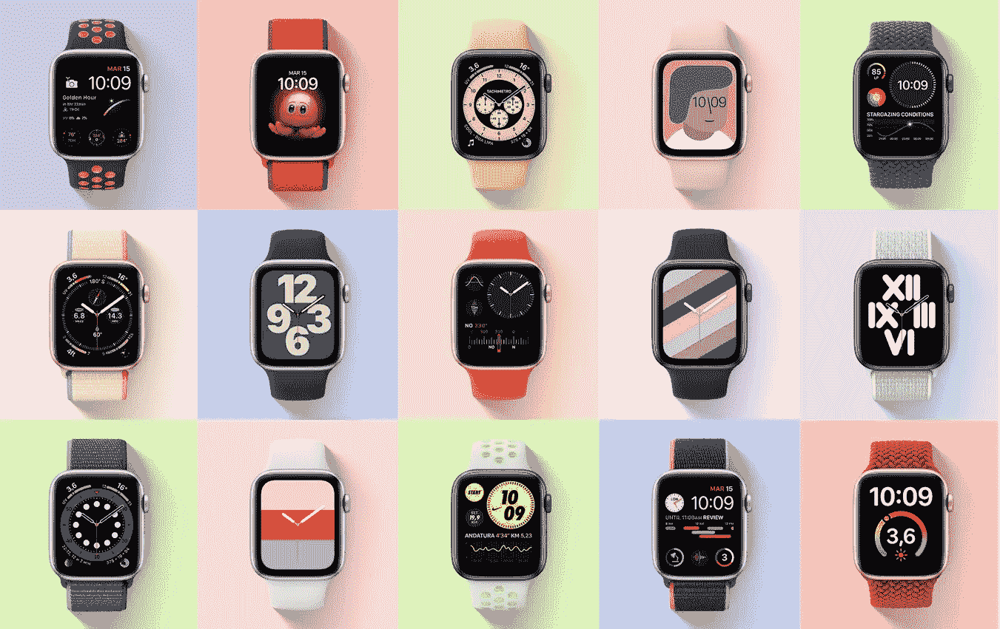
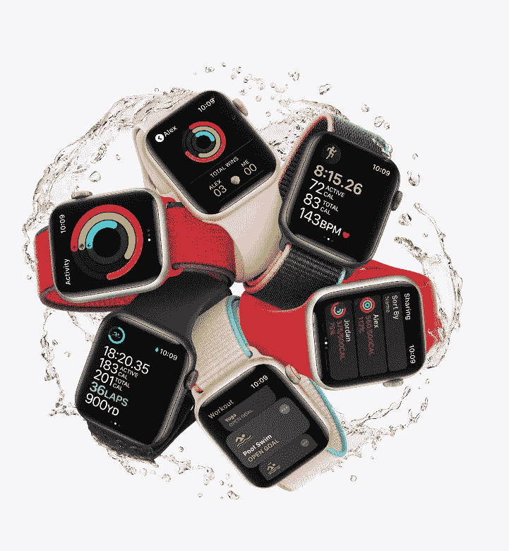
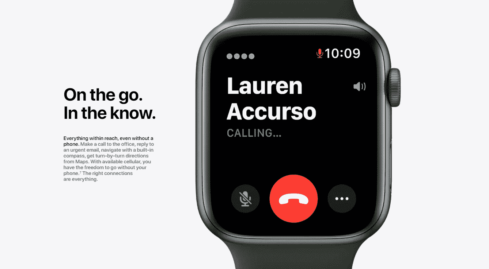
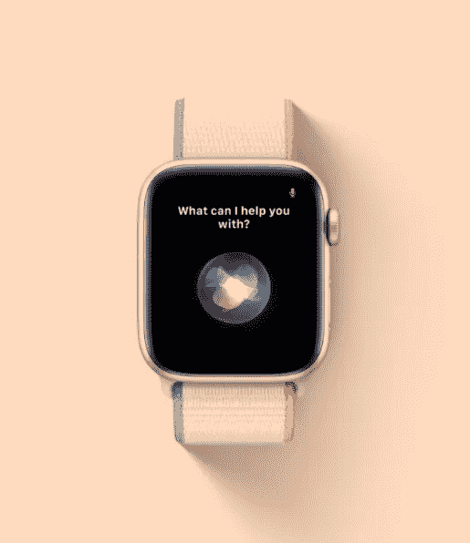
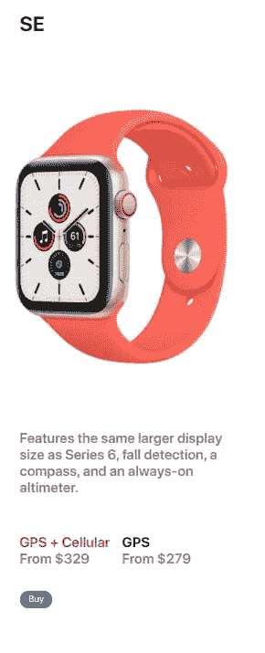

# Apple Watch SE:你需要的一切

> 原文：<https://medium.datadriveninvestor.com/apple-watch-se-everything-you-need-efff60d98b82?source=collection_archive---------18----------------------->

SE 几乎要上一切！

Credits: Apple

这只是关于苹果世界的新闻之一，比新的 MAC 和 iPhones 以及苹果电视还要多。我们知道，“ **SE** 代表“**特别版**”，第一次用在 iPhone 上，正好是在 iPhone 6s 发布之后。

在这之后，我们最近在今年看到了配备 **A13 仿生芯片**(与 iPhone 11 和 11 Pro 相同的处理器)的 iPhone SE 2020。但我们在这里谈论的是这款新设备，而不是 iPhone， **Apple Watch SE** 。

首先，它拥有与系列 6 相同的令人惊叹的设计，而且它也具有相同的尺寸。但是等等，跟系列 6 不一样。让我们一起来看看你需要了解的一切，以及**是否值得我们花钱！**

Credits: Apple

## 技术规格:

*   **GPS/GNSS；**
*   **指南针；**
*   **始终开启的高度计；**
*   **防水(** *50 米*)；
*   **第二代光学心脏传感器；**
*   **容量 32GB(两个版本 GPS&GPS+LTE)；**
*   **麦克风；**
*   **演讲者；**
*   **加速度计；**
*   **显示 44mm(***368×448 像素，977 平方 mm 显示面积***)；**
*   **显示 40mm(***324×394 像素，759 平方 mm 显示面积***)；**
*   **视网膜 LTPO 有机发光二极管显示器；**
*   **S5 SiP 采用 64 位双核处理器；**
*   **LTE 和 UMTS**
*   **Wi-Fi (802.11b/g/n，2.4 GHz)；**
*   **蓝牙 5.0；**
*   **内置可充电锂离子电池(长达 18 小时)；**
*   **磁性充电电缆；**

## 详细信息:

Credit: Apple

[**苹果**](https://www.apple.com/apple-watch-se/) 说:

> 重在特色。
> 轻于价格。

这是苹果对自己设备的描述。与 Series 3 手表相比，我们真的拥有很多功能。最后，我们将在它上面有一个 **32GB 的存储空间**，这确实是一个很大的空间，因为它是一个手表而不是 iPhone。更多的细节是 AW SE 支持 LTE 和 UMTS 频段，所以你可以把手机留在家里。

 [## 抓住智能营销，获得巨大成果|数据驱动的投资者

### 网上的人都看过。每当人们在谷歌上搜索某样东西，他们最终都会与类似的广告互动…

www.datadriveninvestor.com](https://www.datadriveninvestor.com/2020/08/19/grab-on-to-intelligent-marketing-for-great-results/) 

> 但是少了点什么…

血氧饱和度监测仪。使用该设备，将无法测量血液饱和度(**血液中的 O2 水平**)。饱和度仪仅在 Apple Watch Series 6 上可用，由于新冠肺炎，苹果实现了这项技术。一个真实的事实是，苹果多年来一直在考虑这一实现，有什么比专注于呼吸系统的病毒添加这一功能更好的时期呢？

Credits: Apple

**这款 Apple Watch 适合游泳、跑步以及其他许多运动。【2020 年末即将到来**苹果健身+** 。这是一种与世界上最好的教练一起锻炼的新方式，并且肯定可以添加到 Apple One 订阅中(一旦这项服务可用)。因此，一旦 Apple Fitness+上市，你可以发现大量你可能从未见过的新运动和锻炼。**

Credits: Apple

**您可以通过内置麦克风直接呼叫、回复或挂断电话。**它还有扬声器，因此你可以直接用手表接听电话。还有可能用录音信息、Siri 听写和表情符号来回复信息。

Credits: Apple

**Siri 总是在家里，现在总是在你的手腕上！只要说“嗨，Siri”就行，想问什么就问什么。从要发送的消息中查看您当天的活动。Siri 至今仍是设备上最好的虚拟助手。有了 WatchOS 7 和 iOS 14，Siri 比以前更智能了。试着问她任何问题，她都会恰当地回答你。**

Credits: Apple

**钱包。实际上，我用我的 iPhone 和真正的信用卡支付我所有的东西，我把它放在家里了。**但为什么不用手表付款呢？**这款设备的超酷附加值。信用卡正成为全球最普遍的支付方式，我认为几年后将不再有现金。仍然是一个问号的是“**这款设备是否也允许处理 iOS 14 更新中实现的虚拟车钥匙？**”。**

## 价格:

## 这款苹果手表 SE **的价格为**纯 GPS**版本的 279 美元**起。对于 **GPS+LTE 版本，起价为 329 美元**。这些价格比苹果的新价格要便宜得多。这将帮助那些花不起 600 美元买一块苹果智能手表的人。

现在的一切都是关于这个设备。 ***希望你喜欢这篇文章，下期再见！***

**干杯！**

## 访问专家视图— [订阅 DDI 英特尔](https://datadriveninvestor.com/ddi-intel)