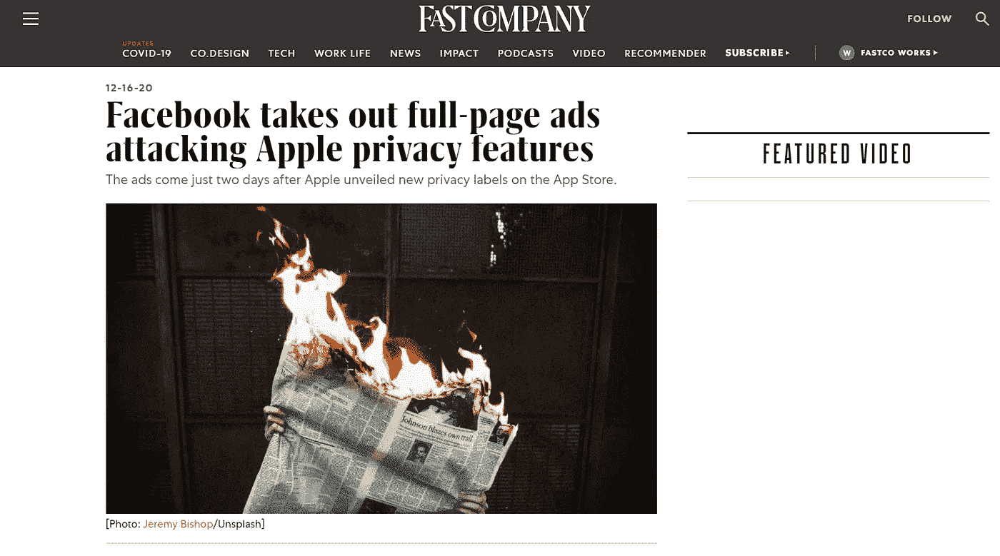

# 苹果 iOS 14 更新:用户隐私还是营销战术？

> 原文：<https://medium.datadriveninvestor.com/apples-ios-14-update-user-privacy-or-marketing-tactic-b9d79faaa300?source=collection_archive---------14----------------------->

## 看起来这个科技巨头正在走向自己的生态系统

Image screenshotted from [fastcompany.com](https://www.fastcompany.com/90587124/facebook-takes-out-full-page-ads-attacking-apples-upcoming-privacy-features?fbclid=IwAR30MCebUikYDWg1AaXS8iRyJLjYMyLLArBNEDccQnq26A4HGeUgThq9tDM)

随着“蓝色巨人”做出惊人的声明——脸书正在各地的小企业中对抗苹果，事情升级了。脸书和苹果之间发生的一切，感觉就像是旁观的数字战争。

# 这一切是如何开始的

在上一次全球开发者大会上，苹果推出了 iOS 14。它可能看起来就像另一个软件更新。但这一次，苹果发布了一个更新，给广告行业带来了冲击波。没有人预见到它的到来，它让人们开始关注在线商务的未来。

在新的软件更新中，用户可以选择退出个性化广告追踪器。让用户对隐私泄露更有“安全感”。有一家广告公司被这种升级激怒了，你可能猜对了——脸书。

Tweet by [Dave Stangis](https://medium.com/u/12744e7080b4?source=post_page-----b9d79faaa300--------------------------------)

这两家巨头公司有不同的商业模式。苹果通过向用户出售高质量的硬件和软件来赚钱。而脸书则以广告的形式向小企业出售信息。

随着 iOS 14 隐私更新，苹果和脸书发生了冲突。这一更新给数字广告带来了“最后一击”。大部分利润来自广告的脸书对这一举动并不满意。

 [## 天秤座可能是脸书的末日

### 2019 年，脸书越过了一条红线。公司宣布了 Libra 项目。在深入了解天秤座之前，我们先来了解一下…

www.datadriveninvestor.com](https://www.datadriveninvestor.com/2020/03/14/libra-may-be-the-end-for-facebook-part-i/) 

# 苹果的下一步行动很大胆

在最近的过去，苹果发布了一些产品，当它们结合在一起时，就像一个生态系统。从 WatchOS 到 iPadOS，这些设备之间的通信非常好，以至于没有其他操作系统能够与它的技术相提并论。

据作家兼开发者[欧文·威廉姆斯](https://medium.com/u/9cca1cc5944f?source=post_page-----b9d79faaa300--------------------------------)的文章称，苹果正专注于建立一个可以独立运行的系统，并将其与网络的其他部分隔离开来。苹果希望其所有产品都作为一个独立的包存在。这使得包括个性化广告在内的第三方访问更加困难。

苹果的这一大胆举动可能暗示了市场垄断理论。该公司希望消除网络上的任何干扰，这样它就可以运行自己的生态系统，其中包括向所有忠实用户提供个性化广告。这是寻求市场支配地位的一种聪明的营销策略。

# 我的看法

现在两家公司都有自己的议程。不，我应该说营销策略。毕竟都是公司。每个网站都有自己独特的赚钱方式。

我想暂时把大家的注意力吸引到苹果的 iOS 14 系统更新上来。看完这些，你认为苹果对用户的隐私是认真的吗？还是另一种形式的市场垄断？没有人真正知道。

嗯，我在脸书做广告。这是一种很好的广告形式，可以带来非常有针对性的潜在客户，并以低廉的成本引入我的业务。然而，当定位变得太“神奇”时，可能会感到毛骨悚然。

这让用户感觉他们正在被监视。如果脸书的广告平台还在运行，我希望它能在不久的将来解决这个问题。

我只能说，苹果的大胆举措将会像新冠肺炎遭受打击一样，严重影响全球中小企业。病毒让我们措手不及，毫无准备。即使有了疫苗，一切都不会再一样了。

## 访问专家视图— [订阅 DDI 英特尔](https://datadriveninvestor.com/ddi-intel)