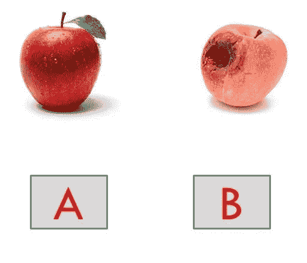
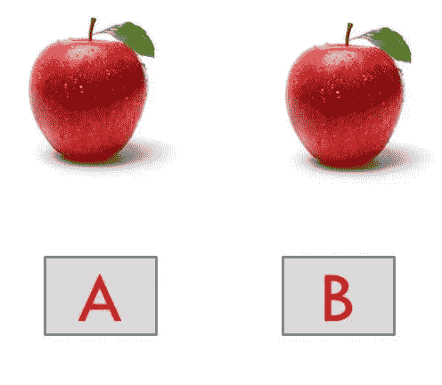
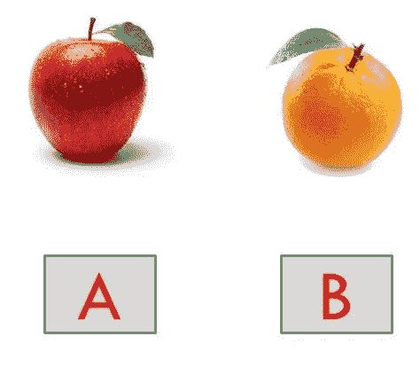
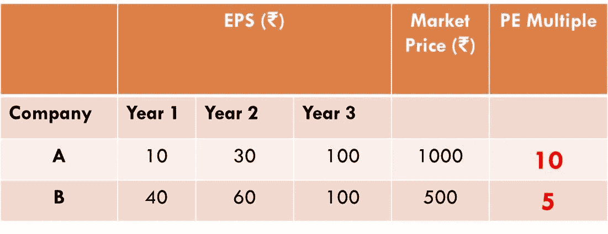

# 苹果、橘子和市盈率

> 原文：<https://medium.datadriveninvestor.com/apples-oranges-and-p-e-ratio-77d99dce7537?source=collection_archive---------4----------------------->

## 了解最容易被误解的选股指标！

Photo by [Precondo CA](https://unsplash.com/@precondo?utm_source=medium&utm_medium=referral) on [Unsplash](https://unsplash.com?utm_source=medium&utm_medium=referral)

市盈率是投资者在选股时进行决策的最重要的指标之一。但是，更多的时候，它被严重误解。

让我们解码这个度量。

# 内容:

**1。** **你怎么决定，买什么？**

*   案例 A:新鲜苹果 vs 不新鲜苹果
*   案例 B:昂贵的新鲜苹果与便宜的新鲜苹果
*   案例 C:苹果 vs 桔子

**2。怎么看 PE 比？**

**3。PE 比是如何被误解的？**

**4。PE 比什么时候不行？**

# **1。你如何决定买什么？**

**案例 A:新鲜苹果 vs 不新鲜苹果**

(Created by author using MS Power Point)

你去市场买一个苹果。你必须做出选择。

苹果‘A’新鲜多汁。苹果‘B’显然已经不新鲜了。苹果 a 花了你₹.20，而苹果 b 只花了你₹.10.这澄清了一个事实，即消费者将为苹果“A”支付更多的钱，因为与苹果“B”相比，苹果“A”在口味和质量上都更好。

同样的事情也发生在股票上。因此，我们可以说，与基本面较弱的公司相比，基本面较好的公司将获得更高的价格。

**案例 B:价格更高的新鲜苹果 vs 价格更低的新鲜苹果**

(Created by author using MS Power Point)

假设，你要在苹果‘A’和苹果‘B’之间做出选择。两者都新鲜多汁。然而，苹果 a 花费你₹.20，而苹果 b 只花费你₹.15.因此，你选择苹果 B 而不是苹果 A。

这同样与购买股票有关。我们可以再次说，与估值过高但基本面良好的公司相比，被低估但基本面良好的公司必须被买入。

# **1。你如何决定买什么？**

**案例 C:苹果 vs 桔子**

(Created by author using MS Power Point)

比方说，你家附近的一个苹果花了你₹.20，一个橘子花了你₹.15.那么，你会买什么呢？

答案显然因人而异。这个决定是主观的。不同的东西有不同的效用。因此，两种不同的东西不能根据它们的市场价格进行比较。苹果和橘子，你看！

这在股票市场上是如此相似。**做不同产品，分属不同行业的公司无法比较。**

# **2。怎么看 PE 比？**

以上讨论的案例都可以和市盈率挂钩。

> **市盈率=市价/每股收益**

换句话说，它只不过是公司每年每股所赚的每一卢比的市场价格。

从表面上看，当投资者查看市盈率时，可能会得出这样的结论:

*   如果一家公司的市场价格较高，但每股收益较低，则市盈率必然较高。因此，投资者为收益较低的公司支付了更多的钱。股票被高估的迹象！
*   如果一家公司的市场价格较低，但每股收益较高，则市盈率必然较低。因此，投资者为收益更多的公司支付的费用更少。股票被低估的迹象！

但是，投资就这么简单吗？能不能以 PE 倍数为基础认真比较公司？

显然，事情并不像看起来那么简单。如果是这样的话，通过简单地比较使用市盈率倍数的公司和价值投资于市盈率较低的股票，任何“普通人”都将是一个自助餐。

与努力盈利的同行相比，持续增长且基本面良好的公司将获得更高的市盈率。

这就是为什么我们看到像 [**、【雀巢】、**、](https://www.bseindia.com/stock-share-price/nestle-india-ltd/nestleind/500790/)[、**、【HUL】、**、](https://www.bseindia.com/stock-share-price/hindustan-unilever-ltd/hindunilvr/500696/)这样的公司相对于其他的“快速消费品”、[、](https://en.wikipedia.org/wiki/Fast-moving_consumer_goods#:~:text=Fast%2Dmoving%20consumer%20goods%20(FMCG,counter%20drugs%20and%20other%20consumables.)的股票估值如此之高。这正是我们在上面的案例 A 中看到的。“新鲜的”苹果比“不新鲜的”苹果更有价值。

市盈率的相关性更多的是在公司表现出同样的增长和持续良好的利润的情况下。这就是你必须投资市盈率较低的股票的地方。这类似于上面的**‘案例 B’**。选择“便宜的新鲜苹果”而不是“昂贵的新鲜苹果”。

一个**“雀巢”**绝对不能和一个**“亚洲油漆”**相提并论！原因就是我们在**‘案例 C’**中讨论的。‘苹果’和‘橘子’没有可比性！

# 3.PE 比是如何被误解的？

让我们好好看看这幅插图。

(Created by author using MS Power Point)

现在，A 公司的市盈率为 10 倍，而它的对手 B 公司的市盈率为 5 倍。

如果你观察，在第三年，这两家公司都记录了₹.100.的每股收益因此，按照₹.1000 的市场价格，人们可能会说，与 b 公司相比，a 公司的价值被高估了，而 b 公司的价格只有 a 公司的一半。

但是，在你把钱投入 B 公司之前，你还必须观察每股收益的趋势。从第一年₹.10 的每股收益到第三年₹.100 的每股收益，a 公司显示了巨大的增长。因此，如果我们假设这一趋势继续下去，人们最好支付更多的钱购买 A 公司的股票，因为在未来几年，如果收益继续保持同样的增长，股票将看起来很便宜，因为市盈率会下降。

另一方面，B 公司的每股收益并没有大幅增长。因此，投资者把他们的钱押在 a 公司身上。

综上所述，**成长型股票将永远被充分估值**。因为投资者预计它将呈指数增长，因此就未来的增长而言，购买一只更贵的股票将是一件好事。**这里要吸取的教训是，过去的收入不重要，但未来的潜力肯定重要！**这就是人们的误解。

# 4.PE 什么时候不行？

如果投资者在周期性或季节性股票中使用这一指标，他们可能会被误导。

有些公司的收益是不可预测的，而且是周期性的。迎合房地产部门、糖业部门等的公司属于这一类。这一年需求量很大，而第二年可能就不景气了！

比方说，由于一个更好的周期或一个更好的季节，一家公司的收益突然增加。投资者可能会被套牢，因为他们觉得该股表现良好，每股收益大幅上升，市盈率很低。为什么不把钱放在这里？

但是，这些公司的未来无法预测。这里没有明显的迹象，因为这些是周期性股票。可能发生的情况是，公司不一致，明年由于周期不好，收益在走下坡路。那时，人们会意识到该公司是一个糟糕的选择，因为这些公司没有理由获得更高的市盈率。

投资是一门艺术，显然不是每个人都是伟大的艺术家。一个门外汉所能做的就是理解股票市场和投资的复杂性。

一次做一件事！