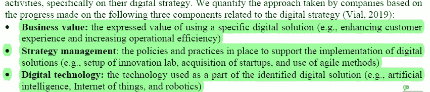
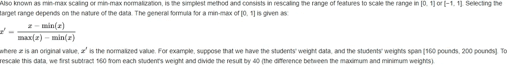
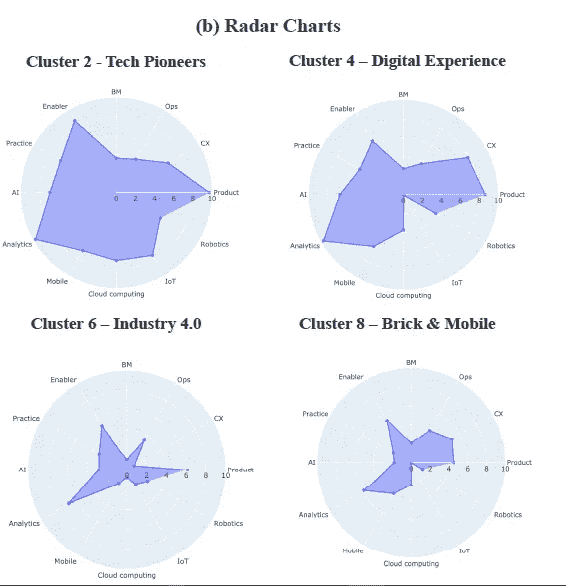
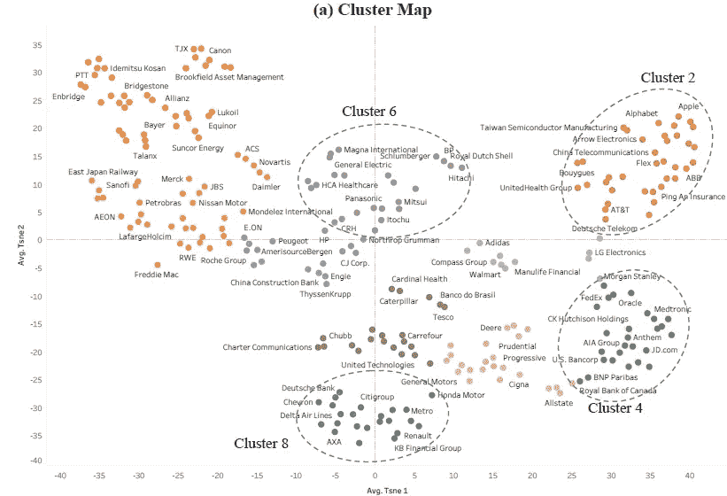

# 应用深度学习框架从盈利电话中衡量公司的数字战略。论文解释和分析

> 原文：<https://medium.datadriveninvestor.com/applying-a-deep-learning-framework-for-measuring-the-digital-strategy-of-companies-from-earnings-725ed0a4b040?source=collection_archive---------9----------------------->

## 这种衡量数字战略的方式对投资者来说意义重大

我喜欢投资和机器学习。我认为这两个领域都非常复杂，一旦理解，就可以极大地提高生活质量。开创性的“[深度学习框架”的作者以一种有趣的方式结合了这些领域。作者以财富 500 强公司的盈利电话为例，应用](https://arxiv.org/abs/2010.12418)[自然语言处理](https://en.wikipedia.org/wiki/Natural_language_processing) (NLP)结合深度学习，将他们的策略分类成各种标签。

在这篇文章中，我将谈论这篇论文，分解出一些有趣的注意点。我还将讨论如何在这个方向(分析公司战略)上扩展这篇论文，以及如何将这项工作应用到其他重要领域。如果你认为这是一个应该更多探索的领域，请分享你的想法。

The 3 components of digital Strategy that the team analyzed over

# 重要定义

为了理解这篇论文，让我们回顾一下重要的定义。

1.  收益电话会议:收益电话会议是政府要求召开的，旨在确保公司董事会和投资者之间的透明度。首席执行官谈论公司、公司收益、战略和未来计划。将 NLP 应用于这些电话将允许投资者和分析师比较不同公司的策略和执行情况，而不必亲自查看电话。
2.  方面和成熟度:两者都是本文创造的术语。方面是“*简介中提出的数字战略三个组成部分的 17 个粗粒度主题”*本质上，一个方面是一个战略的一般特征，如机器人、人工智能、运营等。*另一方面，成熟度是指给定方面在四个离散步骤上取得的进展，包括(1)计划，(2)试点，(3)发布，和(4)先锋(EY &微软，2019)。”*
3.  密集数据集:密集数据集是每个实例(例如事务)彼此非常相似的数据集。例如，如果您考虑一个由二进制矩阵表示的数据集，一个密集的数据集可能有许多 1 和几个 0。该团队维护着一个密集的数据集，尽管他们从未解释过其中的原理。我猜是因为这是同类研究中的第一个。使用密集的数据集只是去掉了等式中的一个因素，让团队专注于他们的主要目标。不过这只是猜测。

# 实验设置

该实验被设置为一个非常标准的 NLP 项目。在预处理中没有大的冲击。有趣的是分类的设置。基于所提出的方法，我们设计了两阶段文本分类体系结构。第一个模型是多标签的，用于检测文档中某个方面的出现，而第二个模型为其分配一个成熟度等级。该团队再次没有给出他们为什么选择这种方法的许多细节。如果操作得当，堆叠可以提高性能。在这种情况下，通过将这两个任务留给不同的模型，每个模型都能够得到更好的训练。所以总的来说这个设置是有意义的。

实验设置的细节在下面的视频中。视频格式允许我回顾一些在文章中很难理解的东西。学习它们很有趣，但对理解文章并不绝对重要。看看吧，让我知道你的想法。任何反馈都会受到欢迎。别忘了赞和分:)。

Experimenting with Different Things. Please share feedback

# 使聚集

该方法简单地说就是“T2”，因为 k-means 聚类假设均值和方差相等，所以我们通过应用最小最大值缩放和对数变换来标准化数据。稀疏特征很少，所以我们选择了 12 个密集特征(非零值> 40%的公司)。我们还应用 t-SNE5 进行降维，因为它显著提高了聚类性能(Maaten & Hinton，2008)。绘制聚类的轮廓分数显示了多个峰，表明数据中的固有层次。

Courtesy of Wikipedia

最小最大值缩放和对数变换都是归一化协议。当数据的范围很大时，聚类分析算法可能很难处理它。规范化数据可以使聚类更好地工作。TSNE 是一种将高维数据映射到 2(或 3)维的降维协议。这允许分析师以人类可读的方式查看数据之间的关系。最后，轮廓分数是用于计算算法如何聚类数据点的分数。

Priorities between different clusters

下面是这些公司的聚类图，基于在收益电话会议上完成的 NLP。我们看到 10 个集群，其中 4 个非常突出。四大巨头分别是技术先锋(2)、客户体验主导(4)、工业 4.0 (6)、砖块和移动(8)。分析雷达图(如上)，我们看到 4 个数字战略原型可以分解为“*产品导向(集群 2)、客户体验导向(集群 4)、服务导向(集群 0、7、8、9)和效率导向(集群 3、6)* ”。此外，我们可以使用雷达图来比较一家公司，与其所在集群的平均水平进行比较，从而对其各方面的进展进行排名

Clustering based on TSNE

从很多方面来说，这是论文最重要的部分，也是我写这篇文章的灵感来源。聚类使我们能够评估哪些公司正在实施类似的战略(并且处于类似的执行阶段)。这种影响是双重的。我们可以评估两个竞争对手，看看他们在战略和执行上的差异。我们可以通过测量一家公司与新集群的距离，来跟踪它在另一个领域的转向/进展。这两条信息对投资者来说都是有用的，他们可以用它们来评估同一行业的公司。举个例子，“*工业部门的 ABB 和西门子因其在自动化和机器人技术方面的能力而处于第 2 类，而他们的大多数同行公司处于第 6 类。这表明一些公司在业务数字化转型方面取得了重大进展。*“对于一个专注于技术、寻求投资西门子的投资者来说，这是极其重要的信息。

 [## 医生管理工作量增加时的深度学习|数据驱动的投资者

### 行政工作量是我们这个时代大多数医生所经历的众多负担之一。医生，尤其是…

www.datadriveninvestor.com](https://www.datadriveninvestor.com/2020/11/27/deep-learning-amid-increased-physician-administrative-workload/) 

# 扩展ˌ扩张

这篇论文令人兴奋有两个原因。首先，NLP 可以扩展到分析关于公司的媒体，以进一步评估公司在各个领域的进展。可以做更多的研究来改进和扩展收益预测分析。所有这些都将显著改善投资者的知识，提高透明度，减少信息不对称。

第二，这种分析框架可以应用于大量的重文本问题。例如，应用这种 NLP 系统可以用来对法庭案件进行聚类，帮助司法人员和律师发现相似之处和法律。这对于检测系统中的任何偏见非常有用，因为我们可以评估一个集群中的所有案例是否都得到了类似的惩罚。

# 向我伸出手

感谢您阅读本文。我会把我所有相关的社交媒体都放在下面。关注任意(或全部)以跨不同平台查看我的内容。我喜欢利用不同平台的优势。留下你可能有的任何反馈，因为它确实帮助像我这样的成长中的内容创作者。如果你觉得这很有用，请分享这篇文章。这些文章需要时间来研究和写作，所以任何帮助都大有帮助。如果你想要免费的股票，使用我的[罗宾汉推荐链接](https://join.robinhood.com/fnud75)。这对我们双方来说都是免费的，投资是为未来积累资产的一个好方法。你正在失去一只没有捕捉到的免费股票，所以没有理由不在那里开户。

我用这个[伟大的服务](https://free-url-shortener.rb.gy/)缩短了网址。他们做得很好，所以给他们一些爱。这不是赞助的，但是宣传有用的工作总是好的。

查看我在 Medium 上的其他文章。:【https://rb.gy/zn1aiu 

我的 YouTube。这是一个正在进行中的工作哈哈:【https://rb.gy/88iwdd 

在 LinkedIn 上联系我。我们来连线:[https://rb.gy/m5ok2y](https://rb.gy/m5ok2y)

我的推特:[https://twitter.com/Machine01776819](https://twitter.com/Machine01776819)

我的子任务:[https://devanshacc.substack.com/](https://devanshacc.substack.com/)

如果你想和我一起工作，请发邮件给我:devanshverma425@gmail.com

twitch 现场对话:[https://rb.gy/zlhk9y](https://rb.gy/zlhk9y)

获取我的内容更新-insta gram:[https://rb.gy/gmvuy9](https://rb.gy/gmvuy9)

获得罗宾汉的免费股票:[https://join.robinhood.com/fnud75](https://www.youtube.com/redirect?redir_token=QUFFLUhqa0xDdC1jTW9nSU91WXlCSFhEVkJ0emJvN1FaUXxBQ3Jtc0ttWkRObUdfem1DZzIyZElfcXVZNGlVNE1xSUc4aVhSVkxBVGtHMWpmei1lWWVKNzlDUXVJR24ydHBtWG1PSXNaMlBMWDQycnlIVXNMYjJZWjdXcHNZQWNnaFBnQUhCV2dNVERQajFLTTVNMV9NVnA3UQ%3D%3D&q=https%3A%2F%2Fjoin.robinhood.com%2Ffnud75&v=WAYRtSj0ces&event=video_description)

# 报纸

感谢阅读。如果你觉得这很有趣，请分享并鼓掌。正如承诺的，下面是嵌入的文件，突出和分析。

**访问专家视图—** [**订阅 DDI 英特尔**](https://datadriveninvestor.com/ddi-intel)