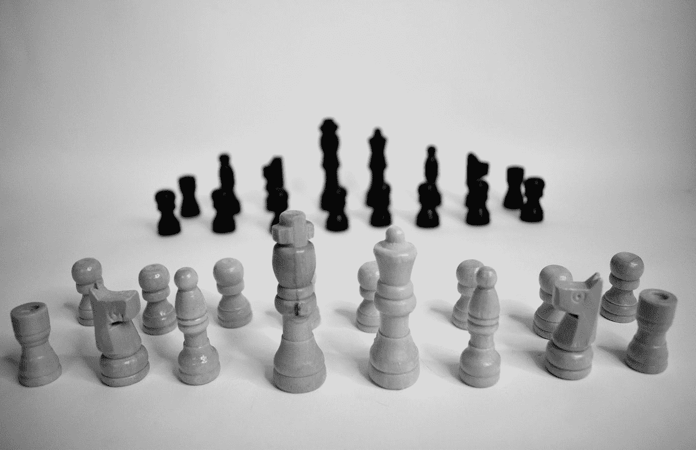

# 加德纳的多元智能理论将改变你对教与学的看法

> 原文：<https://medium.datadriveninvestor.com/applying-gardners-theory-of-multiple-intelligence-to-your-learning-endure-can-tell-you-what-type-4716dd7e9c19?source=collection_archive---------4----------------------->

## 这也会让你明白你应该走什么样的职业道路

Photo by [Tamara Gak](https://unsplash.com/@tamara_photography?utm_source=medium&utm_medium=referral) on [Unsplash](https://unsplash.com?utm_source=medium&utm_medium=referral)

自古以来，人类就在学习中挣扎。斗争总是集中在如何最好地学习某样东西，以及应该使用哪种策略来将自己的学习提高到最佳水平。

不同的教育心理学家提出了各种各样的理论，使教学变得容易和有效。他们都对教育领域做出了巨大贡献。

但是对于一个老师应该选择什么样的策略来教授一个有不同智力水平的学生的班级，仍然存在分歧。老师当时在如何最好地检查学生的表现以及什么参数应该缩小优秀学生和迟钝学生之间的差异上意见不一。

事实是没有学生是迟钝的。每个人都有自己的聪明之处。检验一个学生表现的最好方法是先了解他的天赋。

在这个理论之前，他们认为智力是一个单一的实体。但是加纳的开眼界理论迫使心理学家考虑多元智能，并认为每个智能都不同于其他智能。

今天我们将学习哈沃德·加德纳的多元智能理论，以及它如何帮助我们学习更多知识，以及哪种策略对我们有效。我们也会讨论什么职业适合自己。

# 什么是多元智能理论？

多元智能理论是由哈沃德·加德纳于 1983 年在其著作**“心智框架:多元智能理论”中提出的。这个理论否定了一个人的单一智力。它支持人类生来就有不同的智力，代表一个人可能拥有的各种能力。**

这也挑战了一刀切的教学方法，导致一些学生落后。因为不是所有的学生都被他们的智力所调节，去接受与他们的智力相反的东西。

例如，一个人可能擅长音乐和语言智能，但他的逻辑数学智能可能不好。所以，如果那个人的智商测试是基于逻辑-数学领域，他可能表现不好，他的真正潜力可能不会浮出水面。所以，我们限制单身智商。

因此，哈佛大学教育学教授霍华德·加德纳博士提出，基于智商测试的传统单一智力有严重的局限性。它不能衡量一个人的真实智力。因此，他提出了八种不同的智力理论，每种智力都以自己的方式处理信息。

他的八个多重智能是:

*   *视觉空间智能*
*   *音乐智能*
*   *内省智能*
*   *人际智能*
*   *博物学家的智力*
*   *逻辑-数学智能*
*   *语言智能*
*   *身体动觉智能*

我将很快讨论这些智慧，但首先我想让你知道这个理论的目的。

# 加德纳多元智能理论的目的

加德纳理论的目的是，我们的文化重视那些具有语言或逻辑数学潜力的人，如演说家、煽动家、励志演说家或数学家、医生或工程师。

而具有音乐、内省、自然主义、舞蹈、演员、小丑、画家、治疗师等其他智力的人却不太受关注。因此，他们感到被忽视，他们的潜力未被发掘。

可惜很多学生得不到应有的重视，而这种重视可以给这个世界带来很多人才。他们的才能被我们的教育制度或社会和老师的疏忽所浪费。因此，这些人能够为这个世界做出的贡献常常被黑暗所遗忘。

这就是为什么加德纳认为我们的教育系统必须改变教学方法来适应这些人。它建议对教师进行培训，使他们能够以各种方式授课，如视觉学习工具、内心反思、回顾、讨论、多媒体、角色扮演活动、听力活动、冒险或实地考察、绘画等。

通过运用各种策略，学生将感到适应，并将在多样化的环境中学到更多。

因此，该理论的最终目的是为学生/学习者提供一个多样化的学习环境，以符合他们的智力并学习更多。

> “我们都能够通过语言、逻辑-数学分析、空间表达、音乐思维、使用身体解决问题或制造事物、了解他人和了解自己来认识世界。”—加德纳(1991 年)

# 1.视觉空间智能

视觉-空间聪明的人有通过视觉化学习事物的潜力，他们的空间判断力很强。他们将事物形象化，并想到制作地图和图表。他们也是优秀的空想家。

## 特征

*   他们很清楚自己所处的环境。
*   他们使用思维导图技术来思考一些事情。
*   他们能很好地解释图表、图片和地图。
*   他们能识别模式。
*   他们喜欢画画，更倾向于视觉艺术。
*   他们是优秀的读者，他们可以很容易地解谜。

## 教好他们的更好策略的提示

当根据他们的智力来教导他们时，这样的人给出最大的结果。促进他们学习的最佳方式是通过以下方式教他们:

*   绘制图像和图形
*   在他们的脑海中创造语言意象
*   使用图表和照片
*   使用视频多媒体和 3D 图片

## 潜在的职业生涯

优势在于视觉空间智能的人的最佳职业道路是:

*   工程师
*   摄影师
*   建筑师
*   艺术家
*   设计师

# 2.身体动觉智能

身体动觉智能强的人擅长使用他们的身体控制。他们擅长举重、舞蹈、赛车手、健美操、身体动作、武术和田径。这些人善于将他们的精神运动发挥到极致。他们的手眼判断连接性能比别人强。

## 特征

*   他们对自己的身体有着敏锐的意识。
*   他们喜欢跳舞、运动和有氧运动。
*   他们通过触摸来表达自己。
*   他们使用肢体语言，如手势，来最好地传达他们的信息。
*   他们通过做而不是通过看或听学得最好。
*   他们用手制作东西。

## 教好他们的更好策略的提示

教他们的最好方法是让他们参加体育活动，例如

*   角色扮演活动
*   用手做东西
*   演戏

## 潜在的职业生涯

对这些人来说，他们能够脱颖而出的最佳职业道路是:

*   舞蹈演员
*   健美运动员
*   行动者

# 3.逻辑数学智能

逻辑-数学智能强的人擅长计算、概念思考、识别模式关系、喜欢实验、擅长推理。

## 特征

*   这些人从概念上思考，接受抽象的想法。
*   他们可以看到和探索模式，并可以在复杂的操作中找到它们之间的关系。
*   他们喜欢在处理细节之前学习基本的形式和概念。
*   他们有很强的推理、计算和判断精确数字的能力。
*   他们喜欢解决复杂的问题。

## 教好他们的更好策略的提示

如果满足以下条件，这些学员会取得更好的成绩:

*   材料是按顺序提供的
*   结构良好的材料
*   最好通过逻辑游戏来教授
*   通过给他们复杂的谜题来解决
*   通过对神秘事件的调查

## 潜在的职业生涯

以下工作是最适合具有逻辑-数学智能的人的工作。

*   程序员
*   黑客
*   工程师
*   会计师
*   科学家
*   数学家
*   建筑师

# 4.音乐智能

有音乐天赋的人对音乐有悦耳的听觉。他们最擅长音乐表演和作曲。他们能够识别最佳的音乐音调、声音和节奏。他们是音乐的爱好者。

 [## 贫困心理学|数据驱动的投资者

### 似乎有一种真诚的信念，如果你足够努力地工作，有远大的梦想并努力去做，你就会摆脱贫困…

www.datadriveninvestor.com](https://www.datadriveninvestor.com/2020/01/31/psychology-of-poverty/) 

## 特征

*   他们对音乐很敏感，能够识别出最佳的音调、声音和节奏。
*   他们喜欢唱歌、哼唱和喃喃自语。
*   他们可以很容易地记住押韵，歌曲和音乐的声音。
*   他们在音乐环境中是快乐的。

## 教好他们的更好策略的提示

我们可以通过以下方式教育这些人:

*   背景音乐是他们学习音乐的最佳方式
*   使用有节奏的语言或者有韵律的材料
*   通过使用多媒体、乐器，如收音机和立体声

## 潜在的职业生涯

如果你有很强的音乐天赋，你的职业前景是:

*   音乐老师
*   歌手
*   设计者
*   音乐家

# 5.语言智能

有语言智能的人被赋予演讲的高超技巧。他们是煽动家，很容易影响很多人。他们也是优秀的营销者。他们总是喜欢聊天和八卦。

# 特征

*   他们喜欢讲故事。
*   他们喜欢交谈，知道讨论的艺术。
*   他们是很好的说服者，因为他们可以随心所欲地编词。
*   他们创作诗歌和故事。
*   他们喜欢写作和阅读。
*   他们经常大声思考，有效地使用语言。
*   他们通过说和听记忆最好，因为他们有高度发达的听觉技能。

## 教好他们的更好策略的提示

由于他们的优势在于听觉技能，他们可以通过以下方式学习:

*   以文本格式呈现给他们的材料
*   让他们参与阅读和写作
*   给他们大部分时间说话的机会
*   通过在课堂上做笔记

## 潜在的职业生涯

这些人的最佳职业是:

*   教师
*   政客
*   演说者
*   作者
*   新闻工作者
*   教师

# 6.自然智能

这些人是大自然的爱好者，大自然经常为他们充当老师或疗愈者。他们最擅长在大自然中寻找慰藉。它经常把它们吸引到丛林、高山、溪流和可以看到其他物种的地方。

# 特征

*   他们喜欢野营、远足、游泳和在草地上散步。
*   他们喜欢住在木制的旧农舍里。
*   他们对欣赏原始或古董有着敏锐的感觉，这些东西给他们带来未知的快乐，满足他们对过去的渴望。
*   他们是浪漫的人，喜欢下雪和下雨。
*   他们喜欢在黎明前起床看日出，喜欢在黄昏时去海滩看落日。
*   当他们聆听大自然的音乐时，他们通常是沉默的，比如鸟儿的啁啾声和激流的咆哮。
*   他们对生物学、植物学和动物学等生物科学感兴趣。
*   他们喜欢养宠物。

## 教好他们的更好策略的提示

这些人对自然很敏感，最好通过以下方式来教导他们:

*   生物科学实验，如解剖或操作动物
*   如果我们给他们机会通过显微镜观察细胞，他们很容易学会科学
*   我们可以带他们去丛林和海洋进行研究旅行，收集样本并做研究

## 潜在的职业生涯

对这些人来说，最好的人生职业道路是:

*   农民
*   加德纳
*   农业家
*   植物学家
*   生物学家
*   科学家

# 7.人际智能

拥有人际智能的人是世界的人。他们喜欢与人交流，理解周围人的情绪、感受和动机。他们喜欢交谈和社交。他们喜欢聚会和办派对。他们经常有朋友圈。

## 特征

*   无论是口头上还是非口头上，他们都是优秀的沟通者。
*   他们可以通过谈判解决问题和冲突。
*   他们理解他人，在友谊中总是开放的。
*   他们成为了好朋友。
*   他们有情景意识，可以从不同的角度判断。

## 教好他们的更好策略的提示

我们可以通过以下方式教人们这种智能:

*   研讨会
*   小组活动
*   对话
*   给定方向
*   让他们参与自由学习的环境

## 潜在的职业生涯

*   市场商人
*   政治家
*   心理学家
*   教师
*   律师
*   评论员
*   组织者/管理员

# 8.内省智能

内省智能强的人性格内向，与社会保持距离。他们是孤僻的人，有强烈的自我意识。他们知道并理解自己的情绪、感受、兴趣和动机。他们直觉敏锐，善于做白日梦。他们自言自语。他们计划他们的活动并设定目标。他们在任何情况下都有自己的观点，并且经常找借口。

## 特征

*   他们有强烈的自我意识，重视感觉和情感。
*   比起和别人在一起，他们更喜欢自己。
*   他们保持隐私，需要时间来打开。
*   他们可以独立工作。
*   他们有创造力，聪明，有思想。
*   他们总是分析自己和他人以及他们的优缺点。
*   他们害怕大型集会，避免去或公开表达自己。
*   他们能接受任何想法或理论，并能达到其哲学深度。

## 教好他们的更好策略的提示

拥有这种智力的人可以表现出更好的结果，如果他们:

*   根据独立研究
*   反思和回顾的时间到了
*   写日记
*   提供创意材料
*   创意书籍
*   通过告诉他们抽象的想法和在平静的环境中想象事物

## 潜在的职业生涯

对这些人来说，最有可能的职业发展道路是他们能够茁壮成长的地方:

*   哲学家
*   科学家
*   油漆匠
*   作者

# 结论

多元智能并不意味着每个人只有一种智能。这意味着每个人都拥有所有这些智能。但我们的优势在于一两个小聪明。其余的我们拥有较少的题外话。但一个总是更高。我们必须理解我们的一个更高的智能，并努力使它变得更强大。

这意味着，例如，如果你对音乐很有鉴赏力，但你也喜欢运动，那么你就有两项强大的技能。

如果你认为你拥有两种以上强大的技能，那么恭喜你，你是天才之一。

然而，总而言之，这篇冗长的文章，我将提到 Rief 关于保持学习的研究，他说学生/人们保持:

*   他们阅读的 10%
*   他们听到的 20%
*   他们所看到的 30%
*   他们所见所闻的 50%
*   他们所说的 70%
*   他们所做的 90%

所以，基本上，对一个学习者来说，他或她必须使用所有这些技能和智力来知道哪种学习风格或教学策略适合他们。通过了解自己的最佳学习方式，可以显著影响他的学习策略。

学习自己的智力，对自己确定未来的工作也是相当有帮助的。如果你不知道自己最擅长做什么，你会觉得自己在工作中格格不入。这也会显著影响你的收入、自尊和声誉。

所以，要拥有所有这些，就要了解你拥有哪种类型的智力！

## 访问专家视图— [订阅 DDI 英特尔](https://datadriveninvestor.com/ddi-intel)