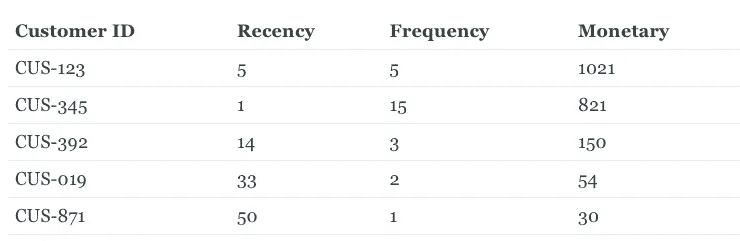
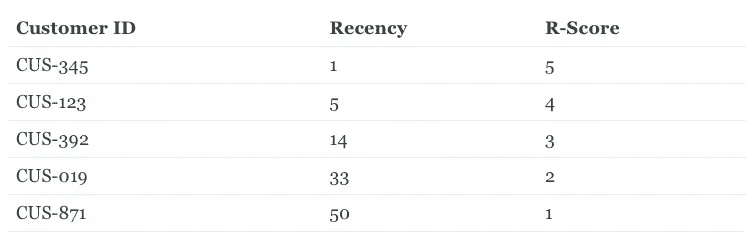
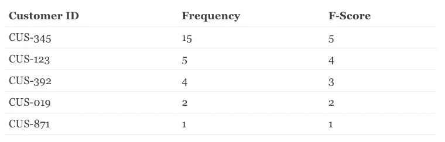
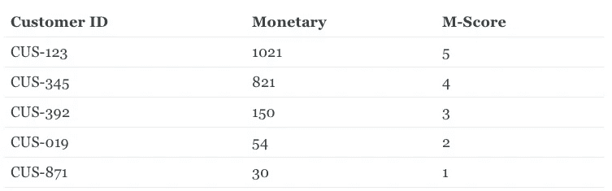
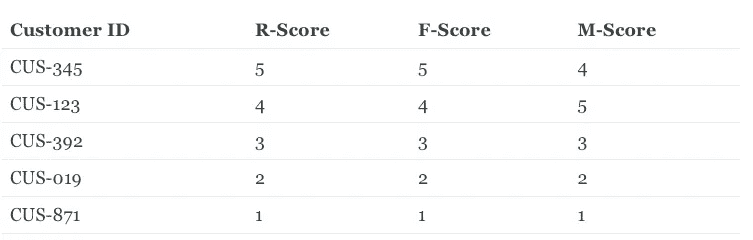
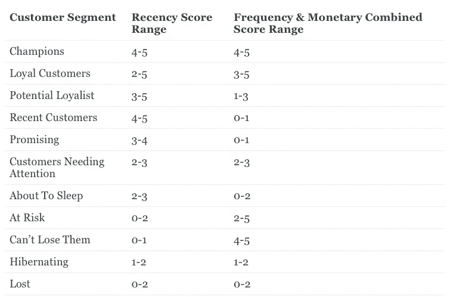

# 立即将 RFM 客户细分应用到您的业务中

> 原文：<https://medium.datadriveninvestor.com/applying-rfm-customer-segmentation-to-your-business-right-now-708eb2659542?source=collection_archive---------10----------------------->

想一想，你现有的客户中有一部分实际上是不活跃的，而另一部分已经流失了。你知道这部分在你的数据库里有多大吗？

发送针对该客户群的信息将产生更高的转化率。

难道不是吗？这难道不是应该的吗？

Photo by [Nick Fewings](https://unsplash.com/@jannerboy62?utm_source=medium&utm_medium=referral) on [Unsplash](https://unsplash.com?utm_source=medium&utm_medium=referral)

所有的营销活动都应该首先选择一个目标细分市场，然后制作能引起该受众共鸣的宣传材料。

RFM 分析是一种便捷的方法**，可以找到你最好的客户，了解他们的行为，然后开展有针对性的电子邮件/营销活动，以增加销售额**，满意度和客户终身价值。

> 客户/用户细分在营销界并不陌生。大品牌将此归结为一个 T，而小公司刚刚意识到激光聚焦战略背后的力量——激光聚焦用户细分。
> 
> *——尼尔·帕特尔谈* [*用户细分如何在内容营销中发挥作用*](http://contentmarketinginstitute.com/2016/06/segmentation-content-marketing/)

# RFM 分析如何变得有用？

Photo by [Henry & Co.](https://unsplash.com/@hngstrm?utm_source=medium&utm_medium=referral) on [Unsplash](https://unsplash.com?utm_source=medium&utm_medium=referral)

正如您可能已经了解的，RFM 矩阵可以准确识别隐藏在我们客户数据库中的潜力。

RFM 使识别客户群变得容易。

RFM 考虑了每个客户的近期、频率和货币价值。将它们组合在一起，然后将它们分成不同的客户群，以便于回忆和确定活动目标。RFM 分析对于理解客户的响应能力和细分驱动的数据库营销非常有用。

 [## 大数据影响电子商务的 4 个关键领域|数据驱动的投资者

### 毫无疑问，大数据可能是电子商务的下一个重大变革者。通过最终给在线零售商一个…

www.datadriveninvestor.com](https://www.datadriveninvestor.com/2019/12/21/4-critical-areas-where-big-data-impacts-ecommerce/) 

# RFM 回答了哪些问题？

*   谁是我最好的客户？
*   哪些客户处于被搅动的边缘？
*   谁有潜力转化为更有利可图的客户？
*   哪些是你不需要太关注的流失客户？
*   你必须留住哪些客户？
*   谁是你的忠实客户？
*   哪一组客户最有可能对您当前的活动做出回应？

# RFM 是一个经过科学验证的过程

这个概念最初是由 Bult 和 Wansbeek 在 1995 年提出的。目录营销人员有效地使用它来最小化他们的印刷和运输成本，同时最大化回报。

Photo by [Austin Distel](https://unsplash.com/@austindistel?utm_source=medium&utm_medium=referral) on [Unsplash](https://unsplash.com?utm_source=medium&utm_medium=referral)

它基于**帕累托法则:** 80%的结果来自 20%的原因。同样，20%的客户贡献了你总收入的 80%。**消费过一次的人更有可能再次消费。购买大件商品的人更有可能重复购买。**

帕累托原则是 RFM 模型的核心。将你的努力集中在关键的客户群上可能会给你带来更高的投资回报！

# RFM 值计算

想知道如何为您的客户数据库计算 RFM 分数吗？如果你按照这些步骤做，真的很简单。我们需要每个客户的一些详细信息:

*   客户 ID /电子邮件
*   **Recency(R)as days from last purchase**:他们最后一次购买是在多少天前？从今天开始计算最近值的最近购买日期(以天为单位)。
*   **频率(F)为交易总数**:顾客在我店购买了多少次？例如，如果有人在一段时间内下了 5 个订单，他们的频率是 5。
*   **货币(M)作为总花费**:顾客花了多少钱？简单地合计所有交易的金额，就可以得到 M 值。

下表是所有计算后您应该获得的结果的示例:

计算基于一个时间范围，我建议最少 3 个月，但也可以计算更长的时间范围或许多不同的时段。例如，计算 RFM 矩阵并比较前 3 个月或前 6 个月的结果是很有趣的。

# RFM 分数计算

一旦我们有了 RFM 值，我们会为每个客户的新近度、频率和货币值分别指定一个从一到五的分数。五是最高值，一是最低值。

RFM 价值观和 RFM 分数是不同的。Value 是该客户的 R/F/M 的实际值，而 Score 是基于该值的 1-5 之间的数字。

为了计算分数，我们首先按照降序(从最高到最低)对值进行排序，并设置分数。最近的购买被认为更好，因此被赋予更高的分数。

# 在 1-5 分范围内计算分数的两种方法。

不同的企业可能会使用不同的 RFM 公式方法对 RFM 值进行排名，从 1 到 5 不等。

# 1-固定范围

**例如:**如果有人在过去 24 小时内购买，则给他们分配 5。在过去的 3 天里，给他们打 4 分。如果他们在当月购买，则分配 3，过去六个月分配 2，其他人分配 1。

由于他们决定了他们认为理想的范围，因此该范围可以根据具体业务进行调整。随着业务的增长，评分范围可能需要经常调整。

如果有定期付款，但付款条件不同(每月、每年等)，计算可能会出错。

# 2 分位数

它由基于可用值的五等份组成，除以五等份。

如果我们选取 100 名客户，并划分五个相同的百分位数范围，18 的分数将落在 0–20 范围内，这将是第一个五分位数。百分位值 51 将落在 50-75 的范围内，因此是第四个五分位数。

**它仍然是计算得分的推荐方法**，因为它解决了固定范围方法中的许多问题，并且它适用于任何行业，因为范围是从数据本身中选取的，它们均匀地分布客户并且没有交叉。

# 基于固定范围的 RFM 计算示例

在此表中，您可以看到如何设置最近得分。

在第二个表格中，我们设置了频率得分。

最后一个，我们为货币设定分数。

现在，我们可以将所有这些放在一起，并按分数分组，以确定谁最近购买了产品，谁是经常购买者，谁花了很多钱，并被分配了 555 分—最近(R) — 5 分，频率(F) — 5 分，金钱(M) — 5 分。

理解 50 个客户群仍然很难，我们可以**在下表中将分析总结为 11 个客户群。**

# [看看我的网站，阅读其他关于数据分析、营销自动化和机器学习的文章。](https://alexgenovese.it)

**访问专家视图—** [**订阅 DDI 英特尔**](https://datadriveninvestor.com/ddi-intel)