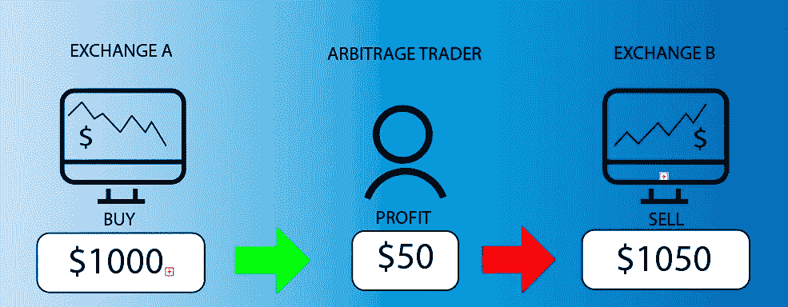
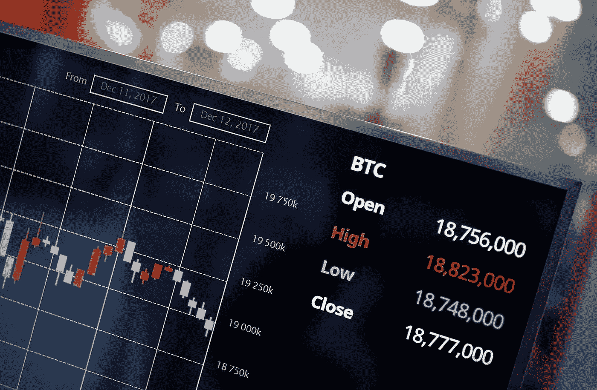
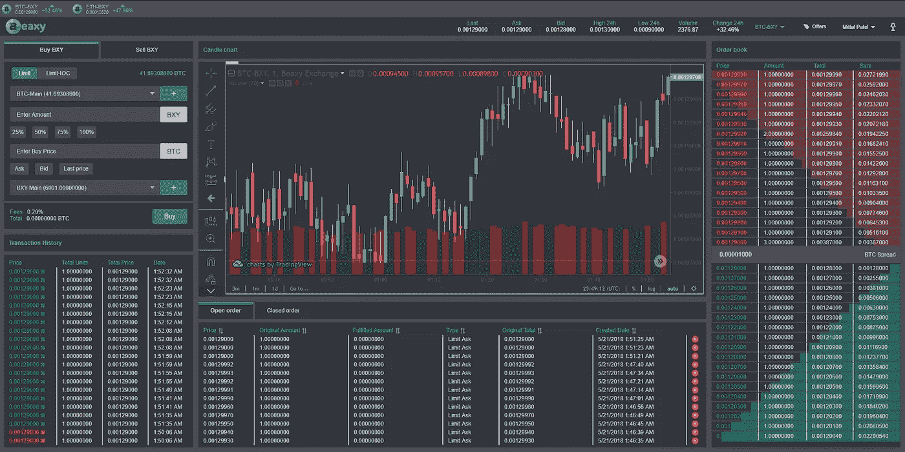

# 加密套利交易

> 原文：<https://medium.datadriveninvestor.com/arbitrage-trading-in-crypto-11ec661c9de9?source=collection_archive---------17----------------------->

古老的套利策略利用了市场之间的价格失衡——但它在加密货币世界中是如何运作的呢？

你可能想过，这些差异会带来绝佳的套利机会。然而，它可能不像乍看起来那么简单。

比特币和加密货币的套利正在成为一种流行的策略。大量交易所的存在，它们的分散化，允许发明各种投机和快速获利的方案。让我们看一些加密货币套利的例子。

对于许多交易者来说，外汇市场的套利交易早已不是秘密，而是稳定利润的来源。同时，该策略也可以成功应用于加密货币市场。

# 一般来说什么是套利？

这种类型的交易受益于不同市场价格的不平衡。也就是同一个硬币的价格差。简而言之，它是指一项资产几乎立即在两个不同的交易所买卖，价格略有不同。

 [## 总部位于瑞士的 ETP 进入加密交易市场|数据驱动的投资者

### 虽然金融市场几乎没有沉闷的时刻，特别是在引入…

www.datadriveninvestor.com](https://www.datadriveninvestor.com/2019/03/10/swiss-based-etp-enters-the-crypto-trading-market/) 

例如，某个技术公司的股票在纽约证券交易所可以卖到 35 美元，在伦敦可以卖到 35.10 美元。当然，差别很小，但快速以较低的价格批发买入股票，然后以较高的价格卖出，可以给有眼光的交易者带来可观的利润。这个概念反映了套利的全部本质，与其他策略相比，风险相对较低。

你可能想知道:这种差异是如何发生的？原因有很多。货币波动可能意味着股票在外汇交易中将被低估。市场是不完善的，很难实现所有交易所的同步。买卖双方的信息不对称也有利于套利。

应该注意的是，在低利润的情况下，交易佣金会使许多套利机会在财务上失去意义。除了股票之外，套利在各种金融工具中都是可能的，这就给我们带来了下面的问题。

# 你能从加密套利中赚钱吗？

是的，概念是相同的，但资产是不同的。现在世界上有很多交易所，为客户提供购买加密货币的机会。但比特币 BTC 或 ETH 等数字货币的价格可能会有很大差异。

这种差异通常出现在加密货币需求旺盛的地方。最常被引用的例子之一是“泡菜溢价”。这个词在 2017 年底首次使用，当时韩国的最高 BTC 价格比市场平均价格高出 30%。BTC 汇率在全球最高时达到 1.95 万美元，而在朝鲜，最大的加密货币交易价格为 2.5 万美元。

津巴布韦是一个遭受恶性通货膨胀的非洲国家，因此食品和燃料等重要商品会在几天甚至几个小时内变得更加昂贵。有时当地人不得不去杂货店买满津巴布韦元以防万一。2017 年，比特币在当地交易所的价格几乎是国际平台的两倍，部分原因是当地消费者无法进入外国交易所。比特币在这个国家的压迫就是从那时开始的。

在香港发生政治抗议的背景下，比特币也在香港交易保证金。去年 8 月，当地商人为这枚硬币支付的价格比其他国家高出 2%。同月，在阿根廷，当比索在意外的选举结果后崩溃时，价格上涨了 4%。

即使将经济和政治条件排除在外，交易所之间的价格差异也可能有利于套利。

# 在密码行业流行吗？

套利已经存在了几个世纪，并开始在加密领域受到欢迎——但这种可能性可能是短暂的。

将加密货币从一个交易所转移到另一个交易所时，供求关系的变化会影响价格。市场波动可能意味着套利机会将很快消失，但与此同时，不可预测的价格变化往往会创造新的机会。通过正确的方法，理论上有可能在短时间内赚取可观的金额——由于有超过 200 家交易所，交易所的差异是不可避免的。

加密货币套利也有新方法，不使用交易所。Pax ful——点对点比特币交易所，直接连接买家和卖家，允许您使用 300 多种支付方式购买 BTC。有了它，美国和欧洲的用户可以向那些更难买到或更贵的市场出售 BTC，与当地交易所的价格相比，买家将节省费用。

还存在支付方式套利的可能性。虽然通过银行转账购买 BTC 可能更便宜，但使用礼品卡时通常会收取附加费。平台代表声称这给了加密社区利用这种差异的机会。

# 加密货币套利有风险吗？

法律和金融壁垒可能会使从加密套利中获利变得困难。

不管加密货币套利的类型如何，这些平台都收取交易费，有时还收取提现费。因此，对交易者来说，重要的是考虑这些成本，以确保最终仍有一些利润。

国际仲裁也可能使客户身份识别法律复杂化(KYC)。这些都是严格的要求，根据这些要求，有时交易者只有在提供有效护照或政府颁发的其他文件后才能在交易所进行交易。所有这些都是证明你身份的必要条件。

交易所的另一个问题可能与取款延迟有关。如果你的时间有限，无法将资金从一个平台转移到另一个平台，缓慢的转移可能意味着你将错过在完成交易前赚钱的机会。

你还应该小心那些为比特币和其他加密货币提供远低于市场价格的交易所。虽然这可能看起来是一个不可抗拒的获得丰厚利润的机会，但你应该首先彻底检查和检查交易所是否可靠——否则你可能会失去你的资本。原因可能是由于安全性差的黑客攻击，或平庸的无法提取资金。

加密货币的套利交易是否值得努力，这个问题没有明确的答案。通常，有丰富市场交易经验的人和知道如何区分有利时机的人在这个领域是成功的。虽然有可能从买卖价格之间 20%的差价中获益，但谨慎的做法是问问自己，如果差价不超过 5%，是否值得进行交易。

在开始仲裁之前，重要的是要记住法律、技术和财务障碍，以及加密市场中可能的费用和波动。然而，拥有不分国界、直接连接买卖双方的平台，可以激发人们对仲裁的新兴趣。

利用我们的云采矿平台 Hashmart.io，赚取更多 BTC，在加密货币交易所进行交易！