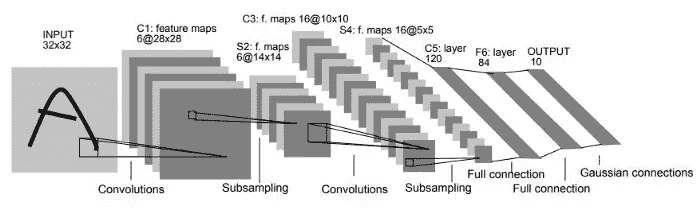
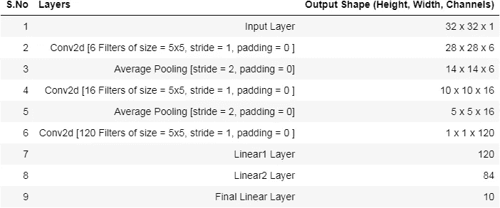
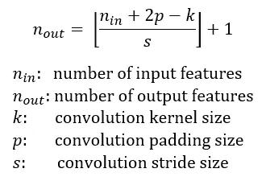
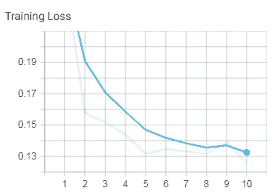
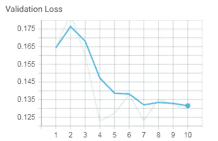

# Pytorch 中 LeNet 的架构与实现

> 原文：<https://medium.datadriveninvestor.com/architecture-implementation-of-lenet-from-scratch-in-pytorch-709cc38c00a9?source=collection_archive---------1----------------------->

重建最古老的神经网络架构。

# 介绍

我将在 medium 上发表一系列文章，涵盖大多数 CNN 架构，并在 PyTorch 和 TensorFlow 上实现。我相信在掌握了标准架构之后，我们将准备好为任何任务构建我们自己的定制 CNN 架构。

所以我从最古老的 CNN 架构 LeNet(1998)开始。它主要是为识别手写和其他字符而开发的。

该架构共有 7 层，由 2 组卷积层和平均池层组成，其后是平坦卷积层。之后，我们有 2 个密集的全连接层，分别有 84 个和 10 个输出神经元。

## LeNet 架构

上图总结了 LeNet 的架构，我们来分解一下各层的参数。

这种体系结构是专门为低分辨率图像设计的，例如大小为 32 x 32 灰度级的 MNIST 图像。

## 输出通道的数量可以通过下式计算:

## 学习参数的数量= [i x (f x f) x b] + b

i =卷积层中输入通道的数量
f =滤波器尺寸
b =偏置数量

## 总体计算:

跨距和填充在整个网络中保持不变，
因此 **S = 1，P = 0**

1.  **输入图层形状= 32×32×1**
2.  **用 6 个大小为(5x5)的过滤器应用 conv2d 后，**

*   输出形状=((32+0–5)/1)+1 = 28
*   学习参数的数量= ([ 1 x (5 * 5) x 1] + 1) * 6 个过滤器= 156

3.**应用平均大小池(2x2)后，**

*   输出形状=((28+0–2)/2)+1 = 14
*   学习参数数量=无(0)

4.**应用 conv2d 和 16 个大小为(5x5)的过滤器后，**

*   输出形状=((14+0–5)/1)+1 = 10
*   学习参数的数量= ([ 6 x (5 * 5) x 1] + 1) * 16 个过滤器= 2416

5.**应用平均大小池(2x2)后，**

*   输出形状=((10+0–2)/2)+1 = 5
*   学习参数数量=无(0)

6.**应用 conv2d 和 150 个大小为(5x5)的过滤器后，**

*   输出形状=((5+0–5)/1)+1 = 1
*   学习参数的数量= ([ 16 x (5 * 5) x 1] + 1) * 120 个过滤器= 48120

7.**应用 84 个神经元的线性层，**

*   学习参数个数= (120 * 84 + 84) = 10164

8.**应用 10 个神经元的线性层，**

*   学习参数个数= (84 * 10 + 10) = 850

 [## 人工智能、深度学习和医疗实践|数据驱动的投资者

### 人工智能和深度神经学习的效用看起来可能是合法和有前途的，特别是…

www.datadriveninvestor.com](https://www.datadriveninvestor.com/2020/06/24/disclosure-and-resolution-program-wont-prevent-physicians-from-practicing-defensive-medicine/) 

# 用 Pytorch 实现 LeNet

## 导入库

## 模型结构

正如我们看到的，模型的总结与我们的计算完全吻合。

## MNIST 实施:

从图中，我们看到模型在训练和测试数据上表现良好。

损失值:

Training and Validation Loss

## 我们模型的准确性:

在 MNIST 模型上，我们得到了 96.37 的良好训练精度和 96.32 的验证精度。

📌**完整实现可在此**[**GitHub Gist**](https://gist.github.com/bala-codes/0f79addd101152d9d67f33ff69ab9234)**或** [**打开 Colab**](https://colab.research.google.com/gist/bala-codes/0f79addd101152d9d67f33ff69ab9234/architecture-implementation-of-lenet-from-scratch-in-pytorch.ipynb) **。**

> ***参考文献:***

[1] Yann LeCun，[基于梯度的学习应用于文档识别](http://yann.lecun.com/exdb/publis/pdf/lecun-01a.pdf) (1998)。

文章作者:

巴拉克里希纳·库马尔五世

## 获得专家观点— [订阅 DDI 英特尔](https://datadriveninvestor.com/ddi-intel)