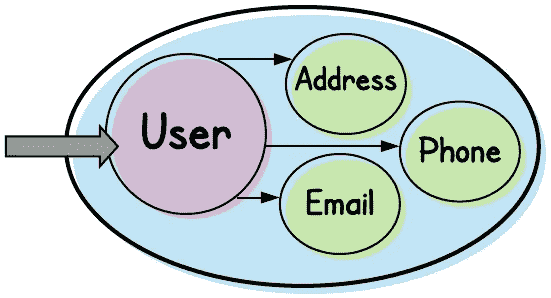
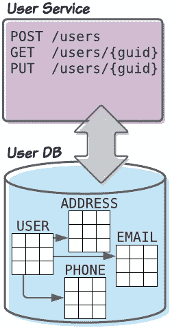
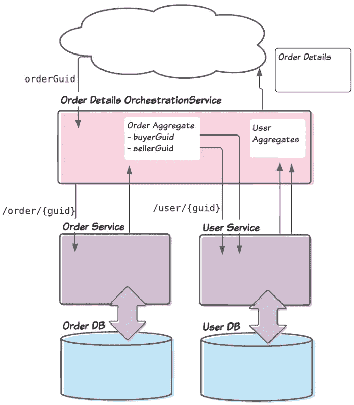
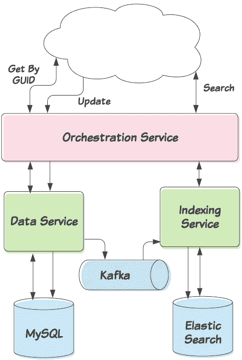
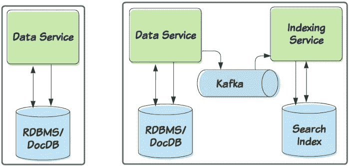

# 面向聚合的微服务是死路一条吗？

> 原文：<https://medium.datadriveninvestor.com/are-aggregate-oriented-microservices-a-dead-end-6651db494f0e?source=collection_archive---------0----------------------->

## 拥抱这个重要的设计模式是否意味着我们不能搜索我们的数据？


Photo by [Markus Winkler](https://unsplash.com/@markuswinkler?utm_source=medium&utm_medium=referral) on [Unsplash](https://unsplash.com?utm_source=medium&utm_medium=referral)

之前，我写过关于[聚合、](https://medium.com/better-programming/why-your-microservices-architecture-needs-aggregates-342b16dd9b6d)的文章，这是一个重要但未被充分重视的微服务设计模式。当我引入这种模式时，我经常听到一种常见的担忧:如果我们采用面向聚合的架构，我们会不会关上搜索数据的大门？

答案显然是否定的。

在本文中，我们将回顾这个聚合模式，展示为什么(乍一看)这个模式似乎排除了搜索，然后解释为什么实际上不是这样。

在设计微服务时,[聚合](https://medium.com/better-programming/why-your-microservices-architecture-needs-aggregates-342b16dd9b6d)是一个重要的设计模式。我在之前的文章中描述了这种模式、它的好处以及如何采用它。不过这里先总结一下。

简而言之，聚合是被视为单个原子单位的一组相关实体。根据定义，聚合由以下部分组成:

*   一些相关的实体
*   明确定义聚合中包含的实体(以及不包含的实体)的边界
*   单个*根*实体，它是聚合中唯一的*实体，可以直接从外部访问*

*聚合的一个最明显的例子可能是一个`User`对象。虽然具体的用例可能会有所不同，但我们可以很容易地描绘出一个对象模型，其中我们有一个核心的`User`对象(带有诸如*名字*、*姓氏*、*出生日期*、*国家 Id* 等字段)。我们可以将联系人信息集合，比如`Address`、`Phone`或`Email`附加到那个`User`对象上。*

**

*Any other entities can access a User Aggregate only through the Aggregate Root: the User entity*

*用户对象本身显然是用户集合的根。聚合之外的任何其他实体都不能通过聚合中的任何其他实体访问用户聚合。*

*坚持这种模式有很多好处，我在之前的文章中概述了这一点；这些原因包括:*

*   *拆分我们整体数据模型的清晰蓝图*
*   *允许我们在扩展时共享数据库*
*   *提供明确定义的消息，我们的服务可以生成这些消息供其他服务使用*
*   *使得对未成功消费的消息的安全重试成为可能*
*   *显著简化的缓存*

*[](https://www.datadriveninvestor.com/2020/05/27/clean-code-is-crucial-in-software-development-heres-why/) [## 干净的代码在软件开发中至关重要——这就是为什么|数据驱动投资者

### 干净的代码是“容易理解和容易改变的”，它是关于对细节的关注。但是开发人员为什么要担心…

www.datadriveninvestor.com](https://www.datadriveninvestor.com/2020/05/27/clean-code-is-crucial-in-software-development-heres-why/) 

# 聚合和微服务

聚合如何影响我们微服务的设计？首先，他们指导我们设计我们的*数据服务*；也就是说，微服务是我们组织数据的入口。

换句话说，当我们设计聚合时，这些聚合自然会推动以下设计:

*   存储聚合的数据库的架构
*   微服务的 API 提供了对这些数据库的直接访问

从上面的用户示例来看，我们可能会得到一个微服务和数据库对，如下所示:



注意，为了便于说明，我们将在示例中描述 ReST APIs。但是同样的原则也适用于 Thrift APIs、gRPC APIs 等。数据库可能是一个 [RDBMS](https://techterms.com/definition/rdbms) ，比如 MySQL，但也可能是一个[文档数据库](https://en.wikipedia.org/wiki/Document-oriented_database)，比如 MongoDB。

在我们的架构中，我们会有其他更高级别的服务来利用这些数据服务。例如，我们可能有一个组合了各种聚合的*编排服务*。以下示例描述了电子商务网站中的一项服务，该服务通过以下步骤汇总了在线订单的概况:

*   公开接受订单 GUID 的 *GET* API
*   检索由该 GUID 表示的订单聚合
*   提取买方和卖方(都是用户)的 GUIDs
*   检索代表买方和卖方的用户集合
*   将所有这些聚合打包成高级订单详细信息模型，并将其返回给调用者



An orchestration service stitches together calls to our various Data Services

# 听起来不错。但是如何查询我们的总量呢？

聚合的一个重要需求是，所有对聚合的访问都必须通过根实体。因此，任何请求 URL 都需要以类似于
`/aggregate/{aggregate-identifier}`
的开头。因此，如果我们向用户数据服务提供 read APIs，它们看起来会像这样:

```
GET  /users/{guid}
GET  /users/{guid}/phones
GET  /users/{guid}/phones/{phoneId}
```

这意味着我们*不能*提供如下 API:

```
GET /users/phones/{phoneId}
```

敏锐的读者可能已经意识到我们也不能提供如下的“搜索”API:

```
GET /users/?email=me@mydomain.com
```

从表面上看，这似乎是一个大问题。

如果我们需要能够查找用户——不是通过他们的 GUID——而是通过他们的电子邮件地址——会怎么样？

或者如果我们改变我们的订单从上面的例子；如果我们的编排服务接受了一个*用户 GUID* ，然后需要搜索*订单*来找到那些具有匹配*买方或卖方 GUID*的订单，会怎么样？

更广泛地说，如果我们需要通过除 GUID 之外的某个东西*而不是*来定位任何聚合，该怎么办？这很难说是不寻常的需求或不合理的要求。但是面向聚合的架构排除了这种可能性吗？

# 解决方案:实现单独的索引服务

这个问题的解决方案看似简单。我们将实现一个单独的服务，它是为索引搜索词而优化的。所有的“搜索”——也就是说，所有的“GET”请求，查询除了由 ID 指定的聚合实例之外的任何内容——都将针对这个索引服务执行。

我们的数据服务仍然是聚合的原始来源或记录系统。对我们的聚合的所有写入(插入、更新、删除等)都将通过该服务进行。另一方面，索引服务永远不会被直接更新。相反，它会收到这些写操作的通知——通常通过 Kafka 之类的异步机制——并最终保持一致。



All updates — and get-by-GUID operations — would go through the Data Service. Freeform searches would be handled by our Indexing Service. Note that in reality, we might split the “Indexing Service” into two separate services: one that consumes Kafka messages and updates the index, and one that facilitates searches.

让我们重温一下我们之前提出的*按用户查找订单*的困境。我们的编排服务需要能够搜索买方 GUID 或卖方 GUID 与给定用户 GUID 匹配的订单。

为了支持这一点，我们将引入订单索引服务。订单数据服务将通知该服务任何添加(或更新，如果我们允许对现有订单进行更新)。然后，它将维护买方 guid 和卖方 guid 的索引，这些 guid 映射回它们相关的订单。然后，编排服务将查询订单索引服务。

假设订单索引服务找到匹配的订单，它将返回什么？我们有几个选择。

1.  **返回匹配订单的 GUIDs。**我们的索引服务可能不会返回订单对象本身，而只是返回匹配订单的 GUIDs。调用者(在本例中是订单细节编排服务)将负责调用订单数据服务来检索匹配订单的细节。
    这种方法的主要好处是编排服务将总是检索订单的当前表示。回想一下，根据设计，索引服务最终将是一致的，因此它返回的详细信息可能不是最新的。
    另一个好处是索引服务和编排服务之间推送的数据量显著减少。
    缺点很明显:编排服务必须进行额外的调用。根据匹配订单的数量，这可能会导致对 Order Details 服务的大量调用。
2.  **返回匹配订单的丰富表示。我们的索引服务可能会返回整个订单对象。
    当然，利弊与之前的方法正好相反。这里，索引服务将返回更多的数据，但是编排服务不需要对数据服务进行额外的调用。但是，编排服务返回的数据可能已经过期。**

支持哪种方法取决于我们的具体设计。例如，如果我们的数据是仅追加的，也就是说，一旦创建就不更新，那么我们就不必担心数据不同步。在这种情况下，我们可能倾向于选项 2。

此外，如果是这种情况，那么我们可能会决定将我们的设计更进一步，要求所有的读取操作都要经过我们的索引服务。在这种情况下，我们在数据服务和索引服务之间有了更清晰的划分。

# 摘要

之前，我们展示了下图左侧描述的聚合和微服务的可视化表示。当搜索变得必要时，我们的心智模式应该调整到右边的表征。



当然，这只是一个概述。我们的实际细节可能不同。例如，我们可以创建单独的索引和搜索服务。或者我们可以使用不同于卡夫卡的机制来保持系统同步。

但总体思路是一样的。为了支持面向聚合的架构和搜索功能，我们应该将数据服务与配套的索引服务捆绑在一起，以支持搜索。

**访问专家视图—** [**订阅 DDI 英特尔**](https://datadriveninvestor.com/ddi-intel)* 

*觉得这个故事有用？想多读点？只需[在这里订阅](https://dt-23597.medium.com/subscribe)就可以将我的最新故事直接发送到你的收件箱。*

*你也可以支持我和我的写作——并获得无限数量的故事——通过今天成为媒体会员。*