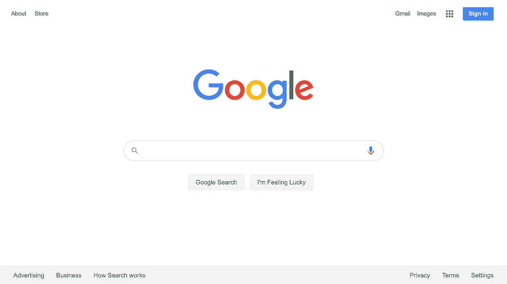

# 企业软件的下一步是分析应用吗？

> 原文：<https://medium.datadriveninvestor.com/are-analytic-applications-whats-next-in-enterprise-software-5dfe4f19a110?source=collection_archive---------10----------------------->

Diego Klabjan 教授邀请我在他位于西北大学的深度学习中心发表就职演讲。你可以 [*听完整个对话*](https://northwestern.zoom.us/rec/play/VxXYxD-4QUIvJhxxQUGuOu3jJlyo_6zPfc-Fc_vbWS-z-DI9bVpL6LtL14mUgy11OldtJbm5UhUhtn5C.FLOSp912X18_802o?continueMode=true&_x_zm_rtaid=cGuAFsYHRoubeyJeYAFh3A.1606760273008.b4f8f96428bef2dada6c8869ce4b9ae8&_x_zm_rhtaid=131) *。接下来的内容是基于这个研讨会，它被分成三个 TED 大小的演讲。*

*第一部分关注企业应用的一个新类别:分析应用。我们已经看到这些在消费者应用程序中出现，其中谷歌搜索是最明显的。我概述了这些新的企业应用程序的五个关键特征。分析应用程序的五个特征之一是它们将从大型数据集创建。那么这些数据将来自哪里呢？虽然人们已经从物联网中挖掘了很多数据，但物联网中的数据要多得多。虽然这一点现在已经很明显了，但是收集这些数据仍然存在许多挑战。演讲的第二部分基于麦肯锡在年度圣丹斯大会上发表的工作，强调了五个关键挑战。最后，第三部分讨论分析应用如何改变世界，我将告诉你我如何成为越南公民的故事。我把会谈分成三个中等职位。这是第一部分。*

作为一个在企业软件领域工作多年的人，我总是对思考下一步会发生什么感兴趣。有时候回顾过去是预测未来的一种方式。

在企业工作流软件的**第一时代，出现了像微软和甲骨文这样专注于开发者的基础设施软件公司。这些软件工程师在整个 90 年代使用 Microsoft Visual Basic 和 Oracle 数据库为企业构建定制的工作流应用程序。重点是自动化工作流，如订单到现金、购买到付款或招聘到雇用。**

到 90 年代末，企业工作流软件的第二个时代**开始了，创建了打包的内部企业工作流应用程序。出现了包括 PeopleSoft、Siebel、SAP 和 Oracle 在内的公司。因此，企业不需要雇用程序员来开发这些工作流应用程序，他们只需要购买应用程序并管理它们。**

企业工作流软件的第三个时代始于 2000 年代，以云服务的形式交付工作流应用。这方面的例子比比皆是，包括 Salesforce、Workday 和 ServiceNow 等专为云构建的公司，以及微软和 Blackbaud 等转型提供软件即服务的公司。这个时代消除了企业雇用运营人员来管理应用程序的需要，并加速了打包工作流应用程序的采用。虽然您可以雇佣软件开发人员来编写 CRM 应用程序，并雇佣运营人员来管理它，但您为什么要这样做呢？

现在让我们来看看分析的世界，它的目的不是自动化工作流，而是使用数据来发现更深层次的见解、做出预测或生成建议。大多数企业分析软件都处于第一时代。我的意思是，公司正在生产基础设施技术，使企业能够构建定制的分析应用程序。**企业分析软件的第一个时代**假设企业将雇用软件开发人员、数据工程师、ML 和 AI 专家以及运营人员来管理应用程序和数据。这一领域的公司和产品包括 Business Objects、Cognos、Teradata 和 Oracle 等经典企业软件，以及 Amazon Redshift、Google Big Query、Microsoft SQL Azure、MongoDB、Cloudera、Databricks、Snowflake、R/Studio、Tableau、Anaconda、Pivotal、TensorFlow 和 Kinesis 等新兴公司。

这个软件的大部分被用来建立“错误的岩石分析”。我的意思是问一个问题的无休止的循环，这个问题在每个企业中引发另一个问题。其中的每一个都会产生一个定制的分析应用程序，就像我们在第一个工作流软件时代看到的定制工作流应用程序一样。如果过去是未来的预测者，那么什么时候会超越自定义分析应用程序，将分析应用程序打包为云服务？那么什么是打包的分析应用程序呢？有什么特点？

**1。分析应用服务于工作者的需求，而不是软件开发者。**

企业分析应用程序关注的是员工，而不是开发人员。消费者世界最好的例子是谷歌搜索。这是一个专注于工作者而不是开发者的应用程序。拉开盖子，你会看到里面有大量的技术。在企业中，分析应用程序将关注临床医生、人力资源副总裁、欺诈检测部门或建筑工地经理的需求。

**2。分析应用使用历史数据**

典型的工作流应用程序会丢弃历史数据。一旦事务被提交，它可能会出现在审计日志中，以防您必须回滚，但是工作流应用程序已经准备好继续工作。另一方面，如果你是一个分析应用程序，你需要所有的历史数据，你购买的所有东西；或者风力涡轮机在过去一年中的行为；或者过去五年里所有患有先天性心脏病的孩子的儿科超声心动图。

 [## 面向企业转型的 AWS:顶级云架构师的秘密|数据驱动型投资者

### “您使用云实现企业转型的方法是什么？”是人们一直问我的问题，自从我…

www.datadriveninvestor.com](https://www.datadriveninvestor.com/2020/07/15/aws-for-enterprise-transformation-secrets-of-top-cloud-architects/) 

**3。分析应用使用大量数据**

你们中的一些人可能熟悉著名的 Jeff Dean 图，该图显示了使用深度学习(神经网络)技术，随着数据量和计算量的增加，与任何其他方法相比，你可以在准确性上接近线性提高。如果你住在硅谷，你无法避免各种配备了激光雷达、相机和雷达的货车和汽车收集越来越多的数据来支持自动驾驶。如果你花时间在成像和医学领域，你会知道创建强大的人工智能算法的最大障碍是大量不同的数据。在最近的德克萨斯州儿童医院儿科放射学人工智能会议上，斯坦福大学的 Greg Zaharchuk 和国家卫生研究院的 Ron Summers 都指出，在人工智能方面取得进展的最大挑战是大型、多样化的成像数据集

**4。分析应用程序使用企业内外的异构数据**

早期的分析都集中在从数据库中获取报告，这些报告是由工作流应用程序生成的。虽然这些在我们转向更专业的应用云服务(例如，Salesforce、Workday、Taleo、Successfactors 等)时很有意义。)能够从各种来源获取数据变得越来越重要。最近被 Twillio 收购的 Segment 就是一个从企业内外各种来源收集营销数据的平台的例子。

**5。分析应用不具有确定性**

最后，分析应用程序是不确定的。我们更熟悉工作流应用程序，在亚马逊上购买一件商品或在 Stubhub 上购买一张机票每次都是同样的方式。在分析应用程序的世界里，情况并非如此。相反，我们将不得不学习如何构建和调整应用程序，这些应用程序有不同的误报率和漏报率。在信用卡欺诈中，有多少次你会宣布交易是欺诈性的，而实际上它不是，又有多少次你会错过欺诈呢？有多少次应用程序会声明患者患有肺炎，而她并没有？还有算法会漏诊多少次？

*总结*

这里有一些企业分析应用的例子。Qualtrics 为营销人员服务。[访问者](https://www.visier.com/)为人力资源工作者服务。 [Yotascale](https://www.yotascale.com/) 服务于 IT 工作者 [Xometry](https://www.xometry.com/) 服务于制造工程师。但我们仍处于早期。第一个分析应用程序是水平的(财务、人力资源、销售、营销、运营)还是垂直的？我们什么时候会看到欺诈检测或肺炎诊断分析应用程序？

正如我们在消费者方面看到的那样，企业工作流应用程序可能会开始退居幕后，提供与我个人相关的信息，我是一名儿科神经科医生、养虾人、建筑经理或云运营经理。只要看看你的 Amazon.com 主页，你会很难找到工作流应用程序——它是购物车。今天的大多数银行网站看起来像一个购物车，他们将来会是什么样子？

## 访问专家视图— [订阅 DDI 英特尔](https://datadriveninvestor.com/ddi-intel)