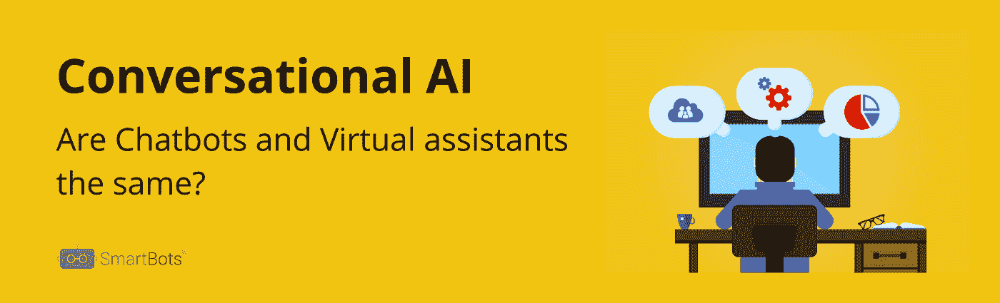

# 聊天机器人和虚拟助手是一样的吗？

> 原文：<https://medium.datadriveninvestor.com/are-chatbots-and-virtual-assistants-the-same-c3b0ca10a64f?source=collection_archive---------17----------------------->

Photo by [Rock'n Roll Monkey](https://unsplash.com/@rocknrollmonkey?utm_source=medium&utm_medium=referral) on [Unsplash](https://unsplash.com?utm_source=medium&utm_medium=referral)

对话式人工智能在过去十年中的受欢迎程度呈指数级增长，并在过去两年中成为主流。企业对对话式人工智能的采用正在加速。企业正在投资数百万美元用于对话式人工智能应用，并热切期望改善客户体验和运营效率。

聊天机器人和虚拟助理正在利用人工智能技术提供创新和高效的解决方案，使客户、员工和合作伙伴受益。在这种情况下，理解聊天机器人和更复杂的解决方案(如虚拟助理)之间的根本区别至关重要。

 [## 对话式人工智能的兴起将如何影响世界|数据驱动的投资者

### 从不同的专业服务，保险，教育，金融，旅游，电信，到建筑，银行，和…

www.datadriveninvestor.com](https://www.datadriveninvestor.com/2019/02/07/how-the-rise-of-conversational-ai-will-impact-the-world/) 

计划或实施对话式人工智能解决方案的企业和专业人士应该知道这种差异，以便从这些技术中获益。如果没有这种正确的理解，就很有可能达不到预期。

# 聊天机器人

一个基本的聊天机器人可以让用户提问，并通过编程从知识库中获得相关答案。Chabot，又名 FAQ chatbot，使用 NLP(自然语言处理)来识别用户问题的关键词，并相应地以编程的答案做出响应。它的工作原理类似于搜索引擎。由于聊天机器人是基于关键字的，如果用户以不同的方式问同一个问题，聊天机器人将无法做出响应，尽管它具备所需的知识。聊天机器人的失败率可能很高，这取决于同一个问题有多少种构建方式。

# 智能虚拟助理(IVA)

而智能虚拟助理使用 NLP 和 NLU 技术理解用户查询的含义和意图，并生成动态响应。意图理解使虚拟助手能够与用户进行更长时间的对话。虚拟助手还可以理解上下文，并提供更加个性化和相关的答案。

# 聊天机器人和虚拟助手的主要区别

1.  **语言理解** —聊天机器人可以识别关键词，但不能理解用户的意图。他们根据这些关键词提供相关的答案。另一方面，虚拟助手可以识别意图，理解情感，并分析自然语言的复杂性。虚拟助理适应性更强，并提供个性化和类似人类的用户交互。
2.  **情境处理** —当我们与他人互动时，我们的意图或行为的情境在互动中扮演着重要的角色。我们对语言、情感和社会暗示的理解可能会因我们在何处、如何以及何时遇到它们而有所不同。聊天机器人不能理解上下文。虚拟助理，也称为上下文助理，在生成响应时考虑上下文，这意味着它们能够理解和响应不同的和意外的用户输入。上下文处理使得虚拟助理能够向用户提供更加个性化和相关的响应。当用户从预期的对话路径切换时，它们可以优雅地处理交互。
3.  **学习和改进** —聊天机器人被编程为静态响应。相比之下，虚拟助手在本质上更具适应性，可以从过去的交互中学习，从而提高未来交互的质量。这使得虚拟助手在一段时间内接受大量数据训练时不太可能失败。
4.  **执行任务** —聊天机器人一般用作简单常见问题的对话界面，不能执行任务。虚拟助理可以帮助用户执行已定义的任务，如检查订单状态、提交服务单、安排约会、发送通知等。

**总结一下** —聊天机器人或者 FAQ 聊天机器人是最简单也是最常见的类型。它们允许用户提问，并根据简单的关键字搜索和一组规则提供脚本答案。当用户输入出乎意料或偏离预期的对话路径时，他们容易出错。虚拟助手，又名上下文助手，更智能，更基于上下文。它们可以理解用户的意图、情绪和环境，并提供个性化的动态响应。它们可以处理意外的用户输入并执行任务。成功实施虚拟助理后，企业可以提供与客户、员工和合作伙伴的良好对话体验。

如有任何与对话式人工智能相关的疑问，请通过 Stallin@smartbots.ai 联系我。

作者:[史泰林·萨纳曼德拉](https://www.linkedin.com/in/stallinsanamandra/)