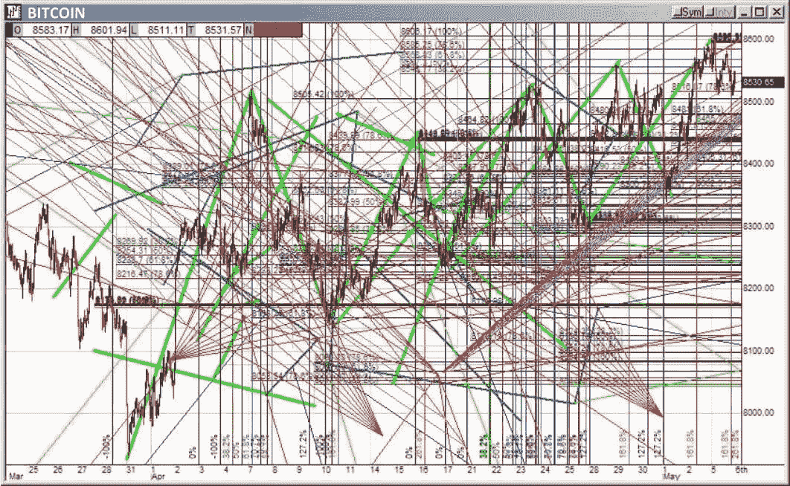
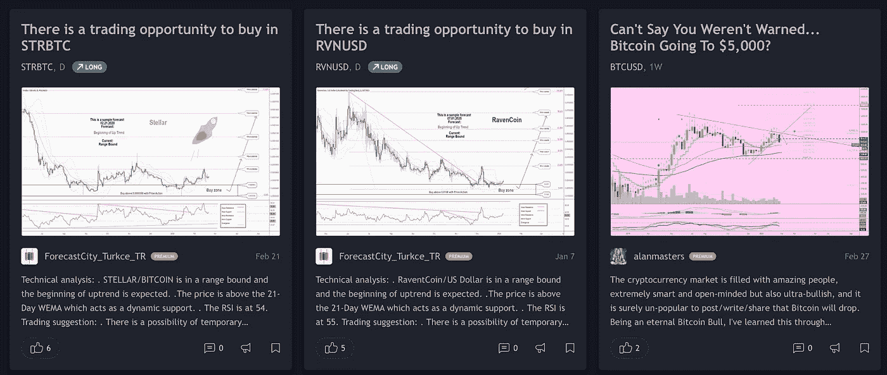
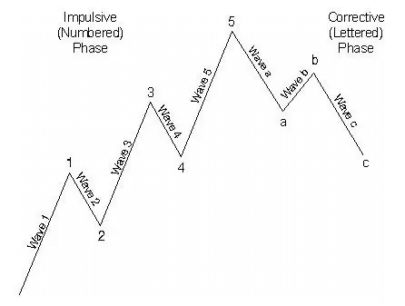

# 密码技术分析完全是垃圾吗？

> 原文：<https://medium.datadriveninvestor.com/are-crypto-technical-analysis-complete-garbage-c434d83821f1?source=collection_archive---------4----------------------->

我经常去 tradingview.com 看各种关于比特币的技术分析，同时搜索“斐波那契回撤”、“道氏理论”、“上下影线”、“波浪理论”、“蜡烛图趋势”等。当几行字神奇地出现在我的图表上时，我用“专业性”来面对自己。

货币圈的加密技术分析已经成为我们周围的大量信息之一。

 [## 总部位于瑞士的 ETP 进入加密交易市场|数据驱动的投资者

### 虽然金融市场几乎没有沉闷的时刻，特别是在引入…

www.datadriveninvestor.com](https://www.datadriveninvestor.com/2019/03/10/swiss-based-etp-enters-the-crypto-trading-market/) 

尽管这些术语看起来都很高级，但背后有什么意义吗？局限性在哪里？作为一个普通投资者，应该有怎样的投资策略才能获得最大的回报？

或者这只是一种生存偏见？既然有这么多的分析，每隔一段时间肯定会有一些正确的分析，人们倾向于寻找他们想看到的，而懒得回头看看他们是否真的错了。

## 基本面分析和技术分析

基本面分析可以用来看一个东西的长期价值。

它用相对较长的时间来评估一个趋势。比如一个人或者一个项目能不能增值，还有多少成长空间。

让我们以相亲为例。我们如何看待一个人？我们也看他的长期价值。

从长远来看，他能让我成为一个快乐的个体吗？我介意他没有查宁·塔图姆那样的腹肌吗？他温柔吗？他够聪明还是有足够的动力去学习成长？

经过一系列的分析，我们得出了一个结论:这个人非常适合我的要求，那么我们可以沟通一段时间来决定是否让他“成交”。

技术分析就是聪明的投资者使用的这样一种工具，通过对货币价格和股票价格变化的长期观察和经验的积累，他们逐渐总结出一些已经得出的趋势。

相比基本面分析，技术分析在把握市场细节方面可以非常直观。更准确，更直接，可操作性强，更快出成果，所以很多人会应用技术分析，进行实战研究。

## 来自社交媒体的分析师

**事实上，我个人认为社交媒体上的大多数个人密码分析师都是无用的。**

恕我直言，当 BTC 在 3800 美元，一直到 9000 美元的时候，有很多人都在喊“有点做空”。

预言还是荒谬？最有可能两者都有。

如果我们要分析它们是否准确，就必须谈谈这些分析师的机制。一些个人密码分析师有隐藏的动机，因为在一天结束时，他们需要流量。

那么大部分个人分析师在 crypto 里生产什么呢？人们喜欢看什么样的东西并一直看下去？不管有没有用，一定是市场分析。

一个接一个的分析，无论哪种方式，读者都会不断地用这些荒谬的信息填充自己，这些信息基于来自“黄金比例”或 1853 年进行的一些数学观察的彩色线条，最后添加一个声明，说明这不是一个财务建议，以及加密市场的风险有多大，投资应该谨慎。这样的结束语反正没用。

**所以订户对他们的投资很满意，也很有信心，作家们也很高兴 50%的订户都很满意。** 
大部分自媒体个人的技术分析没用是一回事，但技术分析本身本身就是另一回事。

## 技术分析有用吗？

如果要谈技术分析的有用性，就需要看看背后的原理。

简而言之答案是肯定的，技术分析肯定有用，绝对比一个人在市场上盲目买入有用。

因为像你我这样的个体只看不知道，我们不知道黑客是否真的攻击了交易所，或者仅仅是监守自盗；我们不知道令牌是如何分发的，等等。

技术分析本质上是一种策略，我们可以用扑克来打个比方。

每次打扑克，我都会形成自己的方法论:对手的每一个表情，每次出牌，我都会计算它的大概概率，以此来决定我会不会跟注。如果是的话，我应该要多少钱？我能拿到多少筹码，或者说我输了多少钱？

我每玩一次都在形成自己的策略，都在丰富自己策略的模式。

策略是获取最高回报的一套方法论。我不在乎这一次的失误，或者说这一次，按照我的策略，赢的概率可能是 70%，但我还是输了。

只要我的模式没有问题，我就坚持下去。因此，我在近似一台没有感情的机器的行为，这是至关重要的。

说完它的本质，我再举几个例子，让大家更容易理解什么是技术分析。

其实在市场上，有一个很简单的用技术分析来决定操作的例子，就是下影线的例子。

例如，如果一个蜡烛图的下影线特别长，上影线特别短，那么它实际上是底部的信号。未来上涨的概率会很大，其实概率是 70%。

这个市场有两个非常经典的两个理论，一个是道氏理论，一个是波浪理论。

什么是波动理论？

他的发明者是艾略特。艾略特认为，市场趋势重复一个模式，每个周期由五个上涨浪和三个下跌浪组成。

波浪理论将不同大小的趋势分为九类，最长的可能跨越 200 多年，次微波可能只覆盖几个小时。但无论趋势大小，每个周期都有 8 波，是不变的。

市场上很多人都在用它，但它的缺陷是显而易见的。

因为他是在试图对市场行为做出非常准确的预测，这就会对使用报告理论的人产生强烈的心理预期和暗示，从而影响营销者对市场本身走势的客观判断，造成一个不去止损或者其他非常不好的举动。

当然，你可能不喜欢波浪理论，但是市场上很多人都在用，你一定要懂。

我们必须了解的另一件事是道氏理论。

道的理论是查尔斯·道发明的。网上查一下就知道，他也是道琼斯指数的发明者，华尔街日报的创始人，相当纨绔子弟。

**他认为，市场的波动分为三种**:第一种是主力运动，主要是持续不到一年或几年的牛熊市；二是二次运动，主要是牛市和熊市的下跌。反弹持续几周或几个月；最后一个是白天的一个动作，比如突然的抽，或者其他。

**他认为主运动是无法操纵的，即使所有财团齐心协力，也不可能改变主趋势。**

还有一点就是价格可以反映一切。

例如，它可以反映所有投资者的失望、对过去的总结的希望和对未来的信心。一切都会体现在价格上。

道氏理论是定义什么是趋势的最重要、最基本的概念之一。在任何一个二级市场，包括比特币在内的外汇股、黄金股，都永远逃不出这个定义。

其实只要你吃透了这个道氏理论，它会让你受益终生。

## 技术分析能赚钱吗？

那么，技术分析能赚钱吗？我也这么认为

其实只要能年赚 25%就已经很多了。比如你拿出 100 万本金，每年可以赚 25%。其实如果只做 20 年，就是 1.4 亿。

关于币圈分析有很多误解。很多人认为自己已经通过技术分析思考过，可以作为铁律来遵循。只要条件 A 出现，条件 B 就一定会出现。

**这其实是个问题。在技术分析中，没有百分百的说法。** 
问题也由此而来。很多人不能容忍这样的技术指标有缺陷。他们总是努力追求完美，沉浸在各种技术指标中。。

正是因为这样一个追求完美的过程，让他们离成功越来越远。他们总觉得，他们认为自己足够聪明，可以找到一个完美无瑕的圣杯。

**其实这个市场没有圣杯，他们也没有特别的 X 策略。**

当其他策略都在 30 到 40 的水平时，一个策略想得 120 分是相当不可能的。因为如果出现这种情况，市场上的钱都是他一个人赚的。

所以最多一个人的策略是 50 分，然后另一个人的策略是 60 分，然后就好那么一点点。

关于技术分析，我们大概讲过它的一些特点。

## 技术分析是万能的吗？

说完了技术分析的特点，再来说说技术分析的缺陷。

**第一个缺陷是这是一项繁重的劳动。**

因为这个市场处于不断创新的过程中。如果你想成为顶级，你必须继续研究新的战略，因为单一的战略不能长期使用，它会不断被取代。所以你必须投入大量时间研究市场，研究整个市场。

我有一个朋友，天天看行情软件，可能睡不好。这也是一个大问题。

**还有一个缺点就是技术分析不能用于 alt 币。**适用于一些流动性比较高的代币。

技术指标本质上不是预测未来，而是从多个角度呈现历史。我们必须永远记住这一点。市场决定技术分析，而不是技术分析决定市场。正是因为价格的变化，指标才变化。

很多人都弄反了，想通过指标来预测价格的走势。所以整体来看是不对的，因为这个技术分析是一个结果，而不是说你通过“结果”来确定它的“因”。

我们需要明白另一点。真正的技术分析从来不会只应用于一个市场。它是一个统计范畴，它的本质是给你一个概率的结果，换句话说，交易它就是一个概率的游戏。
因为金融市场是一个不确定的市场，**这里没有牛顿定律，只有不确定性定理。**

价格是由众多参与者的不确定行为决定的，但同时也受到宏观经济、环境、产业趋势、行业竞争、国家政治、政策环境等一系列效应的影响，所以没有办法用一个时间点的逻辑。得出一个非常明确的结论。

## 普通投资者的策略

我们普通投资者走什么样的策略才是最好的？

很多人都在说定投，我们来谈谈定投是不是最好的方式。

固定是什么意思？很简单，你挑选一个好的项目，然后在固定的一段时间内，比如每周或每月，把你的钱投资在这个项目上。

**定投的好处在于你克服了人性中的这种情绪化。**人性是追涨杀跌的，定投让你跌下去不卖，涨起来不买，那就是用定投解决人性中的问题。

但它有许多缺陷。

首先，不能多做。如果一个价格已经很低了，你就不能在不违反规则的情况下买更多。

再者，如果你买的币一直在跌，长期来看还是会亏很多。

另外，即使投资已经定了，总有一天会有退出的需要。

那么，你什么时候退出呢？

如果恰好处于低谷，急需用钱，此时也会面临很多问题。

所以每个人都有自己的策略。

我来告诉你我用什么策略投资。

**我只看 120 日均线。如果价格高于他的线，我买，如果价格低于我卖。如果定投解决了买的问题，那么 120 日均线既解决了我什么时候买，又解决了我什么时候卖。**

也许我一年只需要做一两次，就可以跑赢需要 95%以上货币的投资者，而且不需要太担心货币的价格，也不需要花太多时间。

其实，这种方式策略是根据道氏理论的主力动向而应用的指标。

很简单，但对我来说足够了。

但是就算我讲这个理论，估计很多人也不会用，因为你还是克服不了追涨杀跌的人性。

比如我玩扑克的时候，就已经根据我的策略计算过了。这次胜率已经很低了，但我只是头脑发热，我只想赢。

这时候你可能会赢，但还是有很大概率不会赢，结果你的筹码就少了。货币投资也是如此。有策略是一回事，你自己的情绪心态是另一回事。

**综上所述，技术分析是有用的，但来自社交媒体的分析大多是无用的。**

我认识的分析师都很不错。他们没时间理你，也没时间给你写公众号，或者运营粉丝运营。

还有一点就是技术分析。这实际上是一种使你的收益最大化的策略。我也讲了它的局限性，给大家讲一个我个人认为最好的投资策略。