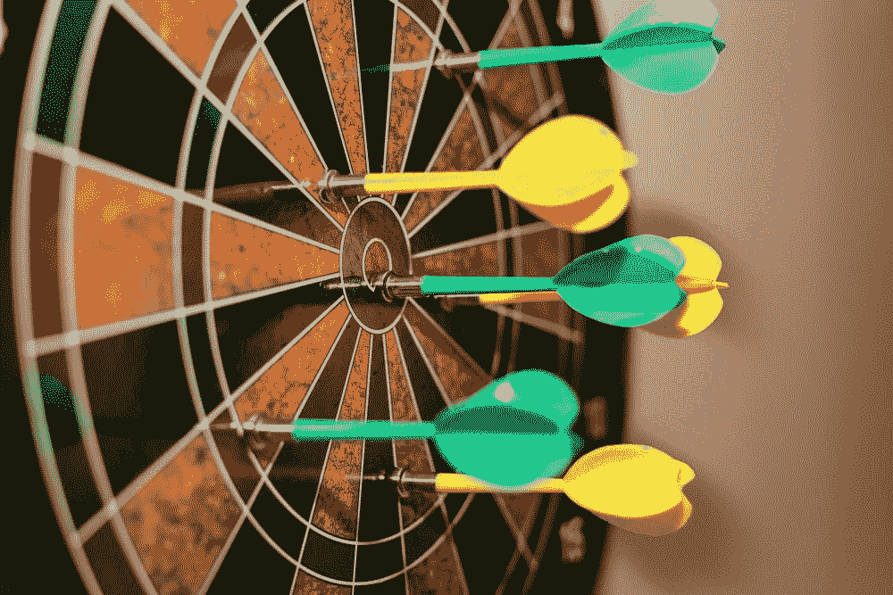

# 专家更擅长预测未来吗？

> 原文：<https://medium.datadriveninvestor.com/are-experts-better-at-forecasting-the-future-ce386c07e76c?source=collection_archive---------6----------------------->

> 汤姆是《纽约时报》驻黎巴嫩记者。他三次获得普利策奖。在他的书《炎热、平坦、拥挤》中，他提倡在 2050 年前进行绿色革命。
> 
> 比尔是内布拉斯加州一名 60 岁的退休公务员。他有空的时候会自愿在[好判断项目](https://www.gjopen.com/)上做预测。他是个博士辍学生。

你能猜出谁是更好的预测者吗？

Photo by [Marc A](https://unsplash.com/@grvault) via [Unsplash](http://unsplash.com)

答案是比尔。比尔·弗莱克的布莱尔得分接近 0。

布赖尔得分类似于高尔夫球得分。你的 Brier 分数越低，你就越擅长预测。如果你得到 0，你的预测就能非常准确地反映现实。如果你得到 0.5，你就对了一半。如果你得到 2，你的预测总是错的。

根据菲利普·泰特洛克和丹·加德纳在[超级预测](https://en.wikipedia.org/wiki/Superforecasting:_The_Art_and_Science_of_Prediction)中的说法，2800 名志愿预测者中排名前 2%的人平均得分为 0.25。弗莱克是其中之一。

当弗莱克努力应对令人烦恼的全球问题和地缘政治事件时，这是一个微调猜测概率的问题，比如:

*   下半年汽油价格会暴跌吗？
*   朝鲜会在 2020 年 12 月前宣布新的国家元首吗？
*   冠状病毒疫苗何时能在全球范围内商业化？

对弗莱克来说，50%和 51%有很大的不同。1%的差距使 50:50 事件的可能性(50%的机会在抛硬币时尾部着地)偏向统计上更可能的情况(如果你发射硬币尾部朝上，51 比 49 的赔率)。

弗莱克不是一个局外人。罗伯特·鲁宾的同事证实了这位美国前财长也有概率思维的嗜好:

> 一名年轻的财政部助理回忆道:“我第一次见到他时，他问我一项法案是否会在国会通过，我说，‘当然会’。”。“他一点也不喜欢。现在我说概率是 60%——我们争论是 59%还是 60%。”

## 权威人士的辩论

如果权威人士缺乏知识上的谦逊、健康的好奇心和成长的心态，他们可能不一定有资格成为超级预言家。

1994 年，吉姆·科林斯和杰里·波尔拉斯在他们的书《为持久而建》中调查并确定了 18 家模范公司。十年后，菲尔·罗森茨韦格在《T2》中的《光环效应》和丹尼尔·卡内曼在《T4 思考，快与慢》中的《T5》反驳了 18 家有远见的公司中有 7 家没有如预期的那样发展顺利。

具有讽刺意味的是，这些被认为是典范的公司并没有长久。摩托罗拉的业绩和股价下滑，迪士尼的领导地位也受到质疑。落伍者已经从优秀变成伟大，再变成愚蠢。

当比尔·盖茨发表他的 TED 演讲时。我们还没准备好”2015 年，他痛斥应对埃博拉疫情是全球的失败。他还警告说，大规模的疫情即将来临。

> “如果有什么东西在未来几十年里杀死 1000 多万人，那最有可能是一种高传染性的病毒，而不是一场战争。不是导弹，是微生物。”—比尔·盖茨

截至 2020 年 5 月 7 日，冠状病毒死亡人数超过 261，000 人，盖茨是否以某种方式预测到了新冠肺炎疫情？

辩论的双方都有预测的支持者和反对者。预测的捍卫者将他们的预测建立在数据和逻辑之上。批评者漠不关心地拒绝预测，认为这是一个失败的事业和浪费时间的独创性。

沃伦·巴菲特和查理·芒格曾经得到一本价值 200 万美元的金融预测书。但巴菲特拒绝了这一提议。被称为奥马哈先知的巴菲特认为预测是徒劳的。他有一句名言“不要问理发师你是否需要理发。”

> “预测可以告诉你很多关于预测者的信息；他们不会告诉你任何关于未来的事情。”—沃伦·巴菲特

著名的《被随机性愚弄的猴子》一书的作者纳西姆·尼古拉斯·塔勒布打趣道，如果给无限多的打字不熟练的猴子一台打字机，有极小的可能性——也许是一千万分之一——其中一只猴子会打出与莎士比亚原版一模一样的《T2·伊利亚特》或《T4·奥德赛》。塔勒布赞同预测是傻瓜的差事的观点。在金融领域，他可能是对的。没有任何预测模型能够预测我们现在所处的经济危机的巨大影响。

## 志愿预测者胜过高薪情报分析师

好的判断项目(GJP)是加州大学伯克利分校和宾夕法尼亚大学之间正在进行的合作研究。GJP 是由美国情报机构资助的。在 GJP 锦标赛结束时，超级预测者因参与而获得奖励，而不是准确性。志愿者是没有报酬的。

然而，如果志愿者能够做出至少 25 次预测，并保持连续 9 个月的预测，他们将获得 250 美元的亚马逊礼品卡。[听一听一个超级预测者怎么说](https://slate.com/technology/2015/11/good-judgment-project-how-i-became-a-superforecaster-for-the-intelligence-community.html)。

前 2%的超级预测者来自各行各业。他们的职业范围很广，从处理数字的工程师、科学家、教授到普通家庭主妇、学生到失业的社会工作者和自由艺术家。

GJP 与密执安大学和麻省理工学院竞争。你瞧，GJP 以 30%到 70%的优势超过了这两家机构。来自 GJP 的前 2%的预测者也比专业情报分析师表现好 30%。

尽管如此，短期预测只有一年后才准确。三到五年后，专家预测师的水平只能与隐喻的投掷飞镖的黑猩猩相提并论。

 [## 艾预测:“颠覆，然后是生产力”|数据驱动的投资者

### 人们越来越担心，随着机器学习和互联网的普及，所有白领工作都将消失

www.datadriveninvestor.com](https://www.datadriveninvestor.com/2018/08/06/ai-forecast-disruption-then-productivity/) 

尽管存在预测取决于运气和机会的错觉，但预测技巧是可以教授和培养的。一个 60 分钟的关于预测基础知识的教程可以提高预测者 10%的准确性。通过训练一种逻辑思维方式，一种综合信息和更新信念的系统方式，你也可以成为一名超级预言家。