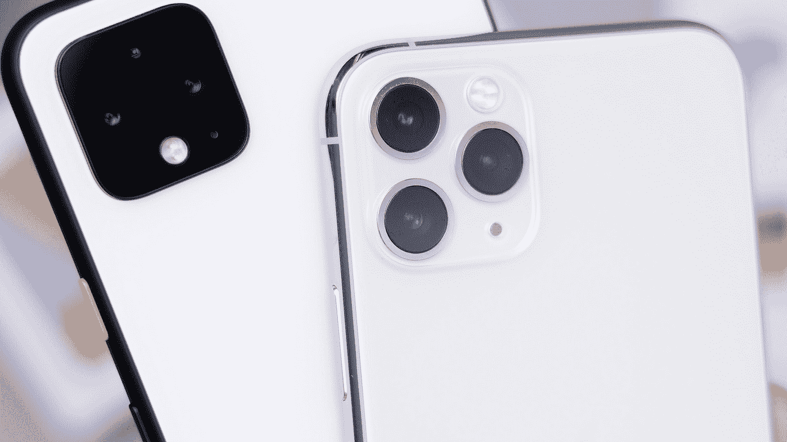
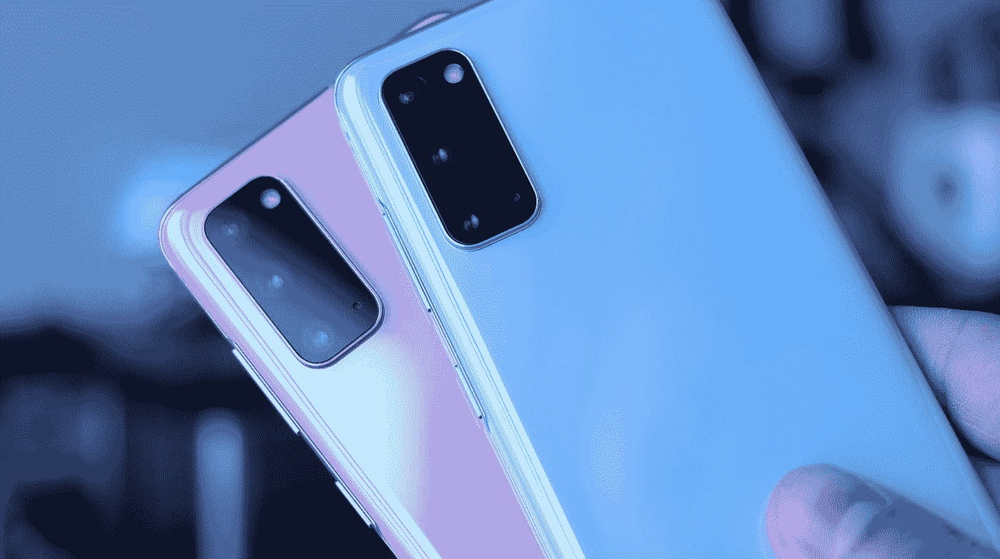

# 旗舰值得吗？

> 原文：<https://medium.datadriveninvestor.com/are-flagships-worth-it-8e4730df7292?source=collection_archive---------20----------------------->

在过去的几年里，我们看到旗舰智能手机的价格飙升，其中一些起价为 1300 美元以上。对于一部智能手机来说，这是一个很高的价格，你不觉得吗？

Photo by [Daniel Romero](https://unsplash.com/@rmrdnl?utm_source=medium&utm_medium=referral) on [Unsplash](https://unsplash.com?utm_source=medium&utm_medium=referral)

主要的问题是，他们值这么多钱吗？这个问题比那个更复杂。公平地说，你几乎每次都可以买到最好的东西，我说主要是因为 S20 Ultra Exynos 版。

## 三星的旗舰产品

旗舰这个词不再是这类手机的好形容词了，它们已经超越了旗舰这个词。以三星为例，他们最新的旗舰手机是 S20、S20+和 S20 Ultra。它们都是旗舰，但 S20 Ultra 似乎是旗舰中的旗舰。我知道这听起来很愚蠢，但考虑到三星在这款手机上的投入，它看起来比它的小兄弟姐妹们高一个档次。这些大数字让它看起来比实际情况优越得多。上一代 iPhones 也是如此。

Photo by [Daniel Romero](https://unsplash.com/@rmrdnl?utm_source=medium&utm_medium=referral) on [Unsplash](https://unsplash.com?utm_source=medium&utm_medium=referral)

每个人在买手机时都应该考虑的一件事是他们打算用它来做什么。如果你只是浏览网页和使用社交媒体，花那么多钱值得吗？

你可能会说，我想要手机上最好的相机，好吧，有道理。通常，旗舰总是有最好的相机。Pixel 4 也是一款旗舰产品，它拥有最好的相机之一，而且比其他旗舰产品便宜得多。优秀相机的其他选择可以是公司发布的最便宜的旗舰产品，如 iPhone 11 和 S20。旧旗舰也是一个可行的选择。

 [## 技术的下一个时代|数据驱动的投资者

### 量子计算。这似乎是继人工智能之后最流行的词汇。然而，很多…

www.datadriveninvestor.com](https://www.datadriveninvestor.com/2020/07/14/the-next-era-of-tech/) 

## 替代品！

最终，作为手机，这些旗舰是值得的。就价格而言，我认为这不合理。考虑到市场上的中档手机。从 iPhone SE 2 开始，到最新的一加诺德。

纵观智能手机市场和未来，我可以说，我们正朝着优秀的中端手机迈进。根据这些“定价过高”的旗舰产品，它们似乎不会走上更低的价格道路。为什么他们会在瞬间被卖掉？

我一直想回答的问题是，在你购买下一部手机之前，你应该经常问自己一个问题。你不应该依赖别人替你决定。试着去寻找建议，永远自己做决定，因为你比任何人都了解自己，知道自己需要什么。

**进入专家视角—** [**订阅 DDI 英特尔**](https://datadriveninvestor.com/ddi-intel)