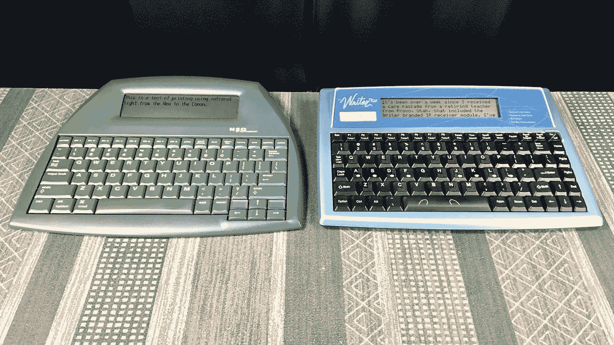
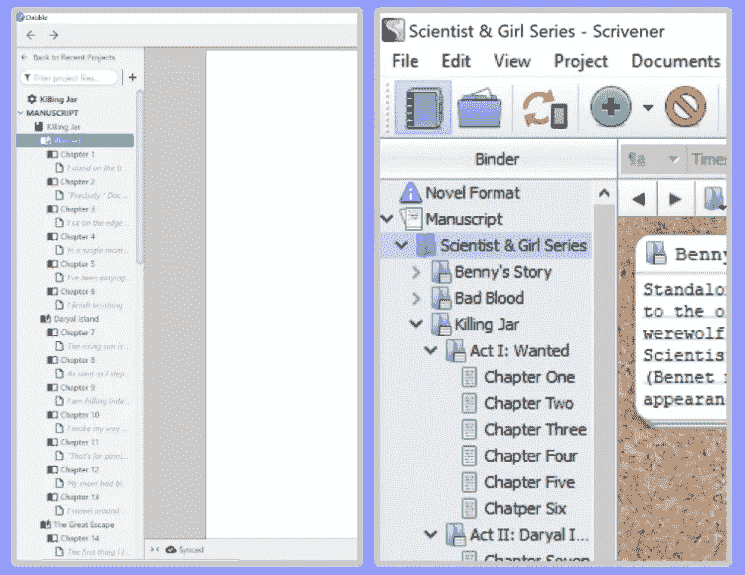

# 免费书写设备真的适合你吗？

> 原文：<https://medium.datadriveninvestor.com/are-freewrite-devices-actually-right-for-you-e96c76f645a5?source=collection_archive---------3----------------------->

## 你真的会从不受干扰中受益吗？

Photo by [Priscilla Du Preez](https://unsplash.com/@priscilladupreez?utm_source=medium&utm_medium=referral) on [Unsplash](https://unsplash.com?utm_source=medium&utm_medium=referral)

[*看看现代的 AlphaSmart*](https://getfreewrite.com/?rstr=12007) *吧，在这篇文章的最后，你会发现如何获得 5%的折扣。*

Astrohaus 的全新设备 [Freewrite Traveler](https://getfreewrite.com/?rstr=12007) 的发布让许多作家和生产力黑客蜂拥而至，想看看所有的宣传是关于什么的。

 [## Freewrite:不受干扰的写作工具

### Freewrite 是一个专门为任何写作者设计的绘图工具，没有浏览器的干扰或诱惑…

getfreewrite.com](https://getfreewrite.com/?rstr=12007) 

小公司 Astrohaus 在 Indiegogo 的支持下开始了它的旅程，它的目标是用更现代版本的简单、便宜而有效的 alpha smart[产品填补市场。对于那些还不熟悉这套漂亮设备的人来说，AlphaSmart 是一个文字处理器品牌，创建于 90 年代初，旨在帮助儿童和成人学习打字。旧的文字处理器，如 AlphaSmart NEO 和 AlphaSmart 3000 再次受到欢迎；这一次，对于作家来说，他们正在寻找一种便携式极简设备，致力于不受干扰的写作。](https://en.wikipedia.org/wiki/AlphaSmart)

AlphaSmart NEO and AKT The Writer Plus ([https://www.flickr.com/photos/31285363@N07/50377217446/in/dateposted-public/](https://www.flickr.com/photos/31285363@N07/50377217446/in/dateposted-public/))

随着 Freewrite 家族最新成员的引入，这家萌芽中的公司现在有两种不同的设备可供买家购买:最初的 **Freewrite(第二代)**和新发布的 **Freewrite Traveler** 。Astrohaus 在他们的网站上发布了一篇博客文章和一个测试，内容是关于哪种免费软件最适合你的个人用户需求。

我很欣赏他们这样做，因为这两种设备的价格都很高，不是每个人都能负担得起这两种——即使是一种——这些时髦的写作助手。

但是，还有一个问题是，作为一个作家，这些方法是否适合你。这就是我这篇文章的目的，基于我自己对两款免费软件的体验。

如果你已经决定从这些设备中受益，但不确定哪一个适合你，看看我的帖子 [***哪个免费软件设备真正适合你？***](https://robinnemesszeghy.medium.com/which-freewrite-device-is-actually-right-for-you-a1b6be09e6d7)

## TL；博士；医生

*   Astrohaus 最近发布了他们最新的不受干扰的书写设备
*   Astrohaus 现在有两款设备可用: **Freewrite(第二代)**和 **Freewrite Traveler** (新版本)
*   Astrohaus 已经写了他们两个现有设备的比较(这里[这里](https://getfreewrite.com/blogs/writing-success/freewrite-2nd-gen-vs-freewrite-traveler)和[这里](https://getfreewrite.com/pages/which-freewrite-is-right-for-you))
*   这些比较忽略了提及免分心设备是否适合你

# 写作过程

首先说一下写作过程。为了评估任何写作工具或设备是否适合你，了解你作为作家的首选过程是很重要的。

每个作家都有一个过程，他们喜欢的工作方式，以及他们为自己开发的方法。对一个作家有用的东西对另一个作家可能不理想。这没关系。

当我们谈论*草稿*编写过程时，自由软件就变得相关了。这一点很重要，因为免费软件从来就没有被设计成好的编辑工具。它们旨在帮助你尽可能少的分心，尽可能多的说出单词。

## 草稿撰写流程类型

一些作家喜欢在写作时通过互联网快速访问手边的研究材料，而另一些作家如果给自己太多的互联网自由，就会分心。一些作家喜欢在写作时参考他们的整个手稿(顺便说一下，如果你是这种类型的作家，那么 [Scrivener](https://www.literatureandlatte.com/scrivener-affiliate.html?fpr=robin) 和 [Dabble](https://www.dabblewriter.com/?via=robin-nemesszeghy) 是很好的直接写作程序；否则，当你不写作时，这些程序仍然可以作为一个地方来帮助存放你的主要手稿)，而其他人喜欢事先绘制出他们的场景将包含什么，然后在一定时间内不看其他地方就开始冲刺写作(场景冲刺作者可以从免费软件和 AlphaSmarts 等分散注意力的极简写作设备中受益匪浅)。如果你容易被互联网分散注意力，文字处理器和智能打字机，如 Freewrites 和 AlphaSmarts，可能会对你和你的写作过程有所帮助。

## TL；博士；医生

**免费软件可能适合您，如果:**

*   你很容易被互联网分散注意力
*   你是一个短跑作家

 [## React Native 如何提高移动应用开发者的生产力？数据驱动的投资者

### React Native 是一个有益的框架，可以帮助您使用 JavaScript 设计应用程序。这种结构包括…

www.datadriveninvestor.com](https://www.datadriveninvestor.com/2020/11/30/how-react-native-improves-the-productivity-of-mobile-app-developers/) 

**免费软件可能不适合您，如果:**

*   你喜欢在写作时快速上网
*   你不会轻易分心
*   你喜欢在写作时接触到你的整个手稿(你可以直接在 [Scrivener](https://www.literatureandlatte.com/scrivener-affiliate.html?fpr=robin) 或 [Dabble](https://www.dabblewriter.com/?via=robin-nemesszeghy) 中写作)

Dabble (left) and Scrivener (right) are great organizational tools for writers to house their manuscripts while also having easy access to refer back to each chapter while writing; (screenshots taken by author)

# 这些不受干扰的书写工具做对了什么

不管你的草稿写作过程是什么样的，我要说的是，当你无法接触到你面前的实际故事文档时，Freewrite 可以是一个记笔记或记下你想到的东西的好工具。然而现实是，你不需要*带着一个单独的极简设备来做这件事，因为你的智能手机也可以作为一个记录随机笔记的好设备。*

Apple iPhone 12 notes app (left) vs. Freewrite Traveler 5" e-ink screen (right); (photos taken by author)

然而，如果你做了很多笔记，并且喜欢在实际的键盘上输入这些笔记，那么 Freewrite(或 AlphaSmart)可能会证明对你有好处。Freewrite 的电子墨水屏幕和 AlphaSmart 的数字屏幕对眼睛来说也更容易，所以如果你因背光屏幕而导致眼睛疲劳，这可能也是你的一个优势。

你是否认为随身携带 Freewrite 或 AlphaSmart 等设备会让你受益，这最终取决于你自己。如果专业人士对你来说值这个价钱，那就去做吧。

## TL；博士；医生

**free write&alpha smart pros(在多用途设备上):**

*   摆脱非写作干扰
*   电子墨水和数字屏幕对眼睛更好看
*   用于打字的实际键盘(与智能手机相比)
*   比笔记本电脑更便携，阳光下屏幕可见度更高

# 一种更便宜的不受干扰的测试方法

你可能已经注意到，AlphaSmarts 和其他 90 年代的文字处理设备的售价比免费软件便宜得多(除非你想买一台高档的打字机)。如果你仍然不确定“不受干扰”是否适合你，你可以购买一个更便宜的 AlphaSmart 或同等产品，自己测试一下，看看这种写作方式是否适合你。

然而，如果你选择这样做，请记住 90 年代的设备和更现代的免费软件之间的区别。最大的区别是免费软件使用云将你的文档传输到你的电脑上，并且缺乏(简单的)光标导航(Astrohaus 故意这样做的)。

## TL；博士；医生

**免费写入设备:**

*   通过云传输文档或作为文档发送到您的电子邮件
*   访问该公司的云服务应用:[邮箱](https://support.getfreewrite.com/article/12-introduction-to-postbox) →允许直接连接谷歌文档、Evernote 和 Dropbox(尽管*只有一种方式*
*   缺乏(简单的)光标导航(第二代 Freewrite 根本没有光标导航，而旅行者有热键，但使用起来很痛苦)
*   支持多语言键盘使用
*   软件内置的各种工具，如字数和字符数、文本阅读时间、数字时钟、模拟时钟、日期和冲刺计时器
*   现代设计与产品
*   电子墨水屏幕(第二代 Freewrite 为 6 英寸，Traveler 为 5 英寸)
*   昂贵的价位

**AlphaSmart 和等效的 90s 设备:**

*   通过 USB 端口连接将文档传输到任何接受文本的计算机程序(如 Microsoft Word)
*   带有光标导航的全键盘
*   你所看到的就是你在功能方面所得到的
*   90 年代设计和产品
*   数字屏幕
*   便宜的价格点

## 任何免费书写设备均可享受 5%的优惠

*如果您准备订购，请随意使用我的折扣代码 ROBIN23，任何免费书写设备均可享受 5%的折扣！*

**:**

* [## Freewrite:不受干扰的写作工具

### Freewrite 是一款专门为任何写作者设计的绘图设备，没有浏览器的干扰或诱惑…

getfreewrite.com](https://getfreewrite.com/?rstr=12007) 

**free write 设备上的其他文章:**

 [## 哪种免费软件设备真正适合您？

### 这不仅仅是可移植性的问题，还有软件的问题

medium.datadriveninvestor.com](/which-freewrite-device-is-actually-right-for-you-a1b6be09e6d7)  [## Astrohaus 全新的免分心书写工具 Freewrite Alpha 是现代的 AlphaSmart

### 看看现代的 AlphaSmart(滚动到这篇文章的末尾可以享受 5%的优惠):

medium.datadriveninvestor.com](/astrohaus-brand-new-distraction-free-writing-device-the-freewrite-alpha-is-the-modern-alphasmart-5ebfa085a4c4) 

**访问专家视图—** [**订阅 DDI 英特尔**](https://datadriveninvestor.com/ddi-intel)

## 成为会员:

*如果你想无限制地阅读像这样的文章，并支持我和你阅读的其他作家，* [*注册成为会员*](https://robinnemesszeghy.medium.com/membership) *。如果你使用我下面的推荐链接，你的会员费的一部分将直接支持我。你可以在这个平台上看到我所有的故事。*

 [## 通过我的推荐链接加入 Medium—Robin Nemesszeghy

### 作为一个媒体会员，你的会员费的一部分会给你阅读的作家，你可以完全接触到每一个故事…

robinnemesszeghy.medium.com](https://robinnemesszeghy.medium.com/membership) 

感谢您阅读和支持我的工作！*