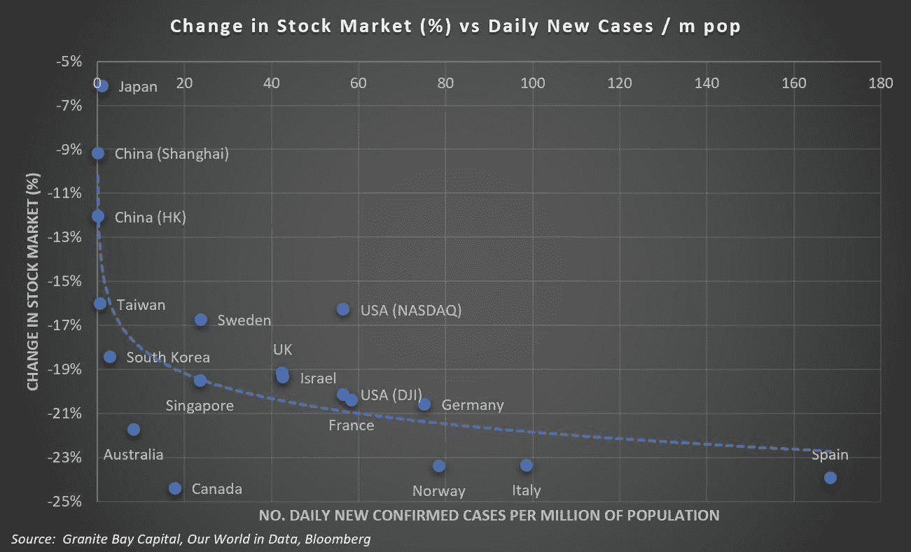
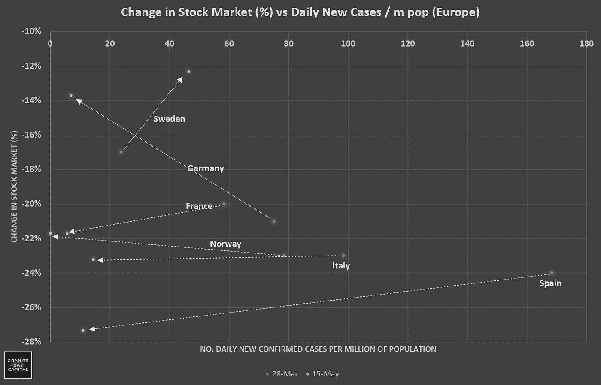
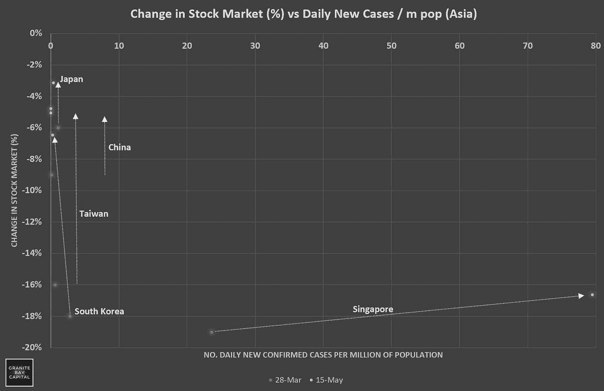
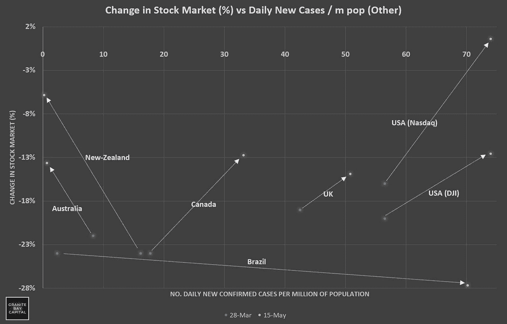
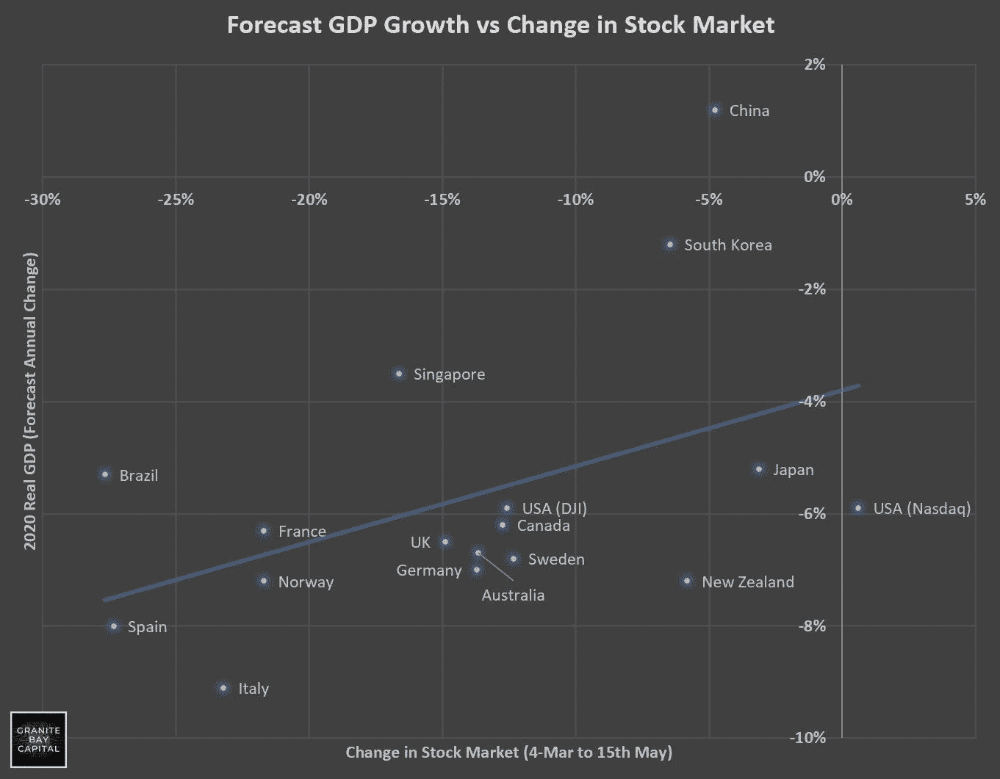

# 全球市场是否正确反映了 Covid19 的经济影响？

> 原文：<https://medium.datadriveninvestor.com/are-global-markets-correctly-pricing-in-the-economic-impacts-of-covid19-4b17aa845f82?source=collection_archive---------23----------------------->

3 月底，我发表了一张图表，显示了全球股市相对于各国每日每百万人感染 19 例艾滋病毒的变化。

这凸显了一些市场相对于其他市场的弹性。例如，纳斯达克指数仅下跌了 16%,而加拿大和澳大利亚尽管对危机的管理要好得多，却经历了更严重的市场抛售。

其中显而易见的因素是，纳斯达克的成分是更具弹性的科技股(即脸书、亚马逊、Alphabet)，而不是由多伦多证券交易所(约 60%的金融、资源和能源)和澳大利亚证券交易所 200 指数(约 50%的金融和资源)组成的弹性较低的行业。

自发布初始图表以来的 1.5 个月里，各国如何(或没有)管理 covid19 疫情以及市场如何对相对影响做出反应和定价，都发生了一些相当大的变化。

为了使评估稍微容易一些，本次后续评估分为三个部分—欧洲、亚洲和世界其他地区(美国、英国、新西兰、巴西)。

## 欧洲

自 3 月底以来，大多数欧洲国家的 covid19 病例数量急剧下降，然而，总体而言，市场复苏相当乏力。

西班牙的每日病例从百万分之 170 下降到今天的百万分之 10，但是市场继续下滑；自 3 月 4 日(全球疫情开始被广泛认可)以来下跌了约 27%。意大利、挪威和法国的情况也是如此。

这一趋势的两个主要例外是德国和瑞典。

随着 covid19 案例的改善，德国 DAX 市场(在一系列行业中多元化)已经恢复，而在瑞典，covid19 案例正在增加，市场正在改善(受到 Atlas Copco、Ericsson 和 Investor AB 等公司的支持)。

## 亚洲

在大多数亚洲国家(那里有全面的检测和报告)，对疫情的有效管理使病例(按人均计算)保持在相当低的水平。

中国，尽管(可以说！)在最初爆发时处理不当，一直保持在 covid19 数字之上，并保持其经济相对正常。事实上，国际货币基金组织(如本文结尾所强调的)预计，中国将成为 2020 年 GDP 增长的极少数国家之一。

韩国市场复苏幅度最大，当地 KOSPI 指数从最初的 18%大幅回升，在过去的 2.5 个月里仅下跌了 6-7%。台湾也出现了类似的大幅复苏，日本的复苏较为温和(和中国一样，日本从未真正陷入两位数的下滑)。

但是——看看新加坡。最初被誉为如何管理危机的“海报儿童”，当他们没有适当地监督他们的农民工的福祉时(病毒病例激增)，人均病例大幅增加。尽管如此，市场略有改善，反映了基本经济(金融、房地产、工业)在很大程度上是有弹性的。国际货币基金组织对国内生产总值低于 4%的预期(明显好于其他国家)强调了这一点。

## 世界其他地区(美国、英国、ANZ、加拿大、巴西)

世界其他地方已经是一个大杂烩了！

在巴西，我们已经看到越来越不受欢迎的领导人对疫情的管理不善(Bolsonaro)。案件的增长速度比其他任何地方都快，市场的抛售也比其他任何地方都多(尽管正在进行的抛售相当平静)。

相对而言，澳大利亚和新西兰在应对危机方面做得非常出色，它们遵循了与德国和几乎所有亚洲发达国家(除了新加坡)相似的轨迹。他们对疫情的处理是世界一流的，两位领导人的支持率都出现了惊人的飙升，市场也已复苏，反映出对各自经济的信心增强。

然而，对这两个国家(尤其是澳大利亚)来说，经济复苏很大程度上将不仅取决于他们如何管理未来的疫情，更重要的是，取决于他们如何管理与中国的贸易关系。指责和对抗他们太多将引发针锋相对的报复，这可能使国际货币基金组织的 2020 年 GDP 增长预测(7%)看起来像是澳大利亚的最佳情况。注意——澳大利亚在矿产、农业、旅游和教育贸易方面严重(过度)依赖中国。

最后，我们只剩下英国和北美。

如前所述，纳斯达克的复苏是合理的——它的成员具有高度的创新性和弹性(即亚马逊、脸书、网飞、Alphabet ),它正在吸引投资，否则市场将不会令人振奋。债券、固定利息、商品、财产…..没有太多具有过度吸引力的投资机会。

然而，在世界上任何发达国家中，美国可能是风险最高的——很大程度上是由于他们的领导力(或缺乏领导力)。美国的第二波浪潮似乎不是“如果”，而是“何时”。当这股浪潮到来时，它会有多猛烈，会对已经遭受重创的经济产生什么影响。此外，特朗普会对他们的贸易关系(即中国)造成什么损害，他是否知道在他的破坏性言论中划清界限。历史表明，他乐于跨过那条线，或许会将自己的连任前景置于经济的最大利益之上。

## 全球经济增长与市场

为了进一步强调上述观点，比较股票市场相对于预测经济增长的变动是有意义的。

在很大程度上，市场应该有效地反映对未来 GDP、失业率、商业信心等的影响。

在大多数情况下，这是正确的。大多数股票市场都反映了对全球经济的预期冲击(根据国际货币基金组织的预测),所有主要经济体(中国除外)都将出现负增长。

上述数据中的主要异常值是巴西。自国际货币基金组织公布其数据以来，巴西的病毒病例已经迅速增加，我认为目前-5%的 GDP 增长率是乐观的(因政治风险增加而加剧)存在很大风险。

## 没有计入第二波风险

总的来说，市场正在消化 Covid19 *目前的影响，但我不认为它消化了第二波风险、第一波的潜在长度以及持续经济混乱和贸易紧张(如中国)的风险。*

尽管股票市场可能继续存在持续的机会，但投资者需要在一个只会越来越不稳定的环境中极其谨慎地行事。