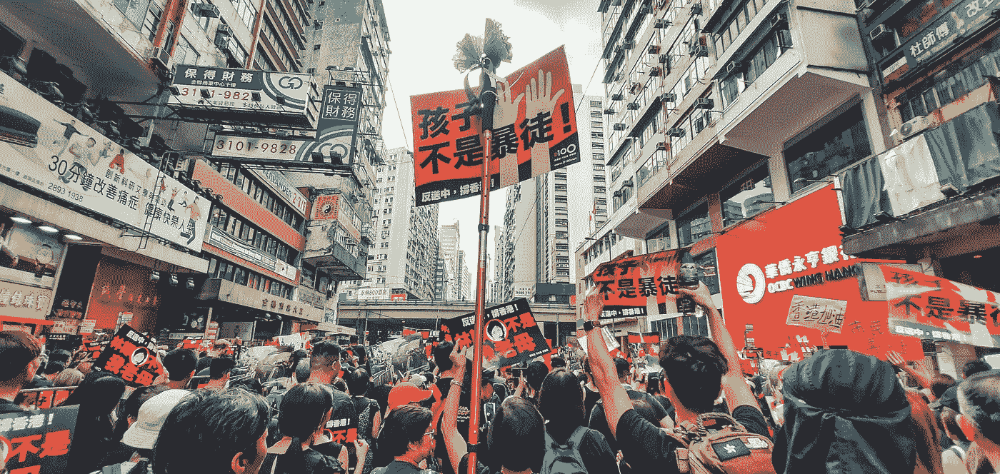

# 人权是普遍的吗？

> 原文：<https://medium.datadriveninvestor.com/are-human-rights-universal-7e72d74eb9dc?source=collection_archive---------17----------------------->

几周前，我了解到三分之一的法国公民认为除了民主之外的其他制度可能也一样好。随着美国面临的内部问题和香港自由的倒退，世界自由似乎处于危险之中。人们想知道民主和个人自由是否是普世价值，或者只是一些西方特有的历史事件。

我并不自称是哲学家或历史学家，但我想就这个我认为非常重要的问题发表我的拙见。

# 西方傲慢的历史

让我们首先认识到，西方国家有一段极端和不合理的傲慢的历史。我们一直在屠杀和奴役人民，因为我们相信我们的种族、文化和宗教是优越的。

在十字军东征的时代，对我们来说，毫无疑问，“我们”比“他们”更好。我们相信我们的宗教是唯一正确的，我们的神圣使命是改变异教徒。理性的缺乏、对其他文化的无知以及普通教育的缺乏，并没有赋予我们从纯粹的特定习俗中区分真正的普世价值的能力。

此外，西方国家大多是独裁国家，几乎没有个人自由，所以也没有什么伟大的价值观可以传播。当然，也可以举几个反例，比如古希腊雅典民主的经历，但它们是专制世界中的例外。

# 启蒙时代

然而，在 17 和 18 世纪的启蒙运动期间，知识分子开始质疑权威，并奠定了人权的基础。中心思想是**生命、自由和财产**是个人的自然权利，应该受到政府的尊重和保护。这在当时是真正的革命，因为专制者可以随意监禁或剥夺个人。在经历了或多或少的暴力革命之后，无论是在西欧还是在美国，基本权利都被纳入了宪法或类似的文件。

另一个关键想法是让**司法变得负责和透明。法院只应适用个人能够事先了解的法律，并应公开作出判决。最后一个革命性的想法当然是民主。法律本身应由人民选出的代表来决定。**

为了使本文的其余部分更简单，从现在开始，我们将这些想法称为基本权利。

 [## 论机器人权利:机器人可以被奴役吗？数据驱动的投资者

### 人们可以随心所欲地对待他们的机器人吗？一个人可以对他们的机器人“暴力”吗？机器人应该是…

www.datadriveninvestor.com](https://www.datadriveninvestor.com/2020/02/13/on-robot-rights-can-robots-be-enslaved/) 

# 光明与黑暗之间

即使在启蒙运动之后，西方文明仍然有许多重大缺陷。例如，他们的民主是不全面的，因为只有男人可以投票。另一个严重的失败是人权只适用于白人。美国和欧洲的很大一部分地区直到 19 世纪还在继续实行奴隶制。甚至在奴隶制结束后，又过了一个世纪，所有种族的人才在法律面前获得平等的权利。

除了这些缺陷，另一个黑暗的方面是这些权利在 20 世纪没有得到持续的尊重。法西斯思想的兴起挑战了这些权利。纳粹德国、墨索里尼的意大利或维希法国都是民主和人权完全消失的政权。

第二次世界大战结束后，这些价值观再次受到新的意识形态的威胁:共产主义。西方提倡自己的价值观，包括基本权利，也包括经济自由，比如创建和拥有公司的自由，这是资本主义的基础。这最后一部分被社会主义者指责为贫困和不平等的根源，为了工人阶级的利益，他们试图用国家管理的经济来取代它。但实际上，东方的公民既没有享受到经济自由，也没有享受到任何其他基本权利。

正如我之前在我的文章 [*中提到的，资本主义仍然是最好的制度*](https://medium.com/@raphael.champeimont/capitalism-ec9f22edbe5) ，数百万来自东德的人越过边境到达西德，在他们的政府建立军事化边境杀死任何试图逃跑的人之前。人们想去西方是为了资本主义提供的物质福利，但也是为了在西方可以享受但在东方被剥夺的自由。

# 超过西方价值观

在西方，我们过去太傲慢了，重要的是要记住这一点，以避免再犯同样的错误。然而，我们不应该走向另一个极端，即认为一切都只是文化问题，基本权利只是几个同样良好的价值体系之一。

反对这一观点的第一个理由是，这些价值观不仅在西方文明中受到尊重。非西方国家甚至可以在实施方面胜过西方国家。例如，根据经济学家*创造的[民主指数](https://en.wikipedia.org/wiki/Democracy_Index)，日韩实际上比美国更民主。同样，香港的事件表明，非西方人和西方人一样准备为基本权利而斗争。*

# 普遍的发现

我认为基本权利实际上是人类对普遍真理的*发现*。从道德上证明这些权利的一种方式可以是使用“康德伦理学”，这是一种逻辑，即“你想为自己拥有这些权利，所以你应该希望每个人都能够享受这些权利”。或者我们可以采用功利主义的观点，也就是说，享受基本权利对人民的幸福至关重要。无论是哪种方式，知道自己享有这些权利都会给你带来内心的平静。你不必害怕被杀害、监禁或剥夺，因为这是有权有势的人的意愿。

作为一名法国公民，我有幸生活在地球上为数不多的能够保证相当高水平的个人自由的地方之一。我知道多亏了为这些自由而战的人们，我今天才能写这样一篇文章，而不用担心我的生命和自由。

民主呢？我倾向于把它看作达到目的的一种手段。这是保证人们继续享有个人自由的最佳方式。经验表明，独裁者通常不尊重基本自由，并且因为害怕被用来质疑自己的权力而放弃基本自由。

人类已经发现，基本权利是文明的一个关键方面，民主是维护这些权利的最有效的政治制度。我们发现，无论种族或性别，人们都应该享有同样的权利。但仍有进步的空间。我们仍在改进我们的价值观，例如发现同性恋者、双性恋者和变性者应该得到平等对待，或者动物有权获得对他们福祉的某种尊重。

# 自由的敌人

基本权利是一种脆弱的财富，如果我们不小心，它们很容易受到损害。第一个风险来自武装力量的暴力接管。对一个民主国家来说，一个明显的威胁是被一个非民主国家入侵。另一个风险是内部派系以政变的形式夺取控制权。民主国家不应该认为他们将永远是全能的，因为他们在以前的战争中一直是胜利的一方，这在很大程度上要归功于美国的强大力量。

但是另一个风险来自我们自己，生活在民主国家的人们。我们可以让当权者破坏民主所需要的宝贵机构，或者利用腐败来影响民主进程。一个类似的风险是选举反对民主的人，因为我们已经不再相信民主的重要性。一个明显的历史例子是通过民主选举上台的希特勒。

最后一个更微妙的风险是，我们投票通过了损害基本权利的法律，尽管我们的政治制度仍然是真正的民主。如果大多数人投票剥夺少数人的权利，就会发生这种情况。例如，假设我们投票赞成将同性恋定罪，就像过去一样。这一决定将是民主的，但却是基本权利的倒退。这意味着民主本身是不够的，我们还需要人们相信个人自由，并接受足够的教育以做出理性的决定。

世界会继续朝着更加人权和民主的方向发展吗？还是会重新陷入黑暗？这取决于我们。

## 获得专家视图— [订阅 DDI 英特尔](https://datadriveninvestor.com/ddi-intel)