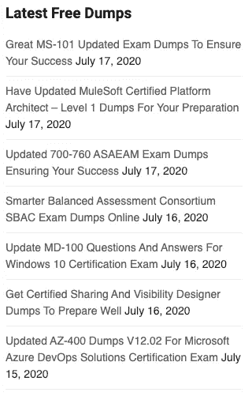

# IT 认证值得你花费时间吗？

> 原文：<https://medium.datadriveninvestor.com/are-it-certifications-worth-your-time-build-projects-instead-1052b4542fd5?source=collection_archive---------8----------------------->

## 软件工程师正在利用 COVID lockdown 获得认证。但是值得吗？

**COVID lockdown 正在重新定义我们的世界**和我们的工作方式。这给在家工作的软件工程师带来了大量额外的时间。但可悲的是，他们中的大多数人已经利用它赶上了**认证的潮流**。你只需要上 ***LinkedIn*** 就能看到。认证已经取代了人们过去在我的网络中分享的真正有趣的工作。

当你有一件有趣的作品时，人们想听。当我面试候选人时，我总是在他们身上寻找动力和激情。没有什么比一个令人惊叹的项目或研究工作更能说明这一点了。

Machine learning model I built that learnt to play Atari’s game Breakout. (Image/GIF by Author: Komal Venkatesh Ganesan)

# 为什么认证不值得您花费时间

下面是摘自 Quora 的[节选](https://qr.ae/pNsycF)——作者[**Gayle Laakmann McDowell**](https://www.quora.com/profile/Gayle-Laakmann-McDowell)**，他是 CareerCup 的首席执行官，曾在苹果、谷歌和微软工作过，也是著名的著作《*破解编码面试》的作者。***

> **“精英”软件公司——微软、谷歌、亚马逊等——通常对软件工程师的认证并不中立；他们实际上是阴性的。对，没错。如果你有证书，并且你正在申请这些公司中的一个，不要在你的简历中列出它**
> 
> **原因是，虽然证书确实证明了某种程度的知识，但这不是那些精英公司所寻求的。他们不在乎你知道什么。他们认为，如果你很聪明，知道计算机科学的基础知识，你就能学到任何缺失的知识。然而，证书表明你关心知识胜过提高你的实际技能。**
> 
> **[- **格利·拉克曼·麦克道尔**-](https://www.quora.com/profile/Gayle-Laakmann-McDowell)**

**一些认证，如思科(我自己也有一个)，甚至鼓励公司雇佣他们的认证人员。例如，思科为他们的设备提供折扣。不用说，这些认证又难又贵。平均来说，任何一个(通常的嫌疑人——谷歌云、甲骨文、思科或 AWS)认证都会让你轻松花费超过 ***200 美元*** 。不仅如此，这些都有到期日，大多数都要求你以“全价”重新参加考试。**

## **考试垃圾——耻辱**

**众所周知，几乎所有的认证都有最新最棒的转储。那么，什么是转储？你看，所有的认证考试软件只是简单地从一套 ***中重复他们的问题*** ，考生利用这一点。他们在考试后迅速写下所有的问题，并在网上分发(也称为大脑转储)。为了证明这一点，请看下图。**

****

**Screenshot taken from website: [https://www.dumpsbase.com/freedumps/](https://www.dumpsbase.com/freedumps/)**

**这使得通过考试变得轻而易举。虽然有些真正的人不会看这些垃圾，但大多数人会看！因为你为这些考试付出了很多，没有人愿意失败。记住**认证只有在稀有且难以获得**时才有价值。有了这些垃圾，每个人都更容易在没有完全理解主题的情况下获得认证。**认证很快就从学习变成了通过考试。****

# **为什么要建立一个项目呢？**

**建立一个项目需要你努力思考。当你有一个有趣的项目时，它反映了你真正的热情。你做个声明。你可以在面试中谈论它。你可以告诉别人为什么你选择了 X 技术而不是 Y 技术，这给了你一个机会来表达你的想法和解决问题的研究。这让面试官和招聘人员有机会更好地了解你。最重要的是，建立一个项目很有趣，你可以从经验中学习。这让简历上的任何证书都相形见绌。当我面试候选人时，我总是在寻找他们做了什么，他们有多少激情，没有什么比一个令人惊叹的项目或研究工作更能告诉我这些了。**

****

**A quadcopter drone that I built recently to run on machine learning. (Photo by Author: Komal Venkatesh Ganesan)**

**自从 COVID lockdown 开始，我开始建立许多机器学习和电子项目。这是一次令人兴奋的旅程，并引起了我的人际网络中招聘人员和工程师的大量关注；比任何证书都多。这就是促使我写这篇文章的原因，看着工程师被他们的公司引诱去做认证。无论如何，学习，研究，但是不要用证书来跟进，而是考虑建立有趣的项目。**你的项目工作将比任何认证都更有说服力**。**