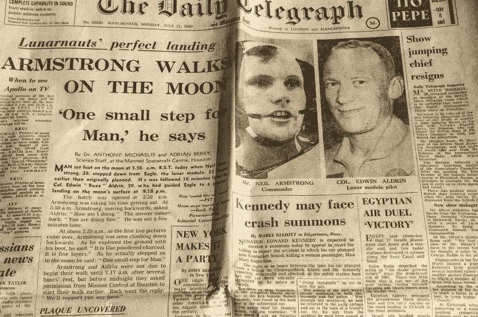
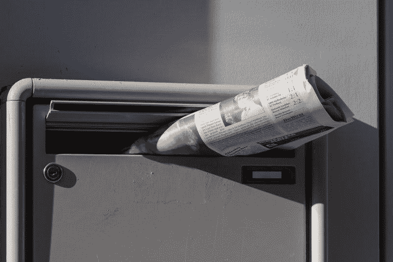
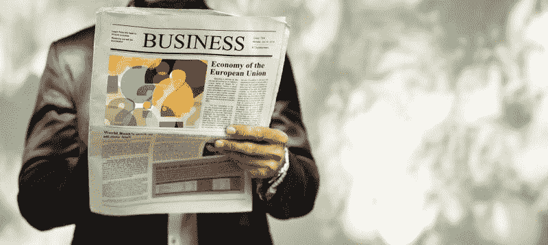

# 李氏企业的报纸已经死了吗？—市场疯人院

> 原文：<https://medium.datadriveninvestor.com/are-newspapers-dead-at-lee-enterprises-market-mad-house-e495da7b65a9?source=collection_archive---------9----------------------->

李氏企业(纽约证券交易所代码:LEE) 承担了一项沃伦·巴菲特认为不可能完成的工作。李试图从技术、经济和改变行为中拯救美国报纸。

**伯克希尔哈撒韦公司(纽约证券交易所代码:BRK。据*华盛顿邮报* [报道](https://www.washingtonpost.com/business/2020/01/29/warren-buffett-said-newspapers-were-going-disappear-now-hes-disappearing-industry/)，T3 将以 1 . 4 亿美元的价格将旗下所有报纸出售给李氏企业。伯克希尔的退出标志着一个时代的结束，因为巴菲特已经在报业经营了 50 年。**

1969 年，巴菲特在奥马哈购买了他的第一份报纸，并于 1976 年加入《华盛顿邮报》董事会。**伯克希尔哈撒韦公司(纽约证券交易所代码:BRK。b)**1977 年买下*布法罗新闻*。

 [## 算法交易的机器学习|数据驱动的投资者

### 当你的一个朋友在脸书上传你的新海滩照，平台建议给你的脸加上标签，这是…

www.datadriveninvestor.com](https://www.datadriveninvestor.com/2019/01/30/machine-learning-for-stock-market-investing/) 

巴菲特在一份新闻稿中称:“我们对将集团出售给其他任何人毫无兴趣，原因很简单:我们相信李开复最有能力应对行业挑战。”。“没有任何组织比李更致力于服务于高质量本地新闻的重要角色，无论是以何种方式提供。”

# 伯克希尔·哈撒韦公司从垂死的报纸中赚钱

巴菲特对李氏企业有些信心。据 PitchBook [报道](https://pitchbook.com/newsletter/berkshire-hathaway-to-dump-newspapers-for-140m)，伯克希尔哈撒韦公司将向李氏企业贷款 5.76 亿美元，并为其债务再融资 4 亿美元。

因此，巴菲特带着 1.4 亿美元的现金离开了报业，并有可能再赚 9.76 亿美元。我认为这笔交易表明了为什么巴菲特是最聪明的投资者之一。解释一下，巴菲特把一项亏损的资产；报纸，转化为现金和赚钱的潜力。

澄清一下，伯克希尔·哈撒韦公司先赚了 1.4 亿美元。此外，如果李氏企业能想出如何扭转局面，伯克希尔可以赚更多的钱。如果李氏企业破产，沃伦叔叔仍有 1.4 亿美元收入囊中，并获得 576 美元的税收减免。

因此，这笔交易表明巴菲特仍然是一个伟大的商人和交易者。然而，它并没有告诉我们报纸是否是一个可行的行业。

# 报纸有什么价值？

市场先生既不信任李氏企业，也不信任报纸。例如，2020 年 2 月 3 日，市场先生将 **Lee Enterprises(纽约证券交易所代码:LEE)** 的价格定为 2.21 美元。

市场先生既不信任李氏企业，也不信任报纸。例如，2020 年 2 月 3 日，市场先生将**李氏企业(纽约证券交易所代码:LEE)** 的价格定为 2.21 美元。

回到 20 世纪 80 年代，我认为李开复可以从这样的投资组合中获得 1000 亿美元的估值。如今，李开复的市值低于他支付给巴菲特的报纸费用。

[李氏的 49 份日报组合](https://lee.net/markets/)包括历史性出版物，包括*圣路易斯邮报*和*卡斯珀星报*。传奇报业大亨约瑟夫·普利策在《圣路易斯邮报》开始了他的职业生涯。

# 李氏企业赚钱了吗？

**Lee Enterprises(纽约证券交易所代码:LEE)** 财务数据显示了巴菲特离开报业的原因。李开复的收入和毛利正在快速缩水。

例如，Lee Enterprises 报告 2019 年 9 月 30 日的季度毛利为 7618 万美元。该毛利低于 2019 年 6 月 30 日的 7，668 万美元和 2018 年 9 月 30 日的 8，311 万美元。

李氏的收入急剧缩水。例如，Lee 在 2018 年 9 月 30 日报告的季度收入为 1.3975 亿美元；该毛利于 2019 年 6 月 30 日降至 1.2728 亿美元，于 2019 年 9 月 30 日降至 1.2367 亿美元。

Stockrow 估计 Lee Enterprises 的收入增长连续五个季度下降。事实上，Stockrow [估计](https://stockrow.com/LEE/financials/income/quarterly) Lee Enterprises 在截至 2019 年 9 月 30 日的季度收入缩水 11.51%。

因此，Lee Enterprises 于 2019 年 9 月 30 日报告的营业收入为 1441 万美元，共同净收入为 82，000 美元。因此，李氏企业正从其报纸中赚取微薄的利润。

可以预见的是，李氏企业的报纸是在烧钱而不是赚钱。例如，李在 2019 年 9 月 30 日报告了负的期末现金流-487 万美元和运营现金流 1389 万美元。

# 李氏企业有什么价值？

目前，我认为李氏企业没有价值。例如，Lee Enterprises 在 2019 年 9 月 30 日有 864 万美元的现金和短期投资。

然而，在 2019 年 9 月 30 日，Lee 的总资产为 5.552 亿美元，非流动资产为 4.949 亿美元，流动资产总额为 6030 万美元。因此，我认为李氏企业的房地产和有形财产比其业务更有价值。

巴菲特通过贷款给李氏企业来挖掘这一价值。解释一下，李氏企业可以抵押或出售报社和印刷厂，以获得支付沃伦叔叔的资金。

然而，伯克希尔·哈撒韦公司将保留其报纸不动产，并将其出租给李，租期为 10 年，《华盛顿邮报》 [报道](https://www.washingtonpost.com/business/2020/01/29/warren-buffett-said-newspapers-were-going-disappear-now-hes-disappearing-industry/)。因此，巴菲特将这些有价值的资产留在了李开复手中，并抛售了亏损的报纸。

李已经确定了伯克希尔报纸 2000 万到 2500 万美元的协同成本。我认为成本协同效应是削减开支和裁员的委婉说法。

# 报纸如何生存

美国报纸正在崩溃，因为它们的收入正在消失。国际笔会估计，美国报纸在 2005 年至 2019 年间损失了超过 350 亿美元的广告收入。*

PEN 声称，其结果是，报纸已经削减了 47%的新闻编辑室工作。此外，自 2004 年以来，超过 1，800 份报纸或 20%的美国报纸已经死亡。

国际笔会估计，美国大约有 1000 份“幽灵”或僵尸报纸。解释一下，僵尸报纸不雇佣记者，也不发布本地或原创新闻。取而代之的是，一份“幽灵”报纸刊登广告、新闻报道和新闻稿。

# 幽灵报纸和僵尸广告商

由于僵尸订户和僵尸广告商，幽灵报纸得以生存。

僵尸订户是那些不管报纸刊登什么都订阅的人。如果报纸只刊登老安德鲁·戴斯·克雷喜剧套路的剧本，我想有些人会订阅的。

与此同时，僵尸广告商在法律上或道德上都有义务购买广告。例如，各州法律要求地方政府在当地报纸上发布法律公告和广告。

即使报纸没有订户，这些法律也会出版。其他僵尸广告商包括那些觉得有义务支持当地报纸的商人。

# 低利率如何让报纸存活

僵尸广告商和订阅提供的收入刚好能维持报纸的运营。然而，僵尸广告和订阅不会产生足够的收入来支持一个功能性的新闻编辑室。

一个相关的问题是，报纸经营者不得不借钱来为他们的经营融资。目前，由于利率低，报纸的债务很便宜。值得注意的是，美联储公开市场委员会[投票](https://www.cnbc.com/2020/01/29/fed-decision-interest-rates.html)在 2020 年 1 月将利率维持在 1.5%至 1.175%，*周* [注](https://theweek.com/articles/892642/why-interest-rates-are-free-marketers-favorite-tool)。

低利率使得债务变得便宜，这使得报纸得以运营。因此，我预测，如果利率上升，债务成本增加，我们将看到许多报纸倒闭。

如果美联储的新领导层认为加息是必要的，报纸可能会面临一场真正的危机。值得注意的是，美联储理事会过去反对降息。然而，美联储公开市场委员会一致支持在 2020 年 1 月 29 日保持低利率，美国消费者新闻与商业频道[报道](https://www.cnbc.com/2020/01/29/fed-decision-interest-rates.html)。

# 是的，报纸注定要失败

我认为目前的广告市场注定了报纸的命运。因此，投资者需要避开**李氏企业(NYSE: LEE)** 。

然而，我认为李的交易显示了为什么**伯克希尔哈撒韦公司(纽约证券交易所代码:BRK。B)** 是一笔巨大的投资。出售报纸表明，伯克希尔可以从报纸等糟糕的业务中赚钱。

值得注意的是，伯克希尔哈撒韦公司报告称，2019 年 9 月 30 日，该公司季度毛利为 502.3 亿美元，收入为 649.72 亿美元。因此，我认为任何想要高安全边际股票的人都需要考虑购买伯克希尔哈撒韦公司的股票。

与此同时，那些想赔钱的人需要购买**李氏企业(纽约证券交易所代码:LEE)** 。经济现实和技术进步注定了李和美国报业的命运。

*

*原载于 2020 年 2 月 3 日 https://marketmadhouse.com***。**