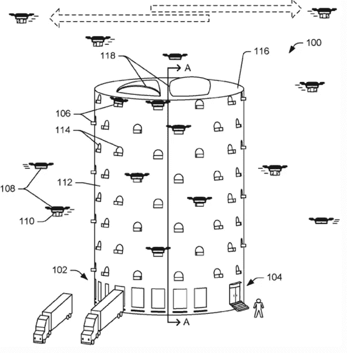

# 包裹递送无人机是“最后一英里”物流问题的答案吗？

> 原文：<https://medium.datadriveninvestor.com/are-parcel-delivery-drones-the-answer-to-the-problem-of-last-mile-logistics-566c8951948f?source=collection_archive---------9----------------------->

## 另一种选择是，到 2030 年，道路上的运输车辆预计将增加 36%。

Photo: Pixabay

据[世界经济论坛报道，](https://www.weforum.org/reports/the-future-of-the-last-mile-ecosystem)网上购物的不可阻挡的增长可能会导致到 2030 年送货车辆增加 36%。

2015 年，亚马逊推出了免费 2 日送货服务，当时很少有人预测这会对传统零售商产生多大影响。许多家喻户晓的名字已经申请破产保护，要么重组新的融资或进入清算。

 [## 我们为军事人工智能做好准备了吗？数据驱动的投资者

### 今天，算法可能会以迷人的形状出现，例如索菲亚，一个态度可爱、开明的机器人…

www.datadriveninvestor.com](https://www.datadriveninvestor.com/2019/02/21/are-we-ready-for-military-ai/) 

然而，电子商务公司的显著增长带来了新的挑战——快速免费送货上门涉及昂贵的物流费用。

我们颠倒了大型购物中心的概念，不是我们去拜访零售商，而是他们去拜访我们。

现在，通过铁路、公路和海运运输集装箱中的大宗包裹不会造成重大的成本问题——当前的技术有助于提高效率。挑战在于配送的“最后一英里”环节，即包裹从当地仓库运送到顾客家门口。

以至于最后一英里的配送占到了供应链成本的 41%。目前卡车和司机的解决方案堵塞了我们的道路，破坏了我们的社区。

卡车和司机的解决方案也不是很有效。随着 [43%的卡车在任何给定的时间都是空载的](https://www.code-n.org/blog/43-trucks-streets-empty-want-change-interview-logistics-startup-transmetrics/)，物流公司正在寻找其他答案也就不足为奇了。

一旦你的包裹到达你的门口，那么另一个问题就出现了——犯罪。所谓的门廊海盗尾随送货卡车，取走“已送达”的包裹，让买卖双方都为谁将承担损失成本而头疼。

物流公司已经采取了新的方法来安全地运送你的包裹。但是没有一个是完全令人满意的。

现在，通过智能技术，送货司机可以进入你的汽车后备箱，甚至你的家，这样包裹就可以被锁在一个安全的环境中。

但这意味着将你的安全外包给物流公司的筛选过程。这只是一个权宜之计，无法超越我们内心深处的感受，即我们在个人空间应该有多安全。

另一个解决方案是包裹柜银行，在那里你通过输入一个独特的代码来领取你的包裹。但是收集你的包裹会让网上购物变得不方便。此外，如果购物者没有及时收集，储物柜就会变满，从而阻止进一步的交付。

物流专家现在提倡使用无人机来彻底改变包裹递送，降低最后一公里的成本，并阻止门廊海盗的祸害。

无人驾驶飞机或者业内人士更愿意称之为“无人驾驶飞行器”,在军事用途上有着悠久的历史。今天也有许多民用用途，如业余爱好者、商业摄影和救灾。

各国都在投资无人机项目，以解决自己的物流需求。[印度尼西亚鹰航空公司](https://www.aircargonews.net/airlines/garuda-indonesia-plans-to-launch-drone-network/)希望利用它们向更偏远的印尼岛屿运送货物。

亚马逊在 2015 年提交的一份[专利申请](https://patents.google.com/patent/US9777502B2/en)提供了对未来的一瞥。它设想了一个多层履行中心，将“适应无人驾驶飞行器的着陆和起飞”，允许几十架无人机为一个地方服务。

[Amazon Patent Illustration](https://patents.google.com/patent/US9777502B2/en)

亚马逊的目标是在 30 分钟或更短时间内将你的包裹送达。你下订单后，无人机会锁定你手机的位置，飞到你所在的任何地方。你也不一定要在你的注册地址；例如，你可以在朋友家下订单。

亚马逊希望这将解决送货点的盗窃问题。30 分钟的送货时间将使订购您的项目就像订购比萨饼。您可以安排在您知道可以接收的时候购买。

进一步的最后一英里效率将来自于劳动力的减少。自主无人机不需要飞行员使用人工智能来避开鸟类、公用电线和其他无人机。

亚马逊和 Alphabet(谷歌的母公司)都有广泛的无人机项目，它们已经在农村地区进行了初步的商业交付，尽管它们都无法进行更大范围的发射。在你选择 30 分钟无人机送货之前，还有一些挑战需要解决。

城市飞行路线尚未对送货无人机开放。航空当局正在像对待任何其他形式的空中运输一样对待无人机，在允许进入航线之前寻求可靠性和安全性的证明。

到目前为止，无人机送货只发生在白天和晴朗的天气。黑暗的天空或强风可能会阻止无人机升空；给停飞的舰队带来机会成本。

温度也会影响用于驱动无人机马达的电池的性能。在寒冷的天气里，飞行范围会显著缩小。使用汽油发动机来驱动无人机可以解决这个问题，但在需要减少二氧化碳排放和城市污染的情况下，这肯定不是一个可行的选择。

如果我们真的让电池供电的送货无人机上天，我们将面临另一种形式的污染——噪音污染。无人机有多个螺旋桨，会产生很大的嗡嗡声，就像它们以蜜蜂命名一样。

尽管面临这些挑战，无人机仍然是物流公司降低最后一英里配送成本的最佳选择。当然，我们不会完全取代送货卡车。购买新沙发或洗衣机总是在卡车后面。但对于较轻的购买来说，我们天空中的一群无人机可能是我们必须接受的交易，以防止道路上的运输车辆增加。