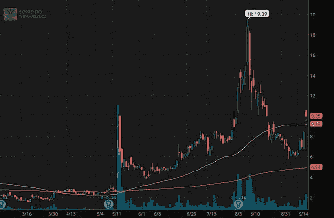
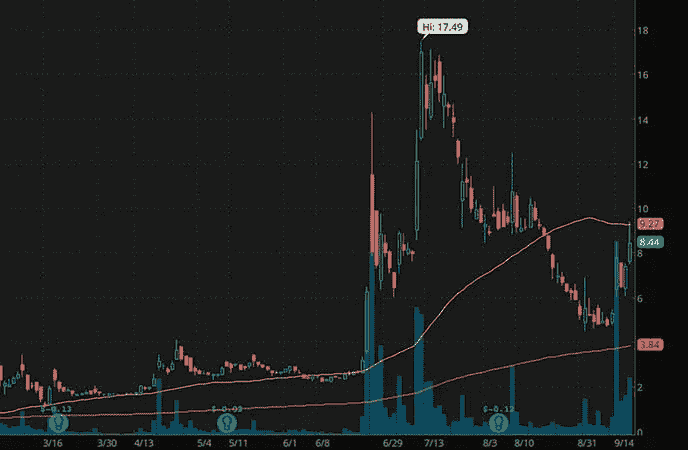
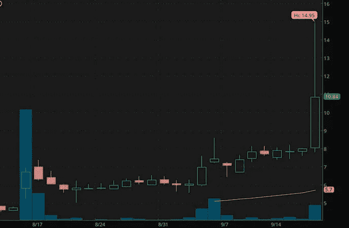
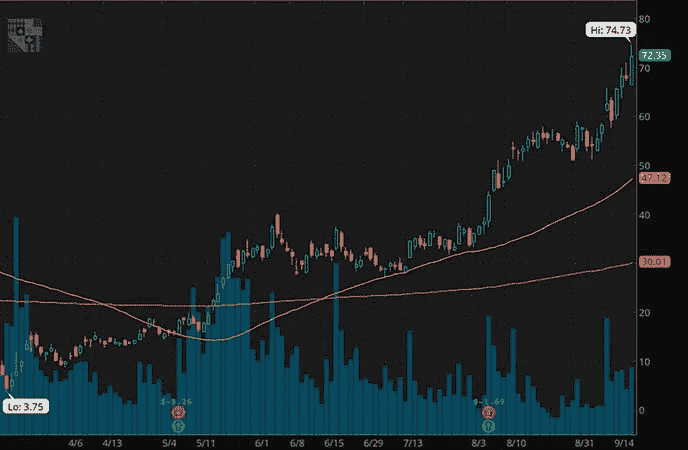
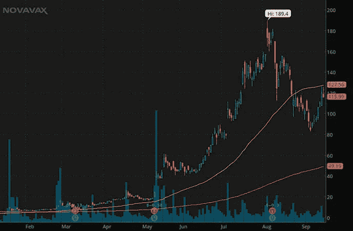

# 细价股值得吗？5 在 2020 年击中公园

> 原文：<https://medium.datadriveninvestor.com/are-penny-stocks-worth-it-5-that-hit-it-out-of-the-park-in-2020-79509f37070f?source=collection_archive---------13----------------------->

# 你应该寻找仙股购买还是亚马逊更好？

低价股本质上是不稳定的，这是必然的。然而，我们今天在股票市场上看到的是，一切都是不稳定的。不管你是在看 S & P ETF ( [间谍 ETF](https://pennystocks.com/ticker/?symbol=SPY) )还是亚马逊公司( [AMZN 股票报告](https://pennystocks.com/ticker/?symbol=AMZN))，价格都在疯狂波动。虽然一些小盘股的反对者可能会强调细价股的“游戏”有多“危险”，但每天都有持续盈利的方法。持续盈利的第一个方法是把这些低于 5 美元的股票当作股票，而不是彩票。

我们看到交易者亏损的大部分时间是当他们试图利用“午餐钱”在他们很少研究的股票上冒险时。在罗宾汉时代，细价股已经成为一个巨大的焦点。事实上，在罗宾汉最受欢迎的低价股中，有 11%的股价低于 5 美元。这告诉你什么？需求摆在那里，现在是了解 [*如何交易细价股才能持续赚钱*](https://truetradinggroup.com/ttg-three-subscription-page/?utm_source=PS_Art&utm_medium=PS_Art&utm_campaign=PS_Art&utm_term=PS_Art&utm_content=PS_Art) 。

它们是为了长期投资而建造的吗？一般来说，大多数细价股波动如此之大，以至于短期时间范围是比什么都好的赌注。这并不是说所有的细价股都不值得。但它是说，从历史上看，第一直觉是短期日内交易或摆动交易。害怕错过——FOMO——可以发挥自己的作用。即使你有钢铁般的意志，在 99%的时间里坚持你的计划，也总有贪婪介入的时候。

# 细价股值得吗？

“也许会更高”是一个非常真实的想法，我相信你们很多人都经历过。当谈到用细价股持续赚钱时，坚持一个计划通常会导致更多的盈利交易而不是亏损。当然，有很多方法可以教会你正确的交易策略。但是我不会在这篇文章中深入讨论这个问题。我要讨论的是 2020 年大卖的低价股。我说的不是从 1 美元涨到 3 美元的那种。这份[细价股清单](https://pennystocks.com/category/penny-stocks-watch-list/)(旧称)是由今年可能以低于 5 美元的价格买入，而现在已经远高于这一水平的股票组成。

# 2020 年赢得细价股第一名:索伦托治疗公司。

索伦托治疗公司( [SRNE 股票报道](https://pennystocks.com/ticker/?symbol=SRNE))实际上仍然是罗宾汉这个月最受欢迎的股票之一。与 2020 年 3 月的交易相比，SRNE 股票本月的交易水平昼夜不同。事实上，自 6 月底以来，SRNE 的股票就不再被视为低价股。迄今为止，该区间已从 1.55 美元的低点升至 19.39 美元的高点。

**【阅读更多】**[9 月有哪些仙股是趋势性的？需要知道的 4 个名字](https://pennystocks.com/featured/2020/09/16/penny-stocks-to-watch-trending-september-16-2020/)

此外，当你谈论**投资低价股**时，例如，SRNE 股票就是我们自去年夏天以来一直在讨论的一只股票。尽管该公司的股票经历了大起大落，但由于新冠肺炎，2020 年是关键的一年。今年早些时候，当这家总部位于加州的生物制药公司声称发现了一种可以保护人体免受冠状病毒感染的抗体时，人们开始兴奋起来。就像他们说的，剩下的就是历史了。

 [## 如何以交易为生|数据驱动的投资者

### 不管你是刚开始交易，还是已经开始了职业生涯，有一件事是…

www.datadriveninvestor.com](https://www.datadriveninvestor.com/2020/08/17/how-to-trade-for-a-living/) 

今年迄今，SRNE 股票上涨了近 200%，在 2020 年的高点，股价上涨了 467%。那么，到目前为止，这只低价股值吗？从各方面来看，我确信你对这支生物技术股票的表现没有什么可说的。虽然令人钦佩，但亚马逊年初至今 60%的涨幅无法与之相比。

显然，当谈到细价股时，对波动性的胃口过去是、现在也可能是需要的。但那些经受住了这种波动的公司今年获得了多倍三位数的升值。更重要的是，今天索伦托公司得到了美国食品和药物管理局的批准，可以继续进行其新冠肺炎抗体治疗的临床研究。

# 2020 年赢得细价股第二名:Vaxart Inc .

今年另一只大赚一笔的廉价股票是 Vaxart Inc .当我们开始追踪这只[冠状病毒低价股](https://pennystocks.com/featured/2020/03/05/best-coronavirus-penny-stocks-on-robinhood-march-5-2020/)时，股价从 2.18 美元飙升至 17.49 美元的高点。虽然 VXRT 股价在 8 月份有所回落，但冠状病毒疫苗股票最近的飙升有助于推动 VXRT 回升。本周，前一只仙股的交易价格超过了 8 美元；年初至今仍上涨超过 2，250%。

当我们开始关注 Vaxart 公司时，它只是专注于 H1 流感的治疗。冠状病毒和流感之间明显的相似之处现在已经很明显了。我们也看到类似情况下的公司如何试图调整治疗方法并将其应用于新冠肺炎。

快进到这个月，该公司刚刚收到 FDA 对其口服新冠肺炎治疗候选药物的第一阶段试验申请的批准。随着招聘定于本月开始，毫无疑问，这家公司会受到更多关注。认为它是 2020 年初低于 50 美分的仙股之一似乎是不真实的。但事实是，VXRT 在 COVID 上市前是一只低价股。

Vaxart 还在仓鼠中进行新型冠状病毒挑战研究，以提供其候选疫苗最佳剂量方案的功效数据和见解。这项研究的结果预计在十月中旬公布。

# 2020 年赢得细价股第三名:亿邦国际公司。

巧合的是，我们第一次也是最后一次讨论亿邦国际股份有限公司([亿邦证券报告](https://pennystocks.com/ticker/?symbol=EBON))是在八月中旬。在开盘前的几个小时里，我们发现了低价股的一些[势头。在此之前，它的交易价格约为 4.60 美元，该公司刚刚宣布了一项关键进展。](https://pennystocks.com/?p=9855)

亿邦报道称，其在新加坡设立了全资子公司，为建立加密货币交易所做准备。现在，在当时，加密货币股票不像 2018 年那样主流。然而，这并不意味着交易者对这个领域不感兴趣。

再过几周，EBON 股票现已达到 14.95 美元的高点。显然，这一举措并没有带来波动。然而，自从我们开始讨论这家公司以来，股价一直在稳步攀升。自那以后没有任何新的进展，也没有任何新的申请。

**阅读更多信息** [尼古拉公司(NKLA)是一只定价过高的细价股还是真货？](https://medium.com/datadriveninvestor/is-nikola-corp-nkla-an-overpriced-penny-stock-or-the-real-deal-ccf98b65a2fb)

考虑到美联储本周的最新评论导致最近对加密货币的关注，它可能已经成为最近这波飙升背后的催化剂。还会继续吗？这还有待观察，但值得一提的是，在短短一个多月的时间里，EBON 的股票已经上涨了 225%。例如，在同一时期，亚马逊股价实际下跌了约 5%。诚然，我们谈论的是一只交易量很小的仙股，而不是一只巨大的蓝筹股。但如果短线交易是你想赚钱的方式，EBON 就是一个明显的例子，说明考虑到更短的时间跨度，细价股的表现优于大盘股。

# 赢得 2020 年的细价股#4:宾州国家博彩

我们讨论过宾夕法尼亚国家博彩公司([宾夕法尼亚股票报告](https://pennystocks.com/ticker/?symbol=PENN))是今年另一只前细价股。今年 3 月，当整个市场抛售时，博彩和赌场类股遭受重创。PENN stock 也不能幸免。

股价跌至 3.75 美元，完全在区间内。然而，从那时起，宾夕法尼亚州立大学就一直处于绝对的撕裂状态。股票刚刚达到新的历史高点，因为本周市场的其余部分正在抛售。在周四上午的交易中，PENN 股票达到了 74.73 美元。自 3 月份以来，这只曾经的仙股已经上涨了近 1，900%。

与 Barstool Sports 的最新交易提高了博彩股票的赌注。除此之外，华尔街的主要分析师也开始关注这只股票。9 月 17 日，Stifel 将该股的目标价从 47 美元上调至 85 美元。该公司还持有 Penn National 股票的买入评级。随着 DraftKings 的公开亮相，iGaming 股票在今天的股市中变得更加“好玩”。

# 2020 年赢得细价股第五名:诺瓦瓦克斯公司。

如果不提到 Novavax Inc. ( [NVAX 股票报告](https://pennystocks.com/ticker/?symbol=NVAX))，你就不能谈论 2020 年的仙股。对于那些对此感到困惑的人来说，NVAX 是今年早些时候和去年年底值得关注的热门仙股。当我们在 1 月中旬第一次开始讨论这只前[仙股时，NVAX 股票的交易价格约为 4.40 美元。这就像“武汉病毒”开始成为“新型冠状病毒”一样。随着更多数据的出现，Novavax 推动了候选疫苗的研发。](https://pennystocks.com/featured/2020/01/15/best-penny-stocks-to-trade-5-to-know-january-2020/)

在宣布从 CEPI 获得高达 3.88 亿美元的 COVID 疫苗开发资金后，NVAX 的股票跃升至全新的价格水平。当时，3.88 亿美元也是流行病预防创新联盟投入的最大一笔资金。该公司还获得了 16 亿美元的奖励，以进一步推进其冠状病毒管道的发展。这些和其他关键的发展推动了 NVAX 股票的突破。它最终将在 8 月份达到 189.40 美元的高点；从 1 月 15 日开始上涨了 4200%。

像大多数冠状病毒疫苗股票一样，NVAX 在过去几周有所回落。本月，股价略有反弹。虽然值得一提的是这一史诗般的运行，但也值得一提的是，这一举动不是一夜之间发生的，我不知道有人会持有股票那么久的可能性。尽管如此，NVAX 股票是这份细价股名单上最大的移动者之一，现在与该行业中一些领先的生物技术公司竞争。

*原载于 2020 年 9 月 17 日 https://pennystocks.com***。**

## *访问专家视图— [订阅 DDI 英特尔](https://datadriveninvestor.com/ddi-intel)*