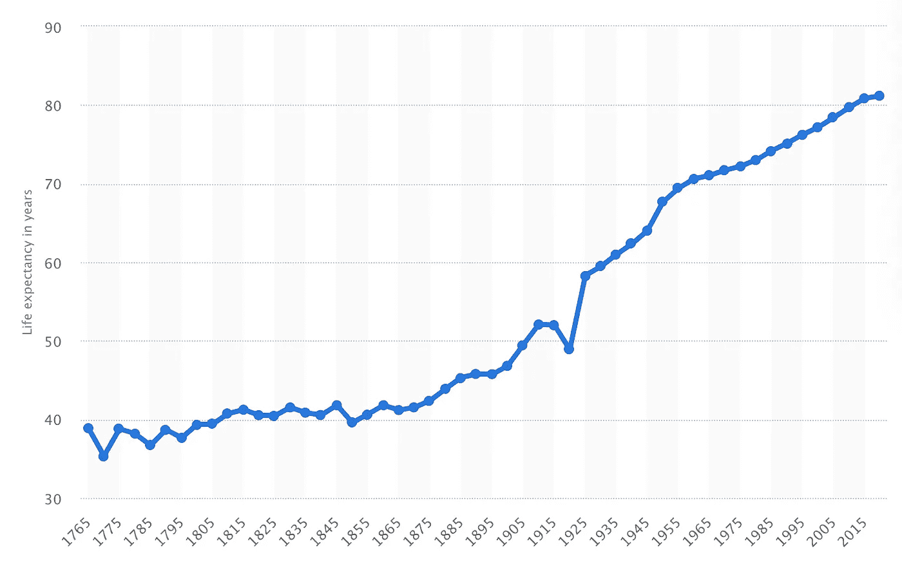
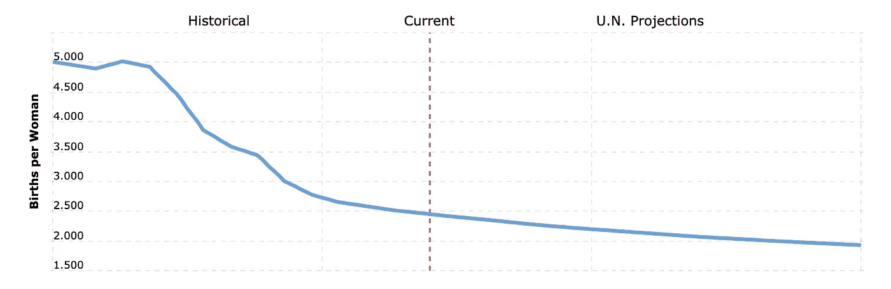
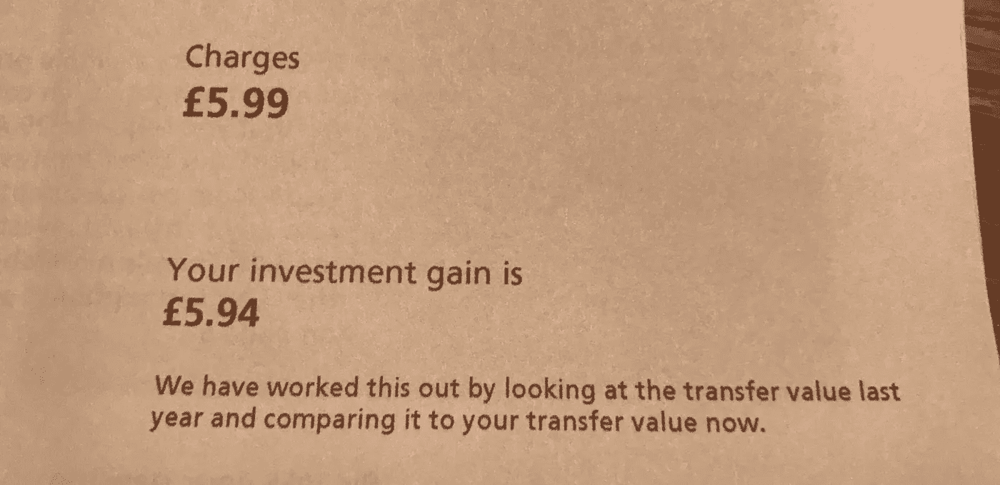
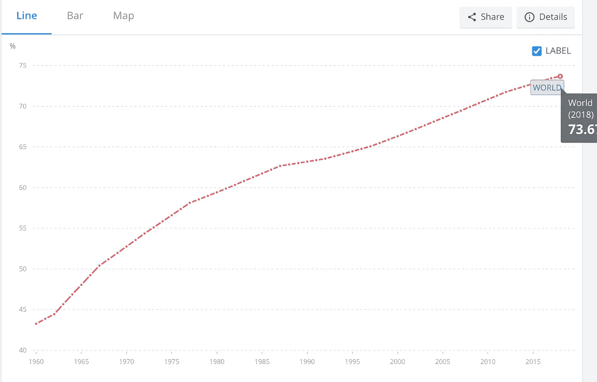
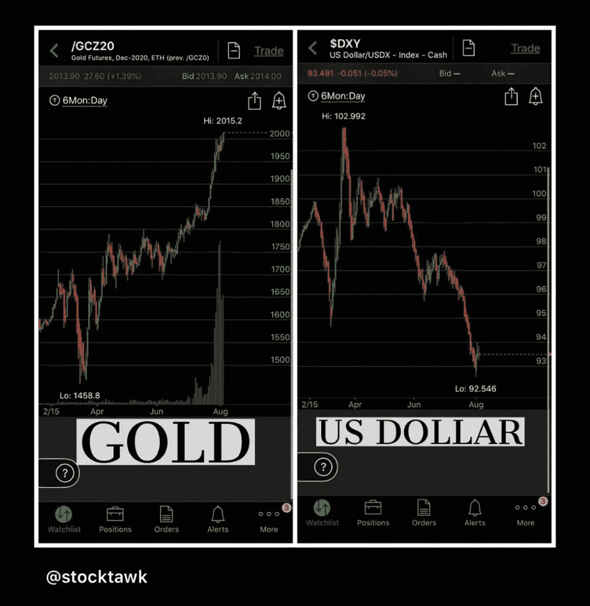

# 养老金是不是一种美化的传销？

> 原文：<https://medium.datadriveninvestor.com/are-pensions-a-complex-pyramid-scheme-8cfbb9a1a382?source=collection_archive---------1----------------------->

## 如何理解和避免它们

Photo by [JD Mason](https://unsplash.com/@jmason?utm_source=medium&utm_medium=referral) on [Unsplash](https://unsplash.com?utm_source=medium&utm_medium=referral)

> **作者注** *:我已经开始了一个引人入胜的时事通讯，里面充满了商业、营销&金融方面的实用建议……所有这些都是为你设计的，只需一分钟或更少的时间就能看完。* [*在此免费阅读*](https://1minutewonders.substack.com/) *。*

我有 1 个苹果，但我的养老金供应商收取了我 1.08 个苹果来管理我今年的养老金。我突然欠了 0.08 个苹果的钱。这足以让任何有数学天赋的孩子挠头。

就这样，我欢迎你来到养老金的复杂噩梦…世界上最被接受的金字塔计划。

让我们重新开始。2008 年，许多努力工作的人在金融危机和随后的衰退中失去了养老金。尽管工作和付出了 40 到 50 年，他们的回报却是零，或者远远低于他们的付出。系统辜负了他们。同样的系统也会让你失败。

> 私人养老基金通常是股票、债券、衍生品等的混合体，通常被称为低风险投资。问题是，当系统失灵时，它就全部失灵了。即使低风险也是一种风险。

在政府的救助下，金融机构保住了自己的性命，但损失最大的是像你我这样的人。我的希望是，随着我们揭露养老金背后的金字塔计划，你会寻找自己的投资机会，并使你辛苦赚来的资本多样化，以获得一个轻松、光明的未来。

## 什么是传销？

金字塔计划或庞氏骗局是一种“通过招募越来越多的‘投资者’来赚钱的系统”

在这个例子中，因为它与养老金有关，系统可以招募的工人越多，所有人都向系统支付，就越容易支持金字塔顶端的人，在退休年龄“兑现”。

 [## 对有商业头脑的投资者有用的行为经济学概念|数据驱动的投资者

### 在美国企业界，高斯统计，对我们周围世界的确定性解释，以及理性…

www.datadriveninvestor.com](https://www.datadriveninvestor.com/2020/07/09/helpful-behavioral-economics-concepts-for-the-business-minded/) 

最高层*(在这种情况下也称为退休)*可以根据他们下面每个人积累的财富一次性支付一大笔钱，这些人仍然在向系统支付。

这是可行的，为什么这是个问题呢？

# 我们死得不够快

多亏了医学、科学、技术、创新和卫生设施，我们的寿命比以往任何时候都要长。

婴儿全因死亡率[也下降了](https://www.ons.gov.uk/search?sortBy=release_date&q=infant+mortality&size=50)，因此平均预期寿命比以往任何时候都要高。越来越多的人活了下来……而且活得更久。

Source: [Statista](https://www.statista.com/statistics/1040159/life-expectancy-united-kingdom-all-time/)

这种延长寿命的乌托邦梦想给金融部门带来了负担。如果你 65 岁退休，活到 81 岁，政府或私人金融机构有责任供养你整整 16 年。

鉴于英国[退休人员平均每年花费 27，000](https://www.which.co.uk/money/pensions-and-retirement/starting-to-plan-your-retirement/how-much-will-you-need-to-retire-atu0z9k0lw3p)(35，000 美元)，你需要确保你的养老基金价值 432，000 英镑或超过 50 万美元。

## 让我们认真一点…

据报道， [35%的合格劳动者根本没有养老金计划。我的猜测是这个数字要高得多，这些研究的问题是，它们没有考虑到参与者说谎的能力——在提问者面前不会感到不合适。](https://www.finder.com/uk/pension-statistics#:~:text=35%25%20of%20the%20adult%20population,is%20enough%20to%20retire%20comfortably.)

即便如此，这仍然表明，超过三分之一的人将依赖纳税的“国家养老金”或“社会保障”政府支持……给每个国家的经济带来巨大压力。

这反过来又增加了对政府的需求，即让更多的人向该体系纳税，而不是让更多的人在经济上依赖于政府。

> 这本身就是传销的定义。

# 我们生孩子的速度也不够快

需要更多的人来支付这个金字塔计划需要更多的符合工作年龄和健康的人。

地球上的人口正在增长，但总体而言，这些数据被活得更长的人扭曲了——实际出生人数正在下降。

不幸的是，联合国预测全球生育率也将继续下降。图表上的红线*(下图)*显示我们当前的年份为 2020 年。这条线之前是生育率的历史数据，这条线之后是对持续趋势的预测。

1950–2020 World Fertility Rate. Source: [Macrotrends](https://www.macrotrends.net/countries/WLD/world/fertility-rate)

甚至埃隆·马斯克也很担心，他在推特上说人口过剩不是问题。

> “真正的问题……到 2050 年，世界人口将会老龄化和减少”— [埃隆·马斯克](https://www.businessinsider.com/elon-musk-reiterates-global-population-is-headed-for-collapse-2019-6?r=US&IR=T)

我们正走向一个倒金字塔。有更多的受抚养人而不是那些足够健康和有资格工作来供养他们的国家。

对政府来说，最简单的解决办法是改变“提取”养老金的要求。其形式是到 2026 年将退休年龄提高到 67 岁。然而，它可能会增加超过这一点，以抵消更多工人支付的需求。

# 政府与这个问题的斗争

2012 年，英国政府实施了一项新举措[自动入学](https://www.pensionsadvisoryservice.org.uk/about-pensions/pensions-basics/automatic-enrolment)，旨在更大程度上解决这一问题。“它使得**的雇主**自动将他们符合条件的工人加入**养老金**计划成为**的强制**。”

这种强制养老基金是一种保证符合条件的工人缴纳养老金的方式，除非他们选择退出。

## 为什么需要这样做？

事实是，没有人有钱。最近的一项研究发现，十分之一的英国人根本没有储蓄——33%的人储蓄不足 600 英镑，这是一个可怕的统计数字。

英国政府采取的这种举措(但被许多其他国家效仿)以及不断提高的退休年龄门槛，确保人们在老年时不会变得“依赖政府”，从而减轻政府支持的负担。

# 那么为什么要有养老金呢？好的，坏的和丑陋的

如果这是一个金字塔计划，有着不断变化的官僚政治目标和与之相关的风险因素，你为什么要有养老金呢？首先，让我们从养老金的基本经济弊端开始，没有任何情感和同情。

1.  它们的增长依赖于市场增长——股票、债券、房地产等。你最终得到的可能比你付出的多，但同样也可能少得多。
2.  他们需要支付该基金的“管理费”和由此产生的利润。
3.  无论如何，你都要纳税，这让你有资格享受“社会保障”或“国家养老金”。为什么要付两次钱？
4.  如果你年老时需要私人护理，聪明的投资者将不得不使用他们的养老金或个人储蓄来支付，而轻浮的顾客将获得政府资助的护理。即。你付了两次钱。一次(税收)给那些负担不起护理的人，一次(养老金)给你。这真的公平吗？
5.  你死了，它就死了。如果您将养老金缴款存入一份“[终身年金](https://www.moneyadviceservice.org.uk/en/articles/what-to-do-about-someones-pension-when-theyve-died#what-to-do-about-their-state-pension)”，那么除非有“保证期”概述，否则付款可能会停止。然而，这通常只有 5 至 10 年的标准。
6.  当你去世时，从养老基金(你已经付过税的基金)中提取的用于购买资产或进行进一步投资的收入将算作你遗产的一部分。这意味着，如果伴侣或配偶不到退休年龄，他们可能要缴纳遗产税或进一步的所得税。

## 证据就在布丁里

有趣的是，我最近收到了 AVIVA 的一封信，告诉我我的养老金进展如何。我想确定我已经和你分享了。这使得本文开头的整个“苹果”比喻变得有意义。

正如你从下面的照片中看到的，我的养老金投资获得了 5.94 英镑(7.64 美元)，不包括 2010 年的付款，我的快乐被收取了 5.99 英镑(7.70 美元)。他们拿走了我所有的利润和更多的钱来“管理”我的养老金。

Photo of Aviva 2020 pension letter and charges by [Geraint Clarke](https://medium.com/u/5467d3aef1ca?source=post_page-----8cfbb9a1a382--------------------------------)

# 解决方法是什么？

即使你一生都虔诚地缴纳养老金，26%的男性和 19%的女性(全球范围内)无论如何也活不到退休年龄。

U.N. Data on % of men globally to reach age 65\. Source: [worldbank](https://data.worldbank.org/indicator/SP.DYN.TO65.MA.ZS)

> 这意味着五分之一的女性或四分之一的男性永远看不到他们的劳动成果。

解决办法是个人储蓄和投资。不要付钱给金融机构、银行或养老金提供者，让他们拿你的血汗钱去赌博而不承担任何后果，而是掌控你自己的资产。

记住，多样化很重要。不要把所有的鸡蛋放在一个篮子里。通过在各种不同的投资上改变你的储蓄金额，你会在某种程度上受到保护。

看看黄金不可思议的上涨，同时美元(传统法定货币)在暴跌。

Source: [Stocktawk’s Instagram](https://www.instagram.com/stocktawk/)

通过在许多投资领域改变你的自我管理的投资组合，你将确保自己在一个领域下跌时损失不那么剧烈。

开始研究投资资产，如:

*   金、银和其他贵金属
*   房地产
*   现金
*   首饰
*   债券(有担保的、政府支持的和有吸引力的免税)
*   股票(选择性地，也许是那些定期支付股息的，或者是超低风险的指数基金——至少利润是 100%你的)
*   你可以和你的受益人共同拥有的企业。

本质上，你是在寻找升值的资产，那些随着时间推移可能增值的资产。这就是养老金供应商或银行在传统养老基金中对你的现金所做的事情，只不过他们保留了很大一部分利润，并向你收取借钱给他们的费用。

摆脱你脚下的便利，开始掌控自己的未来。没有人会像你一样对你的成功充满动力。

**访问专家视图—** [**订阅 DDI 英特尔**](https://datadriveninvestor.com/ddi-intel)