# REITs 被高估了吗？数据驱动的投资者

> 原文：<https://medium.datadriveninvestor.com/are-reits-overrated-data-driven-investor-6dbda911f77f?source=collection_archive---------17----------------------->

在这篇文章中，我的目标是为读者提供一个框架，以分析房地产投资信托在今天的时代。 ***在入门之前，提醒广大读者，本文观点为本人观点，不作为投资建议。***

# 什么是房地产投资信托基金？

股权房地产投资信托基金(以下简称“REIT”)是一家拥有、管理或融资创收财产的上市公司。房地产投资信托基金可能出现在住宅、商业、零售、工业和医疗保健领域。对涉足房地产市场感兴趣但寻求资本密集程度较低且更方便的选择的投资者可能会考虑 REITs 作为一个潜在的选择*。投资者可能会因为三个主要原因而投资房地产投资信托基金。它们是:没有麻烦的财产管理、多样化、收益和潜在的税收优惠。*

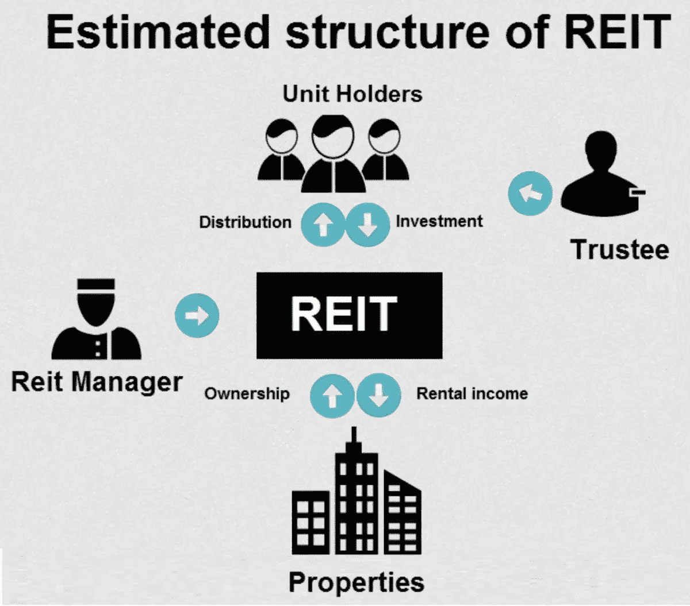

首先，投资者并不直接拥有房地产投资信托基金拥有/管理的物业，但他们确实从这些物业产生的现金流(主要是租金支付)中受益。因此，房地产投资信托基金的投资者不必花费自己的时间、精力和资源来处理与搜索、收购和占有房产相关的所有方面，他们只需购买证券并收集现金流。

其次，房地产投资信托增加了投资者投资组合的多样化。根据晨星公司的数据，从 1972 年到 2019 年 12 月 31 日，富时 NAREIT 股票 REITs 指数和标准普尔 500 之间的相关性平均约为 0.56。与固定收益证券的相关性(以彭博巴克莱美国综合债券指数衡量)甚至更低，在 1976 年 12 月至 2019 年 12 月 31 日期间平均为 0.24。

第三，由于其法律结构，房地产投资信托基金不为其收益缴纳公司税。相反，他们被要求将至少 90%的应税收入作为股息支付给股东，股东最终为他们收到的股息支付普通所得税。

# **REITs 要求**

愿意成为房地产投资信托基金的公司必须遵守美国证券交易委员会(以下简称“SEC”)的以下要求:

> 成立一年后至少有 100 名股东；
> 作为一个实体，如果不是因为其房地产投资信托基金的地位，将作为一个公司纳税；
> 由董事会或受托人管理；
> 拥有完全可转让的股份；
> 由五个或五个以下的个人持有不超过 50%的股份；
> 每年以股东分红的形式支付至少 90%的应税收入；将总资产的至少 75%投资于房地产、现金或美国国债；
> 总收入的至少 75%来自房地产相关来源，包括房地产租金和房地产抵押贷款利息；并且
> 其总收入的至少 95%来自此类房地产来源以及任何来源的股息或利息；并且
> 不超过 25%的资产由非合格证券或应税 REIT 子公司的股票组成。

可以看出，房地产投资信托基金在公司治理和运营方面面临几项要求，允许它们从公司应税收入中扣除支付给股东的所有股息。税收优势当然很有吸引力，但 REITs 严格的分配和投资要求可能会使其在严重的经济压力下比任何其他股票证券都不灵活，就像我们目前在新冠肺炎经历的那样。既然我们对房地产投资信托基金的运作有了更好的理解，让我们分析一下当前的宏观经济环境如何对美国房地产投资信托基金的估值造成重大损害，更具体地说是在零售领域。

# **激增的电子商务**

新冠肺炎的小说迫使人们改变了他们的购物习惯，不管他们是否愿意。根据商务部人口普查局 2020 年 8 月 18 日公布的数据，2020 年第二季度电子商务销售额占总销售额的 15.1%。2020 年第二季度电子商务估计比 2020 年第一季度增长 31.8%(1.2%)，比 2019 年第二季度增长 44.5%(1.9%)，而同期零售总额下降 3.6%(0.5%)。

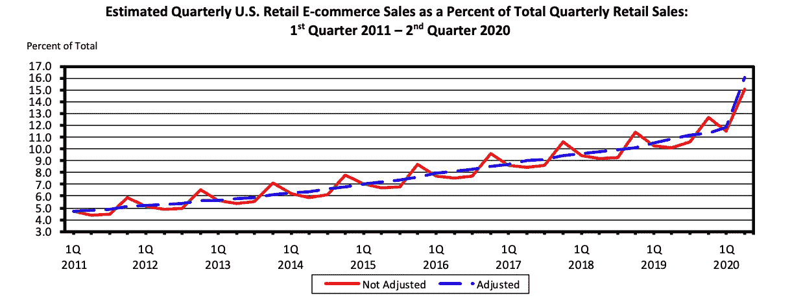

从图表中可以看出，已经处于上升趋势的美国零售电子商务销售额，对仍然屹立不倒的实体零售商来说，已经成为一个更大的威胁。为了保持竞争力，一些实体零售商不得不加大运营投资。例如，他们不得不改善他们的在线购物平台，同时不得不在各自的实体店中承担与额外要求的安全措施相关的额外费用，以遵守严格的 CDC Covid 准则。考虑到当前的宏观经济环境，这些因素正在降低实体店的吸引力，并给电子商务提供了一个主要的支持。有趣的是，瑞士瑞信银行在 2017 年做的一份报告估计，到 2022 年，20%至 25%的购物中心将关闭，主要是因为商店关闭。根据 Coresight Research 最近的一份报告，到 2020 年为止，已有超过 8000 家零售场所关闭，多达 25000 家传统实体零售商可能永久关闭。尽管新冠肺炎及其衍生产品无疑加速了传统实体零售商的关店，但从实体购物到电子商务购物的转变很久以前就已经开始了。

# 《关怀法案》第 4013 条临时救助

毫不奇怪，随着美国经济在 2020 年 3 月底关闭，美国政府不得不采取行动摆脱房地产投资信托基金等股票证券。根据 2 万亿美元的冠状病毒援助、救济和经济安全(CARES)法案第 4013 条，允许 REITs 等金融机构基本上从 3 月 1 日开始 ***暂停*** 陷入困境的重组会计，并于 2020 年 12 月 31 日(或国家紧急状态终止后 60 天)结束。*如果您想了解更多具体信息，请查阅《财务会计准则委员会会计准则汇编》子主题 310–40，应收账款——债权人进行的问题债务重组*。简而言之，房地产投资信托基金已被授权 ***而非*** 使用 GAAP 会计，将任何被视为受新冠肺炎影响的租金收入确认为应收租金，尽管事实上承租人可能已经停止支付租金。这笔临时会计“拨款”很可能掩盖了房地产投资信托基金的真实财务实力，尤其是零售领域的房地产投资信托基金，因为它们已经受到了从实体购物向电子商务购物转变的压力。

为了分析 REITs 对 CARES Act 4013 条款的依赖程度以及影响，我们收集了按市值衡量的前十大公开交易 REITs 的数据。根据全国房地产投资信托协会的数据，这十个 REITs 的总市值相当于美国整个 REITs 股票市值的 41.23%。

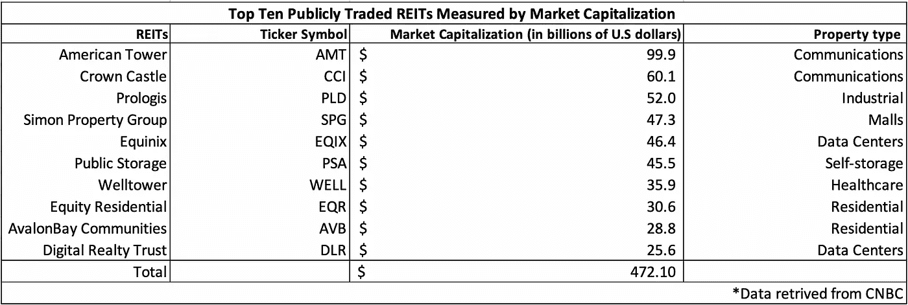

此外，从 4Q 2010 年到 2Q 2020 年，收集了上述各房地产投资信托基金的季度财务报表报告，在九年半的时间内共收集了 39 份季度报告。从下图可以看出，从 2019 年第四季度到 2020 年 Q1，十大公开交易房地产投资信托基金的应收账款总额增长了 24.37%，而同期收入仅增长了 2.47%。同样，与 2019 年第四季度相比，Q2 2020 年的应收账款总额增长了 31.61%，与 Q1 2020 年相比增长了 7.34%，而总收入比 Q1 2020 年的水平下降了 3.87%，比 2019 年第四季度的水平下降了 6.34%。根据提供的数据，可能有超过 14 亿美元的潜在收入因违约而面临非常高的无法收回的可能性，但仍在十大公开交易房地产投资信托基金的账簿中被确认为应收账款，根据 CARES 法案的 4013 部分，该法案允许将任何被视为受新冠肺炎影响的租金收入确认为应收租金。如上所述，这两个百分比变化数据强烈表明房地产投资信托基金的财务实力被夸大了。

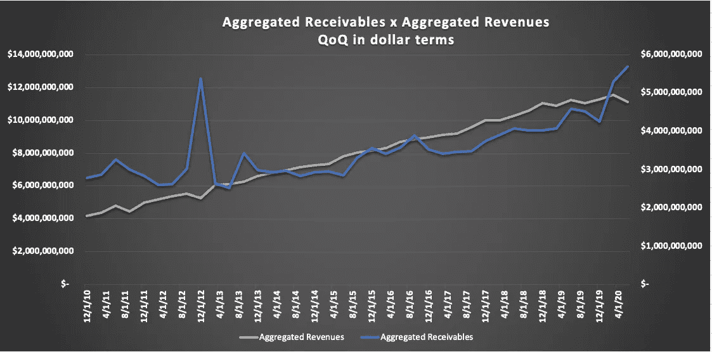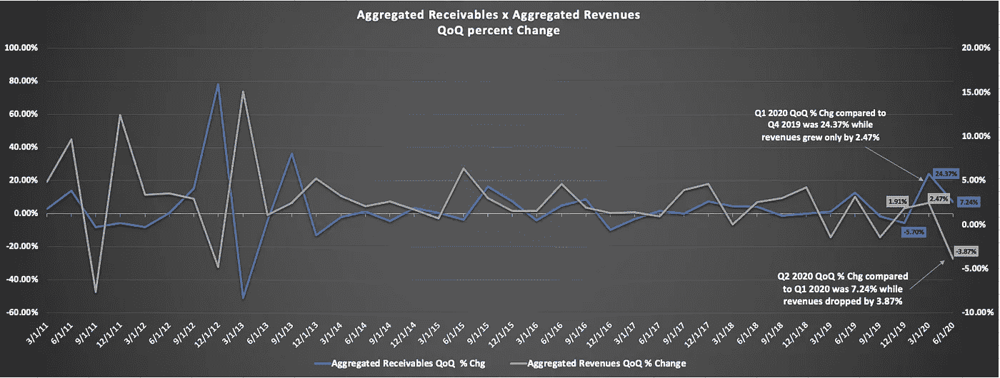

# 西蒙财产集团估价

在进行进一步研究以了解十大公开交易的房地产投资信托基金中的哪一个最容易因 CARES Act 的 4013 条款而夸大其账面价值后，发现了一个最佳选择，Simon Property Group(以下简称“SPG”)。SPG 拥有、开发和管理顶级购物、餐饮、娱乐和综合用途目的地。截至 2020 年 9 月 30 日，SPG 在美国的 204 处创收物业中拥有权益，其中包括 99 个购物中心、69 个高级折扣店、14 个工厂、4 个生活中心，以及 37 个州和波多黎各的 18 处其他零售物业。SPG 房地产投资组合主要集中在零售领域，这是受到新冠肺炎和电子商务的负面影响的主要领域之一。SPG 对十大公开交易房地产投资信托基金进行了类似的基本面分析。结果要可怕得多。从 2019 年第四季度到 Q1 2020 年期间，SPG 应收账款下降了 4.65%，但在 Q2 飙升至 83.71%，与 2019 年第四季度相比增长了 76.42%。从 2019 年第四季度到 Q1 2020 年期间，收入下降了约 9%，如果将 Q2 2020 年与 2019 年第四季度的水平进行比较，则下降了约 31%。SPG 应收账款占收入的比例也大幅上升，在 Q2 2020 年达到 62.54%的极端水平。这表明，Q2 2020 年每一美元的确认收入中，有 62 美分被分配到 SPG 的应收账款中。此外，从 2019 年第四季度到 2020 年第三季度 ，SPG 应收账款增加了***74.52%，这进一步表明投资者应格外谨慎地评估公司的估值。***

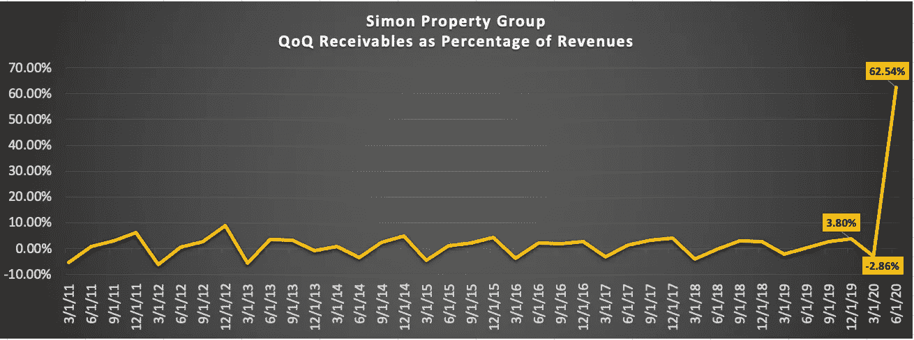

## CARES 法案 4013 条款对 SPG 估值的影响

为了进一步分析 SPG 估值受金融机构(如 REITs)在 CARES 法案下的特权会计处理的影响程度，进行了两次贴现现金流估值。一种最佳情况和其他预期情况下的估价，每种情况都针对 SPG 应收账款增加 74.52%的四种不同违约概率，相当于*6.201 亿美元或 SPG 股本的 30%。*

 [## 新冠肺炎期间股票交易的 9 个教训|数据驱动的投资者

### 在你浏览之前，让我告诉你一些关于我自己的情况。我是…

www.datadriveninvestor.com](https://www.datadriveninvestor.com/2020/12/09/9-lessons-learned-about-stock-trading-during-covid-19/) 

> **在最佳情况下的估值** — SPG 的每股价值从 53.18 美元到 64.18 美元不等，从最乐观(0%)到最不乐观(75%)的违约概率相差 17.14%。

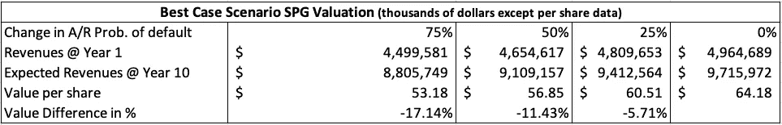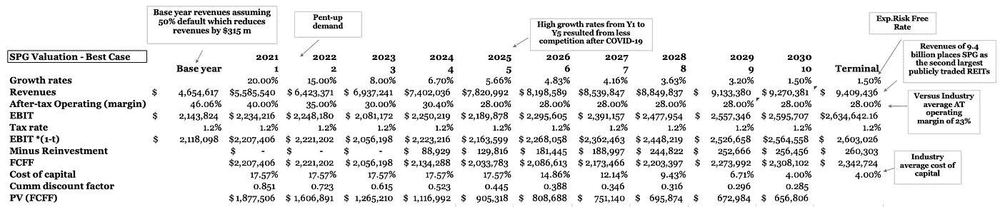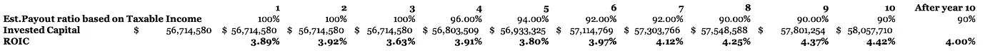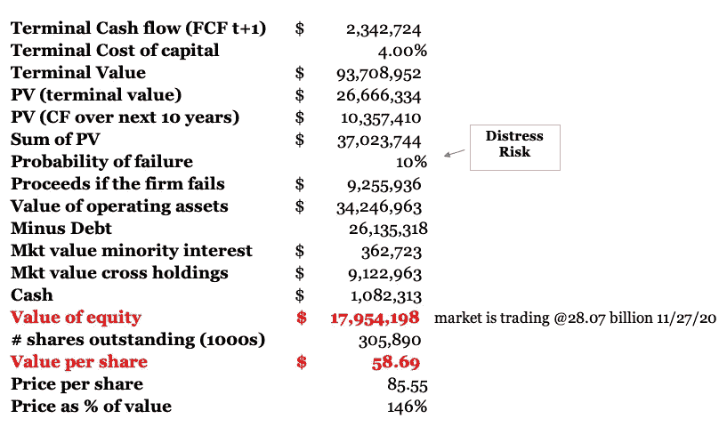

> ***预期情况下的情景估值****——SPG 的每股价值从 25.13 美元到 17.79 美元不等，从最乐观(0%)到最不乐观(75%)的违约概率相差 29.21%。*

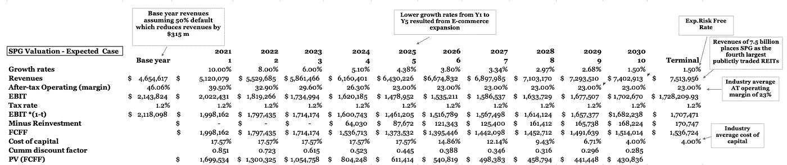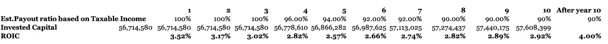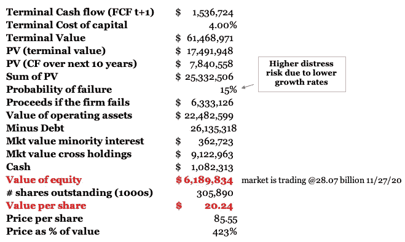

# S o，什么？

根据 CARES Act 第 4013 条，REITs 等金融机构的特权会计待遇将于 2020 年 12 月 31 日到期，但也有可能延长，因为臭名昭著的经济学家米尔顿·弗里德曼(Milton Friedman)曾说过“没有什么比临时政府计划更永久”。虽然 SPG 的股票看起来被严重高估，即使在最好的假设下，动量似乎是目前推动 SPG 股价上涨的主要驱动力。愿意押注于商店购物将强劲反弹的投资者也应该关注电子商务的发展以及大量涉足零售领域的公司的偿付能力，因为它们的基本面可能正在承受极大的压力。我给你的建议是，调整你的赌注，系好安全带，因为这将是一段颠簸的旅程。

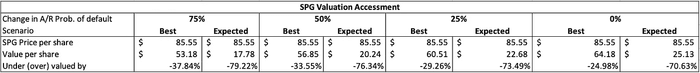

*原载于 2020 年 12 月 8 日 https://www.datadriveninvestor.com**的* [*。*](https://www.datadriveninvestor.com/2020/12/08/are-reits-overrated/)

## 访问专家视图— [订阅 DDI 英特尔](https://datadriveninvestor.com/ddi-intel)