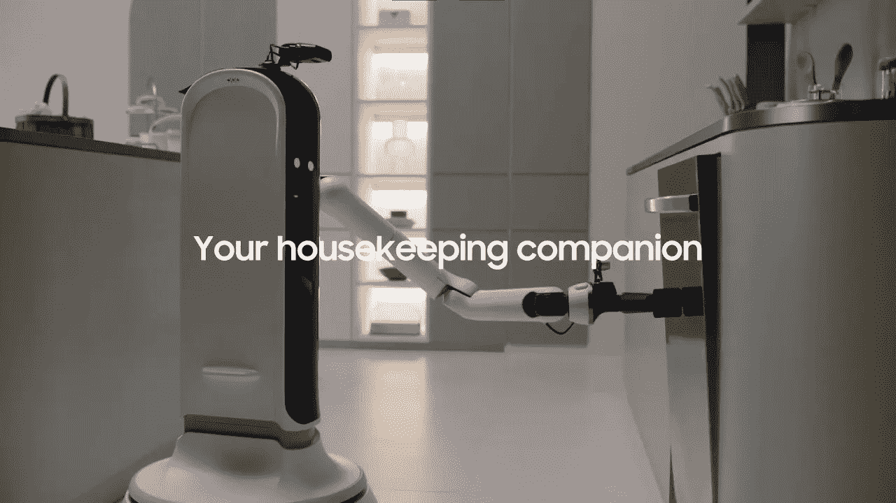
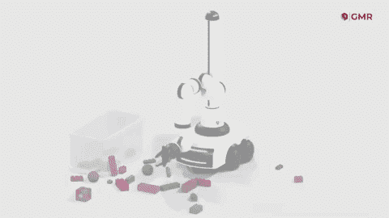
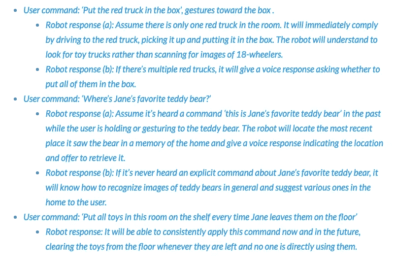
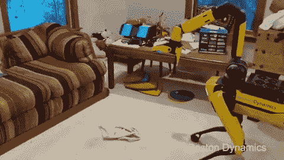

# 机器人管家真的好用吗？

> 原文：<https://medium.datadriveninvestor.com/are-robo-butlers-really-handy-8e20c936154e?source=collection_archive---------39----------------------->

由于我们所有人都花更多的时间呆在家里，机器人女佣是一个非常及时的概念。上个月，[三星研究院](https://research.samsung.com/)总裁 Sebastian Seung 在 [CES 2021](https://digital.ces.tech/home) 、*Handy*——自主管家上亮相。Seung 将他的创新描述为“你在厨房、客厅和其他任何你可能需要帮手的地方的延伸”这部制作精良的视频完整地展示了上菜、倒酒和捡玩具的例子。没有展示的是设置演示所需的大量编程时间和幕后花絮。

在拉开家庭深层技术的帷幕时，我放大了通用手动机器人公司的创始人彼得·伯顿。伯顿博士是德克萨斯大学的数学教授，目前正处于建立自己的机器人家政平台的早期阶段。他与我分享了他对三星显示器的看法，“我对三星 CES 视频中家政机器人背后的人工智能的质量表示极度怀疑。他们展示了它执行各种各样的任务，从倒酒到装洗碗机到洗衣服。开发一个足够强大的人工智能，进入一个未知的消费者家中，并从他们那里了解他们希望如何挑选玩具，这已经是一个难题。”教授充分意识到机械清洁房间的挑战。作为一名企业家和机器人专家，他进一步评论道，“我认为，三星视频中的机器人很可能正在使用特定编码的计算机视觉和操纵指令来执行任务，如果没有进一步的人类干预，它将无法在一个看不见的家里学习完成这些任务。”

与旨在打造瑞士军刀类型的机器人功能的三星不同，伯顿非常专注于打造一种“捡起玩具的机械解决方案”，被亲切地称为 TouchBot。他向我概述了他的方法与三星和市场上其他公司的不同之处:“我们相信，我们的临时专利申请为一个具有感知、移动和操纵能力的小型机器人提供了最有效的方法，以从消费者家庭环境中学习，从而满足他们的需求，而替代方法有很大的风险，会淹没大规模问题空间中任何可行的训练数据量。”这位教授进一步描述了他的方法，“神经网络架构的本质是建立一种数学形式，它利用了人类目的所强加的底层数据中的结构。在我们的案例中，这意味着在卷积和递归神经网络设计方面进行创新，以融入家庭环境的 3D 几何形状以及用户命令和任务的及时分配。”

伯顿博士利用认知深度学习网络，旨在让客户体验像使用 Alexa 设备一样无缝。“我们对用户体验的方法是，我们从来不希望他们像他们必须解决的一项技术一样与机器人互动——控制它的过程将由简单的语音命令和简单的手势组成，”TouchBot 的创造者自豪地说。TouchBot 命令结构的新颖对话性质是其深度学习系统的关键。创始人向我介绍了当前的例子:

伯顿博士计划扩大任务库，最终包括:“将衣服分类并放入洗衣房；在门口取小包裹；取回药瓶和零食；还有和孩子或者狗狗玩简单的折腾游戏。”他的使命是以合理的价格解决真正的人类问题。“我们根据完成任务所需硬件的物理复杂性来考虑机器人的‘好’与‘坏’用途。对我们来说，家庭机器人的一个良好用途是涉及更简单和更便宜的硬件，因为作为科学家，我们相信首先解决更简单的问题，由于缺乏高质量的人工智能，消费者家庭中有许多简单和廉价硬件的应用尚未解决，”这位数学家感叹道。这位科学家指出 Roomba 是“好”机器人用例的一个模型。“Roomba 解决了一个明显的物理问题:吸尘。其他移动家庭机器人，如 [Jibo](https://robotrabbi.com/2018/06/25/bubble/) 和 [Anki Vector](https://robotrabbi.com/2019/05/13/anki/) 基本上都是轮子上的智能扬声器，与静态智能扬声器相比，唯一增加的客户利益似乎是新鲜感。我们相信我们的机器人可以沿着 Roomba 的道路前进，而不是无数次的失败，因为它解决了一个明显的物理问题，没有机械手是不可能的，”伯顿建议道。

技术挑战并不是家务自动化的唯一障碍，成本仍然是大多数美国家庭的最大障碍。虽然 Touchbot 还处于原型开发的早期阶段，但伯顿希望明年开始以低于 1000 美元的价格销售他的设备。根据 Care.com[的说法](https://www.care.com/c/stories/10231/the-cost-of-housekeeping-services-the-housekeeping-guide/)那相当于 61 个小时的家政服务收拾几件玩具。2019 年，据报道，只有 10%的美国家庭使用专业的清洁服务。在疫情之前，美国家庭清洁中心估计，随着双职工家庭数量的增加，家政服务将在未来十年内创造 200 亿美元的收入。然而，随着越来越多的人在家工作和失业率上升，新冠肺炎对该行业产生了重大影响，使得这些服务目前成为一种无法获得的奢侈品。

我就他认为冠状病毒将对他的发明产生的影响向这位初创公司高管施压。他声称 Covid 揭示了家政的价值。“根据标准的市场分析，国内劳动力仍然被严重低估，因为它主要存在于正规经济之外。然而，传统家电的教训表明，一旦家庭劳动力问题的机械解决方案上市，它很快就会被视为美国中产阶级生活标准的一部分，”伯顿宣布。他继续乐观地表示，“虽然我希望疫情在我们的产品上市时已经结束，但它再次强调了大规模采用的‘蝴蝶效应’方面，因此拥有正确的时机绝对至关重要。我认为，在一个如此缺乏现有解决方案的领域率先上市将对我们产生这种影响。”