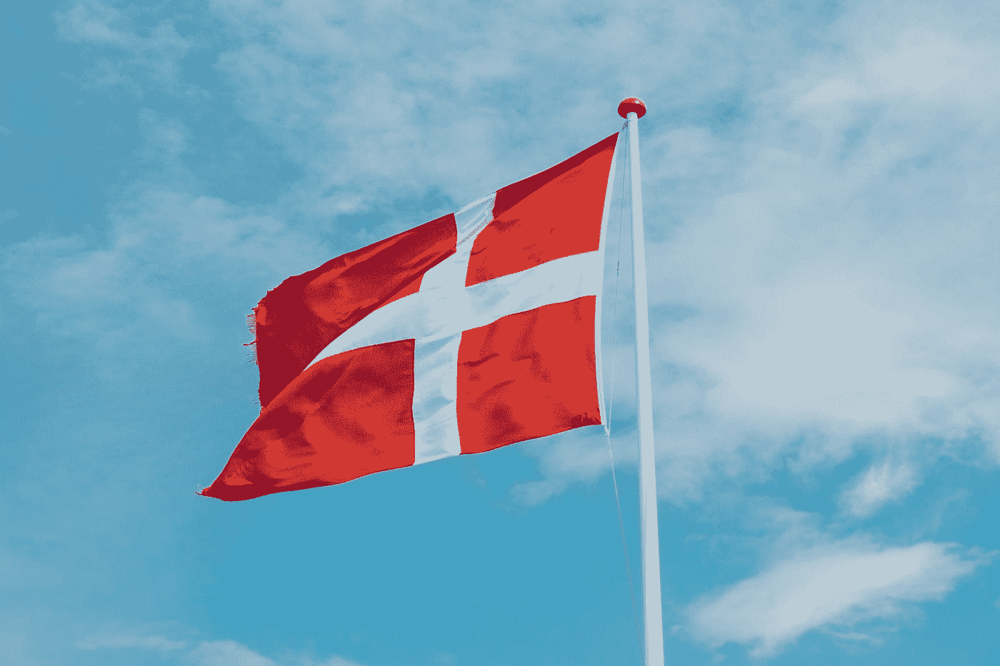

# 斯堪的纳维亚经济是社会主义的吗？不，他们是自由市场经济和社会民主。

> 原文：<https://medium.datadriveninvestor.com/are-scandinavian-economies-socialist-in-nature-no-they-are-free-market-economies-3f587f6e3a5c?source=collection_archive---------5----------------------->

Photo by [Markus Winkler](https://unsplash.com/@markuswinkler?utm_source=medium&utm_medium=referral) on [Unsplash](https://unsplash.com?utm_source=medium&utm_medium=referral)

我开始在网上学习经济学课程已经 5 年了。我参加课程是因为我想知道一些简单问题的答案。其中一个问题是，“为什么人们总是称赞斯堪的纳维亚经济模式？”。嗯，我确实对斯堪的纳维亚模式赞不绝口，但我后来理解的是，人们出于错误的原因而称赞这些国家。

但是，为什么错误的赞扬和误解如此重要，以至于我要写一篇关于它的文章？一切都从一个学期开始；社会主义。在我的辩论和文章中，我个人大多时候都避免使用社会主义或资本主义这个术语；我一直更喜欢“市场经济”和“计划经济”这两个词。甚至大多数经济学家都避免使用资本主义和社会主义这两个术语。

 [## 如果资本主义失败了，那么还有什么选择呢？数据驱动的投资者

### 在当前政治领域的修辞之旅中，我们都可以面对面地接触到流行词汇，如…

www.datadriveninvestor.com](https://www.datadriveninvestor.com/2020/03/16/if-capitalism-is-a-failure-then-what-is-the-alternative/) 

总之。许多人不理解社会主义、资本主义或共产主义的真正含义。因此，让我先从经济体系的基础开始(请耐心听我说)，然后再讨论所谓的“斯堪的纳维亚社会主义”。

经济学家倾向于将经济系统视为一个光谱。一方面，你有市场经济，另一方面，你有计划经济。当分配诸如资本主义、社会主义、共产主义等标签时，存在巨大的误解。我会一个一个地处理它。

那么，什么是市场经济和计划经济呢？

每个国家不仅仅由一个政党管理，而是由过多的机构管理。这些机构包括立法机构、司法系统、行政服务机构、军队、邮政服务等。不管这个国家是自由市场经济还是计划经济，政府管理这些机构是为了确保经济平稳运行。

但是，经济是如何运行的，它是如何工作的？

现代经济运行的基础是财富的交换和分配。个人或企业生产商品，企业支付员工工资，员工购买其他个人生产的商品。如果我们走经济光谱的极端，100%的资本主义经济完全由私人企业经营，而共产主义经济或 100%的社会主义经济则完全由中央计划组织，也称为政府经营。换句话说，在 100%的社会主义经济中，每一个生产商品和服务的企业都归政府所有，因此没有私有财产；而在 100%的资本主义经济中，每一家公司，包括军队、邮政服务、运输等。由私营企业拥有，政府在管理经济中的作用很小或没有作用。

由于这些术语的历史不准确性，经济学家和政策制定者总是使用市场经济和 T2 计划经济这两个术语。百分之百的市场经济是百分之百的资本主义经济，而百分之百的计划经济是百分之百的社会主义经济。但是工业革命以来，除了朝鲜，没有一个国家是 100%的计划经济；我们还没有看到 100%的市场经济。甚至被认为是共产主义国家或 100%计划经济的苏联和古巴也不是。这些国家是我们最接近的共产主义国家，如果你忽略朝鲜，这两个国家将有最高的中央计划指数得分。

这同样适用于市场经济。

那么，让我们看看这些术语的正确含义；资本主义、社会主义和共产主义。

在资本主义，私营企业是经济的核心。私营企业拥有资本货物(原材料、资源、土地)，并在技术和人力资本的帮助下生产货物。这些公司与其他公司竞争决定商品价格。如果人们喜欢一家公司商品的价格和质量，他们就会购买，如果不喜欢，他们就会转向其他公司。这强调企业以正确的方式生产商品，并根据需求定价，以便人们能够购买。经济学家称之为“看不见的手”。这种经济被称为市场经济。然而，与资本主义相关的还有垄断和裙带资本主义等问题。英国东印度公司是裙带资本主义和垄断的极端例子。

这并不意味着政府不能对私营公司和企业进行监管或征税。在资本主义制度下，政府制定环境法规，并对企业征税。政府利用税收为基础设施提供资金，并运行社会福利项目，以帮助每个人创造公平的竞争环境。

社会主义和共产主义紧密交织在一起。卡尔·马克思甚至写道，社会主义是共产主义的前身。社会主义和资本主义有一个非常小的区别，但是完全改变了我们的经济机器和生活方式。在资本主义，政府可以监管公司，但不能控制生产手段。更具体地说，如果政府不能控制生产资料，这意味着私营企业可以存在，政府不能决定你生产多少产品或你应该为这些产品定价多少。在社会主义经济中，你可以拥有一家公司或私有财产，但政府决定你能生产多少商品，这些商品应该定价多少，以及这些公司应该付给员工多少工资。共产主义是指在社会主义经济中，不存在私有财产，所有企业都归政府所有。

这就是为什么社会主义和共产主义被称为计划经济体制，因为政府集中计划经济如何运行，以及如何生产商品和服务。资本主义或市场经济不是这样的。在市场经济中，需求和供给驱动生产，而不是政府。

现在，回到斯堪的纳维亚国家。

人们认为斯堪的纳维亚国家是社会主义经济体，他们的成功直接源于其中央计划政策和社会主义公共政策。

因此，全世界的左翼政治家都认为社会主义经济政策是前进的方向，但事实并非如此。

让我直接引用丹麦首相的话:

> “我知道有些人将北欧模式与某种社会主义联系在一起。因此，我想澄清一件事。丹麦远非社会主义计划经济。丹麦是市场经济”

斯堪的纳维亚地区的国家比德国、法国、印度、意大利、英国等国家更加自由市场。事实上，瑞典和丹麦比美国和加拿大为企业提供了更多的自由。是的，在瑞典和丹麦创业和发展比在美国或加拿大更容易。在挪威或丹麦或任何斯堪的纳维亚国家，政府不能控制生产手段，换句话说，他们不能命令公司以某种方式为商品或服务定价，或限制私营企业生产的商品数量。比美国和加拿大提供更多商业自由的经济体如何被视为社会主义经济体？

**这里另一个引人注目的事情是，没有一个斯堪的纳维亚国家有政府强制的最低工资政策。人们认为这些国家的财富不平等程度很低，因为政府规定了员工的最低工资。这不是任何一个斯堪的纳维亚国家的情况。斯堪的纳维亚地区较高的最低工资背后的原因是政府对当地雇员工会的宽容，而不是强制性的最低工资。**

对斯堪的纳维亚国家的另一个误解是，他们的人均 GDP 非常高，这反过来给人一种印象，即社会主义有助于复制这种结果。嗯，除了挪威，其他斯堪的纳维亚国家的人均 GDP 都不高。然而，与盎格鲁-撒克逊国家和中欧国家相比，这些国家的生活质量好，失业率低，毕业率高，财富不平等少，婴儿死亡率低，最低工资高。只有挪威的人均国内生产总值较高，这是因为它有大量的炼油厂和石油出口。除此之外，挪威与其他斯堪的纳维亚国家并驾齐驱。

所以，这是一个重要的事实。这些国家不是社会主义国家，但比包括德国和法国在内的大多数西方经济体更加资本主义化。因此，他们的成功故事应该归功于资本主义，而不是社会主义，因为没有证据表明这些国家的政府控制了私营实体的生产方式，他们不控制员工的最低工资，他们对外国投资的限制很少，并允许企业比美国或加拿大有更多的自由。

但是，为什么斯堪的纳维亚模式比大多数西方经济体更好，为什么他们有高生活质量、高毕业率和更好的医疗保健系统。他们成功的原因很少，而是多种因素的结合。让我一个一个来。

自 19 世纪中期以来，斯堪的纳维亚国家一直保持着 2%至 3%的增长率。这很重要，因为持续的低增长率可能不会在短期内产生巨大影响，但当我们谈论一个半世纪的规模时，这是巨大的。斯堪的纳维亚国家长期以来一直避免战争，并很快从盎格鲁-撒克逊国家继承了工业革命，这导致他们在近 150 年内几乎没有两年出现渐进式负增长。这使得它们以恒定的速度逐渐增长。

第二个原因可能是强大的自由市场资本主义经济体系和强大的雇员工会的存在，这些工会拥有健全的政府机构，如司法系统和由政府资助的公共基础设施。没有政府的适当机构，资本主义经济就无法繁荣。我所说的制度是指司法系统、公共基础设施和强有力的贸易谈判政府。之所以需要强有力的制度，是因为人类可能并不总是做出明智的决定，他们之间可能会发生冲突，因此我们需要强有力的制度来保护个人权利和个人私有财产。与此同时，强大的工会也受到政府的保护，这导致就雇员最低工资进行更好的谈判。

第三个原因是政府资助的强大的社会安全网。斯堪的纳维亚国家有一个强大的社会保障网，利用全民社会福利计划，政府提供免费的全民医疗保健、免学费的公共教育、失业保险、免费的再培训计划、住房奖励、更便宜的儿童保育，在某些情况下还提供全民基本收入等。斯堪的纳维亚国家的社会安全网相当庞大，一篇文章中的一个段落不足以覆盖大多数国家。这些项目的成功来自于这样一个事实，即大多数项目都是全球性的，也就是说，你只需要成为那个国家的公民就可以享受这些福利。其他国家有一个“以收入为基础”的社会保障网络，你必须在一定的收入范围内才能享受政府资助的社会福利。“基于手段”的计划可能看起来很划算，但是，如果你加上行政成本和不正当的激励，它在大多数时候比全民计划更糟糕。当一个人在社会保障网络下比有更高的收入和脱离社会保障更好时，就会产生不正当的激励。

第四个原因是更高的税收。现在，与流行的观点相反，斯堪的纳维亚国家的主要收入来源不是来自富人，而是来自对商品征收的高额增值税。斯堪的那维亚国家对所有商品都实行单一税制，税率很高，其中丹麦的增值税为 25%。人们的误解是，通过对富人征收高税率，你可以为经济的福利项目提供资金，但事实并非如此。许多斯堪的纳维亚国家在 20 世纪 80 年代和 90 年代尝试过财富税，但非常失败，以至于他们求助于高增值税计划。因此，不是富人通过税收为福利项目提供资金，而是整个国家对商品的需求推动了福利项目。

他们的财富税版本不起作用的原因是大多数富人不拥有现金。他们的收入比我们预期的要低，但是他们有大量的资产和股票是不需要纳税的。因此，通过实施财富税，你正在迫使富人出售他们的股票和投资价值，这抑制了全国的投资。投资对一个国家的就业其实很重要。此外，他们的财富税版本极大地稀释了富人的收入，以至于他们最终会在一两年内陷入税收困境，这导致政府收入逐年稳步下降。

然而，伯尼·桑德斯、伊丽莎白·沃伦和杨安泽等国提出了其他财富税计划，其政策在某种程度上消除了斯堪的纳维亚式财富税体系中存在的谬误。

现在，我们已经确定了斯堪的纳维亚国家是资本主义国家，拥有强大的社会保障网络。这些类型的经济在资本主义中属于一个特定的类别；这些经济体被称为社会民主国家。这就是伯尼·桑德斯、伊丽莎白·沃伦和杨安泽等人提倡的那种政府。

然而，伯尼自称是民主社会主义者。民主社会主义是中国在 50 年代和 60 年代实行的那种经济。这一制度背后的失败是众所周知的。不要误解我，伯尼·桑德斯的政策一点也不接近民主社会主义，而是非常接近斯堪的纳维亚风格，即社会民主资本主义。

我想在这里引用诺贝尔奖获得者保罗·克鲁格曼的话:“问题是，伯尼·桑德斯不是任何正常意义上的社会主义者。他不想将我们的主要产业国有化，用中央计划取代市场；他表达了钦佩，不是对委内瑞拉，而是对 T2。他基本上就是欧洲人所说的社会民主主义者——事实上，像丹麦这样的社会民主国家是非常适合居住的地方。”社会民主是最接近中间派经济学家体系的，也是资本主义中最左的。

但是，我为什么害怕社会主义？社会主义没有一个合适的记录。没有一个向中间偏左的国家，也就是说，没有一个拥护社会主义的国家，有一个政府能提供持续十多年的增长。从第三帝国到东德，到古巴，到苏联，到中国，再到最近的委内瑞拉，每一个接受计划经济的国家都没能为其公民提供一个避风港和持续的增长。这似乎是一种因果关系，当我们向政府集中更多权力并大规模国有化财产时，我们看到的是经济增长率直线下降、腐败加剧和威权主义。

> **但是不要误解我。我支持政府规定的最低工资政策、银行体系监管、单一支付者医疗体系、公共教育补贴和更高的所得税。但在这种情况下，这种模式更接近韩国和新西兰的经济模式。斯堪的纳维亚模式可以在至少 50 多年来保持长期正增长率的国家发挥作用。对于致力于快速增长的国家来说，日本和韩国的模式更适合这一目的，一旦实现了静态增长，政府就可以转向斯堪的纳维亚或加拿大的模式。**

自由市场经济行得通。斯堪的纳维亚模式、韩国模式、日本模式和加拿大模式是很少的几个例子，说明了一个资本主义社会如何能够避免一些资本主义国家面临的问题。当然，也有与自由市场经济相关的问题，这些问题都有充分的证据。但这并不意味着社会主义是更好的选择。甚至在理论上，社会主义也不能适应我们快节奏的经济和永久的技术革命。社会民主和自由市场可以。