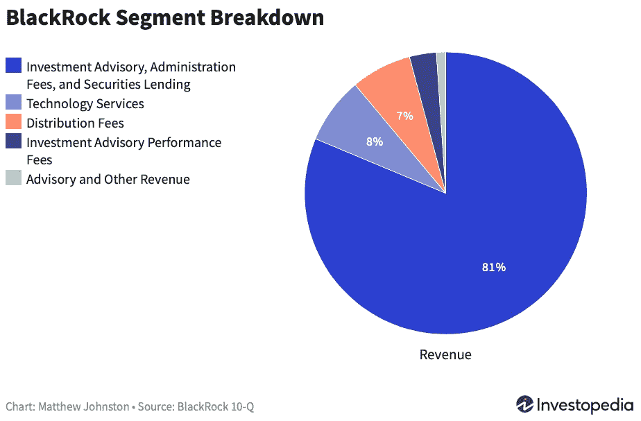

# 市场是由少数几个主要参与者组成的吗？

> 原文：<https://medium.datadriveninvestor.com/are-the-markets-in-a-handful-of-key-players-812fe767555?source=collection_archive---------5----------------------->

## 贝莱德管理着近 8 万亿美元的资产，并且参与了大部分重大决策的制定。

Photo by [Kristina Flour](https://unsplash.com/@tinaflour?utm_source=unsplash&utm_medium=referral&utm_content=creditCopyText) on [Unsplash](https://unsplash.com/s/photos/secret?utm_source=unsplash&utm_medium=referral&utm_content=creditCopyText)

有时它被称为你从未听说过的最有影响力的公司。至少，它确实是世界上最大的资产管理公司。根据[维基百科](https://en.wikipedia.org/wiki/BlackRock)，黑石公司成立于 1988 年，资金来自黑石集团。到 2020 年 1 月，管理的资产超过 7 万亿美元，而截至今天，这一数字可能在 7.8 万亿美元左右(据[路透社](https://www.reuters.com/article/us-blackrock-results-idUSKBN26Y1D1))。这使得贝莱德成为世界上最大的投资管理公司。它管理着 800 多只交易所交易基金(ETF)。

这 8 万亿美元可能比德国和英国的 GDP 总和还要多。在疫情的这一年里，这些数字除了增长什么也没做。正如他们去年 10 月公布的那样，就在上个季度，他们“年化有机资产增长 7%，收入同比增长 18%，运营收入同比增长 17%”，这只是其中几个非常积极的结果。

首席执行官、市场上最有权力的人之一拉里·芬克感到自豪和高兴:

> “我们的结果是对我们全球一体化资产管理和技术业务模式的验证，这使我们能够持续投资并领先于客户需求发展。我们的每个战略投资领域，包括 iShares ETFs、替代产品和技术，都在继续增长，而强劲的投资表现在过去一年中推动了积极的流动。随着客户寻求将 ESG 整合到他们的投资组合中，贝莱德在行业领先的可持续发展研究、投资策略和技术方面处于独特的地位。我们为客户对我们的信任而感到谦卑，为员工的奉献精神而感激，并致力于为所有利益相关方提供最高标准的服务。”

到目前为止，一切顺利。

不仅如此，他们还声称，除了金融市场中最强大的力量之一，他们还是向一个新的、更可持续的世界转变的关键驱动力。在过去的几年里，它因关注可持续和对环境负责的投资而引起了关注。

这位首席执行官再次在一封名为[金融的根本重塑](https://www.blackrock.com/corporate/investor-relations/larry-fink-ceo-letter)的信中表示，气候风险的证据正迫使投资者重新评估现代金融的核心假设。由于资本市场将未来风险向前推，我们将看到资本配置的变化比气候本身的变化更快。在不久的将来——而且比大多数人预期的要早——将会有一次重大的资本再分配。

虽然政府必须在这一转变中起带头作用，但企业和投资者也可以发挥重要作用。

因此，我[在给他们的客户](https://www.blackrock.com/corporate/investor-relations/blackrock-client-letter)的另一封信中说，“我们今天做出的承诺反映了我们的信念，即所有投资者——特别是数百万为退休等长期目标储蓄的客户——必须认真考虑他们投资的可持续性。”

听起来真的很神奇。世界上最大的资产管理公司完全致力于我们今天面临的最关键的经济、社会甚至生存挑战之一。

他们许下的承诺和说的好话数不胜数:改善股东的信息披露，“负责任和透明的资本主义”等等。

什么可能会出错？

贝莱德掌握的权力集中不仅与它是市场上的大玩家有关。

术语是“利益冲突”。

他们还通过投资组合管理软件**阿拉丁**(资产、负债、债务和衍生品投资网络)为客户分析风险和资产。 [BlackRock 解释说【Aladdin 是一个端到端的操作系统，让投资专业人士可以看到他们的整个投资组合，了解风险敞口，并精确地采取行动。通过阿拉丁，贝莱德致力于帮助客户应对波动和市场不确定性。](https://www.blackrock.com/aladdin)

当然，为了完成工作，阿拉丁会收到大量关于他们所投资公司的关键信息和知识。

此外，贝莱德还为全球金融机构、监管机构和政府提供咨询服务。同样，这种服务意味着访问大量关于市场、公司、政府和国家的敏感信息。

虽然这些服务只占总收入的一小部分(甚至不到 10%)，但这种情况提出了许多关于独立性的问题，以及将过多情报放在单个私人代理身上的风险。从这个意义上说，贝莱德表示，他们在不同的分支机构和业务之间有“中国墙”。

[https://www.investopedia.com/articles/markets/012616/how-blackrock-makes-money.asp](https://www.investopedia.com/articles/markets/012616/how-blackrock-makes-money.asp)

最重要的是，该公司是欧洲的主要投资者，在欧洲，他们拥有不同行业(能源、食品、交通、通信、金融……)的许多战略公司的股份(当然还有投票权)。

据《调查欧洲》报道，“仅在法国，该基金就通过一系列子公司持有 Eiffage、Danone、Vinci、Lagardère，以及雷诺、标致、法国兴业银行、Axa、Vivendi、Total、赛诺菲、Legrand、施耐德电气、威立雅或阳狮 5-10%的股份。贝莱德是 525 家法国公司中至少 172 家的股东，通常是主要股东

在证券交易所上市的公司。以及周围的 17000 家公司

世界，在每次大会上，它从来没有失败的投票。“在德国，竞争管理机构表示了关切。它表示:“同一经济领域的企业之间通过横向持股扭曲竞争的潜在风险很大。"

权力权力权力。《截击报》五年前写道，“芬克已经明确表示他的[渴望有朝一日成为财政部长](http://www.foxbusiness.com/business-leaders/2014/01/21/blackrock-fink-hoping-hillary-is-ticket-to-treasury-post/)。奥巴马政府将他列入了取代蒂莫西·盖纳的[候选名单](http://www.washingtonpost.com/business/economy/what-a-second-term-obama-economic-team-might-look-like/2012/10/02/81c8c888-0c8d-11e2-bd1a-b868e65d57eb_story.html)。当这没有实现时，他将前财政部的几名成员拉进了公司的高层职位，这可能会提高[在未来的克林顿政府中实现梦想](http://fortune.com/2016/02/04/blackrock-larry-fink-treasury-secretary/)的前景。

在欧盟，他们还将在就如何将可持续性纳入银行监管向欧盟提供建议方面发挥关键作用。正如[金融时报](https://www.ft.com/content/da821c64-b2f8-4119-afa1-fdafa9a57918)报道的那样，“新的欧盟合同将支付贝莱德€28 万英镑，并将帮助提升该公司在可持续投资方面经常受到批评的信誉。”

让贝莱德担任欧洲可持续发展领域的顾问招致了很多批评。公司发布的所有关于原则和做法的论调都只是为了多赚钱的公关吗？如果像欧洲企业观察组织所说的那样:

*   德意志银行的第二大股东，该银行拥有 690 亿美元的化石燃料资产。
*   法国巴黎银行是 T2 第二大股东，持有 740 亿美元的化石燃料。
*   T4 的第二大股东持有 370 亿美元的化石燃料。

92 个民间组织致信敦促欧盟委员会取消合同，因为:

> 贝莱德在这一领域拥有众多既得利益，因此无法提供任何可信的中立专家建议。我们认为，投资管理公司将通过此次招标获得的信息，以及它将提供的“建议”，将面临欧盟关键且急需的可持续银行措施过早脱轨的极高风险。

整个形势类似于我们在金融危机和大衰退期间犯下的一些主要错误。2015 年，德国之声(DW)称它们为“[影子银行](https://www.dw.com/en/blackrock-the-secret-world-power/a-18653761)”这可能并不新鲜，但今天，就像历史上的许多其他时期一样，许多关于市场和世界的决定可能是在曼哈顿中城的一间办公室里做出的。