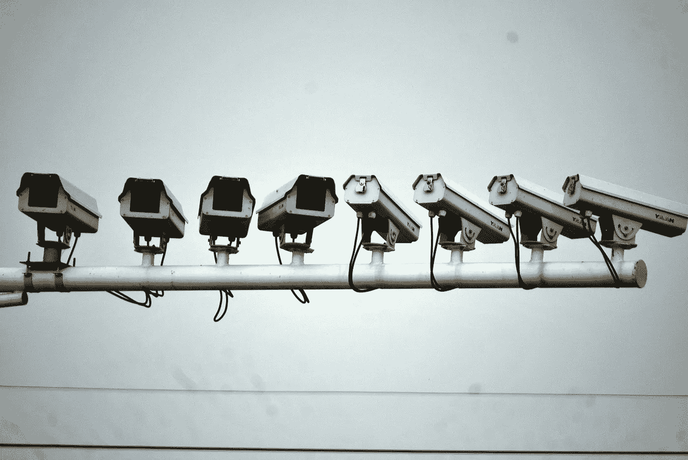
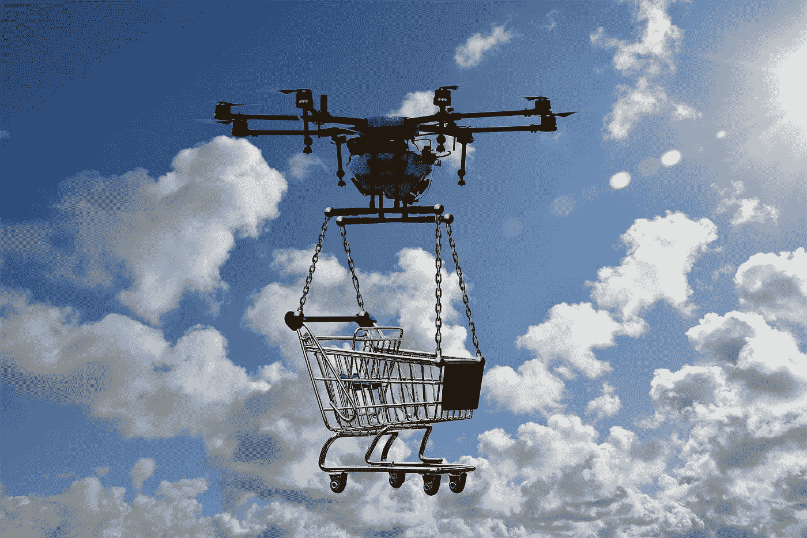
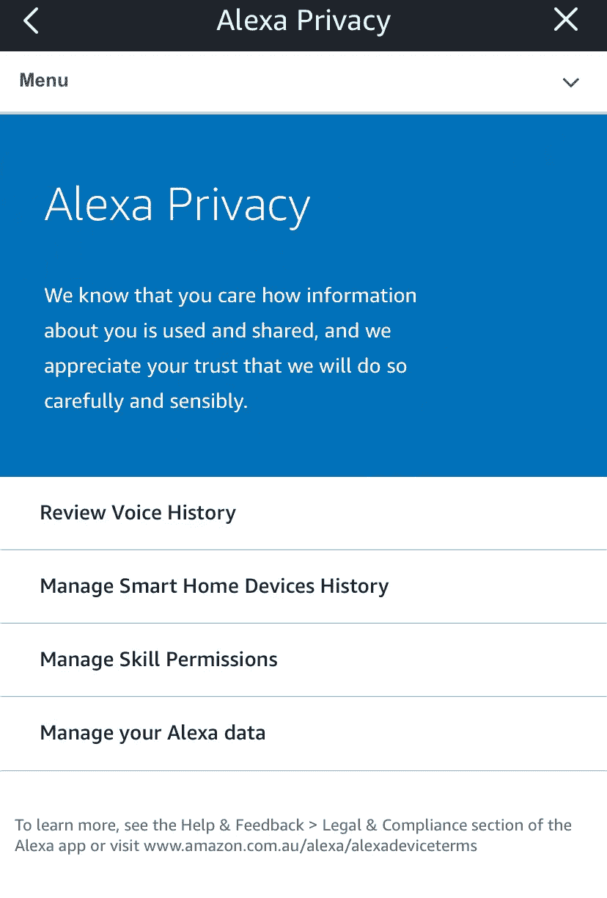

# 我们是不是对人工智能有偏见？

> 原文：<https://medium.datadriveninvestor.com/are-we-biased-against-artificial-intelligence-7e0e265275c?source=collection_archive---------7----------------------->

## 如果一个人记得我们的偏好，我们会觉得自己很重要。如果一个人工智能也这样做，我们会感到毛骨悚然。

Image by [Stefan Keller](https://pixabay.com/users/kellepics-4893063/?utm_source=link-attribution&utm_medium=referral&utm_campaign=image&utm_content=3856750) from [Pixabay](https://pixabay.com/?utm_source=link-attribution&utm_medium=referral&utm_campaign=image&utm_content=3856750)

我想象着走进一家咖啡店、酒吧或餐馆。你依稀记得你最后一次来，你肯定不记得你最后一次点了什么。

其中一名工作人员走向你，并以你的名字欢迎你，问你是否要和你上次点的一样的饮料，并把你喜欢的靠窗座位让给你。

你觉得自己很重要。你对这个地方的客户服务赞不绝口，可能很快就会去拜访。

如果，工作人员是机器人呢？你的信息被存储在某个隐蔽的地方，你不会感到毛骨悚然吗？你不会觉得侵犯了你的隐私吗？

Image by [PublicDomainPictures](https://pixabay.com/users/publicdomainpictures-14/?utm_source=link-attribution&utm_medium=referral&utm_campaign=image&utm_content=19223) from [Pixabay](https://pixabay.com/?utm_source=link-attribution&utm_medium=referral&utm_campaign=image&utm_content=19223)

## 为什么我们不信任智能机器？

我们还没有机器人在我们身边漫游，但我们已经有人工智能通过智能手机和智能设备渗透到我们的生活中，比我们所想的要多

一方面，每一个为我们提供 Siri、Alexa 或 Cortana 的科技巨头都在保证最高水平的隐私，而另一方面，我们正被电影或电视节目轰炸，这些电影或电视节目让我们担心机器人将接管世界的末日即将到来。这些节目不胜枚举，但可以追溯到几十年前。我们不能忘记天网(终结者，1984)，机器(黑客帝国，1999)，或哈尔 9000 (2001:太空漫游，1968)。

Image by [Stefan Keller](https://pixabay.com/users/kellepics-4893063/?utm_source=link-attribution&utm_medium=referral&utm_campaign=image&utm_content=5174303) from [Pixabay](https://pixabay.com/?utm_source=link-attribution&utm_medium=referral&utm_campaign=image&utm_content=5174303)

[Alexa 随机大笑](https://www.engadget.com/2018-03-07-amazon-is-fixing-alexa-creepy-laughter.html?guccounter=1&guce_referrer=aHR0cHM6Ly93d3cuZ29vZ2xlLmNvbS8&guce_referrer_sig=AQAAAAuKnKYd4Lplu48c_XbtvOnkrnoOHVqneSzs2mzEbITOT6hSQoudSKDOTr6Kif7kA91NBrrEwzvDUA5PeCC3TvXt363T2V7cM7JCfOIomtGBmwKUMdIC_pXnNYlKF2OnFfnY00q9Wjy3HzAp8tRwiqQPRWeEIbuMk5wWKuLaI82N)的消息，在全世界传播寒战，脸书不得不[在他们开始互相交谈后关闭 AI 机器人](https://www.independent.co.uk/life-style/facebook-artificial-intelligence-ai-chatbot-new-language-research-openai-google-a7869706.html)。这些都没有增强我们对机器的信任。

在我们与智能手机上的 Siri 或 Alexa 等实际人工智能互动之前，我们大多数人都在电影院遇到过想象中的邪恶人工智能。

当前的一代会更好，但显示人工智能接管世界的内容的冲击继续在每个流媒体服务上传播，讽刺的是，这些服务使用人工智能向你推荐这些内容。

> 如果我们想从技术中获得最大收益，我们必须面对我们的恐惧——如果我们想从人类中获得最大收益，我们必须克服这些恐惧
> 
> —加里·卡斯帕罗夫([观看 TED 演讲](https://www.ted.com/talks/garry_kasparov_don_t_fear_intelligent_machines_work_with_them?referrer=playlist-talks_on_artificial_intelligen)

## 我们应该盲目信任机器吗？

当然不是。但是我们需要小心偏见，这些偏见通常是无意识的。

随着时间的推移，印在我们头脑中的条件偏见会变得无意识。

当我们与周围的人互动时，这种无意识的偏见每天都在上演。歧视往往源于多年来形成的偏见。

## 意识是我们所能争取的

无意识偏见很难处理，因为它们是无意识的(很明显)。我们所能做的就是意识到持续了几十年的条件作用，并将我们的判断应用于眼前的情况。

许多人抱怨他们不懂现代技术，但是他们每天都在使用它。用知识武装自己，对自己的隐私做出明智的决定，不是更好吗？

## 在 19 世纪 80 年代，电是现代技术

1882 年，纽约爱迪生电力照明公司将电灯引入曼哈顿的部分地区。用了将近 50 年的时间，电力才到达西方世界的大多数家庭。

我们不需要了解[同步电机](https://en.wikipedia.org/wiki/Alternator)来安全用电。我们知道如何打开或关闭灯泡或电器，但我们也知道电有多危险。小时候，我们就知道不应该把手指伸进电源插座。我们也不会把水倒在面包机上，或者把吹风机浸入浴缸。

Image by [Bruno /Germany](https://pixabay.com/users/bru-no-1161770/?utm_source=link-attribution&utm_medium=referral&utm_campaign=image&utm_content=3726722) from [Pixabay](https://pixabay.com/?utm_source=link-attribution&utm_medium=referral&utm_campaign=image&utm_content=3726722)

## 艾会留在这里

在日常生活中，我们都会越来越多地遇到人工智能。有时直接(AI 助手)，有时间接(AI 简历筛选)。

以下是一些我们经常接触的人工智能:

1.  人工智能助手
2.  社交媒体推送
3.  互联网搜索
4.  关于网飞等流媒体服务的建议
5.  亚马逊等在线购物网站上的推荐

如果我们想生活在现代世界，享受科技和娱乐的奇迹，我们没有太多的选择，只能接受我们周围的智能机器。

很快我们将拥有自动驾驶汽车，无人机将交付我们的在线订单，不管我们喜欢与否。

Image by [Gerd Altmann](https://pixabay.com/users/geralt-9301/?utm_source=link-attribution&utm_medium=referral&utm_campaign=image&utm_content=2816244) from [Pixabay](https://pixabay.com/?utm_source=link-attribution&utm_medium=referral&utm_campaign=image&utm_content=2816244)

# 我们能做什么？

我们可以停止抱怨技术，开始学习。

如果你能远离网络，那就这样做。如果你不能，并最终使用脸书，Instagram 或 Whatsapp，那么了解这些应用程序的设置，并正确使用它们。

你不需要理解[脸书图形 API](https://developers.facebook.com/docs/graph-api) 来安全使用脸书，但是你需要了解平台提供的隐私设置。

知识比以往任何时候都更容易获得。在谷歌或 Youtube 上快速搜索，你会看到丰富的信息。

例如，亚马逊 Alexa 隐私设置允许您在需要时查看和删除您的语音历史记录:

Image Source: author

# 最后的想法

我们对其他人的许多偏见来自于有限的知识和对我们差异的恐惧。我们知道人工智能不是人类，可能永远也不会是。但是，让我们避免一个偏见陷阱，这将在未来限制我们。

让我们意识到我们的偏见并把它们放在一边——不仅仅是对人类的偏见，还有我们对机器的偏见。