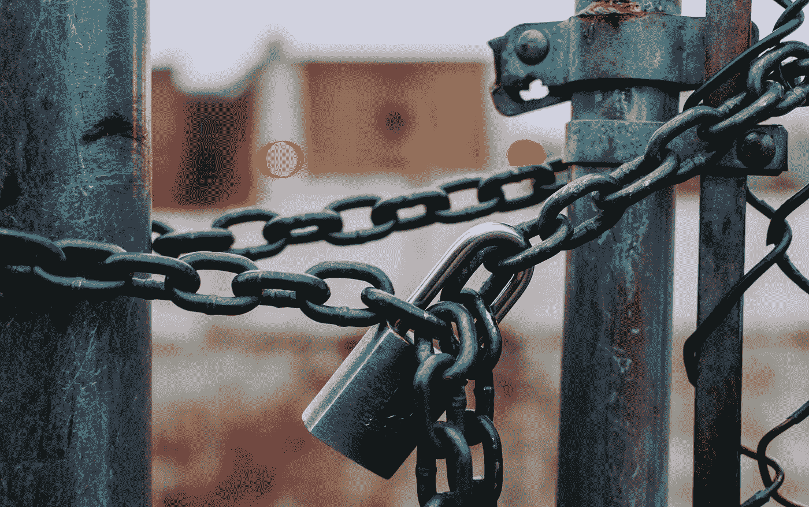
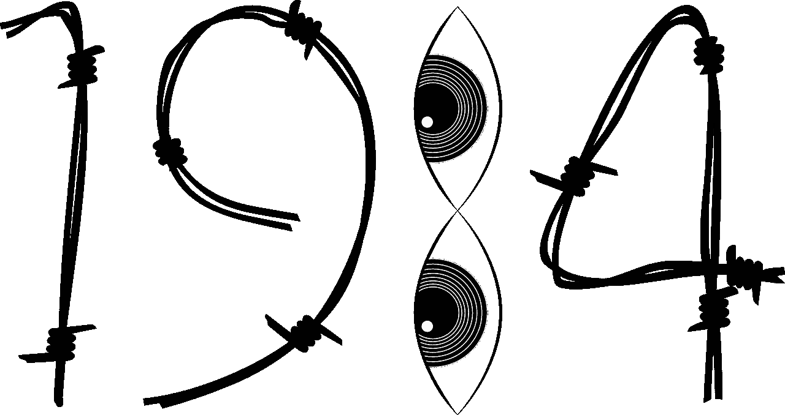
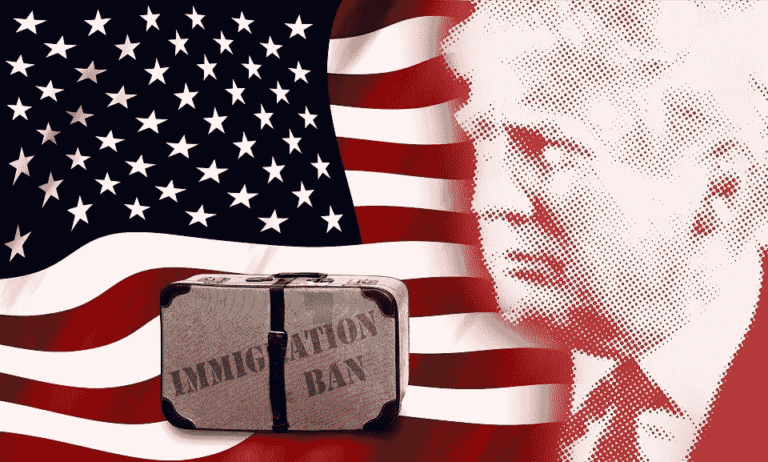

# 我们是在为一个警察国家进行彩排吗？

> 原文：<https://medium.datadriveninvestor.com/are-we-having-a-dress-rehearsal-for-a-police-state-da65d2c84164?source=collection_archive---------8----------------------->

Photo by [Jose Fontano](https://unsplash.com/@josenothose?utm_source=unsplash&utm_medium=referral&utm_content=creditCopyText) on [Unsplash](https://unsplash.com/?utm_source=unsplash&utm_medium=referral&utm_content=creditCopyText)

在他的联合专栏中，丹尼斯·普雷格声称我们正处于一个警察国家的彩排中。他声称，冠状病毒相关的规则限制了我们照常生活的能力，这是非常严厉的。他担心大众媒体“*支持国家的信息和剥夺权利*他感到震惊的是"*全美的警察部门已经同意以只能被描述为令人恐惧的敏捷来执行这些法律和法令*

丹尼斯·普雷格认为，举报违反冠状病毒分离规则的公民是告密者。他将他们比作史塔西的政治线人，史塔西是前东德的秘密警察，以其广泛的间谍网络而闻名。

# 为什么丹尼斯·普雷格的写作很重要，即使他是错的

他的名字可能在像 *Medium* 读者这样的群体中不为人所知。但他是最优秀的右翼政治思想家之一。他的追随者很可能就在那些上街示威反对封锁的人群中。他们是那些带着来福枪进入密歇根州国会大厦说服立法者的人之一。像丹尼斯·普雷格这样的专家影响了大约一半的美国人，以及大约一半的华盛顿代表、州政府和地方政府。

在普雷格先生最近发表的 100 篇文章中，超过三分之一的文章在标题中轻蔑地提到了左派。在他的一个视频中，丹尼斯·普雷格很好地定义了他对所谓左派的态度:“我们认为他们是错的——他们认为我们是邪恶的。”就媒体而言，我读了足够多的左翼人士写的文章，可以得出结论，他们中的大多数人对普雷格先生和其他所谓的右翼人士的看法完全相同。

旁观者会注意到右派提出的观点经不起左派的批评，反之亦然，左派提出的观点经不起右派的审查。他们都只和各自的同伴说话；他们彼此不说话。

对于一个持批评态度的旁观者来说，他们似乎避免直接辩论，因为他们知道他们无法反驳对手的批评。换句话说，通过解雇对手，他们无意中承认，他们都没有解决我们问题的正确方法。

美国左翼和右翼之间的二分法是无益的、妄想的和虚伪的。普雷格先生的上述专栏是一个教科书式的例子。

# 我们有警察国家排练的悠久历史

禁酒令是一场规模宏大的预演。今年 1 月刚刚过了《公约》实施 100 周年。我没有注意到媒体有任何提及，因为没有什么值得庆祝的。但是美国人永远不应该忘记这个惨痛的教训。这是美国傲慢的顶峰。看到酗酒在道德上和经济上摧毁了一个个家庭，美国人在新获得的财富和权力的鼓舞下，决定利用政府的力量来改善社会。

为了实现这一道德崇高的目标，普雷格先生所列举的警察国家的所有要素都已部署完毕。实施了严厉的法律，限制了个人自由，比如饭后喝啤酒。这条法律违背了几千年的饮酒传统。在他们自负的顶点，美国人忘记了他们决定用来反对饮酒的强大的美国在很大程度上是由酗酒者建立的。

媒体顺从地支持禁令所要求的剥夺人权。警察正在执行。由于社会上仍有一部分人想喝酒，警方需要一个秘密线人网络来追踪大量参与制造和销售酒精犯罪活动的公民。

# 为什么我们会有告密者？

如果普雷格先生向警方报告了他可能从窗户看到的正在进行的入室盗窃，我们会称他为告密者吗？如果他向警方告发了他不知何故得知的一起有计划的抢劫案，我们会称他为告密者吗？我不这么认为。但是，我们会认为一个告密者是在禁酒令期间向警察告发他的邻居卖加拿大威士忌的人吗？可能是的。然后，一个更难的问题是:如果普雷格先生告诉美国移民和海关执法局，他的邻居有一名非法移民作为家庭佣工，我们会认为他是告密者吗？我会说是的，但听听普雷格先生对这个问题的看法会很有意思。

Image by [Gordon Johnson](https://pixabay.com/users/GDJ-1086657/) from [Pixabay](https://pixabay.com/vectors/nineteen-eighty-four-1984-1211494/)

直觉上，我们感觉到什么时候报警是一种公民义务，什么时候是告密。当我们举报一种在法律术语中被称为“ [*malum in se*](https://en.wikipedia.org/wiki/Malum_in_se) ”的犯罪时，这是拉丁语中“本身邪恶”的意思，像盗窃、抢劫、强奸或谋杀，这是一种公民义务。当违法行为违反了被认为是“ [*malum prohibitum*](https://en.wikipedia.org/wiki/Malum_prohibitum) ”的法律时，情况就不同了，这意味着“因为被禁止所以是错误的”

我们有许多规则禁止特定的行为，不是因为它本身是邪恶的，而是因为我们同意对我们自由的一些限制会产生值得的好处。路灯就是最好的例子。我们认为红灯停绿灯行会让十字路口更安全，也更容易通过。禁酒令是另一个违反禁止饮酒法的例子，大多数人认为消除酗酒值得剥夺所有美国人在社交场合饮酒的自由。

这两者之间的关键区别在于，有了路灯，在剥夺自由方面完全平等，所有司机的利益完全相同。在禁酒令的情况下，许多美国人，甚至那些酗酒的人，都觉得他们以自己想要的方式追求幸福的宪法权利被剥夺了。甚至那些同意人们应该少喝酒的人也认为这不应该影响他们偶尔喝几杯的自由。更糟糕的是，瘾君子们还是找到了非法购买 buzz 的方法。

由于禁令通常不被遵守，所有卑鄙的角色都有机会告密。个人仇恨或利益冲突经常引发指控。这为有政治影响力的人利用警察骚扰他们不喜欢的人提供了大量的机会。

这意味着一旦社会建立了更多的*禁止恶意行为*规则，告密就会成为一个严重的问题，尤其是当这些规则没有被普遍接受的时候。当警察只执行 T4 法律时，他们是我们的一部分。当他们被用来执行大多数人试图强加给我们所有人的法令时，他们反而是“他们”。通知“他们”就是告密。

# 宪法并没有像预期的那样发挥作用

《独立宣言》最好地表达了开国元勋们的理想主义意图，即政府的目的是确保“某些不可剥夺的权利，其中包括生命权、自由权和追求幸福的权利”这意味着政府的主要目的是保护我们免受被定义为本质上的犯罪。所有其他行为都应该被允许。宪法更实际，赋予政府权力来组成一个更完美的联邦，建立正义，确保国内安宁，提供共同防御，促进普遍福利，并确保我们和我们的后代自由的祝福。

这就留下了一个解释的空间，即政府被授权为了公共利益发布限制我们自由的法律。让我们承认，宪法学者无法就政府应该拥有多大的权力达成一致。总的来说，所谓左是赞成在这方面给政府更多的宽大，所谓右是为了在这方面限制政府。奥巴马医改是最近的一种“恶意禁止”监管，被丹尼斯·普雷格和他的右翼同事挑战为违宪。

但房间里的大象是我们的移民政策，其中包含许多纯粹的警察州法规。普雷格先生是我们移民法的积极支持者，但他不想谈论此事。

Image by [Cristian Ferronato](https://pixabay.com/users/cristianferronato-969247/) from [Pixabay](https://pixabay.com/illustrations/trump-immigration-america-2063922/)

# 我们已经有了警察国家的规则

有趣的是，许多在 1917-1924 年投票禁止移民的政客，形成了我们当前移民政策的核心规则。我们移民法的逻辑类似于禁令，因为不是美国个人，而是联邦政府应该决定谁应该被允许来这里定居。在 20 世纪 20 年代之前，欧洲人来到这里的限制很少。在美国尝试了几个月或几年后，大约三分之一的人回到了自己的国家。

20 世纪初，优生学大行其道。仅仅通过阅读[迪林厄姆报告](https://www.google.com/books/edition/Abstracts_of_reports_of_the_Immigration/yy6OAAAAMAAJ)，人们就可以看到，一个世纪以前，美国人认为来自东欧和南欧的移民来自劣等血统。

第一次世界大战后，美国人担心大约 300 万犹太人会从人口过剩的波兰移民到美国。犹太人在美国不受欢迎，因为他们中的许多人没有被同化，生活在少数民族聚居区。但是那些被同化的人经常因为他们在商业和学术上的成功而被鄙视。就像犹太人经常遇到的情况一样，不管他们是否做了积极的事情，都会被视为对他们不利。

同时，新移民，至少在创业初期，愿意为比美国人更低的工资而工作。上述因素的结合足以形成对限制性移民政策的多数支持，[于 1924 年](https://en.wikipedia.org/wiki/Immigration_Act_of_1924)最终确定。在最初的 25 年里，这项政策的实施很简单。1929 年的大萧条使美国不是一个理想的目的地。

随着二战后经济的增长，美国需要更多的移民。非法移民满足了我们日益增长的经济需求。但是，美国人一直缺乏智慧和勇气来放弃我们移民政策的理念。

类似地，就像在禁酒令的情况下一样，即使是一般支持限制性移民的美国人也不认为雇佣一个符合他们需要的非法移民有什么大问题。为了纠正这种普遍的违法行为，立法者赋予政府更多的警察权力。1986 年，在美国历史上，未经联邦政府许可雇佣外国人首次成为非法行为。当这没有产生令人满意的结果时，政府以 E-Verify 的形式获得了监视权力，这是一个典型的警察国家的工具。

我知道一个餐厅经理解雇了一个偷钱被抓的酒保。作为报复，酒保告诉当局，厨房里的一名帮工是非法移民。经理假装不知道，因为那个移民投入了很多精力去做通常没人想做的平凡工作。经理丢了工作；该移民被拘留。这就是警察国家告密的方式。我们已经拥有了，这在很大程度上要归功于丹尼斯·普雷格等人的精神支持。

有鉴于此，普雷格先生作为我们自由的捍卫者，因新冠肺炎而受到限制，这听起来并不令人信服。

*原载于 2020 年 5 月 18 日 https://www.datadriveninvestor.com**的* [*。*](https://www.datadriveninvestor.com/2020/05/18/are-we-having-a-dress-rehearsal-for-a-police-state/)