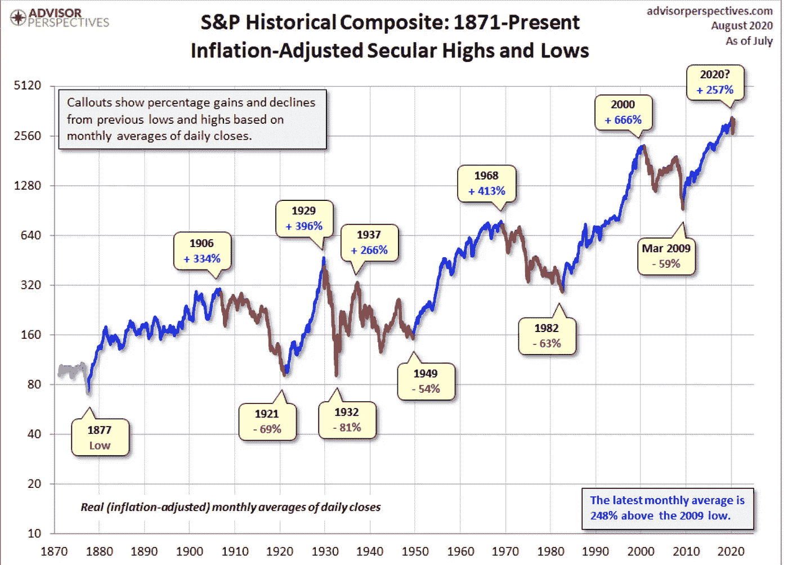
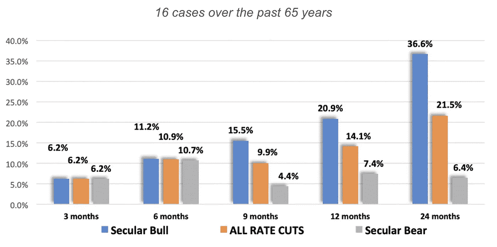

# 我们处于长期牛市吗？

> 原文：<https://medium.datadriveninvestor.com/are-we-in-a-secular-bull-market-74b3254ccef7?source=collection_archive---------2----------------------->

要理解长期牛市和熊市，首先理解周期性牛市和熊市很重要。

周期性牛市被定义为股价涨幅超过 20%的时期。相反，周期性熊市是股价下跌超过 20%的时期。

Photo by [Markus Spiske](https://unsplash.com/@markusspiske?utm_source=unsplash&utm_medium=referral&utm_content=creditCopyText) on [Unsplash](https://unsplash.com/s/photos/stocks?utm_source=unsplash&utm_medium=referral&utm_content=creditCopyText)

长期牛市**或**熊市由许多周期性牛市**和**熊市组成。

## 长期牛市

*   股票的涨幅往往大于其通常的跌幅。熊市期间的下跌将被股价随后反弹至新高时相对较大的涨幅所补偿。
*   向前两步，向后一步。**少了点庄重**，多了点轻佻。更高的高点和更高的低点
*   指数财富创造。买入并持有的表现优于真实资产的表现
*   在一段时间的价格持续下跌、投资者情绪消极和恐惧之后开始。随着兴奋和贪婪的增长而成熟。当乐观情绪达到顶峰时，长期牛市就结束了。
*   长期牛市期间的降息会带来显著收益。
*   修正常常被错误地贴上熊市的标签。他们通常以大幅抛售结束，并坚信这是一个新的熊市，最终导致错失良机。修正的定义是证券或指数价格下跌超过 10%但小于 20%

## 长期熊市

*   股市下跌多于上涨。下降超过了恢复。
*   向前一步，向后两步。**多一分庄重**，少一分轻佻。低高点和低低点。
*   指数中的财富毁灭。买入并持有表现不佳，而实物资产表现出色
*   在一段时间的价格持续上涨、积极的投资者情绪和贪婪之后开始。熊市通常始于大多数投资者转而看涨并大举投资股票的时候。
*   熊市反弹与回调相反。它被定义为长期熊市中股价的短期上涨。在熊市反弹期间，价格可能上涨 10 %- 20 %,这可能导致许多投资者认为新的牛市正在开始。
*   事后看来，熊市可能成为收购能够经受住经济衰退的高质量企业的绝佳时机。

长期牛市与长期熊市的比率= 3:2

## 我们现在在哪里？

在上个世纪，美股经历了 3 次长期牛市。第一次是从 1907 年到 1929 年(22 年)，第二次是从 1942 年到 1968 年(26 年)，第三次是从 1974 年到 2000 年(26 年)。最近一次长期牛市的高点是在 2000 年，在 2009 年 3 月全球金融危机后触底。

 [## 美国牛市能持续多久？数据驱动的投资者

### 美国经济目前正处于扩张的第十年，投资者和决策者都在想…

www.datadriveninvestor.com](https://www.datadriveninvestor.com/2019/07/05/how-long-can-the-u-s-bull-market-last/) 

2009 年 3 月的低点为新的长期牛市铺平了道路，根据历史背景，我们仍处于牛市之中。这可能是我们在短短几个月内从 2020 年 3 月的低点强劲复苏并创下美国指数历史新高的原因之一。值得注意的是，在疫情影响市场之前的一段时间，投资者已经对股票配置持谨慎态度，因为普遍认为股票估值过高。

要结束长期牛市，股票必须被超买、超配、超爱，并伴有触发因素。2020 年 3 月，我们有了一个没有其他特征的触发器来结束长期牛市。

我之前定义的修正在这个长期牛市中多次出现。

*   2011 年 8 月:欧洲主权**债务危机**。也被称为“2011 年黑色星期一”,因为美国主权债务有史以来第一次从 AAA 级下调至 AA+。围绕债务危机的恐惧和悲观情绪导致了市场的调整。
*   2015 年 8 月:全球股市下跌，主要原因是中国股市不稳定，导致上证综指下跌 43%。人民币贬值、希腊债务危机、石油价格下跌进一步加剧了市场抛售。道琼斯工业平均指数(DJIA)最终回升，并于 2016 年 7 月创下历史新高。
*   2018 年 10 月:主要受美中贸易紧张局势、关税、美联储加息、高科技监管不确定性和经济增长悲观前景(总是如此)的推动。

[History of secular bull and bear markets.](https://www.advisorperspectives.com/dshort/updates/2020/08/03/a-perspective-on-secular-bull-and-bear-markets)

> "牛市在悲观中诞生，在怀疑中成长，在乐观中成熟，在兴奋中死亡."约翰·邓普顿

由 [STIR research](https://proactiveadvisormagazine.com/rate-cuts-in-secular-bull-markets-are-extremely-bullish/) 进行的一项有趣的研究分析了过去 65 年中的 16 个案例，研究在利率上升或稳定一段时间后降息时会发生什么。研究发现，不管我们是处于长期牛市还是熊市，股市在最初的 3-6 个月都会上涨。超过这段时间后，结果变得更加有趣，因为长期牛市显示出显著的收益，而长期熊市尽管降息仍相对平稳。

**S&P 500 Returns after the** [**first-rate cut**](https://proactiveadvisormagazine.com/rate-cuts-in-secular-bull-markets-are-extremely-bullish/) **by the FED**

在分析了长期和周期性牛/熊市之后，2020 年 3 月出现的 covid 崩盘可以被确定为长期牛市中的周期性熊市，发达国家的价格下跌了-30%。如果我们处在一个长期的熊市中，任何人都可以想象此次疫情导致的跌幅会有多大。

你有什么想法？

你认为我们是处于长期牛市，还是处于泡沫区域？

毕竟现在是 2020 年。没人知道。

## 访问专家视图— [订阅 DDI 英特尔](https://datadriveninvestor.com/ddi-intel)