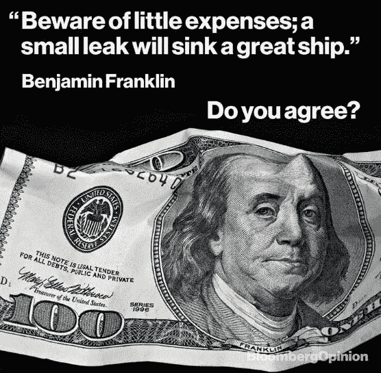

# 在疫情，我们真的攒够钱了吗？

> 原文：<https://medium.datadriveninvestor.com/are-we-really-saving-enough-in-a-pandemic-f3f65110d2e5?source=collection_archive---------20----------------------->

**Source: BloombergOpinion**

大量家庭极易受到经济衰退的影响。在这种紧急情况下，家庭储蓄少得惊人。储蓄不足也是坏账的主要原因之一。根据我的观察，在印度，即使出现收入冲击，许多人仍然青睐高端产品。人们不愿意在生活质量上妥协，而不愿实现财务安全。这给鼓励和增加储蓄带来了重大挑战。没有星巴克拿铁的日常消费或奢侈品牌的预购，生活真的不愉快吗？

人可能不一样。例如，我与之交谈的一群人回答道:“*它给我带来快乐，我也能负担得起，为什么不呢？然而，我认为有节制的节俭可能是一种生活方式。更简单的生活不是更丰富吗？*

教育和宣传等干预措施未能产生持久的效果，而且非常昂贵。最具成本效益但往往被忽视的措施之一是**微调。**理查德·塞勒描述的微推是一个“可预测地改变人们的行为*而不禁止任何选择或显著改变他们的经济激励”的概念。*“推动和积极强化预期储蓄行为的一种方式是通过**社会规范。**

社会规范强烈地影响着我们的决策。因此，这一措施不仅是进步的、有效的，而且对人们产生了更大和更持久的影响。社会规范推动的特征是**模仿**(如果我的大多数同龄人都这样做，那么这可能是一个明智的举动)和愿意**遵从**(不从众的罪恶感和羞耻感)。

 [## 使用谷歌搜索趋势预测首次申请失业救济人数|数据驱动的投资者

### 几年来，我的重点一直是使用多种替代数据来预测宏观经济统计数据…

www.datadriveninvestor.com](https://www.datadriveninvestor.com/2020/03/25/using-google-search-trends-to-predict-initial-jobless-claims/) 

这是一个向你的邻居和同龄人学习的好机会，让生活回到最基本的状态。在资源有限的情况下，不浪费而是确定机会成本可能是至关重要的。如果购物是无利可图的，对你的快乐影响很小，那么最好取消它。我知道计算最小的开销可能会让你精疲力尽，但是节俭难道不是一种值得称赞的品质吗，尤其是在这样的时代？问少即是多不是很关键吗？正如沃伦·巴菲特非常正确地引用的那样，“如果你买了你不需要的东西，你很快就会卖掉你需要的东西。或许富有的一个重要特征就是储蓄很多。

**进入专家视图—** [**订阅 DDI 英特尔**](https://datadriveninvestor.com/ddi-intel)