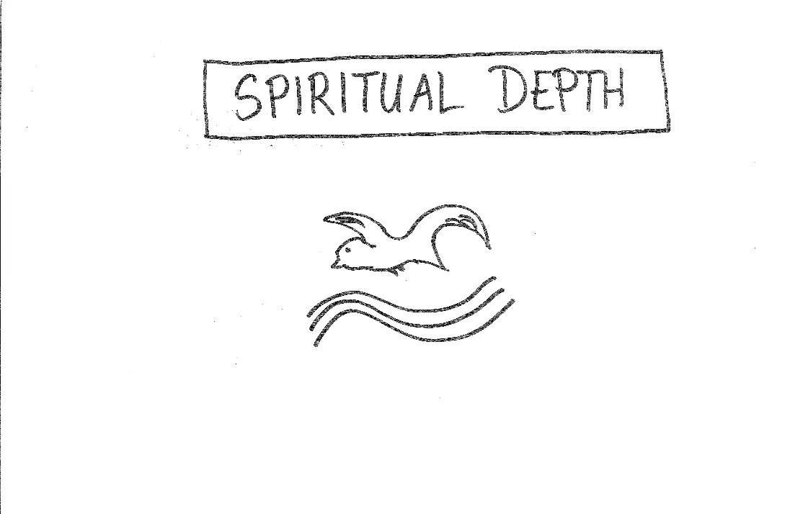
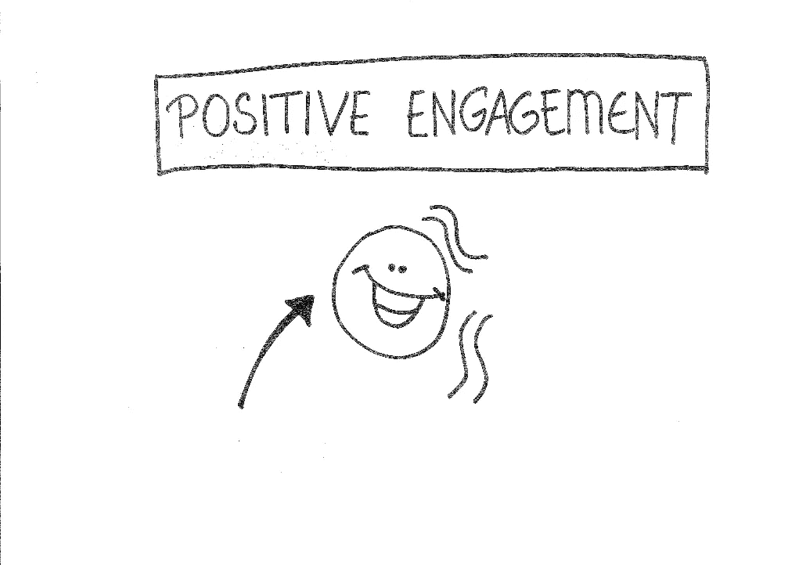
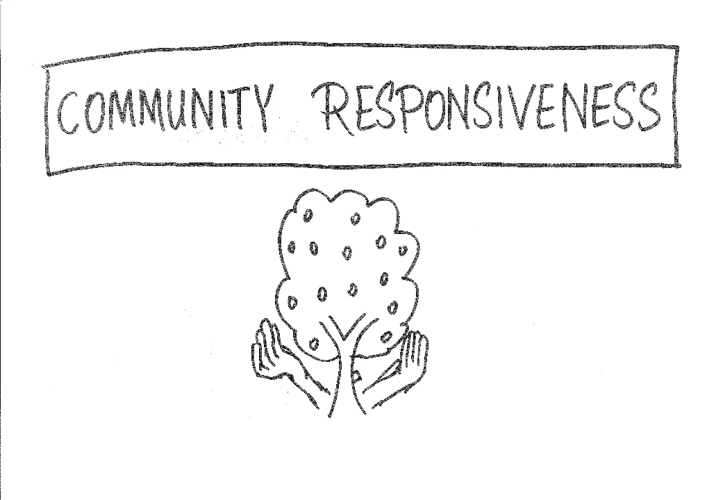

# 这就是你如何发现自己仁慈的领导风格

> 原文：<https://medium.datadriveninvestor.com/are-you-a-benevolent-leader-dd0372c34e1c?source=collection_archive---------10----------------------->

## 用我开发的测试在 10 分钟内找出答案

Photo by [Christina @ wocintechchat.com](https://unsplash.com/@wocintechchat?utm_source=medium&utm_medium=referral) on [Unsplash](https://unsplash.com?utm_source=medium&utm_medium=referral)

这个测试是我和麦吉尔大学的 Emine Sarigollu 博士一起开发的一个简单的工具包。

它旨在帮助您评估自己的领导风格和价值观。

它被称为“仁慈的领导自我诊断工具包”。

大约只需要 10 分钟左右。我们可以开始了吗？

Image created by Author

对于以下各项，请在方框中写出最准确描述您对以下陈述的自我评价的数字。

从 1 到 10:

*   1 —最差(这种说法根本不能反映我)
*   …………….
*   …………….
*   …………….
*   10 —最好(这句话完美地反映了我)。

# 第 1 部分:道德敏感性

Image Created by Author

*   When:我在工作中做出管理决策，我会思考我的决策的道德后果。
*   当我相信某件事时，我会站在道德立场上。
*   :当我管理这个组织的人时，我会认真对待道德准则。
*   :我相信我的行为符合我的道德价值观和信仰。
*   :我信守承诺，也希望我的下属遵守他们的承诺。
*   :我坚持正义，即使这会让我付出代价。
*   :我为我的错误负责，并弥补它们。
*   :我努力在工作中成为正直诚实的榜样。
*   :当我的同事在工作中背离道德价值观时，我会向他们提出挑战。
*   我相信我的工作是由高道德标准指导的。

总分:…………(满分 100 分)

# 第二部分:精神深度

Image created by Author

*   :在工作中，我会花时间进行自我反省、冥想或祈祷。
*   :我试图在我的工作和领导中找到更深层次的意义。
*   :我试图将我的精神融入到我的工作中。
*   :我相信我们都是相互关联的，是一个有意义的整体的一部分。
*   :当我全身心地投入工作时，我感到充满活力和激情。
*   :我的精神让我成为一个更乐于助人、更有同情心的领导者。
*   :我的精神信仰使我对同事更加温和。
*   我努力培养或支持我周围同事的精神成长。
*   当我在工作中面临一个重要的决定时，我的精神在我的行动中起着重要的作用。
*   :我一直在寻找能让我的生活有意义和满足感的东西。

总分:…………(满分 100 分)

# 第 3 部分:积极参与

Image created by Author

*   :我努力传达一个清晰而积极的未来愿景。
*   :我鼓励我的团队成员在这个组织中有大胆的梦想。
*   即使当别人气馁时，我知道我能找到解决问题的方法。
*   :我热衷于给我周围带来积极的变化。
*   我试着给我周围的人希望和勇气去采取积极的行动。
*   :我与同事一起努力，为积极的变革创造一个共同的愿景。
*   :如果我想积极地改变工作中的某些事情，我会采取行动，启动改变的过程。
*   :我对在组织中创造变革和创新的新想法持开放态度。
*   :我对我们在这个组织中所能取得的成就充满希望。
*   :我坚信我们有能力在这个组织中取得积极的成果。

总分:…………(满分 100 分)

# 第 4 部分:社区响应

Image created by Author

*   在我的工作中，我努力帮助我的组织和社区中的其他人。
*   关爱我的社区推动了我在工作中的领导力。
*   :我所做的工作改变了我周围人的生活。
*   :我关心我将留给后代的遗产。
*   :在我的社区中，我觉得自己是一个负责任的领导者，而且行为举止也是如此。
*   :我超越了我的工作定义，为我的社区和世界做贡献。
*   我愿意将时间和精力投入到对我的社区重要的事情上。
*   我积极参与造福社区的社会责任项目。
*   :我会评估我的管理决策给所有利益相关者带来的后果。
*   :我把我的时间和金钱用于社区的慈善事业。

总分:…………(满分 100 分)

Image Created by Author

Image created by Author

# 如何解释你的结果

对于每一部分，你的总分是 100 分。

如果你高于 80，这意味着你认为自己在那个维度上“非常强”。可能会有一些小问题需要解决，但是你可以庆幸自己有很高的“仁爱商”。

 [## 领导力。赢得|数据驱动型投资者需要更广阔的视角

### 不管他们愿不愿意，领导者都是快速运转的机器中的齿轮，这就要求他们夹住自己的爪子…

www.datadriveninvestor.com](https://www.datadriveninvestor.com/2020/02/07/leadership-it-takes-a-wider-perspective-to-win/) 

如果你超过 70 岁，这意味着你认为自己在那个维度上“很强”。有一些问题需要解决，但你可以祝贺自己有一个很高的“仁爱商”。

如果你在 50 岁到 70 岁之间，这意味着你认为自己在那个维度上是“中等”的。你可能想探究一下在这个维度上阻碍你发挥全部潜力的问题。也许这些问题中有一些是关于你的组织环境的。你如何克服挑战并解决这些问题？

如果你低于 50，这意味着你认为自己在那个维度“低”。你可能想探究导致对你的领导风格和行为评价如此之低的潜在问题。怎么了？什么阻止或阻碍了你？你的主导情绪是愤世嫉俗还是愤怒？你如何发起变革并做出改进？

# 反思和行动计划

请现在思考您的结果和评估。

为了积极的改变，你想采取什么行动？

请指出你的行动要点。

你可以列一个要点清单，或者给自己写一封反思信——如你所愿。

______________________________________________________________________________________________________________________________________________________________________________________________________________________________________________________________________________________________________________________________________________________________________________________________________________________________________________________________________________________________________________________________________________________________________________________________________________________________________________________________________________________________________________________________________________________________________________________________________________________________________________________________________________________________________________________________________________________________________________________________________________________________________________________________________________________________________________________________________________________________________________________________________________________________________________________________________________________________________________________________________________________________________________________________________________________________________________________________________________________________________________________________________________________________________________________________________________________________

我希望这个评估对你有用。

真诚；

法赫利

## 法赫里·卡拉卡斯是《自制工作室》的作者。你可以在这里探索更多[。](https://selfmakingstudio.com/)

非常感谢 Emine Sarigollu 博士。

**进入专家视角—** [**订阅 DDI 英特尔**](https://datadriveninvestor.com/ddi-intel)