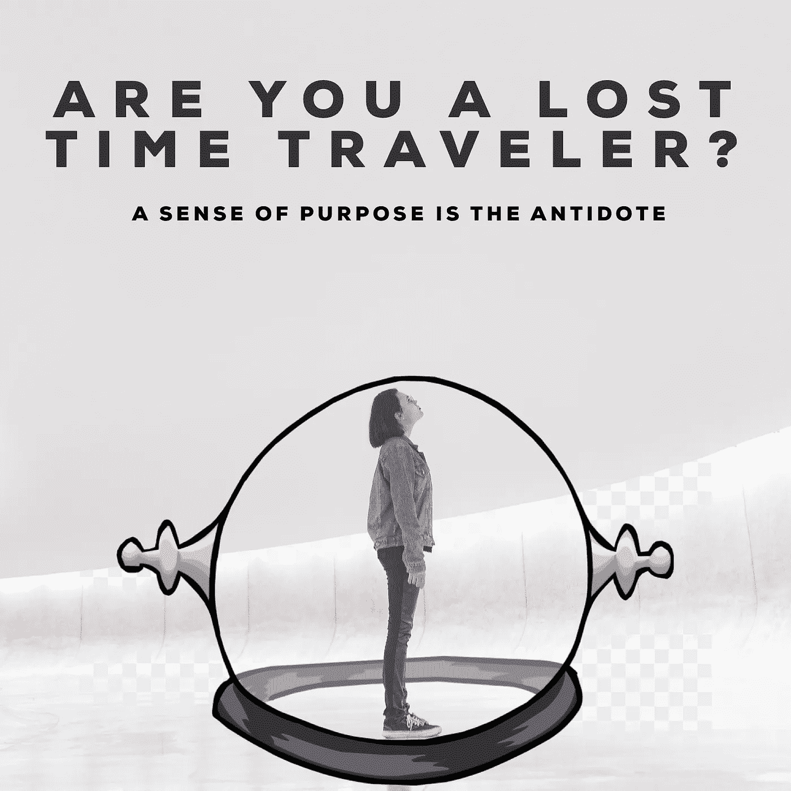

# 你是迷失的时间旅行者吗？

> 原文：<https://medium.datadriveninvestor.com/are-you-a-lost-time-traveler-61dc7c4c265f?source=collection_archive---------22----------------------->

Original photo by Guilherme Stecanella

***我是谁，不是我想成为的人，我也不完全清楚今天的我是谁*** 。它发生在你身上吗？

换句话说，我的思想主要集中在成为另一个人上。这是众所周知的到达一个空间和时间，我应该生活在和平中。太疯狂了，如果那一天永远不会到来呢？

我的大脑是一个时间旅行者，它利用过去来想象一个更好的未来，它大多忘记了生活正在发生。过去，未来，过去，未来…

> “在我们的生活中，如果我们没有弄清楚什么对我们来说是最重要的，那么在任何给定的时刻，最紧迫的事情将占据优先地位。”—富兰克林·柯维

我生活中最重要的是什么？这不是已经用我对未来版本的自己的愿景来定义了吗？

我想专注于建立一个基于充实生活的未来。我的**目标感**会让我保持警觉、专注，并意识到我身上正在发生的事情。我的目标感会提醒我哪些是我的优先事项。

*   当我做我喜欢的事情时，我会忘记过去和未来。
*   当我什么都做不了的时候，我就在抱怨过去的艰辛。
*   当我做我不喜欢的事情时，我是在为更好的未来投资汗水和泪水。
*   当我打破睡眠时，我感到精力充沛。

生活是不确定的，这意味着我不能准确预测未来。这足以让我怀疑自己的想法，不相信有一天我需要做些什么才能获得成功。我知道我的心灵不会轻易屈服；这就是为什么我首选的工具是我的目标陈述。

如果你对寻找自己的目标感感兴趣，你可能会希望在我的在线培训项目可用时收到提醒，[现在就点击这里:)](https://sop.visionofpresent.com)