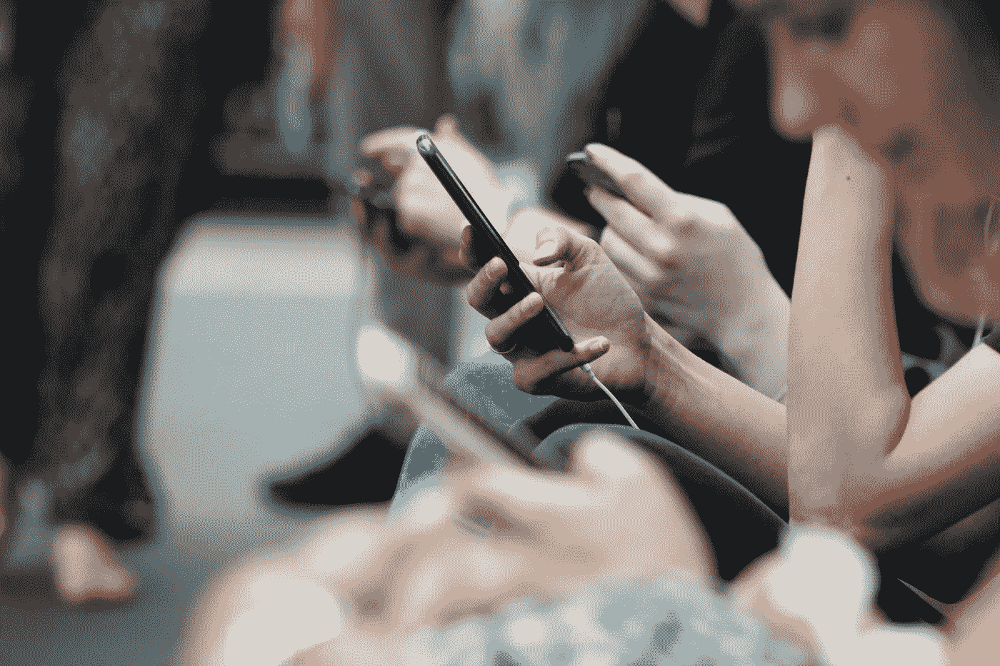

# 试图克服智能手机成瘾？以下是如何夺回控制权

> 原文：<https://medium.datadriveninvestor.com/are-you-a-smartphone-addict-heres-a-simple-trick-to-take-back-control-50cc5a1a69d6?source=collection_archive---------8----------------------->

## 对通知说“不”

www.shutterstock.com

生活充满了干扰。电子邮件、社交媒体、*更多的电子邮件、*短信，不胜枚举。*等等，等等，等等。*我知道不止我一个人认为我的智能手机似乎总是需要我的注意力。大多数早晨，我醒来时似乎会收到一大堆通知，其中大部分我会不假思索地一扫而光。

我对智能手机上瘾并不陌生。几年前，我意识到我花在浏览社交媒体上的时间是以牺牲我本可以和孩子在一起的时间为代价的。事情已经到了我无法控制的地步，所以我删除了所有的社交媒体。我不仅发现自己感觉更快乐了，而且突然间，好像一天中有了额外的时间。如果你是那种认为自己没有时间完成事情的人，请继续读下去。

 [## 为什么你应该退出社交媒体(相信我，我已经做到了)

### 放弃社交媒体是我做过的最好的决定之一，对你来说也是如此。

medium.com](https://medium.com/@justaguywhowrites/why-you-should-quit-social-media-trust-me-ive-done-it-f232b977ebe7) 

# 重新掌控你的时间

毫无疑问，智能手机让我们的生活更加便利。曾经需要你坐在电脑前或去商店的任务，现在可以在任何地方完成，只需要很短的时间。尽管智能手机有很多方式可以帮助我们节省时间，但我们通常最终会浪费我们通过阅读毫无意义的电子邮件或滚动社交媒体提要节省的时间。

> “生活就是当你看着你的智能手机时发生在你身上的事情”——未知

我不会建议你扔掉智能手机，找出藏在抽屉里的老式诺基亚 3310——*我没疯。但是我建议我们试着通过消除智能手机带来的干扰因素来重新控制我们的时间。方法是**关闭你的通知。***

Photo by [ROBIN WORRALL](https://unsplash.com/@robin_rednine?utm_source=unsplash&utm_medium=referral&utm_content=creditCopyText) on [Unsplash](https://unsplash.com/s/photos/use-phone?utm_source=unsplash&utm_medium=referral&utm_content=creditCopyText)

我知道你在想什么。你在想，你会突然开始错过智能手机每天通知你的所有紧急信息。我不想告诉你，但你同事在脸书给你贴的搞笑 GIF 并不紧急。

几周前，我决定关闭智能手机上的所有通知，除了:

*   电话
*   短信
*   WhatsApp 或脸书消息
*   微软团队(我公司的所有交流都通过团队进行)

没有电子邮件，没有 Reddit，没有社交媒体，甚至没有媒体被允许通知我了。我将收到的**唯一的**通知来自试图联系我的**人**。就是这样。

 [## 卷轴开始摇晃。全球科技分裂，5G 获得推动|数据驱动的投资者

### 您知道《数据驱动的投资者》是数据科学、区块链和媒体的顶级出版物之一吗

www.datadriveninvestor.com](https://www.datadriveninvestor.com/2020/08/13/rocky-start-for-reels-global-tech-splinters-5g-gets-a-boost/) 

这并不是说我不再使用电子邮件、Reddit 或社交媒体。这只是意味着我在选择的时候使用它，而不是当我的智能手机需要它的时候。因为说实话，当我们听到*乒的一声时，有多少人会忍不住检查我们的手机？*通知不是问题。当你决定*检查*通知时，问题来了。一旦你的手机拿在手里*，你就更有可能去脸书，或者 Instagram，或者任何能让你开心的应用。这是你时间消失的地方。浪费你一天一个小时的并不是查收邮件，而是一旦你查收了那封邮件，你的大脑就会想要*检查你可能错过的其他事情。**

# *我的最高提示*

*   *下载一个**追踪你的智能手机使用情况的应用**。继续正常使用手机一周，然后检查结果。当你们看到自己在手机上花了这么多时间时，大多数人都会感到震惊。*
*   ***关闭所有不必要的通知**，并**安排一个时间**查看电子邮件和社交媒体。通过这样做，你收回了对时间的控制，而不是让你的时间被一个设备控制。*

*不是每个人都需要接受这个建议。但是如果你或你认识的人很难关掉手机超过几分钟，请与他们分享这篇文章。尝试关闭您的通知。一开始可能会很难，你可能会跌倒几次，但要坚持下去。我向你和 T21 保证，你们新获得的自由会为此感谢我的。*

*29 岁的英国作家乔恩·彼得斯与妻子和两个孩子住在英国康沃尔。要了解我的更多信息，您可以点击这里的 **快速进入我的个人资料。感谢阅读！***

***访问专家视图—** [**订阅 DDI 英特尔**](https://datadriveninvestor.com/ddi-intel)*