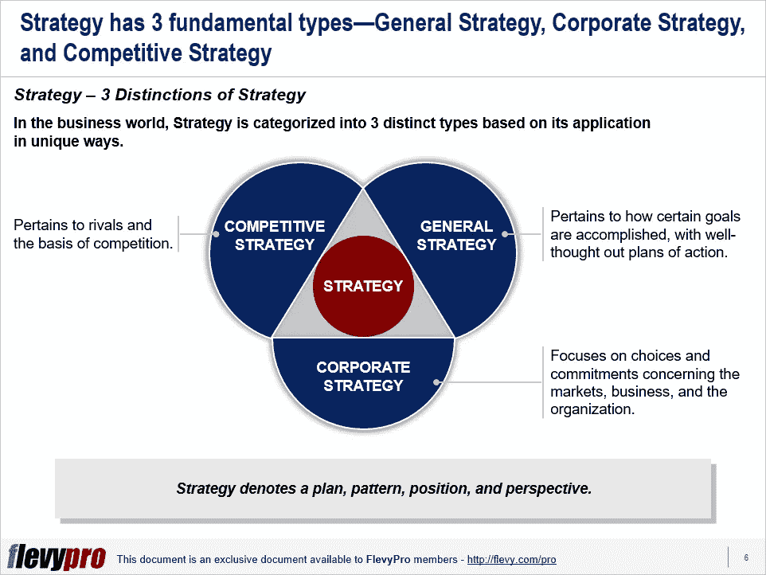

# 你能辨别一般战略、公司战略和竞争战略之间的区别吗？

> 原文：<https://medium.datadriveninvestor.com/are-you-able-to-discern-the-distinction-between-general-corporate-and-competitive-strategy-a3ab0131a152?source=collection_archive---------24----------------------->

战略和执行是推动企业发展的两个关键因素。然而，领导者甚至常常难以定义——更不用说设计和执行——一个有效的战略。许多负责处理它的人没有描述他们通常是如何使用它的。这种失败的根源在于没有与战略相关联的清晰路径。

战略是关于对不可预见的问题做出正确的决定。它是关于选择正确的选项——关于那些今天常常很模糊但对未来有重大意义的事情——基于彻底的思考、详细的分析和创造性的想法。概括地说，战略包含以下三个主要元素:

*   愿景和方向
*   某一位置或模式
*   经过深思熟虑的[战略计划](https://flevy.com/strategic-planning)实现战略目标和愿景

伟大的战略家执行他们的计划，分析结果，评估他们的行动，并根据结果执行过程修正。他们甚至不怕彻底改变他们的方法。高层领导应阐明他们对战略概念的理解，并在制定自己的行动方针之前，提请注意区分 [3 种不同类型战略](https://flevy.com/browse/flevypro/the-3-distinctions-of-strategy-5251)的重要性:

1.  **总体策略**
2.  **公司战略**
3.  **竞争战略**

让我们更深入地研究这三种策略。

# 总体战略

总体战略表明如何通过深思熟虑的计划实现特定目标。这种战略的重点是目的(目标和结果)和手段(我们为实现目标所拥有的资源)。战略和战术相结合，弥合目的和手段之间的差距；战略处理的是在我们的支配下部署资源，而战术控制着资源的利用。决策和行动的模式标志着总体战略中从起点到目标实现的过程。

高级管理人员在制定总体战略之前需要考虑以下问题:

*   我们该怎么办？
*   我们为什么在这里？
*   我们是什么样的企业？
*   我们想成为什么样的企业？
*   我们的目的是什么？我们追求的结果是什么？
*   我们现有的策略是什么，是显性的还是隐性的？
*   什么样的策略和计划可能会带来我们想要的结果？
*   我们有什么资源可以支配？
*   在资源方面是否有任何限制我们行动的因素？

# 企业战略

[公司战略](https://flevy.com/business-toolkit/corporate-strategy)描述了一个公司做什么，它存在的目的，以及它的目标是什么。公司战略侧重于对市场、业务和组织的选择和承诺。公司战略对公司经营的市场和业务进行分类。这种类型的战略通常是在定义公司使命和愿景的背景下决定的。

对现有战略、市场、竞争和环境的详细评估对于制定公司战略至关重要。战略家指出，在制定公司战略时应该考虑到一些关键因素。这些要素包括产品或服务供应、资源、营销和销售方法、制造能力、客户、分销渠道、技术、市场类型及其要求，以及收入和利润目标。

在制定公司战略时，高级管理人员应考虑并寻求以下问题的答案:

*   我们现有的公司战略是什么？
*   我们的企业战略是显性的还是隐性的？
*   使我们现有战略可行的关键假设是什么？
*   在社会、政治、技术和金融环境方面，市场正在发生什么？
*   就我们的增长、规模和盈利目标而言，我们寻求实现什么？
*   我们打算在哪些市场竞争？
*   我们打算经营什么业务？
*   我们将在哪些地点和地理区域竞争？

# 竞争策略

竞争或商业战略为企业指明了与竞争对手竞争的核心原因。这取决于一个组织与市场和竞争对手相比的能力、优势和劣势。

有兴趣了解更多关于[的一般、企业和竞争战略](https://flevy.com/browse/flevypro/the-3-distinctions-of-strategy-5251)？你可以在 [Flevy 文档市场](https://flevy.com/browse)下载[一个可编辑的关于战略的三个区别的幻灯片](https://flevy.com/browse/flevypro/the-3-distinctions-of-strategy-5251)。

## 你在这个框架中找到价值了吗？

您可以从 [FlevyPro 库](https://flevy.com/pro/library)下载关于这个和数百个类似业务框架的深入介绍。 [FlevyPro](https://flevy.com/pro) 受到 1000 名管理顾问和企业高管的信任和使用。有些人不得不说:

> “我的 FlevyPro 订阅为我提供了当今市场上最受欢迎的框架和平台。它们不仅增加了我现有的咨询和辅导产品和服务，还让我跟上了最新的趋势，为我的实践激发了新产品和服务，并以其他解决方案的一小部分时间和金钱教育了我。我强烈推荐 FlevyPro 给任何认真对待成功的顾问。”

–战略商业建筑师事务所创始人比尔·布兰森

> “作为一家利基战略咨询公司，Flevy 和 FlevyPro 框架和文件是一个持续的参考，有助于我们为客户构建我们的调查结果和建议，并提高他们的清晰度、力度和视觉效果。对我们来说，这是增加我们影响力和价值的宝贵资源。”

–Cynertia Consulting 的咨询区域经理 David Coloma

> “作为一个小企业主，FlevyPro 提供的资源材料已被证明是非常宝贵的。根据我们的项目事件和客户要求按需搜索材料的能力对我来说很棒，并证明对我的客户非常有益。重要的是，能够针对特定目的轻松编辑和定制材料有助于我们进行演示、知识共享和工具包开发，这是整个计划宣传材料的一部分。虽然 FlevyPro 包含任何咨询、项目或交付公司都必须拥有的资源材料，但它是小公司或独立顾问工具箱中必不可少的一部分。”

–变革战略(英国)董事总经理迈克尔·达夫

> “作为一名独立的成长顾问，FlevyPro 对我来说是一个很好的资源，可以访问大量的演示知识库来支持我与客户的合作。就投资回报而言，我从下载的第一个演示文稿中获得的价值是我订阅费用的好几倍！这些资料的质量让我能够打出超出自己体重的水平，这就像是用很小一部分开销就能获得四大咨询公司的资源一样。”

–Roderick Cameron，SGFE 有限公司的创始合伙人

> “我每个月都会浏览几次 FlevyPro，寻找与我面临的工作挑战相关的演示文稿(我是一名顾问)。当主题需要时，我会进一步探索，并从 Flevy 市场购买。在所有场合，我都阅读它们，分析它们。我采纳与我的工作最相关和最适用的想法；当然，所有这些都转化为我和我的客户的利益。"

量子 SFE 公司首席执行官奥马尔·埃尔南·蒙特斯·帕拉

在 [**管理和企业咨询**](https://app.ddichat.com/category/management-and-corporate-consulting) **:** 中安排一个 DDIChat 会话

 [## 专家-管理和企业咨询- DDIChat

### DDIChat 允许个人和企业直接与主题专家交流。它使咨询变得快速…

app.ddichat.com](https://app.ddichat.com/category/management-and-corporate-consulting) 

在此申请成为 DDIChat 专家[。
与 DDI 合作:](https://app.ddichat.com/expertsignup)[https://datadriveninvestor.com/collaborate](https://datadriveninvestor.com/collaborate)在此订阅 DDIntel [。](https://ddintel.datadriveninvestor.com/)