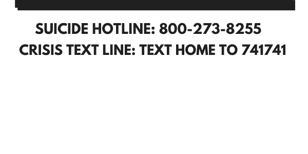
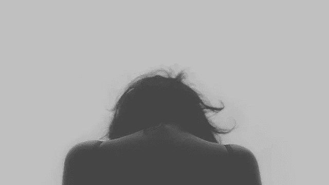

# 你受抑郁症的影响吗？

> 原文：<https://medium.datadriveninvestor.com/are-you-affected-by-depression-fe4974dcc442?source=collection_archive---------34----------------------->

## 你现在可以做的 11 件事

> “对待一个抑郁的人，就好像她只是感到悲伤，说‘好了，坚持住，你会克服的’是没有意义的。”悲伤或多或少就像感冒，只要有耐心，它就会过去。抑郁症就像癌症。"
> ― **芭芭拉·金索弗，** [**豆子树**](https://www.goodreads.com/work/quotes/1095121)

有一种普遍的误解，认为受到抑郁症的影响意味着你很悲伤——脑海中浮现的是蜷缩在角落里的典型女性。这可能对一些人来说是真的，但不是对所有人都是真的。

我有躁郁症，或者说躁郁症。我的跌宕起伏远远超过我的起伏，让我告诉你，抑郁症不仅仅是悲伤。它包括:

*   **无精打采**。没有什么是令人满意的，也没有什么是有趣的。这只是一个废话拍摄。我喜欢园艺和游泳，我知道当我不想修剪草坪或跳进游泳池时，我会感到害怕。
*   **饮食模式的改变。这可能意味着暴饮暴食或根本不吃东西。**
*   **睡眠问题。**我不知道你怎么样，但是当我严重抑郁的时候，我不想起床。我想睡一觉。我曾经因为抑郁症在一次训练中睡觉。人们打电话到我的房间，敲我的门，但我只想睡觉。我不想有意识。
*   **疲劳。这个太棒了。有什么比无聊没精力找事情做更糟糕的？**
*   **感到可耻或无价值。受到抑郁症的影响，有时会让你觉得你所爱的人没有你会过得更好。或者这个世界没有你会更好。很多时候，我们背上的猴子会告诉我们，我们是个失败者，我们做什么都不重要，我们只是个大混蛋。**
*   **自杀的念头。**不言自明。
*   **焦虑或担心增加。担心不好的事情发生通常是抑郁的标志。这是因为我们的想法是如此消极，以至于我们担心一切。**
*   **可能的冲动决定会让你感觉更快。喝酒、吸毒、修指甲、买新衣服来让自己感觉更好，这些在短期内可能会奏效。但是抑郁还会在，衣服也会变旧。指甲会长出来。宿醉就会随之而来。**

现在，当你受抑郁症影响时，有不同层次的功能。你可以是高功能的——一尘不染的房子，经常照顾别人，工作，做任何事情来麻木你自己的恶心感觉。或者你可能功能低下，早上挣扎着起床(内疚)。

Image by [Free-Photos](https://pixabay.com/photos/?utm_source=link-attribution&utm_medium=referral&utm_campaign=image&utm_content=505857) from [Pixabay](https://pixabay.com/?utm_source=link-attribution&utm_medium=referral&utm_campaign=image&utm_content=505857)

## **不同的事情会引发抑郁症。**

一个简单的常规改变就可以做到。有时候是荷尔蒙作祟。产后抑郁症，有人吗？有时候是季节性的，有时候是情境性的。严重和持续的抑郁症通常是因为大脑中化学物质的不平衡。

那么，当我们受到抑郁症的影响时，我们该如何应对呢？我不知道你怎么想，但当我处于那种状态时，我只想**。*就这样。它不会很快发生。有时，这种无精打采的状态会持续几个星期才会消失。*

*受到抑郁症的影响可不是闹着玩的，但是你可以采取一些措施来减少发作的时间和强度。是的，你需要咨询医生或者最好是真正的精神病医生来获得药物治疗。但是康复是医学和生活技能的结合。最好的成功案例是两者并用的结果。*

*我将很快分享一些当抑郁症恶化时你可以做的事情来打发时间。但是有一件超级重要的事情需要在其他事情之前解决，那就是一次只做一件事情。以下提示针对凹陷的深度。当你做其中一件事时，把它写下来。记录下哪怕是很小的成就。*

1.  ***起床。**字面意思。即使你只是想尿尿。看你能让自己下床几次。拿些水。拉伸。*
2.  ***梳头。**不一定要完美。我不想给自己一个巴西式的惊喜。我是说真的，梳梳头。拿出那个马尾，拿起去缠结器，把你的头倒过来，梳好你的头发。它可能会变得卷曲、蓬松或疯狂。刷一下头发就好。我保证，保证，保证你会立刻感觉好起来。*
3.  ***刷牙。当你受到抑郁症的影响时，自我保健就成了过去式。如果你决定做什么，确保是刷牙。顺便说一下，你的心理健康与你的口腔健康息息相关，反之亦然。***
4.  *穿好衣服。当你穿衣服的时候，心理上会发生一些变化。多亏了 covid，更多的人可能会整天穿着睡衣。一套清新的服装几乎和梳头一样好…差不多。*

*现在我已经谈到了木桶的底部，让我们跳到一些中级功能抑郁症。您可以:*

1.  ***读一本正面的书**。我目前积极的书是*秘密。*我非常喜欢吸引力法则，我真的认为如果你能成功，它会对你有所帮助！*
2.  ***听音乐。不一定是快乐的音乐。有时候佛罗伦萨+机器正是我灰色日子需要的药。***
3.  *如果可以的话，积极行动起来。众所周知，积极运动有助于释放内啡肽，从而提升情绪。*

***如果这些都不起作用，如果你需要立即与人交谈，请拨打危机热线或寻求支持。***

*我希望这篇文章已经告诉和教育了你是否受到抑郁症的影响，以及你可以采取哪些措施来减轻痛苦。如果你想看任何被覆盖的东西，请随时给我留言，我会覆盖它。*

***访问专家视图—** [**订阅 DDI 英特尔**](https://datadriveninvestor.com/ddi-intel)*

**原载于 2021 年 1 月 4 日 http://selfhelpfull.wordpress.com***。***