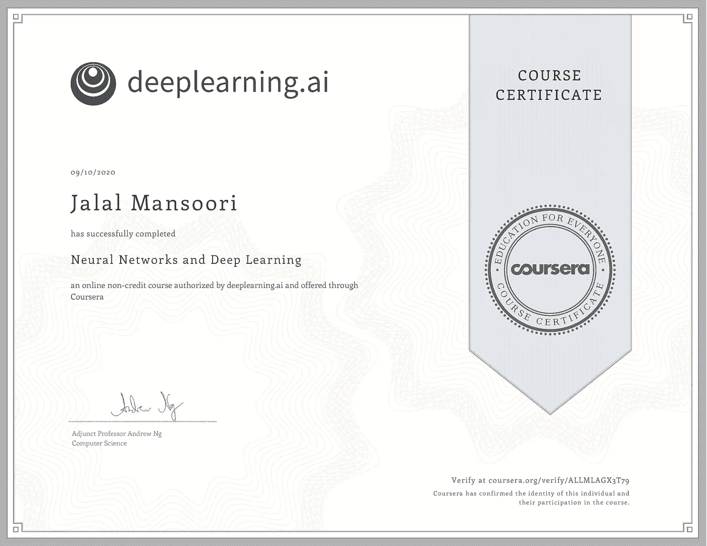
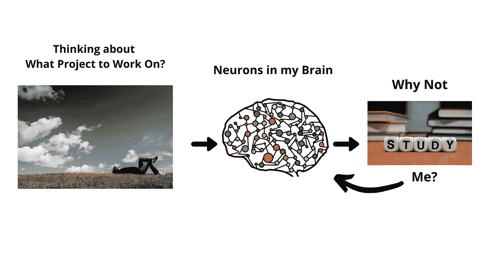
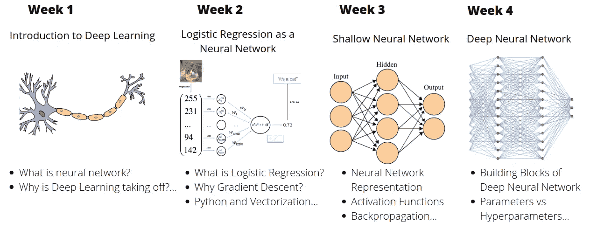

# 你也对学习神经网络感兴趣吗？

> 原文：<https://medium.datadriveninvestor.com/are-you-also-interested-in-learning-about-neural-networks-356a6592662?source=collection_archive---------15----------------------->

Neural Networks and Deep Learning Course Completion Certificate

这是吴恩达教授讲授的神经网络和深度学习课程的综合指南

## 介绍

最近，就在几天前，我完成了吴恩达教授讲授的神经网络和深度学习课程。这是通过 Coursera 提供的 deeplearning.ai 专业化的第一门课程。

在提交了这门课程的最后一个编程作业后，我想让我们写一个评论类型的博客，在网上社区分享关于这门课程的有意义的信息。所以那些热衷于学习和使用神经网络进行有趣项目的人可以从这个博客中获得一些好处！

在开始之前，首先让我分享一下这个博客的概况。这样你就能满足自己的需求。我将信息分为三个阶段。

## 第一相👉为什么？

在这一阶段，我想分享我学习神经网络的目的以及制定明确目标的重要性。

## 第二相👉怎么会？

在这一阶段，我将强调课程内容的相关性，并回答以下问题:

*   你将从这门课中学到什么？
*   是理论课还是动手课？
*   是什么让这门课变得有趣？
*   这门课的前提条件是什么？…

## 第三阶段👉什么？

我完成了神经网络和深度学习课程，现在怎么办？

现在，让我们开始吧！

 [## 冗长但有价值的神经网络指南|数据驱动的投资者

### 如今可用于机器学习的神经网络类型如此之多，以至于它值得一个冗长的指南…

www.datadriveninvestor.com](https://www.datadriveninvestor.com/2019/04/04/neural-networks/) 

# 阶段 1:为什么我开始学习神经网络？

这个问题的答案就在学习、创造和分享的交叉点上。如今，我开始写与机器学习相关的教程，并且为我的下一个教程，因为我在想我应该做什么项目？

我预计，也许我大脑中的一群神经元发出了一个信号，引导我寻找神经网络的应用。有趣的是，我们知道神经网络在改进自然语言处理、计算机视觉领域的问题解决方案方面发挥了至关重要的作用。

Image idea by Author, Left Image by [Pexels](https://pixabay.com/users/Pexels-2286921/) from [Pixabay](https://pixabay.com/), Center Image by [Ahmed Gad](https://pixabay.com/users/ahmedgad-9403351/) from [Pixabay](https://pixabay.com/), Right Image by [Wokandapix](https://pixabay.com/users/Wokandapix-614097/) from [Pixabay](https://pixabay.com/)

所以我设定了一个学习神经网络的目标，用它创建一个项目，并通过写教程与在线社区分享！

有一个明确的目标是非常重要的，因为即使你对某件事充满热情，也会有一段时间你不想做任何事情，但根据我的经验，如果你真的充满热情，那么过一段时间你就会自动开始工作来实现你的目标！

# 阶段 2:课程内容的相关性如何？

## 简介

神经网络与深度学习是 [deeplearning.ai](https://www.deeplearning.ai/) 通过 Coursera 提供的深度学习专业化的第一门课程。在我看来，课程内容是为那些对机器学习有一些基本概念并有编程背景的人设计的，非常有效。

学习的整体流程看起来像👇

Image Design by Author, From left Image Credits: [Neuron](https://commons.wikimedia.org/wiki/File:Neuron.svg) by [Actam](https://commons.wikimedia.org/wiki/User:Actam), [Artificial Neural Network](https://commons.wikimedia.org/wiki/File:Artificial_neural_network.svg) by [Cburnett](https://en.wikipedia.org/wiki/User:Cburnett), [Deep Neural Network](https://commons.wikimedia.org/wiki/File:Artificial_Neural_Network.gif) by [Cecbur](https://commons.wikimedia.org/w/index.php?title=User:Cecbur&action=edit&redlink=1), Licensed Under (CC BY-SA 3.0)

## 是理论课还是动手课？

这是一个完整的实践课程，您将通过解决图像分类任务来建立对神经网络编程的理解和直觉！

本课程的编程作业组织得非常好，它让你更好地理解在神经网络性能中起重要作用的主要概念。像激活函数的选择，矢量化的重要性，…和许多其他任务。

在开始编程作业之前，首先，你将在逻辑回归模型的帮助下建立对神经网络的直觉，然后从第 3 周开始，你将通过实现以下模块中的函数来发展对神经网络整体结构的直觉。

*   正向传播
*   反向传播

一切都是从**用 Python 编程语言**开始的！

## 是什么让这门课有趣又独特？

在 Coursera 和其他电子学习平台上，还有许多其他关于神经网络的在线课程。在我看来，以下是使这门课程有趣和独特的原因。

1.  **课程导师** 本课程由 Coursera 联合创始人、斯坦福大学计算机科学兼职教授[Andrew ng](https://www.coursera.org/instructor/andrewng)教授主讲。当谈到解释机器学习模型背后的数学时，安德鲁教授的教学技巧令人印象深刻。
2.  **编程作业** 作为一个基于项目的学习者，对我来说最有用最有意义的内容就是编程作业。这些作业在指导性和简单性方面组织得非常好。如果你有编程知识背景，那么你就可以开始了！
3.  **深度学习的英雄** 每周 1、2、3 周末，还可以观看安德鲁教授与人工智能领域知名研究人员杰弗里·辛顿(Geoffrey Hinton)、伊恩·古德费勒(Ian Goodfellow)、彼得·阿比尔(Pieter Abbeel)的有趣对话。他们分享自己的个人故事，并给出职业建议。

## 这门课的前提条件是什么？

这个问题的答案取决于你对使用机器学习解决问题的过程的熟悉程度和编程背景。

在我看来，2 个重要的先决条件将在建立对算法背后的数学方程的深入直觉方面发挥重要作用，如成本函数中的方程、梯度下降等

1.  斯坦福大学开设的 [**机器学习课程这个课程也是安德鲁教授教授的，我很幸运从这个课程开始了我学习 ML 的旅程。本课程也是动手操作，并提供了机器学习算法的广泛介绍。在本课程中，与**神经网络和深度学习**课程相比，Andrew 教授精确详细地解释了每个算法。**](https://www.coursera.org/learn/machine-learning?)

在莱克斯·弗里德曼的播客中，安德鲁教授还说:

> “上过机器学习课程的人会发现 deeplearning.ai 专业化稍微容易一些”

过去，我还完成了一门机器学习课程，并写了一个博客，我的目的是分享我在整个课程中学到的一些经验。

 [## 我是如何在 Coursera 上完成吴恩达教授讲授的机器学习课程的？

### 是的，你也可以，只要努力，结果就会出现

medium.com](https://medium.com/illumination/how-i-completed-machine-learning-course-taught-by-prof-andrew-ng-on-coursera-761c98d59743) 

2.**编程知识
顺便说一下，学习 python 编程语言是非常容易的，如果你过去已经开始使用 C 或 C++语言的话！**

## 完成这个课程需要多长时间？

在课程网站上，它说需要大约 20 个小时来完成，现在持续时间因人而异，在我的情况下，我能够在 3 周内完成课程。

现在我来分享一下神经网络和深度学习课程的教学大纲！

## 你会学到什么？

具体来说，您将一步一步地学习使用神经网络构建猫图像分类器，并将能够将其应用于不同的分类任务。让我分享一下每周的课程内容。

**第 1 周:深度学习简介** 本周你将学习:

*   什么是神经网络？
*   深度学习为什么会腾飞？
*   神经网络的类型
*   神经网络的应用
*   结构化数据和非结构化数据的区别

**第 2 周:神经网络基础知识** 从本周开始，你将学习用神经网络的思维方式建立一个机器学习问题。首先，你将使用逻辑回归模型建立关于神经网络的直觉，然后逐步走向高级概念。本周你将:

*   熟悉 Python 和 Numpy
*   了解矢量化技术，以实现模型的高效计算版本。
*   实现一个 ML 算法的重要步骤，包括，导数计算，梯度下降，…
*   在**Python Basic with Numpy Notebook**中观察矢量化与非矢量化实现之间的差异

最近，出于好奇，我也写了一篇关于矢量化的教程。

 [## 机器学习中的矢量化是什么？

### 使用矢量化让您的代码快速执行

towardsdatascience.com](https://towardsdatascience.com/what-is-vectorization-in-machine-learning-6c7be3e4440a) 

**第三周:浅层神经网络** 这一周都是关于数学配置，玩矩阵，学习神经网络中的重要步骤。您将:

*   能够理解神经网络的基本层结构
*   建立并训练具有一个隐藏层的神经网络
*   了解不同的激活功能，随机初始化
*   应用编程作业
    中的所有概念**带隐藏层的平面数据分类**

**第 4 周:深度神经网络** 这是最后一周，在提交了第 3 周的最后一个编程作业后，现在你将:

*   建立和训练深层 L 层神经网络
*   认识到利用矩阵维数检查神经网络实现的重要性
*   了解参数和超参数之间的区别
*   利用深度神经网络构建辅助函数实现 Cat 分类器
*   观察逻辑回归与神经网络模型之间的准确性差异

# 第三阶段:我完成了课程，现在做什么？

现在是时候建立一个有用的项目了，利用我在整个课程中学到的知识，写一个关于它的教程，最终分享到在线社区！

# 影像分类项目教程

在这个课程中，我学会了用 python 的神经网络编程来构建一个猫图像分类项目！

如果您有兴趣从头开始构建自己的 cat 分类器，请查看教程👇

 [## 如何以神经网络的思维方式使用逻辑回归构建图像分类应用程序

### 在这一步一步的教程中，您将学习使用…

towardsdatascience.com](https://towardsdatascience.com/how-to-build-an-image-classification-app-using-logistic-regression-with-a-neural-network-mindset-1e901c938355) 

# 结论

感谢阅读。我希望这有所帮助。

👍感谢 deeplearning.ai 内容创作团队和 Coursera Response Initiative 在新冠肺炎期间提供免费学习资源！

如果你对学习神经网络感兴趣，并对本课程有任何疑问，请随时联系我们！

Gmail:jalalmansoori19@gmail.com
Twitter:[https://twitter.com/JalalMansoori19](https://twitter.com/JalalMansoori19)LinkedIn:[https://www.linkedin.com/in/jalal-mansoori-44584a177/](https://www.linkedin.com/in/jalal-mansoori-44584a177/)Github:[https://github.com/jalalmansoori19](https://github.com/jalalmansoori19)

## 访问专家视图— [订阅 DDI 英特尔](https://datadriveninvestor.com/ddi-intel)