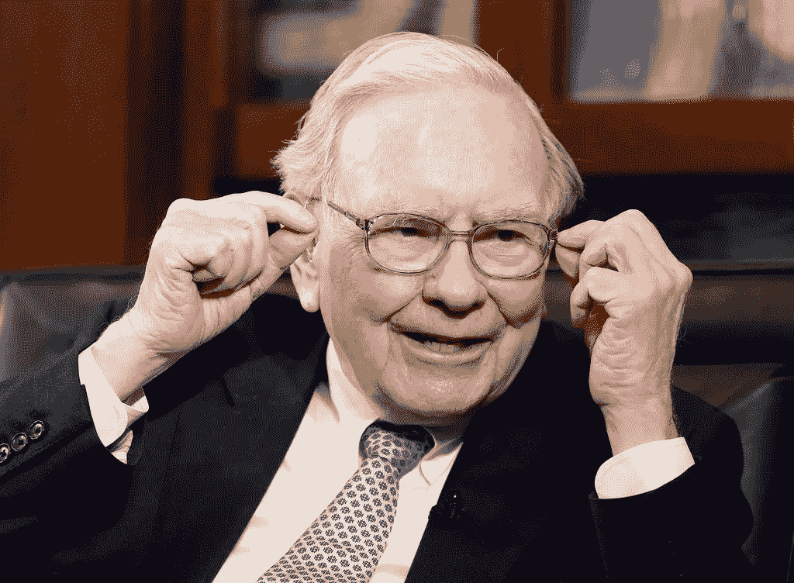

# 你是一个聪明的投资者吗？

> 原文：<https://medium.datadriveninvestor.com/are-you-an-intelligent-investor-deba1fe1884e?source=collection_archive---------17----------------------->

Photo By [freeimage4life](https://www.flickr.com/photos/140989741@N04/) On [Flickr](https://www.flickr.com/photos/140989741@N04/25812934256)

我从本杰明·格拉哈姆的《聪明的投资者》中得到了三点启示。

一个月前，我写了一篇名为“[我在一月读的三本书和他们的课程](https://medium.com/@kevinzshan/the-3-books-i-read-in-january-and-their-lessons-7792bc8fc76b)”的帖子，正如标题所示，是关于我在一月读的三本书和我学到的东西。

在那篇文章中，我发誓要在每个月底写一篇文章，详述我所读到的和学到的。

所以，今天我在这里写了一篇关于聪明的投资者*的文章。*

无可否认，我搞砸了。

我没看完*智能投资人*。我只看了一半。这个月我读了不到一本书——与上个月的三本书和我设定的每月 4-6 本书的目标相差甚远。

但既然我发誓每个月底都要写一篇帖子详细介绍我所学所读，我就让自己尴尬一下，分享一下我从半本书里得到的教训。

# 情商是一个聪明投资者的核心属性

聪明的投资者的关键一课是在投资时保持情绪控制和逻辑。

> “在一生中成功投资并不需要极高的智商、非同寻常的商业洞察力或内幕消息。我们需要的是一个健全的决策智力框架，以及防止情绪侵蚀这一框架的能力。”—沃伦·E·巴菲特
> 
> 《聪明的投资者》第四版序言

不要让过度乐观或不合理的悲观情绪左右你的投资决定。

仅仅因为其他人都认为一只股票会上涨，并不意味着你应该开始把你的钱投入其中。

 [## 算法交易的机器学习|数据驱动的投资者

### 当你的一个朋友在脸书上传你的新海滩照，平台建议给你的脸加上标签，这是…

www.datadriveninvestor.com](https://www.datadriveninvestor.com/2019/01/30/machine-learning-for-stock-market-investing/) 

而且每个人都认为一只股票要跌，并不意味着你要亏本把钱都拿出来。

> 不要参与愚蠢的事。做一个理性、冷静观察股市混乱的人。

当股票下跌，每个人都在抛售时，这可能是你买入的最佳时机。当股票上涨，每个人都在买入时，那就是你卖出的机会。

截至 2020 年 2 月 29 日，这些信息非常有用。

我们刚刚经历了长达 10 年的牛市，股市攀升至令人发指的高价，而现在，由于冠状病毒，市场正在下跌，因为股东们在恐惧中抛售股票。

一个聪明的投资者认识到这种情况是一个以折扣价购买股票，然后获利的机会。

# 你自己的判断是最好的判断

小心顾问！不要像绵羊一样随意听从建议。

我个人犯了这个错误。

我持有的邵氏通讯(SJR)和景顺 KBW 高股息率金融 ETF (KBWD)中的两只股票是在分别由 [The Motley Fool](https://www.fool.ca/) 和 [Investopedia](https://www.investopedia.com/) 发表的博客文章之后买入的。

对于 KBWD 来说，故事稍微好一点。

它的股息率高达 8%左右，并且按月支付。这很好，因为它每月累积，你拥有的股份越多，你得到的就越多。

如果我持有更多的股票，这将成为每月收入的一个很好的来源。但我不知道我要面对的是什么。

我做了一点研究，意识到我有多少不知道的。我发现了它高达 1.35%的费用率以及一些基金的持股。

我了解到 ETF 正在跟踪一个 KBW 银行指数，但我不知道它是什么。

肖的故事更糟糕一点。我知道 Shaw 做了什么——我是说，我们家用的是 Shaw 互联网。

但我真的应该在买入 Shaw 之前做些调查。今天早上我意识到 Shaw 的市盈率是 234 倍！

我再次买入，因为一篇文章谈到了该公司每月的股息，但我真的不想永远持有该公司。

幸运的是，我是一个很小的投资者，我只有 4 股 SJR，所以我可以永远持有它，不会有太大的伤害。

当我真的做了“研究”之后，事情就好了很多。

我在为一个学校项目做一点虚拟交易，我很高兴地说，我的每一只股票都上涨了。

我特别引以为豪的投资是显卡公司英伟达(NVDA)。如果我真的持有到现在，我的投资几乎会翻倍。

# 我真的在投资吗？

我把“研究”放在引号里是有原因的。

《T4:聪明的投资者》的第一章是关于投资与投机的章节。

我不得不对自己非常诚实。我真的是投资者还是投机者？

当我买了 10 股可口可乐(Coca-cola)时，我意识到自己只比投机者强一点点。

我为什么买 KO？

嗯，我喜欢可口可乐在健康趋势出现时的多样化，以及他们如何通过圣诞节和北极熊进行营销。

一般的投机者不会去想那些东西，但一个适当的投资者会去深入。

至于阅读他们的股东报告和查看财务状况，我完全不知所措。我没有花任何时间做那件事。

我没有看数字来判断 KO **是否真的**是一项好的投资。我加入是因为我喜欢这家公司，这不是投资。

你真的在投资吗？还是你只是一个投机者？

# 《聪明的投资者》,一本未来十年的好书

随着冠状病毒和最近的市场调整吓坏了投资者，人们一直预测将出现巨大的熊市。

在过去的 10 年里，股票市场一直攀升到陡峭的水平，也许现在是市场暴跌的时候了。

聪明的投资者知道该做什么。保持冷静，坚持自己合理的长期投资原则。

我还需要读完这本书，但是已经把我学到的一些概念付诸实践，这很令人惊讶。