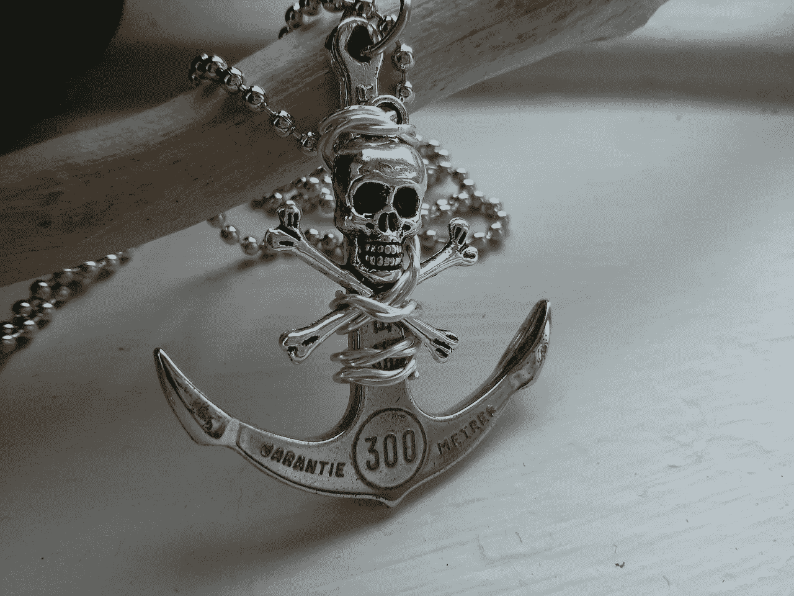

# 您的业务是否依赖于错误的数据？

> 原文：<https://medium.datadriveninvestor.com/are-you-anchoring-your-business-to-the-wrong-data-6e4248cdb305?source=collection_archive---------22----------------------->

在疫情的这几个月里，你改变了对新冠肺炎的看法吗？还是你坚持三月份的观点？

例如，许多人仍然相信许多著名领导人在三月份散布的错误言论，即 COVID 并不比普通流感更糟糕。他们[抗议](https://toronto.citynews.ca/2020/11/02/town-of-aylmer-declares-state-of-emergency-ahead-of-anti-masking-freedom-march/)戴口罩等公共卫生措施，尽管[高质量的同行评议研究](https://www.nature.com/articles/d41586-020-02801-8)显示口罩节省排队。

他们也忽视了新的发展，例如最近州长们紧急要求留在家里和远程办公来压制爆炸性的第三波 COVID。同样，他们也没有注意到[刚刚发表的研究](https://www.statnews.com/2020/11/10/restaurants-gyms-were-spring-superspreader-sites-occupancy-limits-could-control-spread/)显示，餐馆、健身房、酒店、礼拜场所、较小的杂货店和其他长时间暴露在空气中的拥挤室内空间——包括符合这些标准的工作场所——会显著增加 COVID 风险。

有了关于这种扰乱世界的病毒的所有信息，有很多机会增加你对时事的了解。事实上，随着时间的推移，我们对疫情的许多基本看法都发生了变化。如果我们真的依靠事实，我们的观点将会和我们开始的地方非常不同。

不幸的是，现实更加复杂。基于我们最初收到的信息，我们倾向于继续走同一条路。这是不顾强有力的新证据，我们的道路导致悬崖。认知神经科学家和行为经济学家给这种危险的判断错误起的名字是[锚定](https://psycnet.apa.org/doiLanding?doi=10.1037%2F0022-3514.73.3.437)。

这是导致我们在疫情和其他生活领域做出糟糕决定的众多认知偏见之一。认识到这些认知偏见的危险和影响有助于我们做出更好的决策，明智地管理风险，让 T2 在这个疫情中生存和发展。

# 金融服务中的锚定:案例研究

让我们来看一下 Lauren 的案例，她是一家总部位于得克萨斯州、拥有 130 名员工的区域性金融服务公司的首席执行官，该公司在疫情开始时在远程工作方面遇到了很多困难。

领导团队认为他们不需要为超过一两周的中断做准备。这是因为他们遵循了疾病预防控制中心的[早期指导方针，只为短期爆发造成的短暂中断做准备。](https://www.businessinsider.com/disaster-expert-companies-should-face-coronavirus-with-pessimism-2020-3)

因此，领导团队要求所有员工在各州重新开放时回到办公室，尽管有新闻报道称德克萨斯州的病例有所增加。相当多的员工害怕并拒绝回到办公室，导致冲突和紧张。

最终，大部分员工都回来了。然而，由于公司领导层认为新冠肺炎没什么大不了的，领导和员工都没有采取适当的预防措施。这是因为一个叫做“[情绪传染](https://journals.sagepub.com/doi/pdf/10.1111/1467-8721.ep10770953)的精神盲点，追随者会对他们的领导者产生情绪、信念和看法。

事实上，大多数高管和员工都没有遵循社交距离的指导方针，也没有戴口罩，特别是因为德克萨斯州官员没有强制要求戴口罩。试图戴口罩和保持社交距离的员工会受到同事的嘲笑，领导对此表示默许。

你大概能猜到接下来发生了什么。

不幸的是，在一次全体会议上，办公室爆发了新冠肺炎病毒。二十多名员工抓住了新冠肺炎，其中包括三名首席执行官。包括首席运营官在内的几名员工最终住进了医院，两名年长的员工死亡。这导致了公司生产力的下降、人员流失和士气低落。

劳伦在五月下旬通过我举办的关于组织如何适应疫情带来的变化的网络研讨会了解了我的工作后，决定联系我进行咨询。

劳伦打电话给我的时候，内部争斗已经蔓延到整个组织，导致一些关键员工辞职。这导致其他每个人的工作量增加，导致员工和管理层之间的关系更加紧张。

甚至那些最初避开混乱局面的人也表示，他们开始寻找其他工作机会，以便跳槽。很明显，公司需要帮助——而且要快。

# 新冠肺炎和认知偏差

当我与劳伦以及该公司的首席运营官和人力资源主管 Zoom 会面时，我预先告诉他们，他们必须开始承认新冠肺炎带来的干扰。继续这样做将会危及他们公司的底线，甚至在这个疫情时期的生存。

拒绝承认疫情的严重性，甚至对其轻描淡写的行为源于三个因素的结合:

*   病毒本身的性质
*   商业领袖们原有的信念和计划
*   我们都容易犯的危险的判断错误，认知神经科学家和行为经济学家称之为认知偏差，最明显的是锚定

后者的精神盲点很大程度上源于我们的进化背景。我们的[本能反应是为古老的热带草原](https://onlinelibrary.wiley.com/doi/full/10.1002/9781119125563.evpsych241#:~:text=Biases%20are%20often%20ascribed%20to,that%20contributed%20to%20fitness%20ancestrally.)环境进化而来的，而不是现代世界。然而，大师们和商界领袖们都极力主张听从我们的直觉。他们鼓励我们跟随直觉做决定，而不是使用[有效的决策过程](https://disasteravoidanceexperts.com/wise-decision-maker-movement-manifesto/)。

# 锚定:沉重的负担

锚定指的是我们倾向于被我们所拥有的初始信息牢牢地锚定，而不能根据新的证据充分更新我们的信念。即使客观地说，新的证据更有说服力。这个危险的判断错误在两个方面对新冠肺炎造成了深刻的伤害。

首先，商界和政界领袖以及普通民众都记得过去的大流行，尽管很严重，但并没有造成大范围的破坏。

SARS 是 21 世纪的第一个疫情，导致 26 个国家约 750 人死亡。H1N1，也被称为猪流感，导致更多人死亡，多达 50 万人。然而，这并没有对美国造成太大影响，死亡人数约为 12500 人，英国的死亡人数更少，约为 500 人，是欧洲死亡人数最多的国家。

埃博拉和寨卡病毒几乎没有到达美国。结果，大多数美国人忽视了新冠肺炎，认为它会像其他疾病一样不了了之。

第二个深刻的伤害来自于将新冠肺炎比作流感。在 3 月 4 日接受《福克斯新闻频道》采访时， [Donald Trump 将新冠肺炎](https://www.theguardian.com/world/2020/mar/05/trump-coronavirus-who-global-death-rate-false-number)称为“电晕流感”，并表示死亡率“远低于 1%”，暗示没什么可担心的，我们不需要采取重大行动来应对这种情况。

他在[3 月 9 日的推特](https://twitter.com/realdonaldtrump/status/1237027356314869761?lang=en)上肯定了这一点:“去年有 37，000 名美国人死于普通流感。平均每年在 2.7 万到 7 万之间。什么都不关，生活&经济继续。”

其他领导人传达了类似的信息，即一切正常。例如，3 月 5 日，英国确诊了 115 例新冠肺炎病毒，并出现了首例死亡病例， [Boris Johnson 说](https://www.bbc.com/news/uk-51749352)一切如常

尽管受到了广泛的批评，意大利也是一个突出的例子，但约翰逊政府未能实施封锁。相反，它在 3 月初建议人们只需洗手，如果他们最近去过意大利北部并出现流感样症状，自我隔离 14 天。

3 月 11 日，随着 590 例确诊病例的出现，政府行为洞察团队的首席执行官 David Halpern 告诉 BBC 新闻，政府的目标包括保护最脆弱的人群。

政府将允许新冠肺炎更广泛地感染英国人口，直到人口发展出群体免疫力，这样新冠肺炎将停止传播自身，这需要大约 60%的人被感染。第二天，在一次新闻发布会上，约翰逊证实了这一策略，告诉有流感样症状的人进行自我隔离，并告诉 70 岁以上的人避免乘坐游轮。

事实上，在高质量治疗的情况下，新冠肺炎的估计死亡率约为 0 . 5—1 %,远低于埃博拉的 50%和非典的 15%。然而，感染率要高得多，部分原因是大约一半的感染者没有表现出任何症状。即使那些最终表现出症状的人也往往在出现症状之前就具有传染性。

因此，如果没有严格的控制，每个感染者[会有 2-3 人患病](https://wwwnc.cdc.gov/eid/article/26/7/20-0282_article)，任何疫情都会在 3-6 天内翻倍。此外，大约 10-20%的感染者患有严重疾病，主要是老年人，大约一半患有严重疾病的人需要去医院。

鉴于医院对激增的患者能力不足，一场大爆发将使医疗系统不堪重负。

特朗普和约翰逊不负责任的做法为他们各自国家的大多数其他政治和商业领袖以及普通公民的做法奠定了基础。这样的锚定耗费了许多生命和数不清的数十亿美元和英镑。

 [## 你的 COVID 等级是多少？为疫情安全设计办公空间|数据驱动投资者

### 自从新冠肺炎·疫情席卷美国，迫使工人逃离办公室，走向孤立无援的境地…

www.datadriveninvestor.com](https://www.datadriveninvestor.com/2020/11/23/whats-your-covid-rating-designing-office-spaces-for-pandemic-safety/) 

# 适应新的异常

当疫情启动时，大多数公司都启动了他们的业务连续性计划，然后随着时间的推移继续执行。

然而，我不建议在疫情的[最小的两年里继续这些紧急措施。在事情开始恢复正常之前，业务连续性计划意味着一周或两周，如果它是一个真正好的计划，最多一个月(我告诉你这些是因为我曾](https://disasteravoidanceexperts.com/the-trap-of-getting-back-to-normal-in-the-pandemic/)[帮助企业和非营利组织设计](https://disasteravoidanceexperts.com/consulting/)许多业务连续性计划)。

我们不太可能回到疫情“正常”的原状。

我们的社会将永远不会是原来的样子，即使在最乐观的情况下，也只是两年的停工和社会距离。请记住，我们不应该追求最乐观的情况，而应该做最坏的打算。

如果第一波或第二波疫苗不是非常有效，将 COVID 预防在 80 %- 90 %,它将更像是一个五年期而不是两年期。这是你未来应该做的计划。

如果公司想在未来几年生存和发展，他们需要超越紧急措施。你需要[适应疫情](https://disasteravoidanceexperts.com/adapt/)并接受当前的现实[正在进行的限制浪潮](https://edition.cnn.com/2020/08/20/health/us-coronavirus-thursday/index.html)成为新的异常。

这实质上意味着，如果你想让你的组织在这些困难时期走上一条富有成效和回报的道路，就要转变你的[内部](https://youtu.be/q3WKeUoZYwM)和[外部](https://youtu.be/QCXnherBMU8)商业模式。

这样做将包括花很长的时间，认真审视推动你的业务的因素。这还需要修改，或者在某些情况下，甚至彻底修改你的日常运作和业务连续性计划。

# 从锚定向前移动

几个月前，当我最后一次与劳伦交谈时，她告诉我，经过认真考虑，她呼吁召开一次领导会议，重新审查新冠肺炎的事实。

她和她的首席运营官带着他们能找到的关于疫情的最准确的信息来参加会议，这些信息来自优先考虑事实报道的新闻来源。

他们有备而来是正确的，因为这是他们职业生涯中最痛苦的讨论之一。大多数高管仍坚持此前 3 月份的信息，即不应认真对待这种病毒。

因此，他们不想承认需要做出改变。即使是那些最初持观望态度的人——包括一名较早感染病毒并已康复的高管——也不想改变立场。高管们显然不想承认他们错了。

我们三个人——通过几次磋商——为这种情况做好了准备，这是一件好事。劳伦在看到高管们表现得如此顽固后，巧妙地将讨论重新定义为重新制定策略的努力，而不是相互指责和指责。

她还强调了在疫情期间，那些适应了这种情况的竞争对手是如何蓬勃发展的。

最后，面对压倒性的证据表明新冠肺炎是一个严重的问题，他们需要立即采取措施，高管们最终承认了形势的严重性。这为领导团队最终走到一起制定并采取以下步骤铺平了道路:

1.  劳伦召开了一次全公司范围的虚拟市政厅会议，向员工保证他们的担忧已经被听到，并将迅速采取行动。当务之急是揭穿公司大多数人所依赖的关于新冠肺炎的错误信息。
2.  领导团队推出了全面的远程工作计划，为员工提供技术和设备支持。员工也可以向办公室报告，但这完全是可选的。领导团队确保办公室有所有必要的视觉和物理线索来鼓励社交距离。有策略地放置了关于戴口罩的提醒。
3.  营销团队更新了其外部和内部宣传材料，以包括该公司为使其员工的虚拟和物理空间安全所做的工作。它还将这一信息以及来自著名新闻来源的重要新冠肺炎最新消息纳入其长期发行且读者广泛的内部简讯中。
4.  首席运营官与人力资源主管合作，努力留住关键员工，防止他们跳槽。他们还联系了那些已经辞职的人。在大多数情况下，问题源于这些员工拒绝踏进办公室一步。然后，努力集中在保证他们可以尽快远程工作，并且提供更灵活的工作时间。
5.  销售团队以营销团队的行动为基础。他们还联系了之前对该公司对询问和投诉反应迟缓感到不满的客户。销售团队展示了为使公司快速运营和向客户保证更好服务而进行的所有变革。

由于这些努力，该公司能够纠正其路线，并最终回到富有成效的道路上。员工们感到更安全，因此变得更有效率。尽管留住员工的努力只有 80%的成功率，而且一些关键员工没有回来，但领导团队一致认为，这是一个比他们在战略转向之前要好得多的结果。

现场工作的严格政策也将健康风险降至最低，从而降低了公司在办公室爆发疫情时的责任风险。这是首席执行官肩上的一个重担。他们最终能够专注于产品开发和挽救客户关系，幸运的是，这在一定程度上已经得到了销售团队的推动。

Lauren 告诉我，领导团队对他们所做的改变感到满意。她还告诉我，一旦新冠肺炎病例开始增加，促使重新开放过程暂停，最终导致重新开放和限制的循环，她感到多么宽慰。

# 结论

锚定使我们专注于我们收到的初始信息，即使它是错误的。随着疫情继续扰乱商业，你需要警惕误导的观点和信念，它们会阻碍你的发展。通过保护自己免受锚定带来的危险，让你的公司保持弹性和适应性。

# 关键外卖

> 锚定让你被最初的信息束缚，让你无法前进。打破这种思维盲点，做出推动公司发展的最佳决策……>[点击发推](https://twitter.com/intent/tweet?text=Anchoring%20keeps%20you%20shackled%20to%20initial%20information%20and%20keeps%20you%20from%20moving%20forward.%20Make%20the%20best%20decisions%20to%20propel%20your%20company%20by%20breaking%20free%20from%20this%20mental%20blindspot.&url=https%3A%2F%2Fbit.ly%2F3eOCAtA&via=Gleb_Tsipursky)

# 需要考虑的问题(请在下面分享您的答案)

*   在疫情开始的时候，你的领导团队是否依赖于错误的信息，现在你是否想纠正错误？
*   在反对锚定方面，你在哪里做得更好？
*   根据阅读这篇文章，你将采取哪些后续步骤？

图片来源: [ekoingfreemind/Pixabay](https://pixabay.com/de/photos/anker-totenkopf-sch%C3%A4del-pirat-2195924/)

**Bio** :国际公认的思想领袖，被称为灾难规避专家，[Gleb Tsipursky](https://disasteravoidanceexperts.com/glebtsipursky/)博士的使命是通过制定最有效的决策策略来保护领导者免受被称为认知偏差的危险判断错误的影响。作为一名畅销书作家，他最著名的作品是《T4》*《永远不要跟着感觉走:先锋领导者如何做出最佳决策并避免商业灾难* (职业出版社，2019 年)、《我们之间的盲点:如何克服无意识的认知偏见并建立更好的关系 (《新先驱》，2020 年)和《恢复力:适应并规划新冠肺炎冠状病毒疫情 (《变革者图书》，2020 年)他发表了 550 多篇文章，接受了 450 多个知名媒体的采访，如[*Inc .*](https://www.inc.com/entrepreneurs-organization/a-behavioral-scientist-explains-why-your-swot-analysis-is-dangerously-flawed.html)[*企业家*](https://www.entrepreneur.com/article/348115)[*CBS 新闻*](https://www.cbsnews.com/video/study-says-taking-a-small-break-from-facebook-might-be-good-for-your-mental-health/)[*时代*](http://time.com/4257876/wounded-warrior-project-scandal/)[*商业内幕*](https://www.businessinsider.com/disaster-expert-companies-should-face-coronavirus-with-pessimism-2020-3)[*政府官员*](http://www.govexec.com/excellence/promising-practices/2017/03/heres-why-your-gut-instinct-wrong-work-and-how-know-when-it-isnt/136104/)[他的专业知识来自于作为](https://disasteravoidanceexperts.com/NeverGut/)[避灾专家](http://disasteravoidanceexperts.com/)的 CEO，20 多年的[咨询](https://disasteravoidanceexperts.com/consulting/)、[辅导](https://disasteravoidanceexperts.com/coaching/)、[演讲和培训](https://disasteravoidanceexperts.com/speaking/)。这也源于[作为一名行为经济学家和认知神经科学家在学术界超过 15 年的](http://disasteravoidanceexperts.com/research)。通过 Gleb[at]DisasterAvoidanceExperts[dot]com、Twitter[@ Gleb _ tsipursky](https://twitter.com/Gleb_Tsipursky)、insta gram[@ dr _ Gleb _ tsipursky](https://www.instagram.com/dr_gleb_tsipursky/)、 [LinkedIn](https://www.linkedin.com/in/dr-gleb-tsipursky/) 联系他，注册他的免费[明智决策者课程](https://disasteravoidanceexperts.com/newsletter/)。

*原载于* [*避灾专家*](https://disasteravoidanceexperts.com/are-you-anchoring-your-business-to-the-wrong-data?/)

## 访问专家视图— [订阅 DDI 英特尔](https://datadriveninvestor.com/ddi-intel)