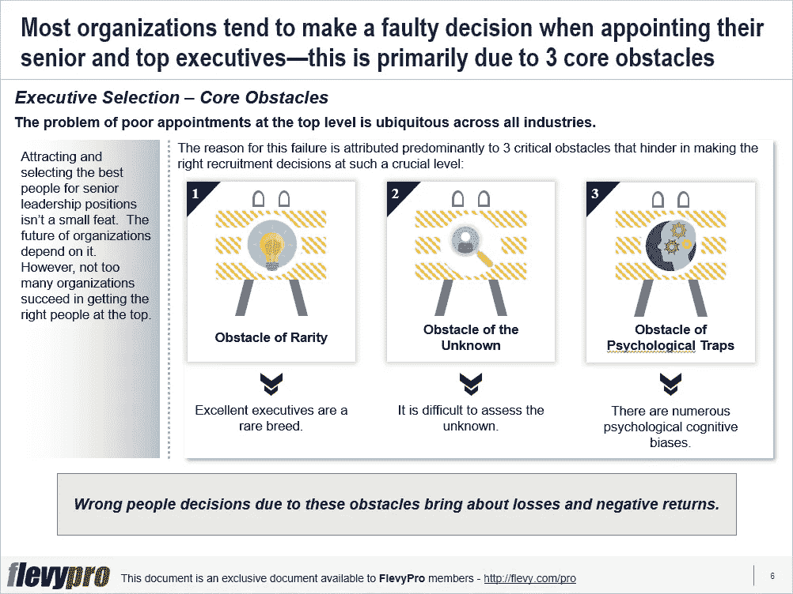

# 你是否意识到入职高管需要克服的 3 个障碍？

> 原文：<https://medium.datadriveninvestor.com/are-you-aware-of-the-3-obstacles-to-overcome-while-on-boarding-senior-executives-48244a711e45?source=collection_archive---------18----------------------->

平庸的人占据高级领导职位是安然和世通这样的公司遭遇惨败和羞辱的主要原因之一。在高层招募普通人的做法无处不在，往往在结果开始浮出水面之前不为人知，而这通常对任何干预来说都为时已晚。

聪明人的决策对实现盈利非常重要。研究表明，在许多行业中，5%的平均人力资产回报率是典型的。然而，高级管理人员选择了低于平均收益率 2 个标准差-15%的资产回报率。高于平均水平 2 个标准差的管理层选择会产生 25%以上的回报，是平均水平的 5 倍。在寻找和雇佣最优秀的高级管理人员方面增加投资可以获得 1000%的回报。

吸引和选择最优秀的人担任高级领导职位不是一件小事。组织的未来取决于它。然而，没有太多的组织成功地将合适的人放在最高层。失败的原因主要归因于 3 个关键障碍，它们阻碍了在如此关键的级别做出正确的招聘决策。由于这三个障碍导致的错误[高管选择](https://flevy.com/browse/flevypro/executive-selection-5346)决策带来损失和负收益；

1.  **稀有障碍**
2.  **未知的障碍**
3.  **心理陷阱的障碍**

让我们稍微详细地讨论一下这些障碍。

# 稀有障碍

寻找优秀高管担任高级职位的第一个障碍是他们的稀缺性，因为优秀的高管是稀有品种。让高管脱颖而出的复杂技能并不常见。它们分布在给定的样本中。

杰出的人比他们的同龄人表现出更高的水平，尤其是在高层。一个标准偏差高于平均值 1 的蓝领高管比普通高管多产出 20%。随着工作越来越复杂，优秀员工和一般员工之间的差距也越来越大。

高级职位的任命不会没有评估错误，这可能证明是极其昂贵的。即使是高管评估中 90%的准确率也不令人满意。这导致了许多被错误归类的优秀员工和优秀候选人的被拒绝。

# 未知的障碍

高管选拔过程的另一个障碍是对候选人所需技能和属性以及个人实际交付能力的预测性评估。很难评估未知的事物。

初级水平的能力更容易定义，但很难确定顶级水平所需的技能。由于政治、技术和经济形势的变化，高层所需的技能也在不断变化。随着时间的推移，如今所需的技能会变得过时。如果一个职位的确切要求是众所周知的，就不能确定候选人是否完全符合要求。

准确评估候选人的行为和能力是困难的，但值得投入精力和资源。“软”技能——例如，领导人员、辅导和发展团队、团队合作和管理[业务转型](https://flevy.com/browse/stream/transformation)——是高层领导的差异化所在，但评估这些技能需要全面的评估和大量的时间，这在高层很难做到。

# 心理陷阱障碍

许多心理陷阱与人类的认知偏见有关，这些偏见阻碍了人们的[决策](https://flevy.com/business-toolkit/decision-making)能力，并使招聘过程无法进行。个人最常见的 8 种心理陷阱:

*   **拖延症**
*   **假设不正确**
*   **基于第一印象的冲动判断**
*   **忽视警告标志**
*   **掩盖错误**
*   **熟悉感结合**
*   **情感锚定**
*   追随大多数人的倾向

如需了解更多关于选拔和聘用“精英中的精英”的信息，请查看[fiacabrino 选拔流程(FSP)](https://flevy.com/fiaccabrino-selection-process) 。在这里下载免费的 FSP 入门读物。

有兴趣了解阻碍正确的高管选择的 3 个关键障碍吗？你可以在[Flevy documents market place](https://flevy.com/browse)的**高管选拔**这里下载[可编辑的 PowerPoint 演示文稿。](https://flevy.com/browse/flevypro/executive-selection-5346)

## 你在这个框架中找到价值了吗？

您可以从 [FlevyPro 库](https://flevy.com/pro/library)下载关于这个和数百个类似业务框架的深入介绍。FlevyPro 得到了数千名管理顾问和企业高管的信任和使用。有些人不得不说:

> “我的 FlevyPro 订阅为我提供了当今市场上最受欢迎的框架和平台。它们不仅增加了我现有的咨询和辅导产品和服务，还让我跟上了最新的趋势，为我的实践激发了新产品和服务，并以其他解决方案的一小部分时间和金钱教育了我。我强烈推荐 FlevyPro 给任何认真对待成功的顾问。”

–战略商业建筑师事务所创始人比尔·布兰森

> “作为一家利基战略咨询公司，Flevy 和 FlevyPro 框架和文件是一个持续的参考，有助于我们为客户构建我们的调查结果和建议，并提高他们的清晰度、力度和视觉效果。对我们来说，这是增加我们影响力和价值的宝贵资源。”

–Cynertia Consulting 的咨询区域经理 David Coloma

> “作为一个小企业主，FlevyPro 提供的资源材料已被证明是非常宝贵的。根据我们的项目事件和客户要求按需搜索材料的能力对我来说很棒，并证明对我的客户非常有益。重要的是，能够针对特定目的轻松编辑和定制材料有助于我们进行演示、知识共享和工具包开发，这是整个计划宣传材料的一部分。虽然 FlevyPro 包含任何咨询、项目或交付公司都必须拥有的资源材料，但它是小公司或独立顾问工具箱中必不可少的一部分。”

–变革战略(英国)董事总经理迈克尔·达夫

> “作为一名独立的成长顾问，FlevyPro 对我来说是一个很好的资源，可以访问大量的演示知识库来支持我与客户的合作。就投资回报而言，我从下载的第一个演示文稿中获得的价值是我订阅费用的好几倍！这些资料的质量让我能够打出超出自己体重的水平，这就像是用很小一部分开销就能获得四大咨询公司的资源一样。”

–Roderick Cameron，SGFE 有限公司的创始合伙人

> “我每个月都会浏览几次 FlevyPro，寻找与我面临的工作挑战相关的演示文稿(我是一名顾问)。当主题需要时，我会进一步探索，并从 Flevy 市场购买。在所有场合，我都阅读它们，分析它们。我采纳与我的工作最相关和最适用的想法；当然，所有这些都转化为我和我的客户的利益。"

量子 SFE 公司首席执行官奥马尔·埃尔南·蒙特斯·帕拉