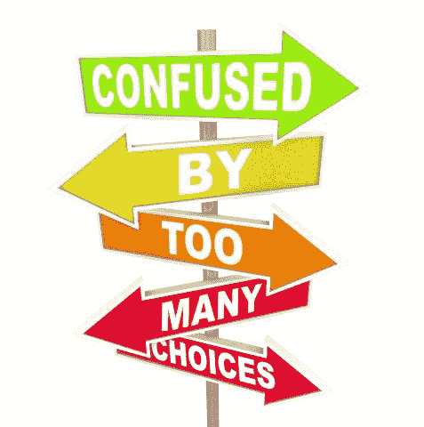

# 你正在体验 FOBO 吗？

> 原文：<https://medium.datadriveninvestor.com/are-you-experiencing-fobo-f11af7aa2f96?source=collection_archive---------4----------------------->

## 你听说过害怕更好的选择吗？

Picture provided by Data Driven Investor

我们知道做出选择很难。我们的选择越多，我们探索的就越少，我们就越有可能选择默认设置。更有趣的是，艾扬格和莱珀(1999，2000，2002，2004…)表明，当人们在决策任务中获得的选项较少时，与那些拥有大量选项的人相比，他们会从决策结果中获得更大的满足感。这看起来如此违背直觉，如此自相矛盾，以至于被称为选择悖论(或选择超载)。

 [## 决策的移情设计方法如何工作|数据驱动的投资者

### 移情设计是一种产品设计方法，首先由多萝西·伦纳德和杰弗里·雷波特在哈佛大学提出

www.datadriveninvestor.com](https://www.datadriveninvestor.com/2018/07/18/how-the-empathic-design-method-of-decision-making-works/) 

这是不是可以用 ***害怕更好的选择【FOBO】***来解释呢？

# 什么是 FOBO？

FOBO，FOMO 的妹妹(害怕错过)，已经来到我们身边。是的，这两个术语都是由同一个人创造的:[帕特里克·麦金尼斯](https://en.wikipedia.org/wiki/Patrick_James_McGinnis)，美国风险投资家。他提出，对更好选择的恐惧是我们不能承诺任何事情的原因。嗯，对于这样一个巨大的声明，我觉得我们应该潜入更深。我们走吧。

作为一个理论概念，FOBO 很简单:你害怕更好的东西就在那里，或者将要出现，因此你发现很难做出选择。你可能会发现选择是如此困难，你可能会愿意无限期地推迟它。你可能永远不会提交(* *文章加重了* *)。

Picture provided by Data Driven Investor

# FOBO 是做什么的？

不，玩笑归玩笑，总有更好的东西存在的想法是有害的。如果没有时间限制，人们可能会花几周、几个月或几年的时间去做一件事。具有讽刺意味的是，从经济人的角度来看，这可能不像人们想象的那样不合理。

经济人是效用最大化者。如何最大化效用？通过选择最好的选择。你如何找到最佳选择:研究。探索，最后是剥削(嗨托马斯)。但是当今世界的研究是无止境的。想到买手机。如果你没有品牌偏好，没有预算限制，世界就是你的。当你调查了所有可能的选择，权衡了价格、功能和美观等因素后。新款手机将会发布，你可以重新开始。还没有买新手机。

Picture provided by Data Driven Investor

在现实生活中，这种行为一点也不适应:它占用了太多的认知资源，如果不是占用太多时间的话。保持优柔寡断的状态就是在你的选择上来回摇摆，浪费资源。

幸运的是，在现实生活中，时间是有限的(你什么时候需要新手机？)、预算限制(你能在电话上花多少钱)以及选择限制，如品牌偏好、忠诚度或消费者在市场中的地位。但即使这样…

除了 FOBO，还有其他值得关注的事情是后悔和失望理论(嗨[格拉汉姆](https://www.moneyonthemind.org/post/interview-with-graham-loomes)和[鲍勃](https://www.moneyonthemind.org/post/interview-with-bob-sugden)！).没有太多的技术，这两个理论都假定测量选择选项的效用(这几乎是不可能的)本身是不够的。你还需要考虑可能的遗憾和/或失望(这些是不同的理论！一个人可能会经历选择了一个选项，而没有选择其他选项。在某些情况下，初始效用值会因此而降低，尽管对于某些选项，它可能会增加。这个理论非常直观:我体验到我的选择的价值(效用)-/+在所有其他选择中选择它的价值。

对 FOBO 来说，这种减少被解释为害怕更好的东西在那里，或者可能会出现。

# 如何减少 FOBO？

所以 FOBO 是一个问题。它降低了一个选择的价值，完全是出于对过早做出承诺或者根本就没有做出承诺的恐惧。但是正如我之前所说的，持续浪费你的资源在已经是“正确的”选择上，会耗费太多额外的压力、担忧、时间和其他认知资源，这样既不健康，也没有成效。因此，尝试离开 FOBO 是个不错的主意。

鉴于 FOBO 主要是由于没有能力探索所有选项(选项太多了)而导致的，这激发了恐惧，你最好有一个有限的选择池。选择可以被人为地限制，无论是你自己还是朋友。

让我们回到手机的例子:为这款手机建立一个清晰的标准列表:最高价格，你需要的功能，你关心的美学，尺寸，[重量](https://www.datadriveninvestor.com/glossary/weight/)，发布以来的年龄，品牌(如果你有明确的偏好)。这是相当严格的。你的人才库最终将拥有一个定价区间内一个品牌的几款车型。挑一个你喜欢的颜色和屏幕，然后结账，买下这个该死的东西，鲍勃就是你的阿姨了。

另一个“搞定”的方法是给自己设定人为的时间限制，如果环境还没有这样做的话。在电话的例子中

Picture provided by Data Driven Investor

但即使这样，也有后悔的可能。这个遗憾是显而易见的。但是，也主要基于你做出了选择。是的，你可以付钱给人(或者友好地询问密友或亲戚)让他们为你做出选择。这就是为什么很多人求助于顾问和咨询师。专业知识，内部知识，但通常也有人为他们做决定。我并不是说这种“分散责任”总是一件好事。但有时，不必花 3 周时间去辩论每一个必须做出的选择，这是一件好事！

最重要的是，为了消除遗憾，你需要停止寻找你犯下的错误。你不能一直寻找更好的选择(谈论婚姻咨询技巧！).万一手机，不要一直看别的手机！这肯定会让人发疯。而且它很少会确认你选择了最好的一个，所以停下来！

然而，幸运的是，在电话的情况下，你会很快习惯这种设备。一旦你习惯了它，知道了它的快捷方式和怪癖，你就会爱上它胜过一切。为什么？[禀赋效应！](https://www.moneyonthemind.org/post/i-like-it-because-it-s-mine-endowment-effect)而且这种影响可以延伸到你做出的任何选择。所以，有东西在对抗 FOBO！只是需要一点时间来发挥作用🙂

**本文中古怪的、略显随意的叫卖声是对那些向我介绍这些概念的老师们说的，他们对这一研究领域做出了重大贡献，如果不是创立了它的话。*

# 参考资料:

艾扬格和莱珀关于选择和选择过载的任何东西都可以在这里找到:【https://scholar.google.com/scholar?hl=nl】T4&as _ SDT = 0% 2c 5&q =艾扬格+和+莱珀++选择& btnG=

卢姆斯，g .，&萨格登， [R](https://www.datadriveninvestor.com/glossary/r/) 。(1982).不确定条件下理性选择的另一种理论。*经济日报*， *92* (368)，805–824。

卢姆斯和萨格登(1987 年)。在不确定的情况下测试选择中的后悔和失望。*《经济日报》*， *97* (增刊)，第 118–129 页。

## 关于作者

莫尔·范·登·阿克是华威商学院行为科学专业的博士生。她研究了不同的支付方式，尤其是非接触式和移动支付方式，对我们管理个人财务的影响。在她的“空闲”时间里，她写了一些关于个人理财、行为科学、行为金融和博士生生活的文章，这些都发表在《金钱在头脑》上。通过 DDI，她撰写了关于个人和行为金融的文章，以确保学术界的知识流入主流，并能帮助尽可能多的人！

*原载于 2020 年 1 月 12 日*[*【https://www.datadriveninvestor.com】*](https://www.datadriveninvestor.com/2020/01/12/are-you-experiencing-fobo/)*。*