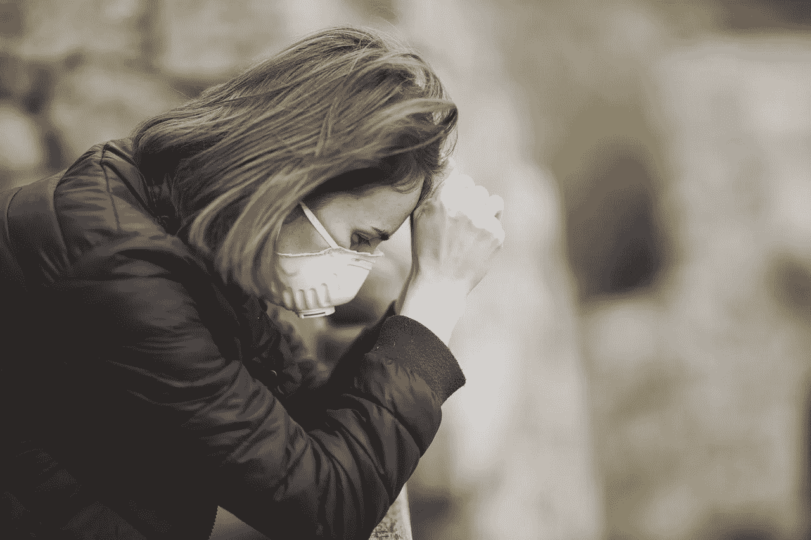

# 你感到焦虑吗？

> 原文：<https://medium.datadriveninvestor.com/are-you-feeling-covid-anxiety-fc3e4c92901?source=collection_archive---------20----------------------->

每当你听到关于新冠肺炎的新闻，尤其是最近的第三次浪潮，你是否会感到越来越不安？每当你通过社交媒体帖子看到朋友们相对富有成效的生活时，你会不会经常问自己，在这个疫情，你是不是唯一一个不成功的人？

如果你最近感到额外的压力或担忧，这并不罕见。许多其他人也有这种感觉。

随着病毒在全国蔓延，破坏了计划和常规，它留下了一条不可预测的道路——足以造成一些需要解决的精神健康和健康问题。

事实上，根据[疾病预防控制中心关于精神健康的报告](https://www.cdc.gov/mmwr/volumes/69/wr/mm6932a1.htm)，压力和焦虑以及临床抑郁症在美国呈上升趋势。事实上，与去年同期相比，第二季度全国压力和焦虑率增加了两倍(从 8.1%到 25.5%)。与此同时，与一年前相比，抑郁症几乎翻了两番(从 6.5%上升到 24.3%)。

这些数字，加上疫情在我们个人和职业生活中取得的重大成果，绝对令人担忧。以下是应对 COVID 焦虑症需要做的事情。

# 立即处理 COVID 焦虑

你可能被诱惑去最小化或忽略你的真实感受，或者你可能不太明白你一直以来有多焦虑或压力。

尽管如此，如果你继续掩盖这些问题，要考虑到对你整体健康的影响。请注意，你的焦虑和压力不会因为你的意愿而消失——就像 COVID 不会神奇地消失一样。

你需要避免[常态偏差](https://pubmed.ncbi.nlm.nih.gov/7977181/)的诱惑，或者那种你可以快进今年困难部分的诱人感觉，或者事情会很快回到 COVID 之前的样子。

常态偏见是一百多种有害的判断错误之一，像我这样的认知神经科学、心理学和行为经济学的学者称之为[认知偏见](https://science.sciencemag.org/content/185/4157/1124)。它们是由我们的进化构造和我们大脑的特定方式结合而成的。这样的[心理盲点](https://disasteravoidanceexperts.com/blindspots)影响着我们生活的方方面面，从[健康](https://disasteravoidanceexperts.com/adapt/)到[政治](https://www.amazon.com/Pro-Truth-Practical-Putting-Politics/dp/1789043999)和[甚至购物](https://www.top10.com/blog/posts/what-really-drives-you-to-buy-what-you-buy)。幸运的是，最近的研究显示了有效和实用的策略来击败这些危险的判断错误。

为了解决压力和焦虑，我们必须适应与新冠肺炎的长期斗争，同时解决当前的问题。推迟这一调整是毫无意义的。

简单地想一想，当你选择直接解决问题时，你的生产率、舒适度以及个人和工作关系将会得到怎样的提升。

# 满足您战胜 COVID 焦虑症的需求

最有可能的是，很多让你焦虑或给你压力的事情都与疫情带来的不确定性有关。你很可能会觉得自己无法控制自己的生活。你感觉到的脆弱甚至会让你小题大做。

尽管如此，有些事情是你可以控制的。获得这些可能会给人一种稳定和舒适的感觉——在这个令人紧张的时代，我们不都渴望得到这些吗？

你可能熟悉亚伯拉罕·马斯洛的人类动机理论以及基于他工作的需求金字塔。马斯洛建议，需要满足特定的基本要求，这样人们才会保持积极性。

心理学家斯科特·巴里·考夫曼[用更新的研究完善了马斯洛的理论](https://www.penguinrandomhouse.com/books/552566/transcend-by-scott-barry-kaufman-phd/)，他的修正模型表明，人类需要下列因素来保持平衡和动力。

# 安全

这与人身安全有关。确保你和你爱的人可以在一个安全的地方呆上几个月，如果你所在的地区有重大的 COVID 爆发。你必须能够留在这个地方，牢记感染的浪潮，以及我们在等待疫苗时都必须应对的限制。

虽然不太可能，但为现实的悲观情况做计划是值得的。这意味着除了必需的药物外，还要有两个月的基本食物和清洁材料。为了确保良好的供应，考虑从专业的在线供应商那里批量购买这些商品，而不是在当地的食品店清理货架。这将是更实际、更负责任的做法。

还要记住，许多公司(很可能也包括您自己的公司)以及组织已经转移到远程工作环境。你可能需要远程办公一段时间，可能比你预期的要长，这取决于你的公司决定采取的商业策略。这意味着你有更多的时间呆在家里，所以要确保这是一个你可以无障碍工作的地方。

# 与他人的联系

如果你想摆脱压力和焦虑，你和你所爱的人以及你的社区的关系是极其重要的。你需要做几件事来维护它。

首先，想想你与家庭成员的直接联系。有了这些联系，最好[提前预料并解决问题](https://disasteravoidanceexperts.com/blindspots/)而不是让它们在以后爆发。如果你和一个浪漫的伴侣住在家里，你需要弄清楚如何以一种健康的方式参与进来，因为你们一直都在一起。

这同样适用于其他各种家庭成员。如果你的孩子从学校或大学回来，你也可能会把他们关在房子里。在这种情况下，你必须想办法帮助他们应对锁定疲劳。

你还需要和他们的学校联系，了解学校工作的最新情况。这些更新将帮助您更好地了解应该如何解决您孩子的教育问题——少了一件需要担心的事情。

应该更多地考虑如何对待家中 60 岁以上的老人或任何有健康问题的人(如果可以的话，包括你自己)。因为他们感染 COVID 的风险更高，所以需要采取重大措施来防止他们患病。

请记住，在这次疫情之前，要比平时更加小心，因为超过一半的 COVID 患者没有症状或症状很轻。

第二，想想你不在你家住的亲人。你和你的爱人可能不住在同一个房子里。基于你和其他家庭成员对病毒的易受伤害程度，你可能会选择有一种社会距离的关系，或者你可能会选择冒身体亲密的风险。

无论你决定采取哪种选择，只要确保你是有意识地做出选择，而不是随随便便。

把同样的原则应用到你的友谊中。你需要想办法和每个朋友保持联系，因为社交距离的建议和偏好可能会有所不同。

这意味着，如果面对面喝啤酒或吃午餐还不太可能，你可以选择在线互动，虚拟地消磨时间。请记住，在接下来的几个月，甚至几年，你可能需要维持这些替代的参与方式。

这也适用于你的社区活动，比如非营利活动、俱乐部、宗教团体等等。你需要制定一个在线计划，以防社交距离限制再次收紧。

考虑到正在进行的封锁和限制浪潮，我强烈建议弄清楚什么样的安排对你和你的关系有效。你越早解决这个问题，对所有参与者都越好。虽然美国不同的州有[不同的指导方针](https://www.nytimes.com/interactive/2020/us/states-reopen-map-coronavirus.html)，但根据 COVID 疫情的严重程度，任何事情都可能发生变化。

请记住，在这些困难时期，保持强大的联系会给你更多的稳定和舒适。拥有良好的[关系](https://glebtsipursky.com/why-do-more-buying-choices-cause-unhappiness-video-and-podcast/)会让你更好地处理 COVID 焦虑。

# 自尊

最后，确保解决和保护你的自尊。这指的是你的自尊、自信和对自己命运的掌控感。

你可以通过计划在疫情期间和之后你想如何生活来做到这一点。这样做会增强你的控制感，帮助你感到自信，这是处理焦虑和压力时的一个好方法。

你也应该探索你生活中的其他领域，在这个限制和约束的时期，你可以在这些领域做出改进，甚至是提高。

你甚至可以学习或提高新技能。大部分时间呆在家里提供了一个很好的机会来学习如何烹饪那些你想尝试很久的菜肴，或者演奏一种乐器，或者学习一门新的语言。

如果你在努力的同时注册了一个在线爱好者团体，你将会建立更多有意义的联系。我相信你会同意这样更好。

处理你最重要的需求是授权，并且将帮助你发展一种对你当前环境的良好掌控感。如果你有意识地坚持这样做，它会在疫情期间甚至之后提供一个强大的对抗焦虑和压力的平台。

# 结论

我们无法准确预测新冠肺炎疫情将如何结束，以及在此过程中我们的个人生活和工作生活将会被打乱多少。这就是为什么我们在这个时期经历压力和焦虑并不罕见。

然而，虽然这种想法带来的不确定性会导致不同程度的担忧，但你可以做一些事情来满足你的基本需求。能够这样做将把你从压力和焦虑的不适中释放出来。

# 关键外卖

> 通过解决你对安全、与他人的联系和自尊的基本需求，立即应对 COVID 焦虑和压力…> [点击发推文](https://twitter.com/intent/tweet?url=https%3A%2F%2Fdisasteravoidanceexperts.com%2F%3Fp%3D6887&text=Deal%20with%20COVID%20anxiety%20and%20stress%20immediately%20by%20addressing%20your%20fundamental%20needs%20of%20safety%2C%20connection%20to%20others%2C%20and%20self-esteem.&via=Dr_gleb_tsipursky&related=Dr_gleb_tsipursky)

# 需要考虑的问题(请在下面分享您的答案)

*   在这个疫情期间，你有没有感到压力或焦虑，现在你想做些改变变得更好吗？
*   你在哪些方面可以更好地应对 COVID 焦虑症？
*   根据阅读这篇文章，你将采取哪些后续步骤？

图片来源: [Engin_Akyurt/Pixabay](https://pixabay.com/photos/mask-coronavirus-quarantine-virus-5008653/)

*原载于* [*避灾专家*](https://disasteravoidanceexperts.com/are-you-feeling-covid-anxiety?/)

**Bio** :国际公认的思想领袖，被称为灾难规避专家，[Gleb Tsipursky](https://disasteravoidanceexperts.com/glebtsipursky/)博士的使命是通过制定最有效的决策策略来保护领导者免受被称为认知偏差的危险判断错误的影响。作为一名畅销书作家，他最著名的作品是《T4》*《永远不要跟着感觉走:先锋领导者如何做出最佳决策并避免商业灾难* (职业出版社，2019 年)、《我们之间的盲点:如何克服无意识的认知偏见并建立更好的关系 (《新先驱》，2020 年)和《韧性:适应并计划新冠肺炎冠状病毒疫情 (《变革者图书》，2020 年)他发表了 550 多篇文章，接受了 450 多个知名媒体的采访，如[*Inc .*](https://www.inc.com/entrepreneurs-organization/a-behavioral-scientist-explains-why-your-swot-analysis-is-dangerously-flawed.html)[*企业家*](https://www.entrepreneur.com/article/348115)[*CBS 新闻*](https://www.cbsnews.com/video/study-says-taking-a-small-break-from-facebook-might-be-good-for-your-mental-health/)[*时代*](http://time.com/4257876/wounded-warrior-project-scandal/)[*商业内幕*](https://www.businessinsider.com/disaster-expert-companies-should-face-coronavirus-with-pessimism-2020-3)[*政府官员*](http://www.govexec.com/excellence/promising-practices/2017/03/heres-why-your-gut-instinct-wrong-work-and-how-know-when-it-isnt/136104/)[他的专业知识来自于作为](https://disasteravoidanceexperts.com/NeverGut/)[避灾专家](http://disasteravoidanceexperts.com/)的 CEO，20 多年的[咨询](https://disasteravoidanceexperts.com/consulting/)、[辅导](https://disasteravoidanceexperts.com/coaching/)、[演讲和培训](https://disasteravoidanceexperts.com/speaking/)。这也源于[作为一名行为经济学家和认知神经科学家在学术界超过 15 年的](http://disasteravoidanceexperts.com/research)。通过 Gleb[at]DisasterAvoidanceExperts[dot]com、Twitter[@ Gleb _ tsipursky](https://twitter.com/Gleb_Tsipursky)、insta gram[@ dr _ Gleb _ tsipursky](https://www.instagram.com/dr_gleb_tsipursky/)、 [LinkedIn](https://www.linkedin.com/in/dr-gleb-tsipursky/) 联系他，注册他的免费[明智决策者课程](https://disasteravoidanceexperts.com/newsletter/)。

*原载于* [*避灾专家*](https://disasteravoidanceexperts.com/are-you-feeling-covid-anxiety?/)

 [## 保护移动医疗应用的安全:在 COVID 时代，开发者如何保护用户数据的隐私

### 远程医疗和移动医疗空间可以采取简单、基本的步骤来更好地保护用户数据免受攻击。医疗保健…

www.datadriveninvestor.com](https://www.datadriveninvestor.com/2020/12/18/keeping-mhealth-apps-secure-what-developers-can-do-to-keep-user-data-private-in-the-age-of-covid-and-telemedicine/) 

**访问专家视图—** [**订阅 DDI 英特尔**](https://datadriveninvestor.com/ddi-intel)