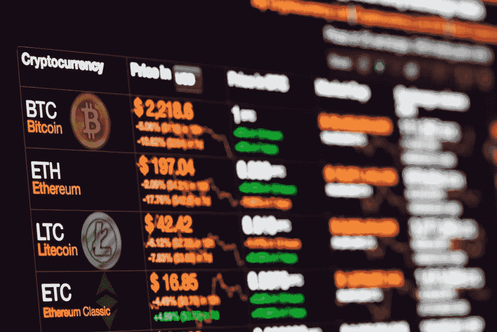
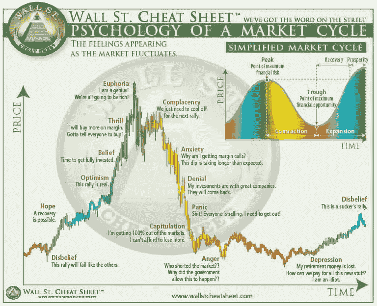

# 你在密码中犯这些错误吗？

> 原文：<https://medium.datadriveninvestor.com/are-you-making-these-mistakes-in-crypto-be57b6a7977b?source=collection_archive---------11----------------------->

进入一个新市场是令人兴奋的。即使是最保守的投资者也会为找到新的赚钱方法而兴奋不已。本文将指出密码领域的新投资者容易犯的常见错误。

投资于你所知道的。热切的投资者倾向于进行非理性投资，希望快速赚钱。这波牛市将重振投资区块链和密码的热潮。对错过的恐惧(FOMO)将开始蔓延，这取决于你坚持一项战略，随着时间的推移，这将建立一个稳固的位置。也就是说，只投资你理解的项目。在区块链，研究基础知识，逐步发展到复杂的项目。

**杠杆作用。**远离杠杆和日内交易。像传统市场一样，随着时间的推移，跑赢指数是非常困难的。当然，你偶尔会走运，但交易费会耗尽你的利润。最好是一段时间内的平均成本，抵制全押的诱惑。

 [## 为什么参与正确的加密交换至关重要|数据驱动型投资者

### 到目前为止，与黄金和美元相比，加密货币，尤其是比特币，已经显示出巨大的增长

www.datadriveninvestor.com](https://www.datadriveninvestor.com/2020/07/16/why-engaging-with-right-crypto-exchange-matters/) 

**分权财政。**2017 年，比特币泡沫是由最初的硬币发行(ICO)热潮推动的。这种为项目筹集资金的新形式类似于传统的首次公开募股(IPO)。这次牛市将被 DeFi 及其所有的创新赚钱方式大肆宣传。DeFi 为区块链打开了新的市场，如信贷、房地产和保险。

**骗局。学会如何保护自己免受不良演员的攻击，对你最有利。没有监管机构对加密进行监管，所以它是一个免费的。这使得保护你的金钱和资产成为你唯一的责任。在研究一个项目时，你需要检查以下四点:**

1.  白皮书:确保他们有一份权威的报告或指南，简明地告知读者他们试图解决的问题。它还可能包括针对同行和开发人员的复杂概念。
2.  优质网站:值得投资的项目都有优质网站。骗子不会把时间和金钱浪费在他们短期使用的网站上。此外，一定要在他们的网站上寻找项目的开发者和合作伙伴的信息。
3.  *Github* :一定要在 *Github* 上找到。他们项目开发的一致性。如果贡献者很少，代码很少被触及，那就离开。
4.  联系:许多可信的项目与他们的用户保持同步。找出他们是否有*推特*、*脸书*、*不和*或*电报*作为外联手段。着眼于长期增长的项目关注消费者的需求。使用这些平台与开发人员互动，看看他们的愿景是否是你愿意支持的。

除了研究硬币和项目，对被视为商机的骗局感到厌倦。最常见的是发送加密到一个地址，他们承诺加倍。他们甚至入侵了著名的 twitter 账户，所以请记住，如果事情好得不像真的，那很可能就是真的。

**止盈，止损。重要的是要记住，市场是以不可能完美计时的周期运行的。不要太贪心，接受失败的战斗。当市场转向时，要有一个进场和出场策略，记住，除非你把钱变成现金，否则你不会赚钱或赔钱。其他任何东西都只是屏幕上的数字。**

**访问专家视图—** [**订阅 DDI 英特尔**](https://datadriveninvestor.com/ddi-intel)