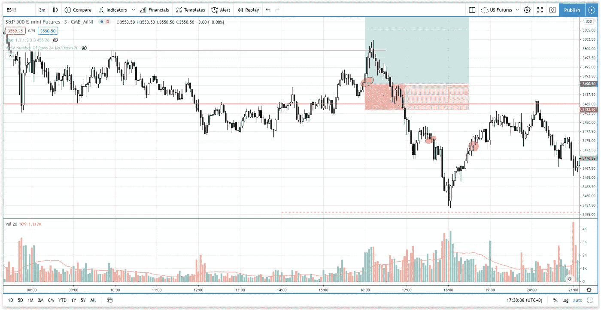

# 你在日内交易标准普尔 500 时会犯这种常见的错误吗？

> 原文：<https://medium.datadriveninvestor.com/are-you-making-this-common-mistake-in-day-trading-s-p-500-de8d903d4f74?source=collection_archive---------22----------------------->

在交易回顾部分，你会发现日内交易中让交易者付出代价的一个常见错误(我对此也感到内疚)以及你如何解决它。

观看视频，了解 2020 年 11 月 9 日交易时段标准普尔 500 指数期货的**每日市场分析。在这个视频中，你将看到最后一个时段的市场回顾和三分钟内的交易回顾(包括进场、出场和背后的原理)。展望未来，我将涵盖偏见，要注意的关键水平，我稍后的交易计划。**

## 时间戳

*   [1:37](https://www.youtube.com/watch?v=G1CUqRXVVVk&t=97s) 市场回顾
*   [3:20](https://www.youtube.com/watch?v=G1CUqRXVVVk&t=200s) 贸易回顾
*   趋势反转后的回调进行交易
*   [6:45](https://www.youtube.com/watch?v=G1CUqRXVVVk&t=405s) 日交易失误
*   [14:58](https://www.youtube.com/watch?v=G1CUqRXVVVk&t=898s) 当前股市展望

如果你还没有看我的[每日市场分析视频](https://www.youtube.com/watch?v=cIMzaBw8ObE)，为了更好地了解市场回顾和交易回顾。

**偏向** —中性(日内交易)；看涨(长期)

**关键水平** —阻力:3587；支持:3540，3500，3480

**潜在设置** —在关键级别寻找潜在反转。

# 资源

**每周市场展望&最佳交易建议【https://www.tradeprecise.com/】直达您的收件箱:[最佳交易建议](https://www.tradeprecise.com/)**

**职业免费**制图平台:创建账户→[www.TradingView.com](https://bit.ly/2U2Femd)

非美国居民？ ( **马来西亚、新加坡**、澳大利亚、新西兰、欧洲等):[点击此处，存款 2000 新加坡元](https://ji.hn/sgtiger)即可获得**免费股票(价值 100++美元)&老虎经纪**的欢迎礼物

美国居民？[点击此处，存款 1500 美元](https://ji.hn/ustradeup)，就有机会在 TradeUP 获得**份免费的 AMZN(价值 3000++** ) & **份欢迎礼物**

**从媒体获取无限文章** —加入以下:[https://priceactiontrading.medium.com/membership](https://priceactiontrading.medium.com/membership)

# 进一步阅读

 [## 市场修正，泡沫还是崩盘？标准普尔 500 价格行为分析

### 标准普尔 500 期货(es)昨日因供应激增下跌 2.5%，跌破上行通道。这是正常的…

medium.com](https://medium.com/datadriveninvestor/market-correction-bubble-or-crash-s-p-500-price-action-analysis-6f26e6698dbc)  [## 凯西·伍德警告市场即将调整——标准普尔 500 价格走势分析

### 在 2020 年 12 月 18 日对彭博的采访中，方舟投资公司的首席执行官兼首席信息官凯西·伍德警告说…

medium.com](https://medium.com/datadriveninvestor/cathie-wood-warns-market-correction-soon-price-action-analysis-on-s-p-500-7e621e013310)  [## 2021 年这些绿色能源股会涨 400%-1300%吗？

### 2021 年第 3 周市场回顾

medium.com](https://medium.com/datadriveninvestor/will-these-green-energy-stocks-gained-400-1300-in-2021-3f7288227c76) 

Photo by Author — Ming Jong Tey

Photo by Author — Ming Jong Tey

披露:如果您点击本文中的链接进行购买或开立账户，并将所需金额存入推荐的经纪人账户，我们将免费为您赚取佣金。

免责声明:本演示中的信息仅用于教育目的，不应作为投资建议。