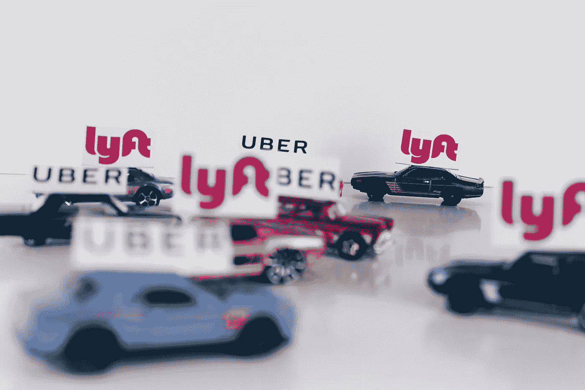

# 你在制定这个灾难性的投资策略吗？

> 原文：<https://medium.datadriveninvestor.com/are-you-making-this-disastrous-investment-strategy-8d5317675692?source=collection_archive---------9----------------------->

停止把钱花在股票上，你的东西会…最终繁荣起来。

任何认为指数增长可以在一个有限的世界里永远持续下去的人，要么是疯子，要么是经济学家。

现在有人在买股票，他们和经济学家有着同样的信念。渴望尽快积累财富。众议院(华尔街)很喜欢它。音乐很响，派对一如既往的热烈。

有人对这一切感到失落。但只要派对继续，饮料摆在桌上，阳光普照，人们就会继续跳舞，你知道吗？

即使每只股票都被高估。即使那些应该苦苦挣扎的行业一直处于高位。即使人们普遍担心我们生活在一个巨大的泡沫中。谁在乎呢。新闻报道说有人靠一些股票发了大财。所以顺其自然吧。

即使你有沃伦·巴菲特**没有在过去 12 年的最佳时机之一购买 T3。标准普尔 500 指数下跌了 34.10%，沃伦甚至没有把手放在口袋里。**

奥马哈先知教导我们:

*在别人恐惧的地方贪婪，在别人贪婪的地方恐惧。*

他没有采取任何行动，任何购买，任何事情。神谕冻结了。

巴菲特说他不会买他不理解的东西。如果他没买，那是因为他不明白到底发生了什么。

但是我们明白吗？

# 华尔街的赌注

华尔街是一台强大的游戏机。勾引各种各样的人。主导了所有的新闻。

然而，还有另一种叫做在线经纪人的游戏机。他们的*选项*像 AK-47 一样开火。

一场真正的战争正在改变整个行业。它让数字，真正的数字，在无休止的争论中互相争斗。

 [## 2020 年最佳短期投资选择精选资源|数据驱动型投资者

### 投资是增加你净财富的一个好方法。如果你通过遵循一个严格的…

www.datadriveninvestor.com](https://www.datadriveninvestor.com/2020/03/28/handpicked-resources-for-the-best-short-term-investment-options-of-2020/) 

你有一部关于赫兹的肥皂剧。

你有特斯拉福音仪式，所有的球迷在他们的宗教仪式上祈祷上帝。

你甚至对优步的美好未来充满信心。希望资产负债表是牧师赐予净化所有灵魂的薄饼。

> 男人们，你们真的要有信仰——赞美主！

Photo by [Zac Durant](https://unsplash.com/@zacdurant?utm_source=medium&utm_medium=referral) on [Unsplash](https://unsplash.com?utm_source=medium&utm_medium=referral)

信念的力量在股票市场中绝对至关重要。看不到这一点的人无法理解这种新经济。

你有一个吸引粉丝和投资者的想法。这个想法不断成长，直到有一天它变得…最终有利可图。

我现在更加确信，数字之外的东西对我们经济的未来最为重要。

我知道这很痛。但事实就是如此。或者我认为是这样的。

像埃隆·马斯克、杰克·多西或查马斯·帕里哈皮蒂亚这样的标志性企业家拥有如此强大的媒体地位。他们的公司依靠信念的力量成长。(我知道我不公平——这不仅仅是信仰的问题)

许多世界上最有价值的科技初创公司从来没有盈利过，从投资者那里筹集了数十亿美元，但每年仍然亏损。

但是有了钱，他们变得越来越强大。如果有足够的信心，再加上一点讽刺，它们可能会茁壮成长。

信任像特斯拉这样的公司是很自然的。作为一个全球社会，我们相信无碳世界。它是我们情感的一部分，告诉我们必须拯救我们的星球。电动汽车是全球战略中的一个大玩家。

问题是，经济过去不是(现在仍然不是)一种信仰。你还是要付账单。你还是要赚钱的。有利可图。

> 那么，这种看待公司的新方式正在发生什么变化呢？

我们生活在一个债务的世界，而不是一个生产力的世界。如果是的话，告诉我一个公司在没有任何资金的情况下如何启动一个想法。回答——筹钱。

我们把希望和信念放在第一位，只是因为我们生活在债务狂欢中。我没有说这是错的。我在问什么时候会停止？或者至少是谁在控制它？

# 混淆信仰和债务

> 2000 年，世界债务总额约为 62 万亿美元。与此同时，根据国际金融研究所的数据，世界经济已从 33.5 万亿美元增长到约 80 万亿美元，但为了实现这一增长，截至 2018 年第三季度，债务总额已超过 247 万亿美元。换句话说，大约 185 万亿美元的全球债务实现了 46 万亿美元的全球增长。

这段摘录摘自我正在读的杰夫·波斯的书，书名是:[明天的价格](https://amzn.to/3ji8kc9)。

杰夫解释说，我们生活在一个通货紧缩的世界。这项技术是一股强大的通货紧缩力量，最终，无论我们做什么都无法阻止它。中央银行不知道接下来会发生什么，所以他们继续印钞票。

我不知道我们是否有 b 计划。我们害怕通货膨胀，所以中央银行试图保持低通胀。但是这种无形的技术力量正在让两个世界发生碰撞。通货紧缩的武器与技术服务。以及对美元冲击金融体系的通胀担忧。

尽管如此，世界仍然需要美元。总有一天有人会没有能力支付他们的账单。或者相信利率会被支付。

这将是一个新时代的第一天。没有人知道它什么时候会到来，它会对我们的日常生活产生什么影响。

喜剧演员汤米·蒂尔南的想法可能是最好的解决方案:

> 我们欠了几百万。我们欠谁那么多钱？为什么我们不杀了那个白痴，然后忘掉这件事？

Photo by [Ehud Neuhaus](https://unsplash.com/@paramir?utm_source=medium&utm_medium=referral) on [Unsplash](https://unsplash.com?utm_source=medium&utm_medium=referral)

# 如果我们必须对某件事有信心

如果我们必须对什么有信心，我对仿生工业有信心。我热爱大自然。尤其是观察我们几乎忘记的微小世界的复杂性。

> “仿生学是一种创新方法，通过模仿大自然久经考验的模式和策略，寻求应对人类挑战的可持续解决方案。”

仿生学几乎可以触及每个领域。医学、建筑、设计、服装、化学等等。

关于设计， [Craig Phillips](https://medium.com/u/470bdb36ec88?source=post_page-----8d5317675692--------------------------------) 在这篇[文章](https://bit.ly/3eGspWb)中写了一篇很好的和平。每个人都应该至少了解一些生物仿生学。

这可能会改变游戏规则。如果我们所有人都有耐心和知识来捕捉这数百万年的技术进化。大自然展现给我们的进化。也许世界会从中受益。甚至经济。

通过理解自然是如何运作的，我们将会明白，在一个有限的世界里，我们不必永远增长得更快。仿生学会告诉我们平衡比成长更重要。

现在如果你问我会不会投资这个行业的公司？不，至少现在还没有。这是一项颠覆性的技术。它必须成熟，稳定，向我们展示我投资的数据。

Photo by [v2osk](https://unsplash.com/@v2osk?utm_source=medium&utm_medium=referral) on [Unsplash](https://unsplash.com?utm_source=medium&utm_medium=referral)

我们现在生活在一个危险的世界。

我们正在混合两股对经济无益的强大力量。信仰和债务。这两股力量正在把我们的经济变成一个童话。这不是真的。巴菲特知道这一点。雷伊·达里奥也知道这一点。

特斯拉去年增长了惊人的 275%。但是具有 272 的本益比。粉丝们继续购买股票。杰克·多西广场的预期市盈率为 457。你疯了吗？谁会买这些股票？谁会相信这些数字？

我没有！

我是一个长期投资者。我仍然相信戴利奥的原则。在巴菲特的原则中。我仍然相信在一天结束的时候，那个人会出现。会让你做算术的人。

到那一天，每个人都会损失很多钱。

我想尽可能少的损失，让我的旅程尽可能的安全！

怎么会？购买有良好资产负债表和现金流的好公司的股票。主导其行业的公司。

我更喜欢分红股票，因为它们更有弹性。现在我正在购买微软、苹果、摩根大通、强生、可口可乐和美国电话电报公司。40%的现金和 30%的房地产。

我可能会对所有分崩离析的金融科技公司感到兴奋，但我不会。这些数字没有告诉我任何好消息。这很简单。

尽管埃隆·马斯克正在进行一场不可思议的旅程，一场鼓舞人心的旅程，但我不能不看数字就买特斯拉股票。

我们在谈论一只独特的股票。可能是市场上最受欢迎的股票。但正因为如此，股票价格高得离谱。

特斯拉公布了第二季度收益。这是特斯拉连续第四个季度盈利。该公司能够加入 S&P500。很多人都喜欢这个故事。我明白了。

尽管埃隆在美国证券交易委员会遇到了种种困难，但他总是勇往直前。作为他的粉丝，我们一直相信这项颠覆性的技术。电动汽车和太阳能将彻底改变我们的星球。

这是非常情绪化的。很有激情。然而，总有一些我们必须思考的其他事情。

市场中的竞争和波动等其他因素可能会导致股价大幅下跌 70%至 90%。这可能是戏剧性的，但在像电动汽车和可再生能源这样新的未知领域是可能的。

我们生活在一个动荡的时代。正如达利奥所说，我们正处于长期债务周期的最后阶段。上一次是 70 年前。1929 年的大萧条。

所以，是时候小心谨慎了。是时候平衡你的投资组合了。这就是我购买分红股票的原因。在市场调整或萧条时最有弹性的股票。

如果你投资科技股风险太大，尤其是那些资产负债表不佳的股票。在接下来的 2 到 5 年里，你必须应对另一场抑郁症。你会遭受巨大的损失。

要有意识，要有耐心，要想得长远！

**进入专家视角—** [**订阅 DDI 英特尔**](https://datadriveninvestor.com/ddi-intel)