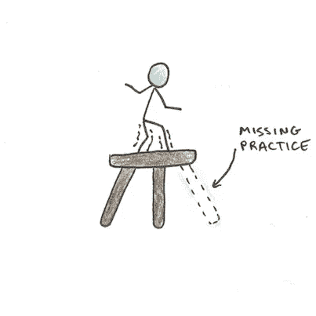
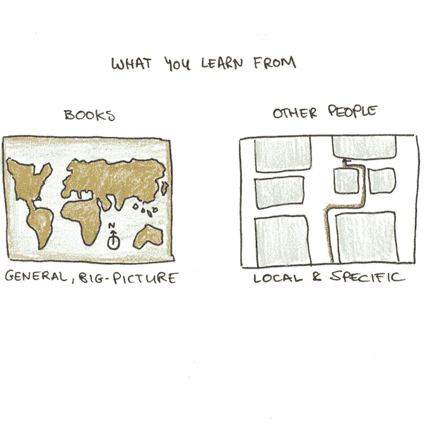
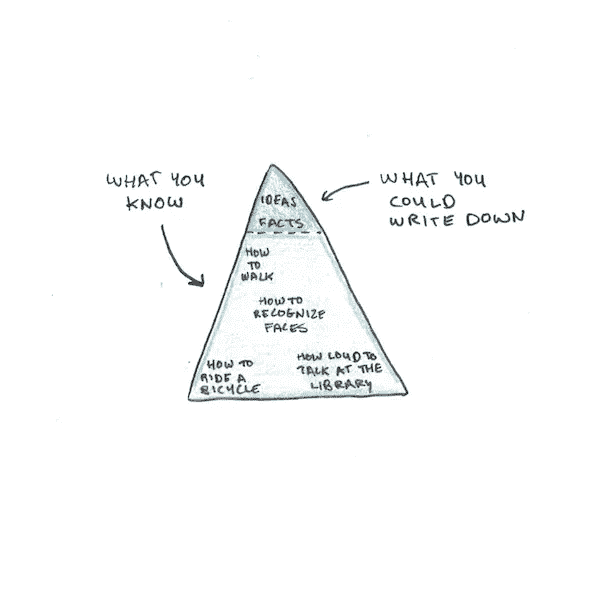
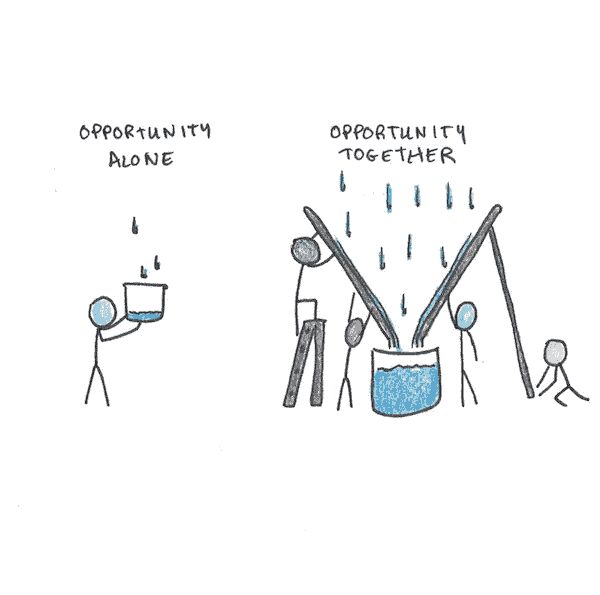
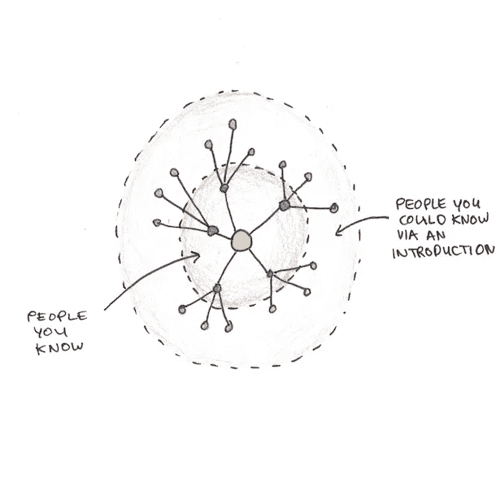
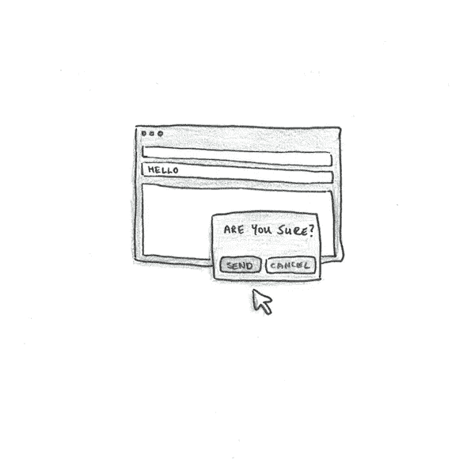

# 你是否错过了美好生活的基础？

> 原文：<https://medium.datadriveninvestor.com/are-you-missing-this-essential-foundation-for-a-good-life-c19992c89e96?source=collection_archive---------11----------------------->

最近，我分享了我列出的[基本实践](https://www.scotthyoung.com/blog/2020/10/26/foundation-practices/)——每个人为了生活得更好应该做的基本事情。当然，我的选择是个人的。你的清单可能和我的有点不同。

然而，大多数人倾向于同意我的选择。基础实践应该是显而易见的。如果它们不是，那么对于它们有多大用处会有一些争议。

然而，有一种做法是很多人承认不经常做的。人们锻炼、阅读、跟踪他们的支出并控制他们的恶习……但是当谈到*这种*实践时，最常见的反应是，“是的，我真的应该开始这么做了。”

# 缺失的实践

这种做法是与比你聪明的人定期交谈。或者，如果不是在所有方面都更聪明，那么至少在你关心的生活的一个方面比你超前一点。

也许这个省略只是反映了我的听众。我吸引了内向的自我提升瘾君子，他们一个月读十本书没有问题，但发现很难与陌生人搭讪。

尽管困难重重，但这种做法的价值不可低估。我至少能看到让这成为你日常生活的一部分的几个主要好处:

# 1.书籍是一般性的，对话是具体的。

一个人告诉我，她读了很多书，这些书和与别人交谈一样有很多好处。我同意书可以有很大的帮助，但是这两种实践有不重叠的地方。

首先，书籍往往提供一般性的建议，但你需要的往往是非常具体的。你不仅仅需要关于“成功”的建议，还需要确切地了解在你的公司里应该联系谁来推动你的职业发展。书上提供了地图册，但你需要的往往是导游。

# 2.很多重要的知识是写不下来的。

你从与他人交谈中学到的比你从谈话记录中读到的要深刻。我们知道人类是独特的社会学习者。我们经常学习成功的实践，即使没有人理解它们是如何工作的。

例如，在一项实验中，研究人员让[的参与者设计一台简单的机器](https://psyarxiv.com/nm5sh/)。从其他人的试错设计中学习，他们很快取得了进展。然而，当被问及为什么他们的设计有效时，大多数人都大错特错。当你直接(或通过 Zoom)与人互动时，你不仅获得了方法和理论，还潜移默化地吸收了影响结果的态度、实践和信念。

# 3.准入很重要(即使它可能被高估)。

“重要的不是你知道什么，而是你认识谁”这句话已经是老生常谈了。显然，对于很多职业来说，这根本就是不真实的。我宁愿要一个懂医学的外科医生，而不是一个在兄弟会里见过很多人的人。

但是这个想法是有道理的。机会是通过其他人实现的。即使你知道该知道的一切，你仍然会从与人交谈中受益，因为这些联系会形成新的可能性的渠道。

# 内向者进行更多(更好)对话的指南

对一些人来说，这个建议不仅显而易见，而且毫无必要。如果你更外向，你可能已经和很多人交谈过，也有很多在不同方面都很优秀的朋友。

然而，考虑到我从读者那里得到的回复数量，这显然是很多人的弱点。因此，我认为看看你应该使用什么样的具体策略来使它变得更容易是有意义的(特别是当与人交往听起来令人生畏的时候)。

> 附注:在我写这篇文章的时候，疫情的魅力让每个人都更难与人交往，所以不仅仅是内向的人在挣扎！

因此，为了确保每周与聪明人进行一次对话的做法取得成功，有一些不同的策略可以让它奏效:

# 1.安排与您已经认识的人通话。

最容易的胜利就是更好地跟踪你已经见过的人。

我有一个朋友非常擅长这个。他不是最外向的人，也不是那种总是让自己成为关注焦点的人。然而，在一件事上，他比我认识的几乎任何人都做得好——他会跟进。

也就是说，当他真的遇到某人时，他会得到他们的联系方式，并在一周左右后给他们发一封友好的电子邮件或短信。如果他们合得来，他会努力打个电话或喝杯咖啡。

从长远来看，即使他遇到同样多的新朋友，他最终也会有更多的对话。他不需要咄咄逼人——如果他发了信息但没有得到回复，或者对方似乎没有兴趣见面，他就放弃。但事实是，大多数人是被动的，所以即使他们对交谈感兴趣，他们也很少主动。

# 2.求介绍。

下一个最简单的步骤是要求被介绍给别人。如果你已经确定了你想向谁学习，这尤其有帮助。因此，如果你想更多地了解商业，询问你的朋友是否认识任何企业家是一个很好的步骤。

当 Vat 和我在中国做非英语语言实验时，我们大量使用了这个。从几个当地的老师开始，我们能够相对较快地建立起一个朋友网络(尽管只会说蹩脚的普通话)，因为我们需要介绍。大多数人都很乐意帮忙，这种策略比试图在街上随便找个人搭讪要有效得多。

# 3.接触志同道合的人。

最后一个建议是，如果你想和某人交谈，简单地给他们发一封电子邮件。令我惊讶的是，这种方法经常奏效。我很多最亲密的友谊都是这样开始的。

这样，拥有一个公共博客、中型账户或 Twitter 个人资料，其中包含少量表达你的想法和观点的内容是有帮助的。这个博客极大地帮助了我与人交往，因为如果我想了解某人，他们可以很快了解我，看看我对事情的看法。

然而，我也知道许多没有公开作品的人很好地利用了这一策略，所以不要让不为人知阻止了你的接触。

# 人们不这么做的真正原因

我在这篇文章的开头指出，这种练习比锻炼、阅读或睡眠更容易被忽视。这很奇怪，因为这也是更容易的实践之一。每个工作日锻炼需要几个小时。每周进行一次谈话，包括联系的时间，需要不到一个小时。

人们不这样做的明显原因是他们害怕被拒绝。如果我给某人发邮件，而他们不回复怎么办？不知道联系谁怎么办？

那么，最简单的热身方式就是选择那些你不会被拒绝的人。你已经认识的人，或者直接要求介绍，这样你就不会给别人发邮件了。

但真正的做法是，不要因为你的努力没有得到回应而感到不安。想象中的恐惧通常是这个人会对你的假设感到愤怒，或者你会被轻蔑的回答羞辱。这种情况几乎从未发生过。相反，最常见的拒绝是根本没有回复。

没有得到回复通常意味着什么。这个人对你的请求没有给予太多考虑，这不会损害你的声誉。当然，不要给人发垃圾邮件。当对方明显不感兴趣时，不要连续发送多个未经请求的请求或无休止的电子邮件来“跟进”。

我理解这样做的恐惧，因为我也是如此。我也抗拒这样做，但这正是我需要鞭策自己多做的原因。如果你整天都在与人交谈，那么向他人伸出援手的好处会越来越少。但是如果你从来不这样做，做一点点可以为你的生活带来巨大的回报。因此，这种练习越有价值，你就越难做到。