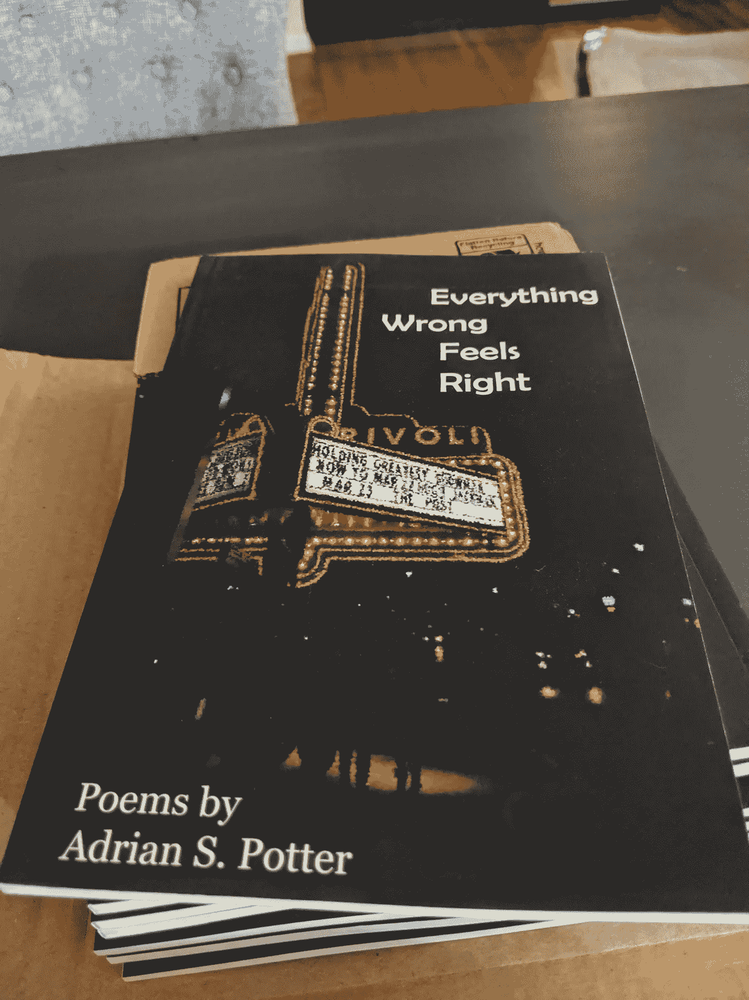

# 你拖得够久了吗？

> 原文：<https://medium.datadriveninvestor.com/are-you-procrastinating-enough-50c34d98840c?source=collection_archive---------15----------------------->

拥抱结构化的分散注意力……然后让你的屁股回到工作中。
(二手灵感项目)

Photo by [Andrik Langfield](https://unsplash.com/@andriklangfield?utm_source=unsplash&utm_medium=referral&utm_content=creditCopyText) on [Unsplash](https://unsplash.com/s/photos/time-management?utm_source=unsplash&utm_medium=referral&utm_content=creditCopyText)

**二手灵感项目从一句励志名言开始，在创意之路蜿蜒的任何地方冒险。**

> “无论你在做什么，你都没有在做其他的事情。所以问题不是如何避免拖延，而是如何把拖延做好。”—保罗·格拉厄姆

当我们不情愿地面对疫情期间的新 WFH 情景时，也许我们应该把拖延的眼光放得更高。因为每个人都知道我们可以比现在更有效地浪费时间。

事实上，每当我们想工作的时候，让我们设定一个 30 分钟的计时器，把精力投入到除了我们需要完成的事情之外的任何事情上。加油；如果我们再努力一点，我们都可以混得更久……*没有一篇关于个人成长的文章提到过*。也就是说，直到现在。

 [## 精疲力竭耗尽了简单的答案|数据驱动的投资者

### “大多数卫生专业人员知道如何照顾病人，但不知道如何照顾自己。”医疗保健…

www.datadriveninvestor.com](https://www.datadriveninvestor.com/2019/01/15/burnout-exhausts-easy-answers/) 

我们都有巨大的目标和紧迫的期限。从表面上看，拖延似乎不利于实现我们渴望的进展。

但问题就在这里。倾向于我们低级的坏习惯通常可以帮助我们更快地克服它们。如果你计划好了，拖延会很快变得平淡无奇。它所有的颠覆性诱惑都消失了，你的抵抗放松了，然后你开始埋头做重要的事情。

Photo by [Allie Smith](https://unsplash.com/@creativegangsters?utm_source=unsplash&utm_medium=referral&utm_content=creditCopyText) on [Unsplash](https://unsplash.com/s/photos/phone-meeting?utm_source=unsplash&utm_medium=referral&utm_content=creditCopyText)

最近，当我们通过 Zoom 与同事见面时，我们分享了一些关于当我们很好地利用拖延时它的力量的笑声。这一点在新冠肺炎事件导致全公司员工离职的背景下尤为重要。

当我们习惯于在办公楼里工作时，视频游戏的诱惑或家务杂事的压力很少会影响到工作日。但我们现在发现，如果我们有时停下来和孩子玩一会儿，或者花 10 分钟叠衣服，之后我们可以很快回到高效的工作状态。

这可能看起来违反直觉，但是如果我们做得好，推迟事情可以让我们更有效率。也许这是一种我们不必完全抛弃的消极倾向——只要我们学会将它校准为我们的优势。

我在接受拖延策略上低调的胜利发生在开发我第一本出版的诗集《一切不对的感觉都是对的》的时候。在为初稿汇集了一大堆诗歌之后，我有一种预感，我会在怀疑中沉湎一段时间，说服自己我是一个糟糕的作家，避免编辑和完成最后几首诗，并迫使自己陷入一种无益的恐慌。

所以，我没有抗拒这些倾向，而是为它们做计划。两个星期以来，我没有坚持不懈地写稿子，也没有憎恨自己，而是安排了“游手好闲的时间”

我确实浪费了时间，因为我狂看了三季网飞的一些蹩脚节目，我甚至都记不清了。当我在两周内经历了比任何人都要多的脚本化冒险时，我已经满足了我内心的批评。他已经知道我是个废物。我证明了他是对的，用一些无热量的无脑电视填充他的大脑，然后把他赶出了我的房子。

随着我的强制性自我破坏行为的方式，我回去工作的书。在接下来的几个星期里，我坚持严格的写作和编辑时间表，这个时间表被塞进了一个人生阶段，其中还包括一份要求很高的工作、一个家庭装修项目、一个具有挑战性的健身方案，以及努力成为一个高于平均水平的父亲和丈夫。

一旦我觉得自己拼凑出了一份像样的手稿，我就把它寄给了威斯康辛州[卡罗尔大学](https://www.carrollu.edu/)的学生管理的出版社 [Portage Press](https://portagemagazine.org/portage-press/) 。在无数年淹没在冒名顶替综合症中并试图出版一本完整的书之后，[所有错误的感觉都是对的](https://www.amazon.com/Everything-Wrong-Feels-Adrian-Potter/dp/109519061X/ref=sr_1_4?qid=1560264651&refinements=p_27%3AAdrian+S.+Potter&s=books&sr=1-4&text=Adrian+S.+Potter&fbclid=IwAR1sK42MI2drdSI1VWJB-9pSq-lbUkoYBCWvSIKlmotVTllQ2hJ46DzqCn0)被第一家出版商接受了。

Photo by [Adrian S. Potter](http://www.adrianspotter.com/)

以协调的方式接近我被截断的注意力范围赢得了相当大的胜利，并促使我最终开发了一本可出版的书。或许控制拖延也能成为你新的成功策略？

一个警告——这种被认可的拖延应该被计量。我不是提倡总是为了好玩而放弃自己的责任。我并不是说你应该一直躲在可管理任务的忙碌背后，忽略那些更困难的任务。但是有时候，短时间的拖延可以减轻长期拖延的冲动。

下次我们发现自己在拖延不可避免的事情或做我们知道不应该做的事情时，我们可能会考虑全力以赴，让自己放松一下。最终，我们会耗尽自己天生抗拒合作的那部分。然后，我们会带着新的焦点和精力回到手头的任务上。

现在接受某种程度的拖延可以帮助我们以后更有效地工作。

阿德里安·s·波特是一名作家、工程师、顾问和演说家。他写诗歌、短篇小说和各种主题的文章，包括创造力和个人成长。他是诗集[和散文集](https://www.amazon.com/Everything-Wrong-Feels-Adrian-Potter/dp/109519061X/ref=sr_1_4?qid=1560264651&refinements=p_27%3AAdrian+S.+Potter&s=books&sr=1-4&text=Adrian+S.+Potter)[的作者。在](https://e2857002-6118-41be-9746-64261e36cacb.filesusr.com/ugd/21d2c2_03522f10c7c84340a05a8d03a97e1642.pdf)[http://adrianspotter.com/](http://adrianspotter.com/)在线拜访他。

# 附加文字

[停止抱怨，开始请求](https://medium.com/datadriveninvestor/stop-whining-and-start-requesting-3164dfcf2e63?source=friends_link&sk=58c27c6e615256e7be26c9136c2caf4c)

[你在不知不觉中破坏成功的九种方式](https://medium.com/datadriveninvestor/nine-ways-youre-sabotaging-your-success-without-realizing-it-b77463353559?source=friends_link&sk=a6d6bbafec7fe3007fdf044e6653ac22)

[小口吃](https://medium.com/@adrianpotter/take-small-bites-6741345732ec?source=friends_link&sk=02fd50ccc65d3229e1c24a24189577d4)