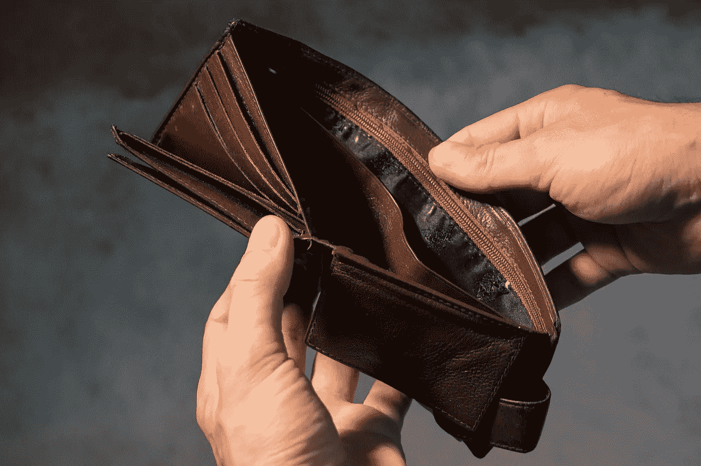

# 你准备好应对实时通胀了吗？

> 原文：<https://medium.datadriveninvestor.com/are-you-ready-for-real-time-inflation-aba9f62e9d6?source=collection_archive---------0----------------------->

## 无现金社会

## 美联储的下一步行动是直接从你的钱包里拿钱

Image by [Andrew Khoroshavin](https://pixabay.com/users/chronomarchie-6883517/?utm_source=link-attribution&utm_medium=referral&utm_campaign=image&utm_content=3548021) from [Pixabay](https://pixabay.com/?utm_source=link-attribution&utm_medium=referral&utm_campaign=image&utm_content=3548021)

有人说，通货膨胀是一种“隐性税收”，因为流通货币供应量的增加会导致我们货币的价值下降。当通胀导致食品价格上涨时，消费者不喜欢通胀，但这种力量也有能力提高房屋和投资等资产的价格，就像我们今天看到的一样。

人类追求效率，和科技结合，结果就是通缩。然而，因为国家的债务是巨大的，像美联储这样的中央银行寻求通货膨胀——因为它导致政府债务的未来偿还价值减少。随着文明进入技术创新呈指数增长的时代，美联储的工具已经失去了引发通胀的大部分能力。

通常情况下，低利率会刺激借贷并有助于通胀，但随着美国利率在相当长一段时间内一直处于低位，甚至为零，这种做法不再奏效。但美联储还有另一个锦囊妙计:负利率。

央行层面的负利率并不是一个新想法。2015 年 10 月，国际货币基金组织(IMF)发布了一份名为“**突破零下限**的[工作文件](https://www.imf.org/en/Publications/WP/Issues/2016/12/31/Breaking-Through-the-Zero-Lower-Bound-43358)，该文件开篇颇为大胆:

> "关于通过消除纸币来消除“零下限”，已经有了很多讨论."

当然，零下限指的是央行将利率降至零以下的能力。附录一*(第。38* )这篇论文的题目是“*从纸币本位向数字货币过渡的潜在步骤*”。

如今，一些国家已经在使用负利率。日本银行(BoJ)在 2016 年 1 月实施了负利率，此后德国和其他几个欧洲国家也纷纷效仿。最近，英格兰银行(BoE) [指示英国的银行](https://www.cnbc.com/amp/2020/10/12/bank-of-england-asks-banks-about-readiness-for-negative-rates.html)从会计角度为实施负利率做准备。

事实上，美联储(美联储)影响当今美国经济的工具相当有限。除了设定联邦基金利率(即银行借贷利率)，并通过 FOMC(联邦公开市场委员会)进行公开市场操作，如 QE(量化宽松)，美联储实际上没有什么可以刺激经济的。

当美联储“创造货币”时，他们本质上所做的是向商业银行提供更大的信贷额度。然而，当我们处于高风险环境中时，如当前的经济衰退，银行的风险偏好会大大降低，因此只有具有最高质量信贷的企业和组织才能够实际借款以刺激经济。

通常情况下，当美联储的利率较低时，其目的是增加借贷和刺激经济，希望引起通货膨胀。但由于美联储的行动仍然依赖于商业银行放贷，而且这些新“钱”需要大约 18 个月才能渗透到实体经济中，因此它们的影响通常是微不足道的。

在最近几个月的头条新闻中，你可能已经看到了一些事情，一个是[美联储一直在努力](https://medium.com/datadriveninvestor/why-big-daddy-fed-cant-get-it-up-inflation-of-course-8ae12ce93473)引发预期的通胀(PCE 指标)，另一个是他们一直在致力于央行数字货币(CBDC)的事实。

在现实中，美联储无法有效地引起经济增长和通货膨胀，因为他们无法控制普通消费者愿意消费的频率，他们也无法控制人们是否会存钱或花钱。如果他们可以这样做，他们相信他们实际上可以刺激经济增长和通货膨胀。

在一个经济增长受到威胁的世界里——正如早在疫情危机之前*所发生的那样，这些工具——以及 QE 和其他购买计划——已被证明不足以刺激“官方”PCE 通胀指标。这些干预支撑了部分市场——但仅此而已。*

*因此，美联储和经济学家希望你消费，他们希望你避免储蓄，他们迫切希望你陷入越来越多的债务，因为这意味着流通货币供应的增加，以及更多的经济活动，以期引发通货膨胀。*

*但在长期处于创纪录的低利率后，当利率已经为零时，央行该做些什么呢？*

*如上所述，一些国家已经转向负利率，但成效有限。问题是，一张 20 美元的钞票看起来价值 20 美元，即使它在幕后因通货膨胀而贬值。如果这个面值可以被绕过，那么货币本身的价值就会发生物理变化，而不是消费者看到消费价格上涨。*

*因此，美联储和国际货币基金组织认为，转向数字货币将消除这一障碍。他们是正确的。然而，只要实物货币及其令人讨厌的面值存在，他们的努力仍然是有限的。*

*因此，美联储将转向 CBDC，摆脱实物现金，这正是他们计划要做的。一些冠状病毒刺激法案，如[全民银行法案](https://www.congress.gov/bill/116th-congress/senate-bill/3571/text)提到了直接从美联储支付刺激资金作为“[数字美元](https://www.ledgerinsights.com/digital-dollar-congress-covid-19-stimulus-bill/)和[直接在美联储为所有美国公民开设银行账户](https://medium.com/swlh/are-you-ready-for-your-new-bank-account-99a5aeab5557)的想法。*

*除了还没有解决未来获得消费者信贷的问题之外，消费者直接向美联储存款的举措将商业银行置于危险之中。这被称为“银行脱媒”，并导致 CBDC 的，这一问题已在美联储，国际货币基金组织和其他经济机构的许多论文中广泛讨论。*

*CBDC/数字美元的实施，以及让消费者直接存入美联储，应该会引发一些问题。例如，如果你在美联储的数字钱包账户中持有 CBDC，而不是实物美元(或今天的数字美元)，当美联储宣布转向负利率时会发生什么？*

* [## 利用区块链构建可持续循环经济|数据驱动投资者

### 自从工业革命开始以来，全世界都关注产品的生产和消费。很少或…

www.datadriveninvestor.com](https://www.datadriveninvestor.com/2020/11/17/building-sustainable-circular-economy-with-blockchain/) 

我来告诉你它的意思:

> 你的美联储数字钱包里的钱会完全在你的控制之外贬值——就像一个扒手偷走你的一些钱一样。我们将通过实时货币贬值实现实时通胀。

如果你拥有 crypto 或股票，你会很熟悉这样一个概念，即查看你的投资账户或 crypto 钱包会显示你的资产在那一刻的价值。

那么，对于钱包里的血汗钱发生这种情况，你有什么感受？

*来了。*

美联储可能会粉饰它，他们可能会为我们提供用 CBDC 而不是美元支付的折扣，直到现金被完全淘汰——但它即将到来。美联储的目标是通过让你消费、抑制你的储蓄欲望来提高货币流通速度。

他们想知道，这会让你更快地花掉它吗？是的，这正是他们所希望的——你会意识到你的 1000 美元会在周末神奇地变成 993 美元，所以你宁愿早点花掉它。

要明白——没有办法提取 CBDC，就像你不能提取比特币一样。你只能花掉 CBDC 或者拯救它——它无法脱离金融体系。你不能从自动提款机里把它取出来，也不能把它藏在你的床垫下(在床垫下，它至少会让*看起来*保持它的面值！)

**如果利率为负，你的一部分钱将随之而去，无法逃脱。**

因此，我们开始看到美联储希望如何控制货币流通速度——一美元易手的次数。如果随着时间的推移，你的数字美元将变得越来越不值钱，你就会受到激励，通过尽可能快地花掉这些钱来尽可能多地保留购买力。

他们将能够做到这一点，因为 CBDC 是可编程货币，与以太坊智能合约没有什么不同。

所以你在想，我不会用 CBDC，我会用我们现有的钱。这很好，直到 CBDC 成为镇上唯一的游戏。从现在开始不久，你将会开始听到废除 100 美元和 50 美元钞票的计划。最终，我们将只剩下硬币，或许还有一美元的钞票——如果我们幸运的话。

世界上 80%的央行已经在致力于 CBDC，像中国和瑞典这样的国家已经在减少实物现金的使用方面取得了长足的进步。这种越来越多的数字支付趋势只会越来越多。

在转向国家数字货币的过程中，我们应该有其他的担忧。因为 CBDC 是可编程的，除了前面提到的贬值，还有更多方面央行将拥有更大的控制权。我已经写了几篇关于 CBDC 的文章，但是我们应该关注的 CBDC 的基本能力列表如下

*   为基金设定到期日
*   为储蓄甚至余额设置上限
*   所有交易都被匿名跟踪
*   用 CBDC 规定什么可以买什么不可以买，就像今天美国的 SNAP/EBT 食品券计划一样。

正如你所猜测的，以上所有这些都是为了控制支出，让美联储有能力影响货币流通速度，阻止你储蓄。我认为他们最终会发现，他们的努力并不像他们希望的那样奏效，但尽管如此，这是一种我们无法避免的重要控制。

展望未来，比特币和其他加密货币的出现给了我们希望，因为它们提供了一种打破即将成为闭环金融系统的方式。

与此同时，消费者应该特别注意任何似乎表明向 CBDC 运动的立法，或任何取消实体法案的行为，我们应该用我们剩下的所有民主向我们的立法者大声疾呼。* * [## 美国需要的革命

### 这是对意识的呼唤，在此之后，我们必须找到可行的方法来建立这种意识。但是我们甚至不能…

link.medium.com](https://link.medium.com/kDU0QaLn8cb)  [## 你准备好你的新银行账户了吗？

### 数字美元的到来比你想象的要快。这对你来说意味着什么？

medium.com](https://medium.com/swlh/are-you-ready-for-your-new-bank-account-99a5aeab5557)  [## 更快的刺激，但代价是什么？

### 央行数字货币有阴暗面

medium.com](https://medium.com/datadriveninvestor/the-ugly-side-of-cbdc-66ee9b80672f)  [## 央行数字货币理解指南(CBDC)

### 关于即将到来的数字美元

medium.com](https://medium.com/datadriveninvestor/what-is-a-cbdc-and-why-should-i-care-a33095e7ef03) 

## 访问专家视图— [订阅 DDI 英特尔](https://datadriveninvestor.com/ddi-intel)*