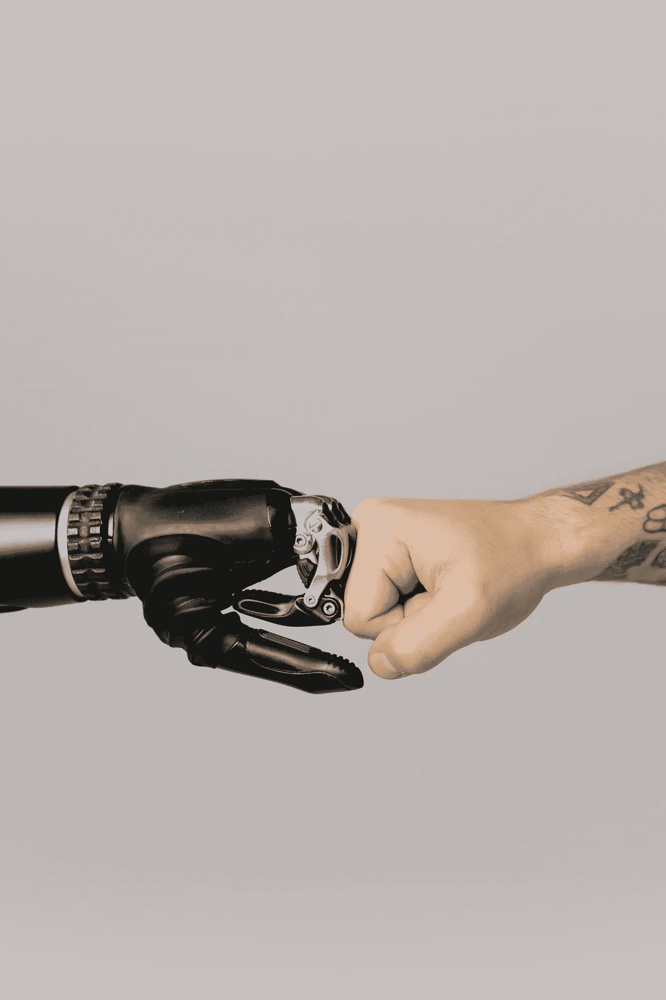

# 你准备好为人工智能投票了吗？

> 原文：<https://medium.datadriveninvestor.com/are-you-ready-to-vote-for-an-ai-1e3db23dd2fc?source=collection_archive---------44----------------------->

Cotton-Technical on Pexels.com

这听起来有点像个笑话，不是吗？一个人工智能可以与之竞争的对手，更不用说赢得与人类的选举了。一个能够理解管理投票公众的微妙差别的人？能够在情感上与他们的选民联系起来，理解他们的痛苦？

那我为什么还要写这个呢？看起来一台计算机没有机会反对那种权利，对吗？

对吗？

## 人工智能可以非常果断，比较成千上万的数据点！

如果我们错了呢。如果一个计算机程序，设计来平衡许多人的需求，而不仅仅是那些掌权者的需求，实际上是更好的方法呢？如果有可能对每个人都公平呢？

人工智能会做出什么决定？什么会改变？在做决定时，有很多不同的方面需要考虑，任何人，任何人，都会被他们对世界的看法所限制。

如果你是一个担心自己有权携带武器的美国人，如果一个人工智能决定禁止枪支符合最佳利益，你会有什么感受？

如果你是一个来自爱尔兰的资本家，如果一个人工智能决定超级富人的税收需要增加…指数增长以支付社会福利项目，你会有什么感觉？

从枪支犯罪受害者的角度来看，或者从努力打破无家可归循环的个人的角度来看，枪支的情况又如何呢？

枪支犯罪的受害者不会付钱给枪支游说团体来让支持枪支犯罪的人掌权。

资本家不会花数十亿美元来维持政客竞选的资金，当他们竞选的平台是从他们那里拿走更多的数十亿美元。

最终，如果事情对每个人都公平，没有人会特别高兴，我认为一个设计良好的算法会有这样的结果。

 [## 机器学习和人工智能如何改变电子商务的面貌？|数据驱动…

### 电子商务开发公司，现在，整合先进的客户体验到一个新的水平…

www.datadriveninvestor.com](https://www.datadriveninvestor.com/2020/11/19/how-machine-learning-and-artificial-intelligence-changing-the-face-of-ecommerce/) 

## 所有这些都只是一个想法…

当然，美国人不会放弃他们的枪，当然，亿万富翁也不会面临收入 75%的税收。但是，如果我们可以讨论这种事情，而不是每个人都把事情看得那么个人化，这不是很好吗？这篇文章，很可能会把这两个问题的任何一方的愤怒支持者拉出来，也许是故意的，但有成千上万个这样的问题！

*   无家可归；
*   教育；
*   少数民族的权利，无论是文化、性取向还是其他。
*   废物处理；
*   矿产和天然气勘探；
*   还有更多！

如果负责的人，不，人工智能在所有这些问题上做出决定，不仅仅是考虑经济，不仅仅是考虑自己或朋友的口袋，而是公平地权衡每个人的生活，会怎么样？

没有人会特别高兴，我们需要汽油，我们需要石油，我们的垃圾总得有个去处。另一方面，我觉得一个适当发展的人工智能——为了这篇文章，忽略目前人工智能领域中令人瞩目的刷白问题，专注于这是一个更先进的人工智能，也许甚至是一篇以后的文章——世界会是一个更好的地方吗？

也许人工智能不会负责，但会提供公共建议，迫使政治家为反对他们的行动辩护？

也许他们可以成为拥有平等投票权的代表？

也许他们根本没有政治地位？

我感兴趣的是开启一场对话，讨论 21 世纪最伟大的进步之一如何更好地为人类所用，而不是推动一台电脑来运行这个世界。需要处理固有的偏见，并收集更多的数据，以允许任何寻求填补这一角色的人工智能做出正确的决策。

有很多人害怕“大重置”，害怕技术公司和政府等不断增长的权力，信任对于人工智能参与政治进程来说将是一个巨大的问题。

作为一个不信任他人的人，也许(也许，也许不是)比一般人更了解人工智能如何做出这些类型的决定，我的投票很可能在未来以人工智能告终。

时间会证明一切。感谢阅读！

## 访问专家视图— [订阅 DDI 英特尔](https://datadriveninvestor.com/ddi-intel)