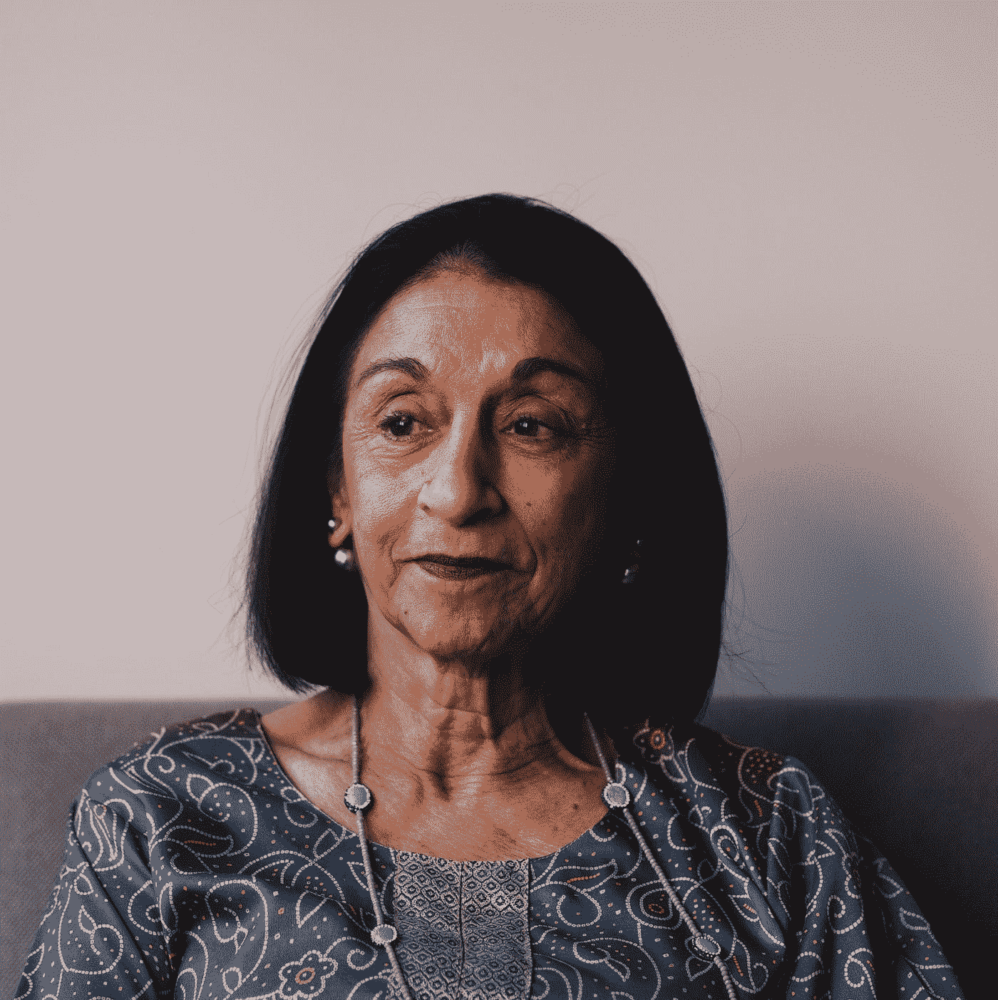
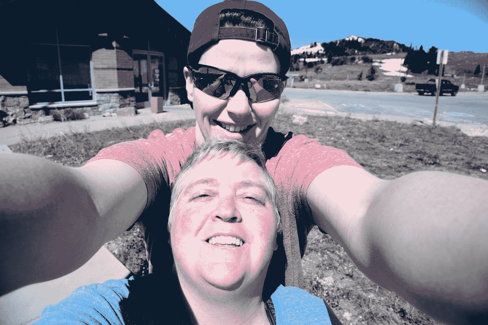

# 六十后的你相关吗？

> 原文：<https://medium.datadriveninvestor.com/are-you-relevant-after-sixty-8fcb89ee349f?source=collection_archive---------19----------------------->

Photo by [Ashwin Vaswani](https://unsplash.com/@ashwinv11?utm_source=medium&utm_medium=referral) on [Unsplash](https://unsplash.com?utm_source=medium&utm_medium=referral)

## 一个媒体作家想知道

我的中等窥视和严重强大的女人[玛格丽特曼宁](https://medium.com/u/c8918bb0842d?source=post_page-----8fcb89ee349f--------------------------------)最近向我提出了这个问题，在请求探索一个博客帖子的想法是相关的。在过去的三个多星期里，我一直在非洲这个美丽的地方，当我终于有了无线网络时，她决定将请求发送给一个更有能力及时回应的博主。

然而。这是一个重要的议题，虽然我可能错过了最后期限，但我想在这里回答这个重要的问题。

在大众媒体上，除非你和我是海伦·米伦或简·方达或简·古道尔或其他知名度很高的人，否则 60 岁以后你和我还有关系吗？

我可能会建议*看情况*。

首先，如果我们屈服于疯狂的信念，认为我们只有在皮肤美丽的基础上才是相关的，那么我们的相关性就会直线下降。好吧，我们认为，我有皱纹，我的牙齿在晚上出来(我的手举起来)我已经过了生育年龄，我增加了体重，体重已经转移到最不方便的地方，紧身连衣裙在我身上不再那么好看了…不胜枚举。

 [## 为您的职业生涯提供机器人保护|数据驱动型投资者

### 随着生产率的提高和巨大的利润，企业转向自动化来简化他们的…

www.datadriveninvestor.com](https://www.datadriveninvestor.com/2018/11/20/robot-proofing-your-career/) 

专注于此，你就会在被种植前死去一百万次。在那段时间里，你关注的是(对我来说)很大程度上无关紧要的事情，那就是你和我都不再年轻了，你会把你的财富花在追逐你不再拥有、永远也不会再拥有的东西上，在一些真正不幸的情况下，这会让你一路上看起来非常愚蠢。

如果可以的话，我可能会再建议一些别的东西。我提到玛格丽特是因为对于那些超过六十岁的人来说，你可能想去她的网站

 [## 时尚、发型、老年女性化妆、高级约会、旅行

### 《六十和我》是一本在线杂志，是一个拥有超过 500，000 名 60 岁以上女性的全球社区。我们的使命是授权和…

sixtyandme.com](https://sixtyandme.com/) 

在这一点上，我怀疑*60 和我的*会员总数超过 50 万。这里有几件事:玛格丽特最近 70 岁了。她全心全意地支持这个项目，因此，我们这些为她写作的人(是的，我是一个特色作家，不，我为 *Sixty 和我*写作没有报酬，但我强烈鼓励那些对这个市场有价值的人联系玛格丽特)为这 50 多万女性提供一切，从个人故事到旅行建议，再到如何在我们步入决赛时保持快乐和参与，我认为这是我们一生中最好的时光。

只要说玛格丽特设法保持相关就够了。她用视频、对有影响力的女性的采访来取悦她的读者，并不断寻找作家，这些作家对我们这些在一个关键的里程碑之后为自己的身份而挣扎的人有非常重要的话要说。

玛格丽特让我评论的那篇文章发表在 *Inc .杂志*上，它列出了以下相关属性:

*   *真实——说出真相*
*   *达到精通——增长你的才能——擅长任何事情！*
*   *感同身受*
*   *采取更多行动*

我刚刚花了三天时间研究凯伦·瓦伦蒂的工作，她 47 岁时接受了一份实际上是志愿者的工作，在坦桑尼亚的莫希管理乞力马扎罗山搬运工援助项目。她在和平队呆过，所以她习惯了贫困。她离开丹佛，在这里登陆，在这里呆了将近十六年。在她充满激情的管理下，KPAP 不断成长、壮大和繁荣。各种坦桑尼亚公司都努力想让她下台，然后被踢出去，仅仅因为她的努力改变了关于工人权利的对话。去年，在不涉及太多细节的情况下(你可以在 Medium 上找到我关于 KPAP 的故事)，她的工作改善了大约 5.5 万名搬运工的生活和工作条件质量(这些是他们搬运设备和物资去乞力马扎罗山的个人旅行)。然而，KPAP 的工作几乎没有完成，因为在依靠 Kili 工作的两万名搬运工中，迄今为止，KPAP 已经登记了大约 7500 人。那是巨大的。KPAP 还有很多工作要做，不仅要保护他们在这里已经取得的成果，还要继续让攀岩公司同意成为 KPAP 的合作伙伴。这确实保护了波特的工作权利和生活条件。

凯伦 62 岁了，每周 60 小时的工作和紧张的工作已经开始损害她的健康。因此，从今年 3 月 1 日开始，她有点退缩，因为她一直在努力培养三名员工来接替她的职责。这些年来，她做了两个半人的工作，而她雇佣的那些有才能的人几乎已经准备好接手了。她将去莫希的健身房，现在捐赠者已经让她有可能住在她认为“富丽堂皇”的两居室公寓里，她将开始更好地照顾自己。她现在将担任顾问的角色，因为她能够在这里做的事情(KPAP 是总部位于科罗拉多州博尔德的[国际山地探险家协会](https://mountainexplorers.org/)的一项倡议)需要在其他地区完成，那里有土著居民为我们这些想要冒险经历的人提供搬运工和向导。

凯伦无意淡出。事实上，当她完成她缓慢的三年退休计划时，我猜测这位充满活力的白发老人会发现自己甚至更受欢迎，因为她在这里能够实现的是新兴冒险行业最佳实践的基准。在我看来，凯伦最美好的时光还在前面。因为她所建立的相当多的技能，她所经历和赢得的战斗，以及她所建立的记录，使得她对于其他急需波特权利的领域来说非常有价值。但是从现在开始，她不再需要忍受那些令人疲惫不堪的时间。作为顾问，她可以挑选自己的项目，专注于发展他人的技能，成为这个年龄的主人。

这就是为什么当你我过了 60 岁，我们能为这个世界做的比以往任何时候都更有价值。如果你让社会和看起来年轻的压力说服你放弃对自己非凡价值的信念，你就在你和我最需要感到有价值的时候剥夺了你最伟大的天赋。我们已经超越了我们最疯狂的梦想，但是我们必须为我们自己和真正需要我们的世界做到这一点。

凯伦所做的和将要继续做的已经改变了成千上万人的生活。玛格丽特所做的和继续做的已经改变了成千上万人的生活。我可能会假设这两个女人，嗯，*是相关的。*

在这篇文章中，我可以列出 160 多人，但是玛格丽特和凯伦是典型的例子。列表展开。在我们生命的最后几十年里，在我看来，你和我可以坐在沙发上，看无休止的重播《T2》和《安迪·格里菲斯秀》，这勾起了美好的回忆。在我们的身体变得虚弱和退化的同时，他们失去了力量和活力，我们向其他人和我们自己证明了衰老是地狱，我们失去了力量和崩溃。很糟糕吧。

或者，你可以像这些充满活力的女性以及更多我在 Medium 上写的女性一样(你可以在*60 和我*上读到更多关于其他人的内容)，你可以离开沙发，忙碌起来，学习新技能，变得非常重要、强大、有影响力。你和我不需要成为简·古道尔就能有所作为。我们只需要摆脱社会的误导，去追求我们热切关心的东西。

我已经决定卖掉我的房子，搬到西北太平洋(PNW)度过我的最后几十年，或者至少是其中的一部分。当我做到的时候，我还会去西北动物按摩学校上课。我最近刚和经营这家店的女士谈过，她告诉我关于她马按摩项目的一名毕业生。

# 学校的所有者和经营者洛拉·米其林告诉我，这位 76 岁的老妇人迫不及待地开始了她全新的职业生涯。

我不知道你怎么想，但这很鼓舞人心。

我热情地关心动物。写作让我胸中有只鸟，就像探险旅行让我心跳加速，就像写作是我的身份，而不仅仅是我做的事情。我把所有这些都融入到我以后的生活中。就像那个新毕业生一样，宝贝，我才刚刚开始。因为当我旅行时，我看到越来越多的地方，工作是如此重要。

随着年龄的增长，生活不会变得缓慢和困难。我们选择我们生活的方向，当你和我照顾我们的身体时(我可能会推荐 *Sixty 和我的*温柔瑜伽计划),我们确保选择。这个世界需要像玛格丽特和凯伦这样的人。世界需要你和我。67 岁时，我发现我的才能和技能在某些领域得到了爆发，如果你在 20 年前告诉我这些，我会笑得把你赶出房间。然而，我作为一名作家的能力和我作为一名运动员(尽管笨拙)的能力相结合，使我处于有影响力、令人愉快的位置，并为我在世界各地的客户提供真正的价值。

# 我现在所做的一切在二十年前都是不可能的。

这是衰老的真正礼物:所有这些技能和礼物的顶点。我们有责任保持健康，这样在我们年轻的时候，我们就可以回馈我们所积累的。在一个害怕变老但希望长寿的世界里，你和我的关系越来越密切。因此，当我们努力利用我们已经建立的技能，并像玛格丽特和卡伦一样在世界上运用这些技能时，尽管有消息说白发意味着衰老，你和我都是精通的典范。

我们欠我们的孩子和孙子，以及我们身后的几代人的最伟大的礼物之一，是生命非常美好的例子，直到你和我把我们经常使用的身体交还给大自然母亲。

你相关吗？你想成为吗？然后，我可能会邀请你全面衡量你花了一生时间培养的所有技能和能力。外面有很多人需要你。相信它。确实如此。你越早忙着寻找将这些技能传授给别人的方法，你就会越快地说，“我最近太忙了，没时间看电视”。

Photo by [Sharon McCutcheon](https://unsplash.com/@sharonmccutcheon?utm_source=medium&utm_medium=referral) on [Unsplash](https://unsplash.com?utm_source=medium&utm_medium=referral)